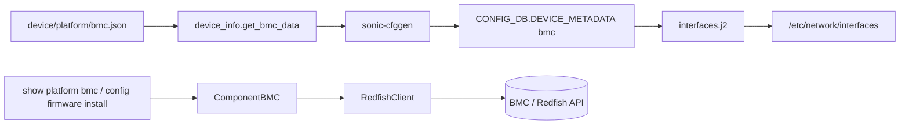
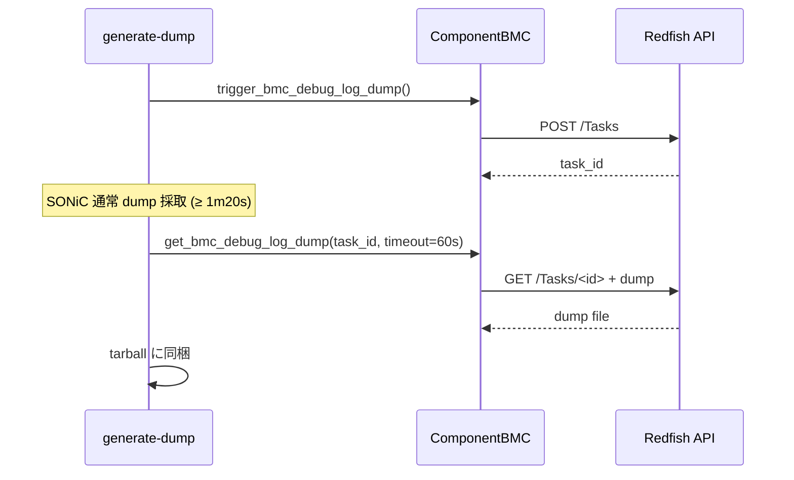

<!-- topics-tip -->
!!! tip "Topics で読み物として読む"
    この HLD は実装詳細を含む。機能の概念・設定・運用を読み物として読みたい場合は [Topics 14 章: Platform / Port / Optics](../topics/14-platform-port-optics/index.md) を参照。
<!-- /topics-tip -->

!!! success "裏取りステータス: code-verified"
    `sonic-platform-common/sonic_platform_base/redfish_client.py` の `RedfishClient`、`bmc_base.py` の `ComponentBMC` / `BmcBase`、`sonic-utilities/show/platform.py` の `def bmc()` / `def bmc_summary()` Click グループが master に存在。`generate_dump` の BMC dump 取り込み経路も確認済み。HLD と実装は一致 (verified at: 2026-05-11)。

# BMC / Redfish 統合

## 読み手が知りたいこと

- BMC とは何で、[SONiC](../reference/glossary.md#term-sonic) からどう操作するか
- どこに設定を入れ（`bmc.json`）、どこに反映される（[CONFIG_DB](../reference/glossary.md#term-config_db) / `/etc/network/interfaces`）か
- `show platform bmc` / firmware update / techsupport それぞれ何が起こるか
- BMC 非対応プラットフォームではどう振る舞うか

## 全体像

BMC (Board Management Controller) は switch メインボード上の **out-of-band 管理用マイコン**。OpenBMC は Redfish (RESTful) API を提供し、SONiC はその client を `sonic-platform-common` に内蔵して CLI / techsupport から呼ぶ[^1]。



## どこに何が書かれるか

### 入力: `device/platform/bmc.json`

```json
{
  "bmc_if_name": "usb0",
  "bmc_if_addr": "169.254.x.x",
  "bmc_addr":    "169.254.y.y",
  "bmc_net_mask":"255.255.255.0"
}
```

`device_info.get_bmc_data()` が読み、`sonic-cfggen` 経由で `CONFIG_DB.DEVICE_METADATA|bmc` に投入される[^1]。

### 反映先: `/etc/network/interfaces`

`interfaces.j2` で usb0 を static で起こす[^1]:

```text
auto usb0
iface usb0 inet static
    address <bmc_if_addr>
    netmask <bmc_net_mask>
```

## RedfishClient の設計ポイント

`sonic-platform-common` に追加された `RedfishClient` は curl ラッパで、主に以下を担う[^1]:

| 機能 | 内容 |
|------|------|
| Session | login / logout、token / session_id、expire 時の自動再 login |
| Firmware | version 取得、update |
| BMC 操作 | reset、password 変更、debug log dump 起動・取得 |
| Error | curl エラー → RedfishClient エラーコードへマップ |
| Security | token / password を log・CLI 出力で **obfuscate** |

### なぜ Python decorator で login/logout を挟むのか

SONiC では各 CLI が **独立プロセス** で動き状態を共有しない。2 コマンド = 2 session でセッション枯渇を招くため、`RedfishClient` は decorator で `login → call → logout` を 1 呼び出しにまとめる[^1]。

## `ComponentBMC` の API

`platform/component.py` に追加された `ComponentBMC` は Device Base 系（`get_name` / `get_presence` / `get_model` 等）に加えて以下を提供[^1]:

| API | 用途 |
|------|------|
| `get_eeprom()` | Manufacturer / Model / PartNumber / PowerState / SerialNumber |
| `get_version()` | BMC firmware version |
| `reset_root_password()` | `(ret, msg)` |
| `trigger_bmc_debug_log_dump()` | `(ret, (task_id, err_msg))` |
| `get_bmc_debug_log_dump(task_id, filename, path)` | dump 取得 |
| `update_firmware(fw_image)` | firmware update |

## CLI

```text
show platform bmc summary       # Manufacturer / Model / FW Version 等
show platform bmc eeprom        # EEPROM 情報
show platform firmware status   # ONIE / SSD / BIOS / CPLD / BMC ...
config platform firmware install chassis component BMC fw -y <BMC_IMAGE>
```

`config platform firmware install ...` は `ComponentBMC.update_firmware()` を呼び、Redfish task を polling して完了を待つ[^1]。

## techsupport への BMC dump 統合（非同期）

`generate-dump` の流れ[^1]:



特徴: **非ブロッキング**（dump 起動を先に投げて並行採取）、**timeout 60 秒**、エラーは log のみで全体は止めない。`bmc.json` 未存在のプラットフォームは skip[^1]。

## Fast / Warm / Cold boot との関係

これらは CPU 側 method で完結し BMC と独立。BMC 側の状態は影響しない[^1]。

## 設定

### CONFIG_DB

| Table | Key | フィールド | 説明 |
|-------|-----|-----------|------|
| `DEVICE_METADATA` | `bmc` | `bmc_if_name` / `bmc_if_addr` / `bmc_addr` / `bmc_net_mask` | bmc.json から自動投入 |

### 設定例

```bash
show platform bmc summary
sudo config platform firmware install chassis component BMC fw -y /tmp/bmc_fw.bin
sudo show techsupport     # BMC dump 自動同梱
```

## 制限事項

- `bmc.json` 未存在プラットフォームでは BMC 機能 skip、関連 CLI は `N/A`[^1]
- 各 CLI が独立プロセスで login/logout を毎回行うためセッションオーバヘッド大[^1]
- `update_firmware` は Redfish task 完了を待ち長時間ブロック
- BMC dump timeout 60 秒は techsupport 全体時間に依存したヒューリスティック
- password / token を扱うため log 出力 obfuscate 必須[^1]
- 202605 branch で platform common API への統合（phase 2）が予定[^1]

## 干渉する機能

- **`sonic-platform-common`**: `RedfishClient` / `ComponentBMC` 追加
- **`sonic-py-common`**: `device_info.get_bmc_data()`
- **`sonic-cfggen`**: `DEVICE_METADATA|bmc` 書き込み
- **`interfaces.j2`**: usb0 静的設定生成
- **`generate-dump`**: techsupport 拡張
- **`config platform firmware` / `show platform firmware status`**: 既存 CLI を BMC で拡張

## トラブルシューティング

- `show platform bmc summary` が `N/A` → `bmc.json` の有無、`ip a` で usb0 を確認
- BMC firmware update 失敗 → Redfish task ID、`RedfishClient` log、curl 戻り値
- techsupport に BMC dump が無い → `generate-dump` log の trigger / collect 各 stage 結果
- session 枯渇 → CLI ごとに logout が走っているか、decorator が外れていないか

### コマンド例

BMC との通信を確認する。

```bash
# BMC
sudo ipmitool mc info 2>&1 | head
sudo ipmitool sdr list 2>&1 | head
redis-cli -n 6 keys 'BMC_*'
```

## 関連 reference

- [Topics: Platform / Port / Optics](../topics/14-platform-port-optics/index.md)
- [HLD: s3ip-sysfs-specification](s3ip-sysfs-specification.md)
- [CLI: show-platform](../reference/cli/show-platform.md)
- [CLI: config-platform-firmware](../reference/cli/config-platform-firmware.md)
- [Reference index](../reference/index.md)

## 引用元

[^1]: `sonic-net/SONiC` `doc/bmc/bmc_hld.md` @ `49bab5b5ff0e924f1ea52b3d9db0dfa4191a7c06`

<!-- concerns hint:
- sonic-platform-common の RedfishClient / ComponentBMC 取り込みは確認済み (2026-05-11)
- 202605 branch の platform common API 統合 phase 2 の進捗確認
-->

<!-- topics-back-ref -->
## 関連 Topics

- [Topics: Platform / Port / Optics / PHY](../topics/14-platform-port-optics/index.md)

<!-- /topics-back-ref -->


<!-- augmented-links: v1 -->

<!-- glossary-links-injected: 8ba32e5aa69d -->
