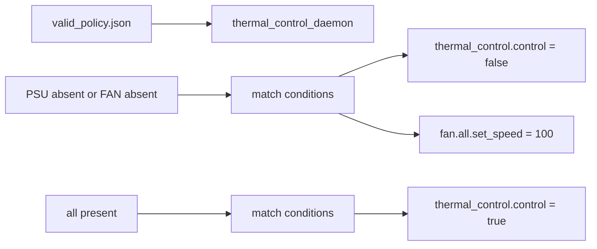

<!-- topics-tip -->
!!! tip "Topics で読み物として読む"
    この HLD は実装詳細を含む。機能の概念・設定・運用を読み物として読みたい場合は [Topics 14 章: Platform / Port / Optics](../topics/14-platform-port-optics/index.md) を参照。
<!-- /topics-tip -->

!!! info "裏取りステータス: code-verified"
    `sonic-platform-common/sonic_platform_base/sonic_thermal_control/`（`thermal_action_base.py` / `thermal_condition_base.py` / `thermal_json_object.py` / `thermal_policy.py` / `thermal_manager_base.py`）と `sonic-platform-daemons/sonic-thermalctld/` を master で確認。テストプラン側の SONiC-mgmt サンプル JSON は本リポジトリ範囲外（mgmt キャッシュ未配備）。

# Thermal Control テストプラン

## 概要

Thermal Control 機能（FAN status / thermal status / thermal policy）に対する **functional テストプラン**[^1]。[SONiC](../reference/glossary.md#term-sonic) platform monitor (pmon) 配下で動く thermal control daemon を対象に、**FAN/温度の表示**と **policy 一致時のアクション実行**を検証する。テストは SONiC-mgmt の `tests/platform/test_platform_info.py` に追加される pytest として実装され、トポロジ非依存で全構成に適用可。

## 対象機能

| 機能 | 説明 |
|------|------|
| FAN status monitor | platform API を 60 秒周期で読み [Redis](../reference/glossary.md#term-redis) に保存。`show platform fanstatus` で表示[^1] |
| Thermal status monitor | 60 秒周期。`show platform temperature` |
| Thermal policy management | JSON で記述した policy を pmon docker の daemon が読み、条件一致でアクション実行 |

## テストケース

### Show FAN Status Test
`show platform fanstatus` の出力フォーマットと presence/status 表示を検証[^1]。

### Show Thermal Status Test
`show platform temperature` 出力の整合性検証。

### FAN Test
FAN 抜去 / FAN 復旧時の `fanstatus` 表示と policy のアクション動作。

### PSU Absence Test
PSU 抜去で `psu absence` policy が発火し、**全 FAN を 100% に上げ thermal control algorithm を停止** することを検証[^1]。

### Invalid Policy Format Load Test
JSON フォーマット異常（パース不能）な policy file をロードし、daemon がエラーで起動しないこと / 直前 policy で動作継続することを検証。

### Invalid Policy Value Load Test
JSON 形式は正しいが意味的に誤った値（不明な condition / action type）を含む policy file をロードした場合の挙動検証。

## サンプル valid policy

```json
{
  "thermal_control_algorithm": {
    "run_at_boot_up": "false",
    "fan_speed_when_suspend": "60"
  },
  "info_types": [
    {"type": "fan_info"},
    {"type": "psu_info"}
  ],
  "policies": [
    {
      "name": "any PSU absence",
      "conditions": [{"type": "psu.any.absence"}],
      "actions": [
        {"type": "thermal_control.control", "status": "false"},
        {"type": "fan.all.set_speed", "speed": "100"}
      ]
    }
  ]
}
```

([HLD](../reference/glossary.md#term-hld) には "any PSU absence" / "any FAN absence" / "all FAN and PSU presence" の 3 policy 例が示される[^1])

### Policy DSL

| Field | 内容 |
|-------|------|
| `thermal_control_algorithm.run_at_boot_up` | 起動直後に algorithm を起動するか |
| `thermal_control_algorithm.fan_speed_when_suspend` | suspend 状態のデフォルト fan speed (%) |
| `info_types[]` | 監視対象（`fan_info` / `psu_info` など）|
| `policies[].conditions[].type` | 例: `fan.any.absence`, `psu.any.absence` |
| `policies[].actions[].type` | 例: `fan.all.set_speed` (`speed` 引数), `thermal_control.control` (`status`) |

### 期待動作



<!-- evidence:
source: sonic-net/SONiC/doc/pmon/sonic_thermal_control_test_plan.md#L43-L75 (sha: 49bab5b5ff0e924f1ea52b3d9db0dfa4191a7c06)
excerpt: |
  In the case of "any PSU absence", the expected behavior based on the design and implementation
  is that FAN speed is set to 100% and thermal control algorithm is disabled.
reasoning: PSU absent → FAN 100% / algorithm disable の根拠。
-->

<!-- evidence-rendered:start -->
??? note "📋 検証エビデンス: sonic-net/SONiC/doc/pmon/sonic_thermal_control_test_plan.md#L43-L75 (sha: 49bab5b5ff0e924f1ea52b3d9db0dfa4191a7c06)"

    **出典**:

    `sonic-net/SONiC/doc/pmon/sonic_thermal_control_test_plan.md#L43-L75 (sha: 49bab5b5ff0e924f1ea52b3d9db0dfa4191a7c06)`

    **抜粋**:

    ```text
    In the case of "any PSU absence", the expected behavior based on the design and implementation
    is that FAN speed is set to 100% and thermal control algorithm is disabled.
    ```

    **判断根拠**: PSU absent → FAN 100% / algorithm disable の根拠。

<!-- evidence-rendered:end -->

## 実装基盤

- [SONiC-mgmt `tests/platform`](https://github.com/sonic-net/SONiC-mgmt/tree/master/tests/platform) を流用
- 対象 file: `test_platform_info.py`
- 追加 file: `valid_policy.json`, `invalid_format_policy.json`, `invalid_value_policy.json`

## 制限事項

- daemon の **policy 動的 reload** に関する仕様は test plan 内では明確でない（design.md 側を参照）
- 60 秒周期に依存するため、テストでは **timeout 余裕** を取る必要がある
- 本 plan は機能テストでありストレス・電圧変動などの長時間試験は対象外

## 干渉する機能

- **psud / pmon-enhancement**: PSU 監視部分の依存
- **thermal-control-design (リンク先)**: 上位設計
- **xcvrd / sfp-refactor**: optic 由来の温度はこの policy には含まれない
- **show platform CLI**: `fanstatus` / `temperature` 出力フォーマット契約

## 確認コマンド

- `show platform fanstatus` / `show platform temperature` — fan speed と各温度センサの状況
- `sonic-db-cli STATE_DB keys "FAN_INFO|*"` / `"TEMPERATURE_INFO|*"` — daemon の publish 結果を直接確認
- `docker exec pmon supervisorctl status thermalctld` — thermal control daemon の状態
- `docker logs pmon 2>&1 | grep -i thermal` — policy reload / algorithm 切替のログを追う

### コマンド例

冷却 / thermal センサーの状態を確認する。

```bash
# Thermal / cooling
show platform temperature
show platform fanstatus
redis-cli -n 6 keys 'TEMPERATURE_INFO|*'
redis-cli -n 6 keys 'FAN_INFO|*'
```

## 引用元

[^1]: `sonic-net/SONiC` `doc/pmon/sonic_thermal_control_test_plan.md` @ `49bab5b5ff0e924f1ea52b3d9db0dfa4191a7c06`

<!-- concerns hint:
- SONiC-mgmt tests/platform/test_platform_info.py への thermal policy ケース追加状況確認
- valid_policy.json / invalid_format_policy.json / invalid_value_policy.json の同 repo 配置確認
- thermal_control_algorithm の run_at_boot_up / fan_speed_when_suspend 仕様の sonic-platform-daemons 取り込み確認
- fan.any.absence / psu.any.absence / fan.all.set_speed / thermal_control.control の type 名統一性確認
- 親 thermal-control-design.md (現状 keboliu fork リンク) の master 移行有無確認
-->

<!-- topics-back-ref -->
## 関連 Topics

- [Topics: Platform / Port / Optics / PHY](../topics/14-platform-port-optics/index.md)
- [Topics: Lab / Virtual SONiC / Developer Entry](../topics/21-lab-vs-developer/index.md)

<!-- /topics-back-ref -->

<!-- glossary-links-injected: 8ba32e5aa69d -->
