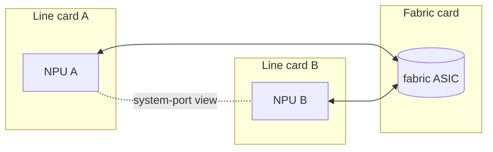

!!! info "裏取りステータス: code-verified（要点裏取り）"
    `DEVICE_METADATA.{switch_type,switch_id,sub_role}` は `sonic-yang-models/yang-models/sonic-device_metadata.yang`、`SYSTEM_PORT` / `VOQ_INBAND_INTERFACE` / chassis BGP は `sonic-system-port.yang` / `sonic-voq-inband-interface.yang` / `sonic-bgp-voq-chassis-neighbor.yang`、CLI は `sonic-utilities/show/{chassis_modules,fabric}.py` および `chassis_modules.py:system_ports`（`voqutil`）で確認済み。distributed VoQ counter / fabric port などは派生 HLD ページを参照。

# VoQ SONiC（distributed VoQ chassis / system-port / fabric）

## 何のための設計か

複数の NPU（line card）を fabric card で繋ぎ、外側からは「1 台のスイッチ」に見える **分散 VoQ chassis** を SONiC で動かす設計[^1]。要点:

- **Virtual Output Queue (VoQ)**: 入力側 NPU が、出力側 NPU の各 port / class に対する仮想キューを持つ。HoL ブロッキングを避け、輻輳判定を fabric を跨いで行う
- **system-port**: chassis 全体で一意な論理 port 識別子。各 NPU の物理 port が system-port にマップされる
- **distributed control plane**: BGP / FRR は複数 NPU 上で協調する。supervisor と fabric が連動

## どんな構造か

主要な構成要素[^1]:

- **`DEVICE_METADATA|localhost.switch_type=voq`**: chassis-wide で VoQ モードを示す
- **`SYSTEM_PORT`**: chassis 内すべての port の論理マップ。`switch_id` / `core_index` / `core_port_index` / `speed` 等
- **`VOQ_INBAND_INTERFACE`**: chassis 内 NPU 間制御 plane 通信用 inband interface
- **fabric port**: NPU↔fabric 接続を表す port。CRM / link state / counter は専用扱い
- **chassis-wide BGP**: line card ごとに ASN / loopback を分けず、chassis として 1 つの BGP speaker（または multi-speaker 連携）

## 設定 / CLI

| Table | 説明 |
|-------|------|
| `DEVICE_METADATA` | `switch_type=voq`、`sub_role`、`switch_id`、`max_cores` |
| `SYSTEM_PORT` | chassis 全 port の論理識別 |
| `VOQ_INBAND_INTERFACE` | NPU 間 control plane の inband |
| `PORT` | 通常の per-NPU port（system-port にも紐づく） |
| `BGP_NEIGHBOR` | chassis-wide で構成 |

| Command | 用途 |
|---------|------|
| `show chassis` | chassis モジュール一覧 |
| `show chassis modules status` | line card / fabric 状態 |
| `show fabric counters` | fabric port counter |
| `show system-port` | system-port 一覧 |
| `show interfaces counters fabric` | fabric 方向 |

## 制限事項

- **対応 ASIC が限定的**: VoQ をサポートする NPU / fabric chip 上でのみ動く
- **single-asic 前提機能との非互換**: 一部の機能（VLAN、特定 ACL）は VoQ 上で挙動差・未対応あり
- **show 単位の曖昧さ**: `show interfaces counters` で port / system-port / fabric のどれを指すか文脈依存
- **HLD は包括設計のみ**: バッファ計算、scheduler、warmboot、congestion の詳細は派生 HLD 参照

## 干渉する機能

- **distributed VoQ counter**: 入出力 NPU を跨ぐ統計の集計（同 area 別 HLD）
- **fabric port support**: fabric port 単独の管理（[fabric-port-support-on-sonic](fabric-port-support-on-sonic.md)）
- **everflow on VoQ chassis**: mirror の宛先解決が system-port 単位
- **single-asic VoQ fixed system**: VoQ 機能を 1 ASIC platform で適用する派生 HLD
- **chassis BGP / chassis-wide management**: control-plane 側 HLD 群

## トラブルシューティング

- system-port が出ない → `DEVICE_METADATA.switch_type=voq` と `SYSTEM_PORT` の populate を確認
- fabric link 不安定 → `show fabric counters errors`、cable、neighbor NPU の状態
- 統計が物理 port と合わない → VoQ 集計単位（system-port vs front-panel）を確認

## 関連 Topics

- [Topics 12 Multi-ASIC / VOQ - architecture](../topics/12-multi-asic-voq/architecture.md)
- [Topics 12 Multi-ASIC / VOQ - internals](../topics/12-multi-asic-voq/internals.md)
- 関連 HLD: [Fabric port support (VOQ chassis)](fabric-port-support-on-sonic.md) / [Recirculation port (VOQ chassis)](recirculation-port-support-on-voq-chassis.md) / [Everflow on VOQ chassis](everflow-support-on-voq-chassis.md) / [Single-ASIC VOQ fixed system](single-asic-voq-fixed-system-sonic.md)

## 引用元

[^1]: `sonic-net/SONiC` `doc/voq/voq_hld.md` @ `49bab5b5ff0e924f1ea52b3d9db0dfa4191a7c06`
