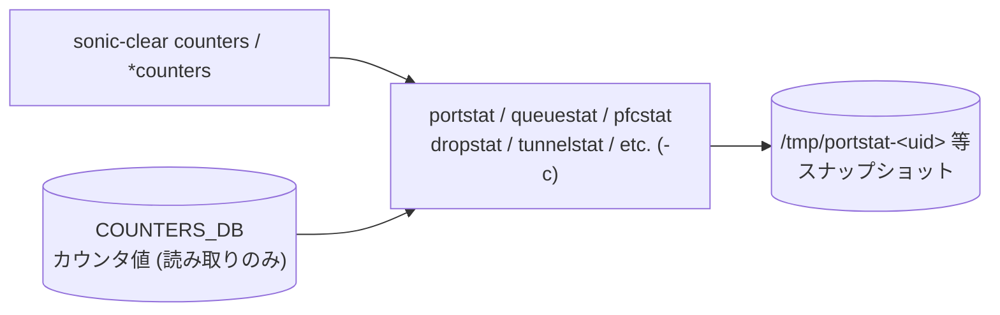

# clear counters サブコマンド群（詳細）

## 概要

`sonic-clear`（`sonic-utilities` の click グループ `clear/main.py:cli`）には **カウンタ系のリセット用サブコマンド**が多数定義されており、いずれも外部の C++/Python ユーティリティを `-c` または `-C` フラグ付きで起動する薄いラッパ。本ページはそれらの一覧と内部挙動を整理する。`clear` グループ全体の俯瞰は [clear (sonic-clear) コマンド](clear.md) を参照。

## カウンタクリア系コマンドの実装対応

| CLI コマンド | 起動コマンド | 対象 |
|---|---|---|
| `sonic-clear counters` | `portstat -c` | ポート (`COUNTERS_PORT_NAME_MAP`) の RX/TX バイト・パケット・エラー |
| `sonic-clear rifcounters [<intf>]` | `intfstat -c [-i <intf>]` | Routed Interface (L3 SVI / sub-interface) の RX/TX |
| `sonic-clear queuecounters` | `queuestat -c` + `queuestat -c --voq` | キュー単位カウンタ。Supervisor 上では VoQ のみ |
| `sonic-clear pfccounters` | `pfcstat -c` | [PFC](../../reference/glossary.md#term-pfc) pause パケットカウンタ |
| `sonic-clear dropcounters` | `dropstat -c clear` | DEBUG_COUNTER 系の drop カウンタ |
| `sonic-clear tunnelcounters` | `tunnelstat -c` | tunnel encap/decap カウンタ |
| `sonic-clear srv6counters` | `srv6stat -c` | [SRv6](../../reference/glossary.md#term-srv6) SID 別カウンタ |
| `sonic-clear switchcounters` | `switchstat -c` | スイッチレベル global カウンタ |
| `sonic-clear fabriccountersqueue` | `fabricstat -C -q` | fabric キューカウンタ |
| `sonic-clear fabriccountersport` | `fabricstat -C` | fabric ポートカウンタ |

定義箇所はすべて `clear/main.py` 内のシンプルな `@cli.command()`[^1]。

## 「クリア」の実態 = スナップショット保存

ここで言う「クリア」は **[COUNTERS_DB](../../reference/glossary.md#term-counters_db) の値を 0 に戻すわけではなく**、`portstat` 等が「前回 clear 時の値」をディスク上のスナップショットファイル（`/tmp/portstat-<uid>` 等）に書き出して、**次回表示時の差分計算用ベースライン**として使う、という意味[^2]。

つまり:

1. `sonic-clear counters` → `portstat -c` → `/tmp/portstat-<uid>` を現在の [COUNTERS_DB](../../reference/glossary.md#term-counters_db) 値で上書き。
2. `show interfaces counters` → [COUNTERS_DB](../../reference/glossary.md#term-counters_db) の現在値 − スナップショットの差分を表示。

スイッチ ASIC 側 [SAI](../../reference/glossary.md#term-sai) カウンタや [orchagent](../../reference/glossary.md#term-orchagent) のカウンタリングは触らないため、`sonic-clear counters` を打っても **[SAI](../../reference/glossary.md#term-sai) レイヤから見た累計値は残り続ける**。

## `queuecounters` の VoQ 二段呼び出し

`queuecounters` は通常スイッチでは `queuestat -c` を呼び、その後 **常に `queuestat -c --voq` も追加で呼ぶ**。Supervisor デバイス (`device_info.is_supervisor()` が True) の場合は前者をスキップし VoQ のみ。Supervisor は line card 側でしか通常 queue を持たないため。

```python
@cli.command()
def queuecounters():
    """Clear queue counters"""
    if(device_info.is_supervisor()):
        print("INFO: On Supervisor, only Aggregate VOQ counters will be cleared")
    else:
        run_command(["queuestat", "-c"])
    run_command(["queuestat", "-c", "--voq"])
```

## fabric 系 (`-C` 大文字)

`fabricstat` だけは大文字 `-C` を clear フラグに使う。これは `fabricstat` のオプション設計が他統計ツール (`-c`) と微妙にずれているため。`-q` でキュー側を指定する。

## watermark / persistent-watermark 系（参考）

カウンタとは別に、`priority-group watermark` / `queue watermark` / `headroom-pool watermark` のようなウォーターマーク系も `watermarkstat -c [-p] -t <type>` で同じスナップショット方式でリセットする。**root 権限が必要**で、非 root で実行するとサブグループ起動時点で `sys.exit("Root privileges are required for this operation")` で落ちる。

詳細は [clear (sonic-clear) コマンド](clear.md) のコマンドツリー節を参照。

## CONFIG_DB との接点

なし。COUNTERS_DB を直接書き換えるのではなく、`/tmp` 配下のスナップショットファイルだけが書き換わる。

## 既知の動作・今後の変更予定

!!! note "switch ingress drop monitoring はデフォルト無効 (issue [#3923](https://github.com/sonic-net/sonic-utilities/issues/3923))"
    switch ingress drop のモニタリング（`sonic-clear dropcounters` で管理する drop counter のデフォルト有効化）は HLD PR#1912 で「デフォルト有効にすべき」と提案されているが、2026年5月時点では実装されていない。現在はユーザーが明示的に drop counter を設定・有効化する必要がある。

<!-- cli-mermaid -->
### データフロー (手動作成)



!!! note "凡例"
    clear 系 (CLI → ユーティリティ → /tmp スナップショット) のミニ図。ユーティリティは COUNTERS_DB を読み取って /tmp 配下のスナップショットファイルに書き出すのみ。COUNTERS_DB 自体は書き換えない。
<!-- /cli-mermaid -->

<!-- ref-triangle:start -->

## 関連リファレンス

- (関連リンクなし)

<!-- ref-triangle:end -->

## 引用元

[^1]: `counters` / `rifcounters` / `queuecounters` / `pfccounters` / `dropcounters` / `tunnelcounters` / `srv6counters` / `switchcounters` / `fabriccountersqueue` / `fabriccountersport` の定義は `clear/main.py` L167-L235。<https://github.com/sonic-net/sonic-utilities/blob/39732bceb8bdefe706518ab40623bbbba6ff33b9/clear/main.py#L167>

[^2]: `portstat` のスナップショット方式は `scripts/portstat` 参照（`COUNTER_TABLE_PREFIX` を読んで `STATS_TEMP_FILE` に保存）。<https://github.com/sonic-net/sonic-utilities/blob/39732bceb8bdefe706518ab40623bbbba6ff33b9/scripts/portstat>

<!-- glossary-links-injected: c463a977c0b8 -->
