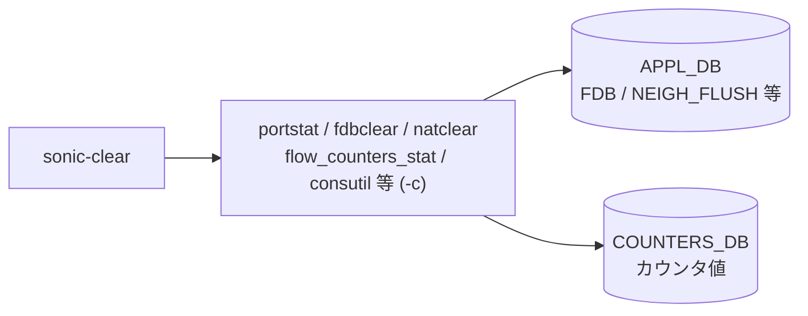

# clear (sonic-clear) コマンド

## 概要

実行ファイル名は `sonic-clear` だが click のエントリ名は `cli`（`/usr/local/bin/sonic-clear` 経由で呼ばれる）。**カウンタ系のリセット、[ARP](../../reference/glossary.md#term-arp)/[NDP](../../reference/glossary.md#term-ndp) テーブルのフラッシュ、[FDB](../../reference/glossary.md#term-fdb) クリア、[NAT](../../reference/glossary.md#term-nat) 統計クリア、PBH カウンタ保存、route flow counter リセット、[ASIC](../../reference/glossary.md#term-asic)/SDK health-event 消去**などをまとめている[^1]。

ほとんどのコマンドが `portstat` / `intfstat` / `queuestat` / `pfcstat` / `dropstat` / `tunnelstat` / `srv6stat` / `switchstat` / `watermarkstat` / `wredstat` / `fdbclear` / `flow_counters_stat` / `natclear` / `consutil` 等の **C++/python ユーティリティを `-c` (clear) フラグで呼び出すラッパ**。

`clear/main.py` の `AliasedGroup` は **alias 自動補完**（例: `st` → `status`）と `aliases.ini` 読み込みを実装している。

## コマンドツリー

```text
sonic-clear (= clear)
├── arp [<ip>] [-n <ns>]              # IP ARP テーブル全消し or 1 件
├── ndp [<ip>] [-n <ns>]              # IPv6 NDP テーブル
├── ip
│   ├── arp / ndp                     # cli 直下と同じものを再 add
│   └── bgp ...                       # routing_stack=frr 時に動的アタッチ
├── ipv6 bgp ...                      # 同上 v6 側
├── counters                          # portstat -c
├── rifcounters [<intf>]              # intfstat -c
├── queuecounters                     # queuestat -c (--voq も)
├── fabriccountersqueue / fabriccountersport  # fabricstat -C [-q]
├── pfccounters                       # pfcstat -c
├── dropcounters                      # dropstat -c clear
├── tunnelcounters                    # tunnelstat -c
├── srv6counters                      # srv6stat -c
├── switchcounters                    # switchstat -c
├── priority-group
│   ├── watermark headroom / shared
│   ├── persistent-watermark headroom / shared
│   └── drop counters
├── queue
│   ├── wredcounters                  # wredstat -c
│   ├── watermark unicast / multicast / all
│   └── persistent-watermark unicast / multicast / all
├── headroom-pool
│   ├── watermark
│   └── persistent-watermark
├── fdb all                           # fdbclear (port/vlan は実装コメントアウト)
├── line <target> [-d|--devicename]   # consutil clear
├── nat statistics / nat translations # natclear -s / -t
├── pbh statistics                    # PBH_RULE 集約 + ファイル書き出し
├── flowcnt-trap                      # flow_counters_stat -c -t trap
├── flowcnt-route [pattern <p>] [route <prefix>]
├── asic-sdk-health-event [-n <ns>]   # STATE_DB ASIC_SDK_HEALTH_EVENT_TABLE* delete
└── spanning-tree                     # clear/stp.py 由来 (BPDU stats / etc)
```

## 主要コマンドの詳細

### `sonic-clear arp [<ipaddress>] [-n <namespace>]`

**動作**:

- `<ipaddress>` 省略時: `sudo ip -4 -s -s neigh flush all`
- `<ipaddress>` 指定時: `ip -4 neigh show <ip>` で `dev` を解析し、`ip -4 neigh del <ip> dev <iface>` を実行
- `-n <ns>` 指定時は `sudo ip netns exec <ns> ip -4 ...` の形に書き換え

### `sonic-clear ndp [<ipaddress>] [-n <namespace>]`

`arp` と対称。`ip -6` 系。

### `sonic-clear counters`

`portstat -c` を起動。`portstat` は [COUNTERS_DB](../../reference/glossary.md#term-counters_db) の各ポートのスナップショットを `/tmp/portstat-<uid>` 等にコピーする実装で、表示時の差分計算用ベースラインを更新する。

### `sonic-clear rifcounters [<interface>]`

`intfstat -c [-i <interface>]`。Routed Interface (L3 SVI / sub-interface) の RX/TX を扱う。

### `sonic-clear queuecounters`

`queuestat -c` の後、必ず `queuestat -c --voq` も実行。Supervisor デバイスでは前者をスキップして VoQ のみリセットする。

### `sonic-clear pfccounters` / `dropcounters` / `tunnelcounters` / `srv6counters` / `switchcounters`

それぞれ `pfcstat -c` / `dropstat -c clear` / `tunnelstat -c` / `srv6stat -c` / `switchstat -c`。

### `sonic-clear priority-group watermark <headroom|shared>` / `priority-group persistent-watermark <headroom|shared>`

`watermarkstat -c [-p] -t pg_headroom|pg_shared [-n <ns>]` を起動。`-p` 付きが persistent。**root 権限が必要**で、非 root だとサブグループ起動時点で `sys.exit("Root privileges are required for this operation")` する。

### `sonic-clear priority-group drop counters`

`pg-drop -c clear` を起動。同じく root 必須。

### `sonic-clear queue wredcounters` / `queue watermark <uni|multi|all>` / `queue persistent-watermark <uni|multi|all>`

`wredstat -c` / `watermarkstat -c [-p] -t q_shared_uni|q_shared_multi|q_shared_all`。

### `sonic-clear headroom-pool watermark` / `headroom-pool persistent-watermark`

`watermarkstat -c [-p] -t headroom_pool [-n <ns>]`。

### `sonic-clear fdb all`

`fdbclear` を起動。**`fdb port` / `fdb vlan` はソースコード上ではコメントアウト**されており、現行 master では起動できない仕様（必要なら [APPL_DB](../../reference/glossary.md#term-appl_db) の `FDB_TABLE` を直接操作する形になる）[^2]。

### `sonic-clear line <target> [-d|--devicename]`

`consutil clear <target>` または `consutil clear --devicename <target>`。コンソールサーバ機能で他プロセスが掴んでいる line を強制解放する。

### `sonic-clear nat statistics` / `nat translations`

`natclear -s` / `natclear -t`。

### `sonic-clear pbh statistics`

実装が他と異なり、`PBH_RULE` を [CONFIG_DB](../../reference/glossary.md#term-config_db) から取得 → `read_pbh_counters` で現在値を読み出し → `serialize_pbh_counters` で `/tmp` 系のファイルへ書き出す。**「クリア」ではなくスナップショット保存**で、表示時の差分計算用ベースラインに使う。

### `sonic-clear flowcnt-trap`

`flow_counters_stat -c -t trap`。[CoPP](../../reference/glossary.md#term-copp) trap 名ごとのカウンタをリセット。

### `sonic-clear flowcnt-route [pattern <prefix-pattern>] [route <prefix>]`

サブコマンド省略時は全 route flow counter をクリア。`pattern <pattern>` でワイルドカード絞り、`route <prefix>` で 1 prefix 指定。`--vrf` で [VRF](../../reference/glossary.md#term-vrf)/[VNET](../../reference/glossary.md#term-vnet) 指定可能。

### `sonic-clear asic-sdk-health-event [-n <namespace>]`

[CONFIG_DB](../../reference/glossary.md#term-config_db) ではなく **[STATE_DB](../../reference/glossary.md#term-state_db) の `ASIC_SDK_HEALTH_EVENT_TABLE*` キーを namespace ごとに delete** する。multi-[ASIC](../../reference/glossary.md#term-asic) 時に `-n` 指定で対象 namespace のみ。

### `sonic-clear spanning-tree`

`clear/stp.py` 由来の BPDU 統計クリア / 学習エントリリセット用サブグループ。

## ip / ipv6 サブグループ

`cli.add_command(arp)` と `ip.add_command(arp)` の **両方**が呼ばれており、`sonic-clear arp` と `sonic-clear ip arp` がエイリアス的に同じ機能を提供する（[NDP](../../reference/glossary.md#term-ndp) も同様）。[BGP](../../reference/glossary.md#term-bgp) セッションリセット系は `routing_stack` の値に応じて `clear/bgp_quagga_v4.py` または `clear/bgp_frr_v6.py` 等が動的に `ip.add_command(bgp)` / `ipv6.add_command(bgp)` を実行する。

## STATE_DB / CONFIG_DB との接点

| テーブル | 操作 | 操作するコマンド |
|----------|------|------------------|
| [STATE_DB](../../reference/glossary.md#term-state_db) `ASIC_SDK_HEALTH_EVENT_TABLE*` | delete | `asic-sdk-health-event` |
| 各 [COUNTERS_DB](../../reference/glossary.md#term-counters_db) スナップショット | 外部ツール経由 | `counters` 系全般 |

それ以外のコマンドは **kernel neighbor table** や **[SAI](../../reference/glossary.md#term-sai) 経由の SDK 状態** を操作するもので [CONFIG_DB](../../reference/glossary.md#term-config_db) は触らない。

<!-- cli-mermaid -->
### データフロー (手動作成)



!!! note "凡例"
    clear 系 (CLI → ユーティリティ → APPL_DB / COUNTERS_DB) のミニ図。CONFIG_DB を直接介さないコマンドのため手動で記述。
<!-- /cli-mermaid -->

<!-- ref-triangle:start -->

## 関連リファレンス

- (関連リンクなし)

<!-- ref-triangle:end -->

## 引用元

[^1]: `cli` グループ全体は `clear/main.py` で定義。`AliasedGroup` の自動補完と `aliases.ini` 読み込みは L39-L75。<https://github.com/sonic-net/sonic-utilities/blob/39732bceb8bdefe706518ab40623bbbba6ff33b9/clear/main.py>

[^2]: `fdb port` / `fdb vlan` は L610-L624 でコメントアウト。コメントには「sonic-clear fdb port and sonic-clear fdb vlan will be added later」とある。<https://github.com/sonic-net/sonic-utilities/blob/39732bceb8bdefe706518ab40623bbbba6ff33b9/clear/main.py#L610>

<!-- ops-hint -->
## 運用ヒント

### 典型的な利用シーン

- counters / [ARP](../../reference/glossary.md#term-arp) / [FDB](../../reference/glossary.md#term-fdb) / [BGP](../../reference/glossary.md#term-bgp) セッションの状態をリセットする。
- 障害解析前のベースラインクリア。

### よくある落とし穴

- `sonic-clear counters` は累積カウンタを 0 にするのみで、`persistent-watermark` は別コマンド。
- `sonic-clear fdb all` を本番で打つと一時的に L2 通信が flood に切替わる。

### 関連する show / debug

```bash
show interfaces counters
show arp
show mac
```
<!-- /ops-hint -->

<!-- glossary-links-injected: e82be350a384 -->
