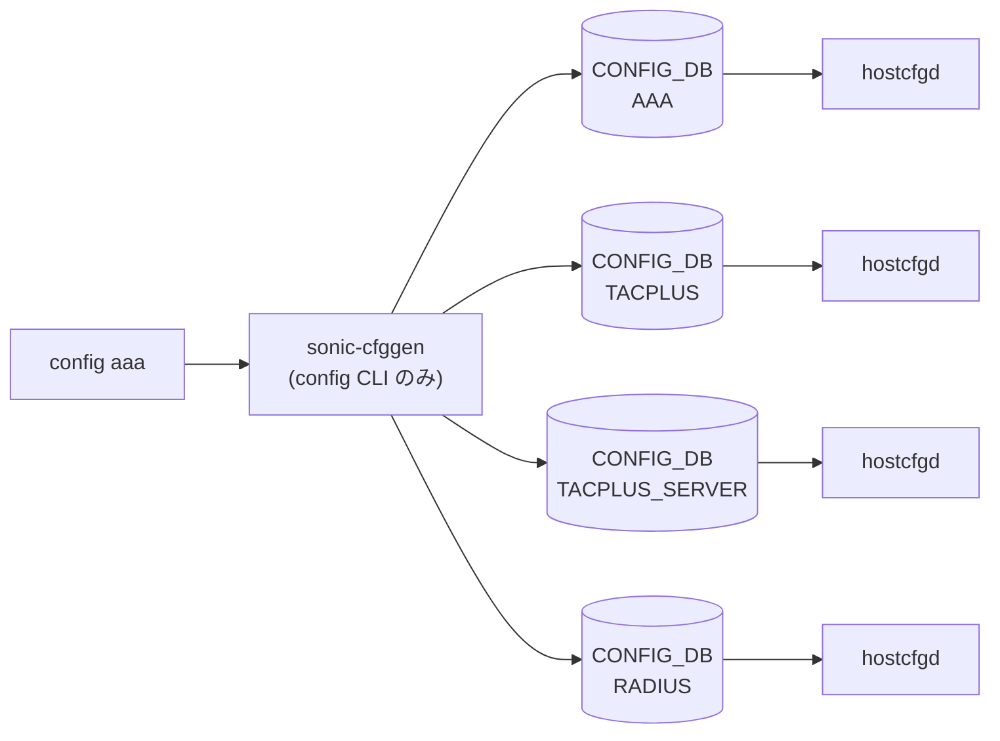

# config aaa / tacacs / radius サブコマンド

## 概要

[AAA](../../reference/glossary.md#term-aaa) (Authentication / Authorization / Accounting) と、その下位プロトコル TACACS+ / [RADIUS](../../reference/glossary.md#term-radius) のサーバ設定を行う。**`aaa`・`tacacs`・`radius` の 3 つは独立した click グループ**で、`config/main.py` がそれぞれを `config.add_command(aaa.aaa)` `config.add_command(aaa.tacacs)` `config.add_command(aaa.radius)` の形で `config` 直下に登録する[^1]。すべて `config/aaa.py` に同居している。

操作対象は [CONFIG_DB](../../reference/glossary.md#term-config_db) の `AAA` / `TACPLUS` / `TACPLUS_SERVER` / `RADIUS` / `RADIUS_SERVER` テーブル。値の追加には `add_table_kv` (= `mod_entry`)、削除には `del_table_key` を使う。`set_entry` は `ValidatedConfigDBConnector` 経由で [YANG](../../reference/glossary.md#term-yang) 検証を伴う。

## コマンド一覧

### `config aaa ...`

| コマンド | 用途 |
|---------|------|
| `config aaa authentication failthrough <enable\|disable\|default>` | [AAA](../../reference/glossary.md#term-aaa) fail-through |
| `config aaa authentication fallback <enable\|disable\|default>` | [AAA](../../reference/glossary.md#term-aaa) fallback |
| `config aaa authentication debug <enable\|disable\|default>` | AAA debug ログ |
| `config aaa authentication trace <enable\|disable\|default>` | AAA パケットトレース |
| `config aaa authentication login <ldap\|radius\|tacacs+\|local\|default> [secondary]` | ログイン認証プロトコル選択（最大 2 段） |
| `config aaa authorization <tacacs+\|local\|"tacacs+ local">` | 認可プロトコル |
| `config aaa accounting <disable\|tacacs+\|local\|"tacacs+ local">` | アカウンティング |

### `config tacacs ...`

| コマンド | 用途 |
|---------|------|
| `config tacacs timeout <0-60>` / `config tacacs default timeout` | グローバルタイムアウト |
| `config tacacs authtype <chap\|pap\|mschap\|login>` / `default authtype` | グローバル認証方式 |
| `config tacacs passkey <secret>` / `default passkey` | グローバル共有鍵 |
| `config tacacs add <ip> [-t TIMEOUT] [-k KEY] [-a TYPE] [-o PORT] [-p PRI] [-m]` | TACACS+ サーバ追加 |
| `config tacacs delete <ip>` | TACACS+ サーバ削除 |

### `config radius ...`

| コマンド | 用途 |
|---------|------|
| `config radius timeout <1-60>` / `default timeout` | グローバルタイムアウト |
| `config radius retransmit <0-10>` / `default retransmit` | リトライ回数 |
| `config radius authtype <chap\|pap\|mschapv2>` / `default authtype` | 認証方式 |
| `config radius passkey <secret>` / `default passkey` | 共有鍵（最大 65 文字） |
| `config radius sourceip <ip>` / `default sourceip` | source IP |
| `config radius nasip <ip>` / `default nasip` | NAS-IP |
| `config radius statistics <enable\|disable\|default>` | 統計収集の有効化 |
| `config radius add <ip> [-r N] [-t SEC] [-k KEY] [-a TYPE] [-o PORT] [-p PRI] [-m] [-s INTF]` | [RADIUS](../../reference/glossary.md#term-radius) サーバ追加（最大 8 台） |
| `config radius delete <ip>` | [RADIUS](../../reference/glossary.md#term-radius) サーバ削除 |

## 各コマンドの詳細

### `config aaa authentication login <protocol> [secondary]`

**動作**:
`AAA|authentication` の `login` フィールドに `<protocol>` を書き込む。引数を 2 つ取った場合は `local,radius` のように `,` 結合した値にする[^2]。`local` が必ず一方に含まれていること、もう一方が `radius` / `tacacs+` / `ldap` のいずれかであることを `aaa.py` がチェックする。`default` 単独指定で `login` フィールドが削除される。

<!-- evidence:
source: sonic-net/sonic-utilities/config/aaa.py#L120-L155 (sha: 39732bceb8bdefe706518ab40623bbbba6ff33b9)
excerpt: |
  if good_ap == True:
      val += ',' + val2
  ...
  add_table_kv(db, 'AAA', 'authentication', 'login', val)
-->

<!-- evidence-rendered:start -->
??? note "📋 検証エビデンス: sonic-net/sonic-utilities/config/aaa.py#L120-L155 (sha: 39732bceb8bdefe706518ab40623bbbba6ff33b9)"

    **出典**:

    `sonic-net/sonic-utilities/config/aaa.py#L120-L155 (sha: 39732bceb8bdefe706518ab40623bbbba6ff33b9)`

    **抜粋**:

    ```text
    if good_ap == True:
        val += ',' + val2
    ...
    add_table_kv(db, 'AAA', 'authentication', 'login', val)
    ```

<!-- evidence-rendered:end -->

### `config aaa authorization <protocol>` / `accounting <protocol>`

`AAA|authorization` または `AAA|accounting` の `login` フィールドに `tacacs+` / `local` / `tacacs+,local` を設定する。`accounting disable` のみ `del_table_key` で削除する。

### `config tacacs add <ip> [...]`

**引数**:

- `<ip>` ... 必須。`is_ipaddress` で検証。
- `-t/--timeout` ... 整数（範囲チェックは ON-add 時にはなく、`config tacacs timeout` のグローバル側で 0-60 と定義）
- `-k/--key` ... shared secret
- `-a/--auth_type` ... `chap` / `pap` / `mschap` / `login`
- `-o/--port` ... 1-65535、default 49
- `-p/--pri` ... 1-64、default 1
- `-m/--use-mgmt-vrf` ... 立てると `vrf=mgmt` をエントリに追加

**動作**:
`TACPLUS_SERVER|<ip>` を `set_entry` で書く。同じ IP のエントリが既存ならエラーで終了。

### `config tacacs delete <ip>`

`TACPLUS_SERVER|<ip>` を `set_entry(None)` で削除。

### `config tacacs timeout` / `authtype` / `passkey`

`TACPLUS|global` テーブルの `timeout` / `auth_type` / `passkey` を `add_table_kv` で書き換え。`config tacacs default <field>` 形式は同じ field を `del_table_key` で消す。値の範囲: `timeout` 0-60 (`click.IntRange`)、`authtype` は 4 値の Choice。

### `config radius add <ip> [...]`

**引数**:

- `<ip>` ... IP もしくはホスト名
- `-r/--retransmit` 1-10（注: `config radius retransmit` グローバル側は 0-10、`-r` オプション側は 1-10 と range が異なる。ソース `config/aaa.py` L356/L510 で個別定義）
- `-t/--timeout` 1-60
- `-k/--key` ... 65 文字以下、空白 / `#` / `,` を含まないこと（`is_secret` でバリデート、`RADIUS_PASSKEY_MAX_LEN = 65`）
- `-a/--auth_type` ... `chap` / `pap` / `mschapv2`
- `-o/--auth-port` 1-65535、default 1812
- `-p/--pri` 1-64、default 1
- `-m/--use-mgmt-vrf`
- `-s/--source-interface` ... `Ethernet*` / `PortChannel*` / `Vlan*` / `Loopback*` / `eth0` のみ許可

**動作**:
`RADIUS_SERVER|<ip>` を `set_entry`。サーバ数が `RADIUS_MAXSERVERS = 8` を超える場合は拒否される[^3]。

### `config radius sourceip <ip>` / `nasip <ip>`

`is_ipaddress` で検証後、IPv4 では `0.0.0.0`・予約・マルチキャストをエラー、IPv6 では `0::0` / `0::1` / マルチキャストをエラーにする。値は `RADIUS|global` の `src_ip` / `nas_ip` フィールドへ書く。

### `config radius statistics <enable|disable|default>`

`RADIUS|global|statistics` を `'true'` / `'false'` 文字列で書く（boolean ではなく文字列）。`default` で削除。

## 関連する CONFIG_DB

| テーブル | key | 主なフィールド | 操作するコマンド |
|----------|-----|--------------|----------------|
| `AAA` | `authentication` | `login` / `failthrough` / `fallback` / `debug` / `trace` | `config aaa authentication ...` |
| `AAA` | `authorization` | `login` | `config aaa authorization` |
| `AAA` | `accounting` | `login` | `config aaa accounting` |
| `TACPLUS` | `global` | `timeout` / `auth_type` / `passkey` | `config tacacs timeout` 等 |
| `TACPLUS_SERVER` | `<ip>` | `tcp_port` / `priority` / `auth_type` / `timeout` / `passkey` / `vrf` | `config tacacs add/delete` |
| `RADIUS` | `global` | `timeout` / `retransmit` / `auth_type` / `passkey` / `src_ip` / `nas_ip` / `statistics` | `config radius ...` |
| `RADIUS_SERVER` | `<ip>` | `auth_port` / `priority` / `auth_type` / `retransmit` / `timeout` / `passkey` / `vrf` / `src_intf` | `config radius add/delete` |

## 補助バリデータ

- `is_secret` ... `^[^ #,]*$` 正規表現。空白 / `#` / `,` を禁止。
- `RADIUS_PASSKEY_MAX_LEN = 65`、`RADIUS_MAXSERVERS = 8`。
- `ADHOC_VALIDATION = True`（デフォルト ON）。[CONFIG_DB](../../reference/glossary.md#term-config_db) の [YANG](../../reference/glossary.md#term-yang) 検証側ではなくコマンド側で IP / 文字種チェックを行う。

<!-- ref-triangle:start -->

## 関連リファレンス

- [CONFIG_DB](../../reference/glossary.md#term-config_db): [`AAA`](../config-db/aaa.md) / `TACPLUS` / [`TACPLUS_SERVER`](../config-db/tacplus-server.md) / [`RADIUS`](../config-db/radius.md) / [`RADIUS_SERVER`](../config-db/radius.md)

<!-- ref-triangle:end -->

## 引用元

[^1]: `config/main.py` の L1754-L1756: `config.add_command(aaa.aaa)` / `config.add_command(aaa.tacacs)` / `config.add_command(aaa.radius)`。<https://github.com/sonic-net/sonic-utilities/blob/39732bceb8bdefe706518ab40623bbbba6ff33b9/config/main.py#L1754>

[^2]: `aaa authentication login` 引数 2 段の組合せロジックは `config/aaa.py` L120-L155。<https://github.com/sonic-net/sonic-utilities/blob/39732bceb8bdefe706518ab40623bbbba6ff33b9/config/aaa.py#L120>

[^3]: RADIUS サーバ数の上限は `RADIUS_MAXSERVERS = 8`。`config/aaa.py` L11 と L537-L538 参照。<https://github.com/sonic-net/sonic-utilities/blob/39732bceb8bdefe706518ab40623bbbba6ff33b9/config/aaa.py#L11>

<!-- cli-sibling -->
### 関連 CLI コマンド

- [`show aaa`](show-aaa.md) — show aaa サブコマンド
- [`show acl`](show-acl.md) — show acl サブコマンド
- [`config acl`](config-acl.md) — config acl サブコマンド
- [`config ssh`](config-ssh.md) — config ssh サブコマンド

<!-- /cli-sibling -->

## 関連ページ
- [HLD: TACACS+ 認証](../../management/tacacs-authentication.md)
- [CONFIG_DB: TACPLUS_SERVER](../config-db/tacplus-server.md)
- [YANG: sonic-system-aaa](../yang/sonic-system-aaa.md)

<!-- cli-mermaid -->
### データフロー (自動生成)



!!! note "凡例"
    config 系 (CLI → CONFIG_DB → daemon) のミニ図。テーブル → daemon 対応は `docs/reference/config-db-orch-map.md` から機械生成。
<!-- /cli-mermaid -->

<!-- topics-back-ref -->
## 関連 Topics

- [Topics: Security / AAA / FIPS / Hardening](../../topics/15-security-aaa/index.md)

<!-- /topics-back-ref -->

<!-- glossary-links-injected: eb13b25f8314 -->
