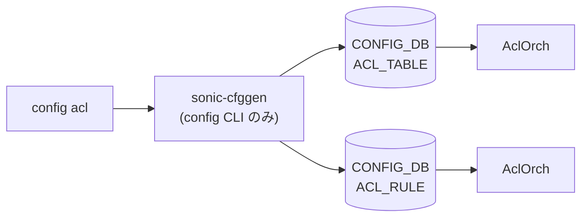

# config acl サブコマンド

## 概要

`config acl` は [ACL](../../reference/glossary.md#term-acl) テーブルの作成・削除と、ルール定義 JSON ファイルの一括ロード（`acl-loader` 起動）を提供する。**個別 [ACL](../../reference/glossary.md#term-acl) ルールを CLI フラグで追加するインタフェースは無い**。ルールは JSON ファイルに記述して `config acl update full|incremental` で投入する設計[^1]。

[ACL](../../reference/glossary.md#term-acl) の実体は `aclorch`（swss）が `ACL_TABLE` / `ACL_RULE` を [APPL_DB](../../reference/glossary.md#term-appl_db) → [ASIC_DB](../../reference/glossary.md#term-asic_db) へ反映する。`config acl` は [CONFIG_DB](../../reference/glossary.md#term-config_db) の `ACL_TABLE` のみ直接書き換え、ルール側は外部ツール `acl-loader` が [CONFIG_DB](../../reference/glossary.md#term-config_db) と直接対話する。

## コマンド一覧

| コマンド | 用途 |
|---------|------|
| `config acl add table <name> <type> [-d <desc>] [-p <ports>] [-s ingress\|egress] [-n <ns>]` | ACL テーブル作成 |
| `config acl remove table <name> [-n <ns>]` | ACL テーブル削除 |
| `config acl update full <file>` | ACL ルール JSON 全更新（`acl-loader update full`） |
| `config acl update incremental <file>` | ACL ルール JSON 差分更新（`acl-loader update incremental`） |

## 各コマンドの詳細

### `config acl add table <table_name> <table_type> [options]`

**用法**:

```bash
config acl add table <table_name> <table_type>
    [-d|--description <desc>]
    [-p|--ports <port_list>]
    [-s|--stage ingress|egress]   # default: ingress
    [-n|--namespace <ns>]
```

**引数**:

- `<table_name>` ... `ACL_TABLE` のキー
- `<table_type>` ... ACL タイプ（`L3`, `L3V6`, `MIRROR`, `MIRRORV6`, `MIRROR_DSCP`, `CTRLPLANE` 等）。実装は文字列をそのまま `type` フィールドに格納するため、[SAI](../../reference/glossary.md#term-sai) で実装されているタイプであれば任意

**オプション**:

- `-d` ... `policy_desc` フィールド。省略時は `<table_name>` がそのまま入る
- `-p` ... バインド先ポートのカンマ区切りリスト。**`Vlan*` を渡すと `VLAN_MEMBER` から実メンバを展開**して `ports` に格納する。省略時は全有効ポート（`get_acl_bound_ports`）を自動で埋める
- `-s` ... `stage`。default `ingress`

**動作**:
`ACL_TABLE|<name>` を以下フィールドで作成:

| フィールド | 値 |
|-----------|----|
| `type` | `<table_type>` |
| `policy_desc` | `<desc>` または `<name>` |
| `ports` | 解決後のポートリスト |
| `stage` | `ingress` / `egress` |

**バインド先解決の仕様** (`parse_acl_table_info`):

1. `get_acl_bound_ports`: `PORT` テーブル全件 + `PORTCHANNEL_MEMBER` の portchannel 名（メンバ単独ポートは除外）を有効候補として取得
2. `expand_vlan_ports`: 引数中に [VLAN](../../reference/glossary.md#term-vlan) 名があれば、そのメンバ Ethernet/[PortChannel](../../reference/glossary.md#term-portchannel) に展開
3. 展開後に上記候補に含まれない名前があればエラー

<!-- evidence:
source: sonic-net/sonic-utilities/config/main.py#L8076-L8096 (sha: 39732bceb8bdefe706518ab40623bbbba6ff33b9)
excerpt: |
  @add.command('table')
  def add_table(ctx, table_name, table_type, description, ports, stage, namespace):
      ...
      table_info = parse_acl_table_info(table_name, table_type, description, ports, stage, namespace)
      config_db.set_entry("ACL_TABLE", table_name, table_info)
-->

<!-- evidence-rendered:start -->
??? note "📋 検証エビデンス: sonic-net/sonic-utilities/config/main.py#L8076-L8096 (sha: 39732bceb8bdefe706518ab40623bbbba6ff33b9)"

    **出典**:

    `sonic-net/sonic-utilities/config/main.py#L8076-L8096 (sha: 39732bceb8bdefe706518ab40623bbbba6ff33b9)`

    **抜粋**:

    ```text
    @add.command('table')
    def add_table(ctx, table_name, table_type, description, ports, stage, namespace):
        ...
        table_info = parse_acl_table_info(table_name, table_type, description, ports, stage, namespace)
        config_db.set_entry("ACL_TABLE", table_name, table_info)
    ```

<!-- evidence-rendered:end -->

### `config acl remove table <table_name> [-n <namespace>]`

**動作**:
`ACL_TABLE|<table_name>` を `set_entry(..., None)` で削除する。**配下の ACL_RULE 自動削除は CLI 側ではしない**（aclorch が `ACL_TABLE` 不在になった時点で [APPL_DB](../../reference/glossary.md#term-appl_db) → [SAI](../../reference/glossary.md#term-sai) から rule を取り除く）。

### `config acl update full <file_name>`

**動作**:
`acl-loader update full <file>` を `subprocess` で起動。`acl-loader` は引数 JSON から `ACL_RULE` テーブル全行を**置き換え**る（既存の rule は一旦削除されてから再登録）。

### `config acl update incremental <file_name>`

**動作**:
`acl-loader update incremental <file>` を起動。差分のみを `ACL_RULE` に反映する。既存 rule の上書き・追加だけで、削除は行わない。

## 関連する CONFIG_DB

| テーブル | 操作 | 操作するコマンド |
|----------|------|------------------|
| `ACL_TABLE` | 作成・削除 | `config acl add table` / `config acl remove table` |
| `ACL_RULE` | 全置換 / 差分置換 | `config acl update full` / `config acl update incremental`（実体は `acl-loader`） |

<!-- ref-triangle:start -->

## 関連リファレンス

- [CONFIG_DB](../../reference/glossary.md#term-config_db): [`ACL_TABLE`](../config-db/acl-table.md) / [`ACL_RULE`](../config-db/acl-rule.md)

<!-- ref-triangle:end -->

## 引用元

[^1]: `acl` グループ定義は `config/main.py` L7979-L7982。`add table` / `remove table` / `update full|incremental` の 4 コマンドのみで、個別ルール CRUD は `acl-loader` に委譲される設計。<https://github.com/sonic-net/sonic-utilities/blob/39732bceb8bdefe706518ab40623bbbba6ff33b9/config/main.py#L7975>

<!-- ops-hint -->
## 運用ヒント

### 典型的な利用シーン

- EVERFLOW / 自前 ACL_TABLE の作成と rule の追加・更新。
- TACACS / [SNMP](../../reference/glossary.md#term-snmp) の制御プレーン保護 (CTRLPLANE ACL)。

### よくある落とし穴

- `config acl add table` で stage を間違えると aclorch が [SAI](../../reference/glossary.md#term-sai) でテーブルを作れず syslog にエラー。
- `ports` を空にすると CONFIG_DB には載るが [ASIC](../../reference/glossary.md#term-asic) には降りない。

### 関連する show / debug

```bash
show acl table
show acl rule
aclshow -a
```
<!-- /ops-hint -->

<!-- cli-sibling -->
### 関連 CLI コマンド

- [`show acl`](show-acl.md) — show acl サブコマンド
- [`show aaa`](show-aaa.md) — show aaa サブコマンド
- [`config aaa`](config-aaa.md) — config aaa / tacacs / radius サブコマンド
- [`config ssh`](config-ssh.md) — config ssh サブコマンド

<!-- /cli-sibling -->

## 関連ページ
- [HLD: ACL の基本設計](../../acl-qos/acl-support-in-sonic.md)
- [CONFIG_DB: ACL_TABLE](../config-db/acl-table.md)
- [CONFIG_DB: ACL_RULE](../config-db/acl-rule.md)
- [CLI: show acl](show-acl.md)

<!-- usage-example -->
## 実行例

### 典型的な使い方

```bash
# 例 1: ACL テーブルを作成しルールをロード
sudo config acl add table DATA_ACL L3 -p Ethernet0,Ethernet4 -s ingress
sudo config acl update full /etc/sonic/acl_rules.json
```

### よくある引数の組み合わせ

```bash
# 増分更新
sudo config acl update incremental /etc/sonic/acl_rules_delta.json

# CtrlPlane ACL（SNMP/SSH 保護）
sudo config acl add table SNMP_ACL CTRLPLANE -s ingress --services SNMP
```

### 期待される出力 (抜粋)

```text
Successfully loaded ACL rules from /etc/sonic/acl_rules.json
```
<!-- /usage-example -->

<!-- cli-mermaid -->
### データフロー (自動生成)



!!! note "凡例"
    config 系 (CLI → CONFIG_DB → daemon) のミニ図。テーブル → daemon 対応は `docs/reference/config-db-orch-map.md` から機械生成。
<!-- /cli-mermaid -->

<!-- topics-back-ref -->
## 関連 Topics

- [Topics: ACL / CoPP / Mirror / Packet Action](../../topics/07-acl-copp-mirror/index.md)

<!-- /topics-back-ref -->

<!-- glossary-links-injected: c006405759d8 -->
