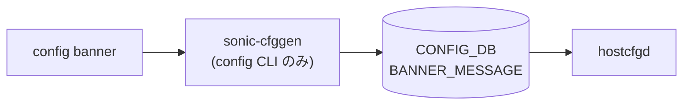

# config banner サブコマンド

## 概要

`config banner` はシステムバナー（ログイン前/後メッセージ、MOTD）を [CONFIG_DB](../../reference/glossary.md#term-config_db) の `BANNER_MESSAGE|global` テーブルに書き込む CLI グループ[^1]。[SONiC](../../reference/glossary.md#term-sonic) では [hostcfgd](../../reference/glossary.md#term-hostcfgd) 系がこのテーブル変更を監視し、`/etc/issue.net` / `/etc/motd` などを再生成する。

## コマンド一覧

| コマンド | 用途 |
|---------|------|
| `config banner state <enabled\|disabled>` | バナー機能の有効/無効 |
| `config banner login <message>` | ログイン前メッセージ設定 |
| `config banner logout <message>` | ログアウト時メッセージ設定 |
| `config banner motd <message>` | Message of the day を設定 |

## 各コマンドの詳細

### `config banner state <enabled|disabled>`

**用法**:

```bash
config banner state {enabled|disabled}
```

**引数**:

- `state` ... `enabled` / `disabled` のいずれか（`click.Choice`）

**動作**:
[CONFIG_DB](../../reference/glossary.md#term-config_db) の `BANNER_MESSAGE|global` の `state` フィールドを更新[^2]。

<!-- evidence:
source: sonic-net/sonic-utilities/config/main.py#L10012-L10020 (sha: 39732bceb8bdefe706518ab40623bbbba6ff33b9)
excerpt: |
  @banner.command()
  @click.argument('state', type=click.Choice(['enabled', 'disabled']))
  def state(state):
      config_db.mod_entry(swsscommon.CFG_BANNER_MESSAGE_TABLE_NAME, 'global',
                          {'state': state})
-->

<!-- evidence-rendered:start -->
??? note "📋 検証エビデンス: sonic-net/sonic-utilities/config/main.py#L10012-L10020 (sha: 39732bceb8bdefe706518ab40623bbbba6ff33b9)"

    **出典**:

    `sonic-net/sonic-utilities/config/main.py#L10012-L10020 (sha: 39732bceb8bdefe706518ab40623bbbba6ff33b9)`

    **抜粋**:

    ```text
    @banner.command()
    @click.argument('state', type=click.Choice(['enabled', 'disabled']))
    def state(state):
        config_db.mod_entry(swsscommon.CFG_BANNER_MESSAGE_TABLE_NAME, 'global',
                            {'state': state})
    ```

<!-- evidence-rendered:end -->

### `config banner login <message>`

**動作**:
`BANNER_MESSAGE|global` の `login` フィールドを更新。SSH/console ログイン前に表示されるバナー文字列。

### `config banner logout <message>`

**動作**:
`BANNER_MESSAGE|global` の `logout` フィールドを更新。

### `config banner motd <message>`

**動作**:
`BANNER_MESSAGE|global` の `motd` フィールドを更新。ログイン後に表示される MOTD (Message Of The Day)。

## 関連する CONFIG_DB

| テーブル | キー | フィールド |
|----------|------|------------|
| `BANNER_MESSAGE` | `global` | `state`, `login`, `logout`, `motd` |

## 注意

- `state` が `disabled` の場合、`login` / `logout` / `motd` の文字列が設定されていても表示されない（[hostcfgd](../../reference/glossary.md#term-hostcfgd) 側のテンプレート分岐）。
- `<message>` は単一文字列の click argument のため、複数語のメッセージは引用符でくくる必要がある。

<!-- cli-mermaid -->
### データフロー (自動生成)



!!! note "凡例"
    config 系 (CLI → CONFIG_DB → daemon) のミニ図。テーブル → daemon 対応は `docs/reference/config-db-orch-map.md` から機械生成。
<!-- /cli-mermaid -->

<!-- ref-triangle:start -->

## 関連リファレンス

- [CONFIG_DB](../../reference/glossary.md#term-config_db): [`BANNER_MESSAGE`](../config-db/banner-message.md)

<!-- ref-triangle:end -->

## 引用元

[^1]: `config banner` グループ定義は `config/main.py` L10003-L10053。<https://github.com/sonic-net/sonic-utilities/blob/39732bceb8bdefe706518ab40623bbbba6ff33b9/config/main.py#L10003>

[^2]: テーブル名は `swsscommon.CFG_BANNER_MESSAGE_TABLE_NAME` 定数経由で取得される（= `"BANNER_MESSAGE"`）。

<!-- cli-sibling -->
### 関連 CLI コマンド

- [`show clock`](show-clock.md) — show clock サブコマンド
- [`show environment`](show-environment.md) — show environment サブコマンド
- [`show feature`](show-feature.md) — show feature サブコマンド
- [`show platform`](show-platform.md) — show platform サブコマンド
- [`show services`](show-services.md) — show services サブコマンド

<!-- /cli-sibling -->

<!-- glossary-links-injected: 8ba32e5aa69d -->
