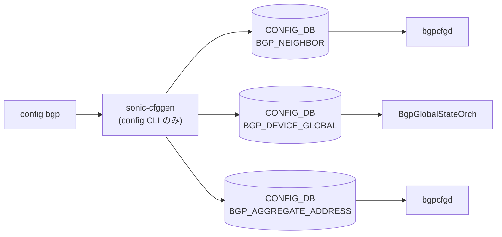

# config bgp サブコマンド

## 概要

`config bgp` は [BGP](../../reference/glossary.md#term-bgp) セッションの管理（shutdown / startup / 設定削除）と、device-global の TSA / W-[ECMP](../../reference/glossary.md#term-ecmp)、および aggregate-address (集約広告) の操作を提供する。[BGP](../../reference/glossary.md#term-bgp) データプレーン本体は [FRR](../../reference/glossary.md#term-frr) が握っているが、SONiC はその設定状態を **[CONFIG_DB](../../reference/glossary.md#term-config_db)** に保存し、`bgpcfgd` が [CONFIG_DB](../../reference/glossary.md#term-config_db) → [FRR](../../reference/glossary.md#term-frr) (vtysh) に反映する。`config bgp` は [CONFIG_DB](../../reference/glossary.md#term-config_db) を直接書き換える役割を担う[^1]。

`config/main.py` 末尾で `config.commands['bgp'].add_command(bgp_cli.DEVICE_GLOBAL)` `add_command(bgp_cli.AGGREGATE_ADDRESS)` の形で `config/bgp_cli.py` のサブグループが追加される構造のため、cli.json (機械抽出) には `device-global` / `aggregate-address` 配下が現れない。本ページでは両方を統合して扱う。

## コマンド一覧

| コマンド | 用途 |
|---------|------|
| `config bgp shutdown all` | すべての [BGP](../../reference/glossary.md#term-bgp) セッションをダウン |
| `config bgp shutdown neighbor <ipaddr_or_hostname>` | 指定隣接の BGP セッションをダウン |
| `config bgp startup all` | すべての BGP セッションをアップ |
| `config bgp startup neighbor <ipaddr_or_hostname>` | 指定隣接の BGP セッションをアップ |
| `config bgp remove neighbor <neighbor_ip_or_hostname>` | 隣接設定そのものを削除 |
| `config bgp device-global tsa enabled` | TSA (Traffic-Shift-Away) を有効化 |
| `config bgp device-global tsa disabled` | TSA を無効化 |
| `config bgp device-global w-ecmp enabled` | W-[ECMP](../../reference/glossary.md#term-ecmp) (Weighted-Cost Multi-Path) を有効化 |
| `config bgp device-global w-ecmp disabled` | W-[ECMP](../../reference/glossary.md#term-ecmp) を無効化 |
| `config bgp aggregate-address add <address> [options]` | 集約 prefix を追加 |
| `config bgp aggregate-address remove <address>` | 集約 prefix を削除 |

## 各コマンドの詳細

### `config bgp shutdown all`

**用法**:

```bash
config bgp shutdown all [-v|--verbose]
```

**動作**:
全隣接 IP を CONFIG_DB の `BGP_NEIGHBOR` テーブルから列挙し、各エントリの `admin_status` を `down` に書き換える[^2]。multi-ASIC では各 namespace の **front_ns**（外部 EBGP 隣接側）のみが対象。

<!-- evidence:
source: sonic-net/sonic-utilities/config/main.py#L4939-L4959 (sha: 39732bceb8bdefe706518ab40623bbbba6ff33b9)
excerpt: |
  @shutdown.command()
  def all(verbose):
      ...
      for namespace in namespaces:
          config_db = ConfigDBConnector(...)
          ...
          for ipaddress in bgp_neighbor_ip_list:
              _change_bgp_session_status_by_addr(config_db, ipaddress, 'down', verbose)
-->

<!-- evidence-rendered:start -->
??? note "📋 検証エビデンス: sonic-net/sonic-utilities/config/main.py#L4939-L4959 (sha: 39732bceb8bdefe706518ab40623bbbba6ff33b9)"

    **出典**:

    `sonic-net/sonic-utilities/config/main.py#L4939-L4959 (sha: 39732bceb8bdefe706518ab40623bbbba6ff33b9)`

    **抜粋**:

    ```text
    @shutdown.command()
    def all(verbose):
        ...
        for namespace in namespaces:
            config_db = ConfigDBConnector(...)
            ...
            for ipaddress in bgp_neighbor_ip_list:
                _change_bgp_session_status_by_addr(config_db, ipaddress, 'down', verbose)
    ```

<!-- evidence-rendered:end -->

### `config bgp shutdown neighbor <ipaddr_or_hostname>`

**用法**:

```bash
config bgp shutdown neighbor <ipaddr_or_hostname> [-v|--verbose]
```

**引数**:

- `<ipaddr_or_hostname>` ... 隣接 IP アドレス、または DEVICE_NEIGHBOR テーブルで定義された hostname

**動作**:
`_change_bgp_session_status` が CONFIG_DB の `BGP_NEIGHBOR|<ip>` の `admin_status` を `down` に更新する。multi-ASIC では `front_ns` + `back_ns` の両方を走査し、見つからなければエラー終了。

### `config bgp startup all` / `config bgp startup neighbor`

`shutdown` と対称。書き換え値が `up` になるだけで、引数・オプション・スコープは同一。

### `config bgp remove neighbor <neighbor_ip_or_hostname>`

**用法**:

```bash
config bgp remove neighbor <neighbor_ip_or_hostname>
```

**動作**:
`_remove_bgp_neighbor_config` が `BGP_NEIGHBOR` テーブルから当該エントリを完全削除する。`admin_status` を変えるだけの shutdown と異なり、隣接定義そのものが消える。multi-ASIC では `front_ns` + `back_ns` を走査。

<!-- evidence:
source: sonic-net/sonic-utilities/config/main.py#L5052-L5074 (sha: 39732bceb8bdefe706518ab40623bbbba6ff33b9)
excerpt: |
  @remove.command('neighbor')
  def remove_neighbor(neighbor_ip_or_hostname):
      ...
      if _remove_bgp_neighbor_config(config_db, neighbor_ip_or_hostname):
          removed_neighbor = True
-->

<!-- evidence-rendered:start -->
??? note "📋 検証エビデンス: sonic-net/sonic-utilities/config/main.py#L5052-L5074 (sha: 39732bceb8bdefe706518ab40623bbbba6ff33b9)"

    **出典**:

    `sonic-net/sonic-utilities/config/main.py#L5052-L5074 (sha: 39732bceb8bdefe706518ab40623bbbba6ff33b9)`

    **抜粋**:

    ```text
    @remove.command('neighbor')
    def remove_neighbor(neighbor_ip_or_hostname):
        ...
        if _remove_bgp_neighbor_config(config_db, neighbor_ip_or_hostname):
            removed_neighbor = True
    ```

<!-- evidence-rendered:end -->

### `config bgp device-global tsa enabled` / `disabled`

**用法**:

```bash
config bgp device-global tsa enabled
config bgp device-global tsa disabled
```

**動作**:
`tsa_handler` が `BGP_DEVICE_GLOBAL` テーブルの key `STATE` の `tsa_enabled` フィールドを `true` / `false` に更新する。隣接単位ではなくスイッチ全体の状態変更で、外部向けトラフィックを能動的に他デバイスに振り替えるための機能[^3]。

### `config bgp device-global w-ecmp enabled` / `disabled`

**動作**:
`wcmp_handler` が `BGP_DEVICE_GLOBAL|STATE` の `wcmp_enabled` を更新する。Weighted-Cost Multi-Path 機能のスイッチ全体スコープのオン／オフ。

### `config bgp aggregate-address add <address> [options]`

**用法**:

```bash
config bgp aggregate-address add <address>
    [--bbr-required]
    [--summary-only]
    [--as-set]
    [--aggregate-address-prefix-list <name>]
    [--contributing-address-prefix-list <name>]
```

**引数**:

- `<address>` ... 集約 prefix（IPv4/IPv6 両対応、`ipaddress.ip_network(strict=False)` で検証）

**オプション**:

- `--bbr-required` ... BBR (Best-path-Backup-Route) 経路がある場合のみ集約を生成
- `--summary-only` ... 集約のみ広告（contributing route は抑止）
- `--as-set` ... AS_SET 属性を付与
- `--aggregate-address-prefix-list <name>` ... 集約 prefix を追加する prefix list 名
- `--contributing-address-prefix-list <name>` ... contributing prefix の選別に使う prefix list 名

prefix-list 名は [YANG](../../reference/glossary.md#term-yang) 由来の制約 `[0-9a-zA-Z_-]*`、最大 128 文字でバリデートされる[^4]。

**動作**:
CONFIG_DB の `BGP_AGGREGATE_ADDRESS|<address>` を `set_entry` で作成。同じ key が既存ならエラーで終了する（idempotent ではない）。

<!-- evidence:
source: sonic-net/sonic-utilities/config/bgp_cli.py#L255-L286 (sha: 39732bceb8bdefe706518ab40623bbbba6ff33b9)
excerpt: |
  def AGGREGATE_ADDRESS_ADD(ctx, db, address, bbr_required, summary_only, as_set, ...):
      table = CFG_BGP_AGGREGATE_ADDRESS  # = "BGP_AGGREGATE_ADDRESS"
      key = address
      ...
      if table in cfg and key in cfg[table]:
          ctx.fail("Aggregate address '{}' already exists".format(key))
      data = {
          "bbr-required": ..., "summary-only": ..., "as-set": ...,
          "aggregate-address-prefix-list": ...,
          "contributing-address-prefix-list": ...,
      }
      db.cfgdb.set_entry(table, key, data)
-->

<!-- evidence-rendered:start -->
??? note "📋 検証エビデンス: sonic-net/sonic-utilities/config/bgp_cli.py#L255-L286 (sha: 39732bceb8bdefe706518ab40623bbbba6ff33b9)"

    **出典**:

    `sonic-net/sonic-utilities/config/bgp_cli.py#L255-L286 (sha: 39732bceb8bdefe706518ab40623bbbba6ff33b9)`

    **抜粋**:

    ```text
    def AGGREGATE_ADDRESS_ADD(ctx, db, address, bbr_required, summary_only, as_set, ...):
        table = CFG_BGP_AGGREGATE_ADDRESS  # = "BGP_AGGREGATE_ADDRESS"
        key = address
        ...
        if table in cfg and key in cfg[table]:
            ctx.fail("Aggregate address '{}' already exists".format(key))
        data = {
            "bbr-required": ..., "summary-only": ..., "as-set": ...,
            "aggregate-address-prefix-list": ...,
            "contributing-address-prefix-list": ...,
        }
        db.cfgdb.set_entry(table, key, data)
    ```

<!-- evidence-rendered:end -->

### `config bgp aggregate-address remove <address>`

**動作**:
`BGP_AGGREGATE_ADDRESS|<address>` を `set_entry(..., None)` で削除。存在しない key を渡すとエラー終了。

## 関連する CONFIG_DB

| テーブル | 書き換える key/フィールド | 操作するコマンド |
|----------|--------------------------|------------------|
| `BGP_NEIGHBOR` | `<ip>` の `admin_status` | `config bgp shutdown ...` / `config bgp startup ...` |
| `BGP_NEIGHBOR` | エントリ全削除 | `config bgp remove neighbor` |
| `BGP_DEVICE_GLOBAL` | `STATE` の `tsa_enabled` | `config bgp device-global tsa ...` |
| `BGP_DEVICE_GLOBAL` | `STATE` の `wcmp_enabled` | `config bgp device-global w-ecmp ...` |
| `BGP_AGGREGATE_ADDRESS` | `<prefix>` の `bbr-required` / `summary-only` / `as-set` / `aggregate-address-prefix-list` / `contributing-address-prefix-list` | `config bgp aggregate-address add/remove` |

## multi-ASIC スコープ

- `shutdown all` / `startup all`: **`front_ns` のみ**（外部 EBGP 隣接側）
- `shutdown neighbor` / `startup neighbor` / `remove neighbor`: `front_ns` + `back_ns` 両方を走査

<!-- cli-mermaid -->
### データフロー (自動生成)



!!! note "凡例"
    config 系 (CLI → CONFIG_DB → daemon) のミニ図。テーブル → daemon 対応は `docs/reference/config-db-orch-map.md` から機械生成。
<!-- /cli-mermaid -->

<!-- ref-triangle:start -->

## 関連リファレンス

- CONFIG_DB: [`BGP_NEIGHBOR`](../config-db/bgp-neighbor.md) / [`BGP_DEVICE_GLOBAL`](../config-db/bgp-device-global.md) / [`BGP_AGGREGATE_ADDRESS`](../config-db/bgp-aggregate-address.md)

<!-- ref-triangle:end -->

## 引用元

[^1]: `config bgp` グループ定義は `config/main.py` の L4918-L4921。`@config.group(cls=clicommon.AbbreviationGroup)` で `bgp` が宣言される。<https://github.com/sonic-net/sonic-utilities/blob/39732bceb8bdefe706518ab40623bbbba6ff33b9/config/main.py#L4918>

[^2]: `_change_bgp_session_status_by_addr` の実装は CONFIG_DB の `BGP_NEIGHBOR|<ip>` を直接 mod する。同 `config/main.py` 上部のヘルパ参照。

[^3]: TSA / W-ECMP の CONFIG_DB key は `swsscommon.CFG_BGP_DEVICE_GLOBAL_TABLE_NAME = "BGP_DEVICE_GLOBAL"`、key は `STATE`。`utilities_common/bgp.py` L1-L13 を参照。<https://github.com/sonic-net/sonic-utilities/blob/39732bceb8bdefe706518ab40623bbbba6ff33b9/utilities_common/bgp.py>

[^4]: prefix-list 名のバリデータは `validate_prefix_list_name` (`config/bgp_cli.py` L215-L226)。<https://github.com/sonic-net/sonic-utilities/blob/39732bceb8bdefe706518ab40623bbbba6ff33b9/config/bgp_cli.py#L215>

<!-- usage-example -->
## 実行例

### 典型的な使い方

```bash
# 例 1: 特定隣接の BGP セッションをシャットダウン
sudo config bgp shutdown neighbor 10.0.0.1
```

### よくある引数の組み合わせ

```bash
# 集約 prefix を summary-only で広告
sudo config bgp aggregate-address add 10.0.0.0/16 --summary-only

# Traffic-Shift-Away を有効化（メンテナンス前に外向きトラフィックを退避）
sudo config bgp device-global tsa enabled
```

### 期待される出力 (抜粋)

```text
Starting up BGP session with neighbor 10.0.0.1 .....
```
<!-- /usage-example -->

<!-- ops-hint -->
## 運用ヒント

### 典型的な利用シーン

- メンテナンス前に対象隣接を `shutdown`、終了後 `startup` する運用。
- TSA (Traffic-Shift-Away) で機器全体の外向き advertise を一括停止する。

### よくある落とし穴

- `config bgp shutdown neighbor` は [FRR](../../reference/glossary.md#term-frr) には即反映だが CONFIG_DB 上は `admin_status` が変わるのみ。`config save` を忘れると再起動で戻る。
- TSA は AS-Path prepend で実現するため、対向側の bestpath ロジック次第では退避が遅延する。

### 関連する show / debug

```bash
show ip bgp summary
show runningconfiguration bgp
show bgp device-global
```
<!-- /ops-hint -->

<!-- cli-sibling -->
### 関連 CLI コマンド

- [`show bgp`](show-bgp.md) — show bgp / show ip bgp / show ipv6 bgp サブコマンド
- [`show arp`](show-arp.md) — show arp サブコマンド
- [`show bfd`](show-bfd.md) — show bfd サブコマンド
- [`show ip`](show-ip.md) — show ip サブコマンド
- [`show ndp`](show-ndp.md) — show ndp サブコマンド

<!-- /cli-sibling -->

## 関連ページ
- [HLD: FRR-BGP Unified Mgmt Framework](../../routing/sonic-frr-bgp-extended-unified-configuration-management-framework.md)
- [CONFIG_DB: BGP_NEIGHBOR](../config-db/bgp-neighbor.md)
- [YANG: sonic-bgp-neighbor](../yang/sonic-bgp-neighbor.md)

<!-- glossary-links-injected: 22dc76970f48 -->
