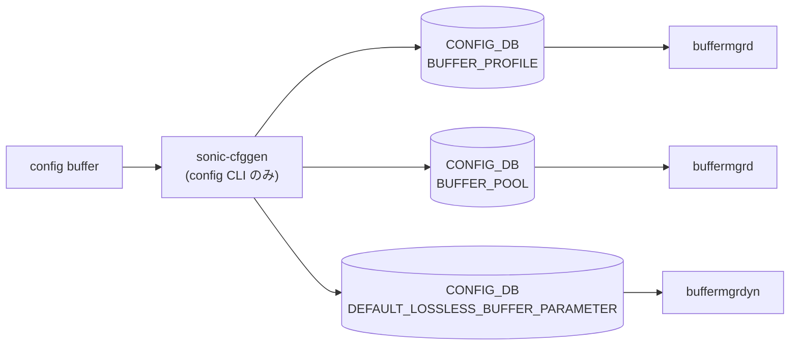

# config buffer サブコマンド

## 概要

`config buffer` は dynamic buffer が有効なシステムで、[CONFIG_DB](../../reference/glossary.md#term-config_db) の `BUFFER_PROFILE` を追加・更新する CLI グループ。グループ入口で `DEVICE_METADATA|localhost` の `buffer_model` を確認し、dynamic 以外では実行を拒否する[^1]。

## コマンド一覧

| コマンド | 用途 |
|---------|------|
| `config buffer profile add <profile> [options]` | `BUFFER_PROFILE|<profile>` を新規作成 |
| `config buffer profile set <profile> [options]` | 既存 profile を更新 |

## 各コマンドの詳細

### `config buffer profile add <profile>`

**用法**:

```bash
config buffer profile add <profile>
    [--xon <bytes>]
    [--xoff <bytes>]
    [--size <bytes>]
    [--dynamic_th <value>]
    [--pool <pool>]
```

`BUFFER_PROFILE|<profile>` が既に存在する場合はエラー。存在しない場合、`update_profile()` を通じて `pool`, `xon`, `xoff`, `size`, `dynamic_th` を組み立て、`ValidatedConfigDBConnector` で [CONFIG_DB](../../reference/glossary.md#term-config_db) に書き込む[^2]。

`--pool` を省略すると `ingress_lossless_pool` が使われる。指定 pool は `BUFFER_POOL` に存在する必要がある。

### `config buffer profile set <profile>`

**用法**:

```bash
config buffer profile set <profile>
    [--xon <bytes>]
    [--xoff <bytes>]
    [--size <bytes>]
    [--dynamic_th <value>]
    [--pool <pool>]
```

既存 `BUFFER_PROFILE|<profile>` を更新する。profile が存在しなければエラー。既存 profile が `xoff` を持たない dynamic headroom 計算型の場合、`--xoff` を指定して非 dynamic 型へ変える操作は拒否される[^3]。

## 関連する CONFIG_DB

| テーブル | キー | 操作 |
|----------|------|------|
| `BUFFER_PROFILE` | `<profile>` | profile の作成・更新 |
| `BUFFER_POOL` | `<pool>` | 指定 pool の存在確認 |
| `DEFAULT_LOSSLESS_BUFFER_PARAMETER` | 任意 | shared headroom pool 判定 |

## 注意

- `config interface buffer priority_group ...` と `config interface buffer queue ...` は別グループで、port 上の `BUFFER_PG` / `BUFFER_QUEUE` バインドを操作する。本ページは root の `config buffer profile` を対象にする。
- CLI 抽出上の `config buffer priority-group` / `queue` 候補は、実装上は `config interface buffer ...` 配下にある。

<!-- ref-triangle:start -->

## 関連リファレンス

- [CONFIG_DB](../../reference/glossary.md#term-config_db): [`BUFFER_PROFILE`](../config-db/buffer-profile.md) / [`BUFFER_POOL`](../config-db/buffer-pool.md) / [`DEFAULT_LOSSLESS_BUFFER_PARAMETER`](../config-db/default-lossless-buffer-parameter.md)

<!-- ref-triangle:end -->

## 引用元

[^1]: `config buffer` グループ定義と dynamic buffer チェック。<https://github.com/sonic-net/sonic-utilities/blob/39732bceb8bdefe706518ab40623bbbba6ff33b9/config/main.py#L8481>

[^2]: `profile add` は既存 entry を確認してから `update_profile()` を呼ぶ。<https://github.com/sonic-net/sonic-utilities/blob/39732bceb8bdefe706518ab40623bbbba6ff33b9/config/main.py#L8494>

[^3]: `profile set` の存在確認と `xoff` 変更制限。<https://github.com/sonic-net/sonic-utilities/blob/39732bceb8bdefe706518ab40623bbbba6ff33b9/config/main.py#L8514>

<!-- cli-mermaid -->
### データフロー (自動生成)



!!! note "凡例"
    config 系 (CLI → CONFIG_DB → daemon) のミニ図。テーブル → daemon 対応は `docs/reference/config-db-orch-map.md` から機械生成。
<!-- /cli-mermaid -->

<!-- topics-back-ref -->
## 関連 Topics

- [Topics: QoS / Buffer / PFC / Watermark](../../topics/08-qos-buffer/index.md)

<!-- /topics-back-ref -->

<!-- ops-hint -->
## 運用ヒント

### 典型的な利用シーン

- dynamic buffer モードと traditional モードの切り替え。
- lossless プロファイル（headroom）の最適化。

### よくある落とし穴

- switchmode 変更は `config save` + reload 必須。即時切替不可。
- PG/queue から profile を外す前に profile を削除すると [orchagent](../../reference/glossary.md#term-orchagent) が拒否する。

### 関連する show / debug

```bash
show buffer profile
show priority-group persistent-watermark headroom
show buffer pool
```
<!-- /ops-hint -->

<!-- cli-sibling -->
### 関連 CLI コマンド

- [`show buffer`](show-buffer.md) — show buffer サブコマンド
- [`show buffer pool`](show-buffer-pool.md) — show buffer_pool / headroom-pool サブコマンド
- [`show pfc`](show-pfc.md) — show pfc サブコマンド
- [`show priority group`](show-priority-group.md) — show priority-group サブコマンド
- [`show queue`](show-queue.md) — show queue サブコマンド

<!-- /cli-sibling -->

<!-- glossary-links-injected: a35f1b1cdfa7 -->
