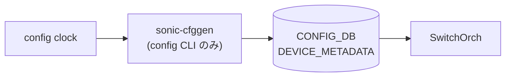

# config clock サブコマンド

## 概要

`config clock` はシステムのタイムゾーンと日時を設定する CLI グループ[^1]。タイムゾーンは [CONFIG_DB](../../reference/glossary.md#term-config_db) の `DEVICE_METADATA|localhost.timezone` に保存し、日時は OS の `timedatectl set-time` を実行する。

## コマンド一覧

| コマンド | 用途 |
|---------|------|
| `config clock timezone <timezone_name>` | システムタイムゾーンを設定 |
| `config clock date <YYYY-MM-DD> <HH:MM:SS>` | システム日時を設定 |

## 各コマンドの詳細

### `config clock timezone <timezone_name>`

**用法**:

```bash
config clock timezone <timezone_name>
```

**引数**:

- `<timezone_name>` ... `timedatectl list-timezones` が返す候補から選ぶ（shell completion 対応）

**動作**:

1. `timedatectl list-timezones` の出力を取得し、引数がリストに含まれるか検証。不一致なら `Timezone <name> does not conform format` を表示して `sys.exit(1)`
2. [CONFIG_DB](../../reference/glossary.md#term-config_db) の `DEVICE_METADATA|localhost` テーブルに `timezone` フィールドを `mod_entry` で書き込む

<!-- evidence:
source: sonic-net/sonic-utilities/config/main.py#L9777-L9790 (sha: 39732bceb8bdefe706518ab40623bbbba6ff33b9)
excerpt: |
  @clock.command()
  def timezone(timezone):
      if timezone not in get_tzs(None, None, ''):
          click.echo(f'Timezone {timezone} does not conform format')
          sys.exit(1)
      config_db.mod_entry(swsscommon.CFG_DEVICE_METADATA_TABLE_NAME, 'localhost',
                          {'timezone': timezone})
-->

<!-- evidence-rendered:start -->
??? note "📋 検証エビデンス: sonic-net/sonic-utilities/config/main.py#L9777-L9790 (sha: 39732bceb8bdefe706518ab40623bbbba6ff33b9)"

    **出典**:

    `sonic-net/sonic-utilities/config/main.py#L9777-L9790 (sha: 39732bceb8bdefe706518ab40623bbbba6ff33b9)`

    **抜粋**:

    ```text
    @clock.command()
    def timezone(timezone):
        if timezone not in get_tzs(None, None, ''):
            click.echo(f'Timezone {timezone} does not conform format')
            sys.exit(1)
        config_db.mod_entry(swsscommon.CFG_DEVICE_METADATA_TABLE_NAME, 'localhost',
                            {'timezone': timezone})
    ```

<!-- evidence-rendered:end -->

### `config clock date <date> <time>`

**用法**:

```bash
config clock date <YYYY-MM-DD> <HH:MM:SS>
```

**引数**:

- `<date>` ... `YYYY-MM-DD` 形式（`datetime.strptime` でフォーマット検証）
- `<time>` ... `HH:MM:SS` 形式（同様に検証）

**動作**:
両方のフォーマットチェック後、`timedatectl set-time "<date> <time>"` を実行する。[CONFIG_DB](../../reference/glossary.md#term-config_db) は更新しない（systemd 経由で OS の wall clock を変更するのみ）[^2]。

## 関連する CONFIG_DB

| テーブル | キー | フィールド |
|----------|------|------------|
| `DEVICE_METADATA` | `localhost` | `timezone` |

## 注意

- `date` サブコマンドは NTP 同期が有効な場合、`timedatectl` が "Failed to set time: Automatic time synchronization is enabled" でエラーを返す。先に NTP を停止する必要がある。
- `timezone` は CONFIG_DB に保存されるため `config save` 後の再起動でも保持される。`date` は OS clock の変更のみで CONFIG_DB に持続化されない。

<!-- cli-mermaid -->
### データフロー (自動生成)



!!! note "凡例"
    config 系 (CLI → CONFIG_DB → daemon) のミニ図。テーブル → daemon 対応は `docs/reference/config-db-orch-map.md` から機械生成。
<!-- /cli-mermaid -->

<!-- ref-triangle:start -->

## 関連リファレンス

- CONFIG_DB: [`DEVICE_METADATA`](../config-db/device-metadata.md)

<!-- ref-triangle:end -->

## 引用元

[^1]: `config clock` グループ定義は `config/main.py` L9758-L9815。<https://github.com/sonic-net/sonic-utilities/blob/39732bceb8bdefe706518ab40623bbbba6ff33b9/config/main.py#L9758>

[^2]: `timedatectl set-time` は systemd 提供の操作で OS 時刻のみを変更する。

<!-- cli-sibling -->
### 関連 CLI コマンド

- [`show clock`](show-clock.md) — show clock サブコマンド
- [`show environment`](show-environment.md) — show environment サブコマンド
- [`show feature`](show-feature.md) — show feature サブコマンド
- [`show platform`](show-platform.md) — show platform サブコマンド
- [`show services`](show-services.md) — show services サブコマンド

<!-- /cli-sibling -->

<!-- glossary-links-injected: a35f1b1cdfa7 -->
