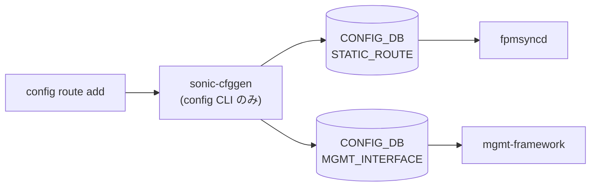

# config default-route（デフォルトルート設定パターン）

## 概要

[SONiC](../../reference/glossary.md#term-sonic) には `config default-route` という独立した click コマンドは **存在しない**。デフォルトルート（`0.0.0.0/0` / `::/0`）を設定する場合は、用途に応じて以下のいずれかを使う:

| 目的 | 使うコマンド | 書き込み先 |
|---|---|---|
| データプレーン側のスタティックルート | `config route add prefix 0.0.0.0/0 nexthop <ip>` | [CONFIG_DB](../../reference/glossary.md#term-config_db) `STATIC_ROUTE` |
| 管理 NIC (`eth0`) の default gateway | `config mgmt-interface add` 系 + `MGMT_INTERFACE` の gwaddr | [CONFIG_DB](../../reference/glossary.md#term-config_db) `MGMT_INTERFACE` |
| [BGP](../../reference/glossary.md#term-bgp) で受ける default route | [FRR](../../reference/glossary.md#term-frr) [vtysh](../../reference/glossary.md#term-vtysh) / `config bgp` 配下 | [CONFIG_DB](../../reference/glossary.md#term-config_db)（一部）+ [FRR](../../reference/glossary.md#term-frr) config |

本ページは前 2 つの「CLI で書き込めるデフォルトルート」のパターンを整理する。`config route` 全体の仕様は [config route サブコマンド（static route）](config-route.md) を参照。

## パターン 1: スタティックなデフォルトルート

`config route add` で `0.0.0.0/0` を prefix に指定する。実装は `config/main.py:add_route()`[^1] で、内部関数 `cli_sroute_to_config()` が CLI トークンを解析して `STATIC_ROUTE` テーブルのキーと value 辞書に展開する。

```bash
# IPv4 デフォルトルート
sudo config route add prefix 0.0.0.0/0 nexthop 10.0.0.1

# VRF 指定
sudo config route add prefix vrf Vrf-Red 0.0.0.0/0 nexthop vrf Vrf-Blue 192.0.2.1

# IPv6
sudo config route add prefix ::/0 nexthop 2001:db8::1

# 出力インタフェース指定（dev <iface>）
sudo config route add prefix 0.0.0.0/0 nexthop dev Ethernet0

# Blackhole (null route)
sudo config route add prefix 0.0.0.0/0 nexthop dev null
```

最後の `dev null` 形式は内部で `'blackhole': 'true'` が `STATIC_ROUTE` に書き込まれる[^1]。

書き込まれる CONFIG_DB エントリ例:

```yaml
STATIC_ROUTE|0.0.0.0/0
  nexthop:      10.0.0.1
  nexthop-vrf:  ""
  ifname:       ""
  distance:     "0"
  blackhole:    "false"
```

[VRF](../../reference/glossary.md#term-vrf) 付きの場合のキーは `STATIC_ROUTE|Vrf-Red|0.0.0.0/0`。

## パターン 2: 管理 NIC のデフォルトゲートウェイ

eth0 (mgmt) のデフォルトゲートウェイは `MGMT_INTERFACE` テーブルの `gwaddr` フィールドで設定する。`config mgmt-interface` 系コマンドまたは `config_db.json` 直編集で扱う。

```text
MGMT_INTERFACE|eth0|10.0.0.0/24
  gwaddr: 10.0.0.1
```

このゲートウェイは管理 [VRF](../../reference/glossary.md#term-vrf)（有効時）または default [VRF](../../reference/glossary.md#term-vrf) の routing table に `default via 10.0.0.1 dev eth0` として注入される。**データプレーン側の default route と分離する**点に注意。

## パターン 3: BGP 経由

業務トラフィック向けのデフォルトルートは大抵 [BGP](../../reference/glossary.md#term-bgp) で受ける。CLI 単独で設定する場合は `config bgp` 系（`config-bgp.md` 参照）または `vtysh` で `neighbor X default-originate` / `default-information originate` を使う。

## STATIC_ROUTE の更新ロジック（補足）

`config route add` が同じ prefix で複数回呼ばれた場合、`config/main.py` の `add_route()` は **既存エントリの値カラムに `,` 区切りで追記**する形で複数 nexthop を蓄積する仕様[^1]。デフォルトルートに複数 [ECMP](../../reference/glossary.md#term-ecmp) nexthop を載せたい場合は、その分だけコマンドを繰り返すか 1 度のコマンドで `nexthop 10.0.0.1 nexthop 10.0.0.2` の形で書く。

削除は `config route del prefix 0.0.0.0/0 ...` で対象 nexthop を指定する。

<!-- cli-mermaid -->
### データフロー (自動生成)



!!! note "凡例"
    config 系 (CLI → CONFIG_DB → daemon) のミニ図。テーブル → daemon 対応は `docs/reference/config-db-orch-map.md` から機械生成。
<!-- /cli-mermaid -->

<!-- ref-triangle:start -->

## 関連リファレンス

- [YANG](../../reference/glossary.md#term-yang): [`sonic-static-route`](../yang/sonic-static-route.md)
- CONFIG_DB: [`STATIC_ROUTE`](../config-db/static-route.md) / [`MGMT_INTERFACE`](../config-db/mgmt-interface.md)

<!-- ref-triangle:end -->

## 引用元

[^1]: `config route add` の実装は `config/main.py` L7812-L7888。`blackhole` の自動付与は L7858-L7870。<https://github.com/sonic-net/sonic-utilities/blob/39732bceb8bdefe706518ab40623bbbba6ff33b9/config/main.py#L7812>

<!-- ops-hint -->
## 運用ヒント

### 典型的な利用シーン

- default route の追加・削除、VRF 別 default route。

### よくある落とし穴

- [BGP](../../reference/glossary.md#term-bgp) / OSPF からの default route と static default route が共存すると AD で挙動が変わる。
- VRF 指定を忘れると default VRF に入り、想定外の経路漏れになる。

### 関連する show / debug

```bash
show ip route 0.0.0.0/0
show ip route vrf all
vtysh -c 'show ip route 0.0.0.0/0'
```
<!-- /ops-hint -->

<!-- cli-sibling -->
### 関連 CLI コマンド

- [`show route map`](show-route-map.md) — show route-map コマンド
- [`config route`](config-route.md) — config route サブコマンド（static route）
- [`show arp`](show-arp.md) — show arp サブコマンド
- [`show bfd`](show-bfd.md) — show bfd サブコマンド
- [`show bgp`](show-bgp.md) — show bgp / show ip bgp / show ipv6 bgp サブコマンド

<!-- /cli-sibling -->

<!-- glossary-links-injected: 7ac8e66e1af3 -->
