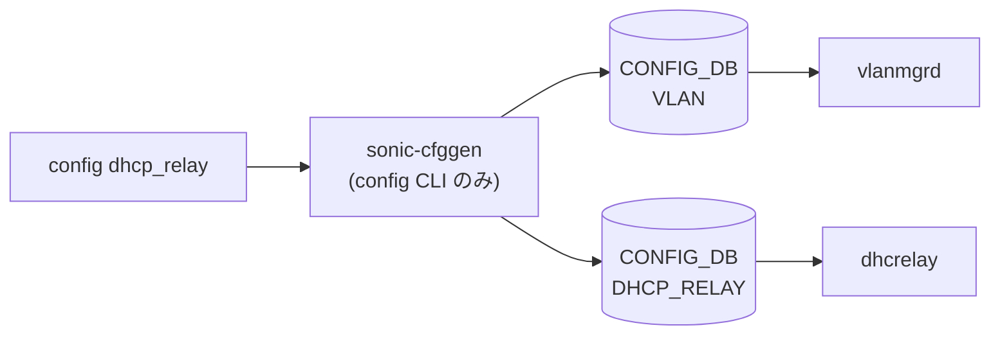

# config dhcp_relay / dhcpv4_relay サブコマンド

## 概要

`config dhcp_relay` および `config dhcpv4_relay` グループは、`sonic-buildimage` 側の **docker-dhcp-relay コンテナの CLI plugin** (`cli/config/plugins/dhcp_relay.py`) で定義されており、`sonic-utilities` 起動時に `sonic_package_manager` のプラグイン機構経由で `config` コマンドツリーに合流する[^1]。`sonic-utilities` 単体には実装が無い点に注意。

実装は 3 つのトップレベル group に分かれる:

- **`config dhcp_relay`** ... 旧来のシンプルな relay (Vlan の `dhcp_servers` / `dhcpv6_servers` を増減)
- **`config dhcpv4_relay`** ... 新 DHCPv4 リレー (`DHCPV4_RELAY` テーブル + 拡張オプション)
- 上記 `dhcp_relay` 配下の `ipv4 helper` / `ipv6 destination` ... 旧 CLI の現代化 wrapper

新形式 (`dhcpv4_relay`) は `FEATURE|localhost.has_sonic_dhcpv4_relay = True` の環境でのみ実効化される[^2]。

## コマンド一覧 (主要)

### dhcp_relay (旧形式互換)

| コマンド | 用途 |
|---------|------|
| `config dhcp_relay ipv4 helper add <vid> <server_ip>...` | Vlan の DHCPv4 helper 追加 (拡張オプション付き) |
| `config dhcp_relay ipv4 helper del <vid> <server_ip>...` | DHCPv4 helper 削除 |
| `config dhcp_relay ipv6 destination add <vid> <server_ip>...` | DHCPv6 リレー先追加 |
| `config dhcp_relay ipv6 destination del <vid> <server_ip>...` | DHCPv6 リレー先削除 |

### dhcpv4_relay (新形式)

| コマンド | 用途 |
|---------|------|
| `config dhcpv4_relay add --dhcpv4-servers <ips> [拡張オプション] <vlan_name>` | Vlan に DHCPv4 リレー設定を新規追加 |
| `config dhcpv4_relay update [変更オプション] <vlan_name>` | 既存設定を merge |
| `config dhcpv4_relay del [削除フラグ] <vlan_name>` | 設定全部 / 一部削除 |

## 各コマンドの詳細

### `config dhcp_relay ipv4 helper add <vid> <server_ip>...`

**用法**:

```bash
config dhcp_relay ipv4 helper add <vid> <server_ip> [<server_ip> ...]
    [--source-interface <ifname>]
    [--link-selection {enable|disable}]
    [--vrf-selection {enable|disable}]
    [--server-id-override {enable|disable}]
    [--server-vrf <vrf_name>]
    [--agent-relay-mode {discard|append|replace}]
    [--max-hop-count <int>]
```

**動作**:
`<vid>` から `Vlan<vid>` を組み立て、IPv4 アドレスを `validate_ips` で検証したうえで `VLAN|Vlan<vid>` の `dhcp_servers` リストに追加する。同時に `DHCPV4_RELAY|Vlan<vid>` テーブルに拡張オプション (source_interface 等) を merge する。最後に `dhcp_relay.service` を `systemctl restart` する[^3]。

### `config dhcp_relay ipv4 helper del <vid> <server_ip>...`

`VLAN|Vlan<vid>` の `dhcp_servers` から指定 IP を削除する。指定された IP のうち登録されていないものはエラー終了。最後にサービスを再起動する。

### `config dhcp_relay ipv6 destination add <vid> <server_ip>...`

IPv4 helper と対称、`VLAN|Vlan<vid>` の `dhcpv6_servers` リストを更新し、`DHCP_RELAY|Vlan<vid>` (v6 用) を merge する。

### `config dhcpv4_relay add --dhcpv4-servers <ips> <vlan_name>`

新 CLI。`<vlan_name>` を `validate_vlan_exists` で検証 (`VLAN` テーブルに存在することが前提)、`source-interface` は `validate_source_interface` で当該 Vlan / Loopback 等の有効インタフェースか、`server-vrf` は `validate_vrf_exists` で `VRF` テーブルに存在するかを検査する。検証通過後 `DHCPV4_RELAY|<vlan_name>` を作成。`add` は **既存エントリがある場合エラー** で、変更時は `update` を使う。

### `config dhcpv4_relay update <vlan_name>`

既存 `DHCPV4_RELAY|<vlan_name>` に対して指定オプションのみ merge 更新する (idempotent)。

### `config dhcpv4_relay del <vlan_name>`

オプションフラグ未指定なら `DHCPV4_RELAY|<vlan_name>` を全削除。`--source-interface` / `--link-selection` / 等の個別フラグを付けると、対応するフィールドだけ削除して残りは保持する。

## 拡張オプションの意味

| オプション | 値 | 役割 |
|-----------|----|------|
| `--source-interface` | ifname | リレーパケットの送信元インタフェース (Loopback など) |
| `--link-selection` | enable / disable | RFC 3527 link selection sub-option (option 82.5) |
| `--vrf-selection` | enable / disable | [VRF](../../reference/glossary.md#term-vrf) selection sub-option (option 82.151 / VPN-ID) |
| `--server-id-override` | enable / disable | server-id サブオプションの override |
| `--server-vrf` | vrf 名 | リレー先サーバ到達用の [VRF](../../reference/glossary.md#term-vrf) |
| `--agent-relay-mode` | discard / append / replace | option 82 を含むリレーパケットの扱い |
| `--max-hop-count` | int | リレー時に許容する最大 hop |

## 関連する CONFIG_DB

| テーブル | キー | 用途 |
|----------|------|------|
| `VLAN` | `Vlan<vid>` | `dhcp_servers` / `dhcpv6_servers` のリスト |
| `DHCP_RELAY` | `Vlan<vid>` | DHCPv6 拡張オプション (旧 CLI 経路) |
| `DHCPV4_RELAY` | `<vlan_name>` | DHCPv4 拡張オプション (新 CLI 経路) |

## 注意

- 新旧 CLI が同じ Vlan に対して並走する場合、`dhcp_servers` (旧) と `DHCPV4_RELAY` (新) の整合は CLI が保証しない。新環境では `dhcpv4_relay` 系に寄せるのが推奨。
- DHCPv4 リレーサービス再起動は **`systemctl restart dhcp_relay.service`** で行うので、設定変更時に既存リース解析が一旦止まる。

<!-- ref-triangle:start -->

## 関連リファレンス

- [CONFIG_DB](../../reference/glossary.md#term-config_db): [`VLAN`](../config-db/vlan.md) / [`DHCP_RELAY`](../config-db/dhcp-relay.md) / [`DHCPV4_RELAY`](../config-db/dhcpv4-relay.md)

<!-- ref-triangle:end -->

## 引用元

[^1]: docker-dhcp-relay の CLI plugin は `dockers/docker-dhcp-relay/cli/config/plugins/dhcp_relay.py`。`sonic-utilities` の `setup.py` には登録されておらず、buildimage 側でコンテナイメージにインストールされる。<https://github.com/sonic-net/sonic-buildimage/blob/9ea932ec2e18f35e58268ec2e4456b1d4afd65cd/dockers/docker-dhcp-relay/cli/config/plugins/dhcp_relay.py>

[^2]: `check_sonic_dhcpv4_relay_flag` (同 plugin L16-L20)。`FEATURE|localhost` の `has_sonic_dhcpv4_relay` を見て、未対応なら `dhcpv4_relay` 系コマンドはエラー終了する。

[^3]: `restart_dhcp_relay_service` (同 plugin L51-L62) が `systemctl restart dhcp_relay.service` を呼ぶ。

<!-- cli-mermaid -->
### データフロー (自動生成)



!!! note "凡例"
    config 系 (CLI → CONFIG_DB → daemon) のミニ図。テーブル → daemon 対応は `docs/reference/config-db-orch-map.md` から機械生成。
<!-- /cli-mermaid -->

<!-- topics-back-ref -->
## 関連 Topics

- [Topics: NAT / DHCP Relay / Time-DNS Services](../../topics/16-nat-dhcp-dns/index.md)

<!-- /topics-back-ref -->

<!-- ops-hint -->
## 運用ヒント

### 典型的な利用シーン

- [VLAN](../../reference/glossary.md#term-vlan) に DHCP relay server を割り当て、テナント収容を有効化。
- DHCPv6 relay の interface-id / link-address 設定。

### よくある落とし穴

- [VLAN](../../reference/glossary.md#term-vlan) に IP が無い状態で relay を入れても client から DISCOVER を受けない。
- `config dhcp_relay del` で server を全消去すると relay 機能自体が停止する。

### 関連する show / debug

```bash
show dhcp_relay
show runningconfiguration all | grep -i dhcp
docker logs dhcp_relay
```
<!-- /ops-hint -->

<!-- cli-sibling -->
### 関連 CLI コマンド

- [`show mgmt-vrf`](show-mgmt-vrf.md) — show mgmt-vrf サブコマンド
- [`show muxcable`](show-muxcable.md) — show muxcable サブコマンド
- [`show running config`](show-running-config.md) — show runningconfiguration / startupconfiguration サブコマンド
- [`config mgmt trio`](config-mgmt-trio.md) — config save / load / reload / replace / qos reload
- [`config muxcable`](config-muxcable.md) — config muxcable サブコマンド

<!-- /cli-sibling -->

<!-- glossary-links-injected: ad07899a32d7 -->
