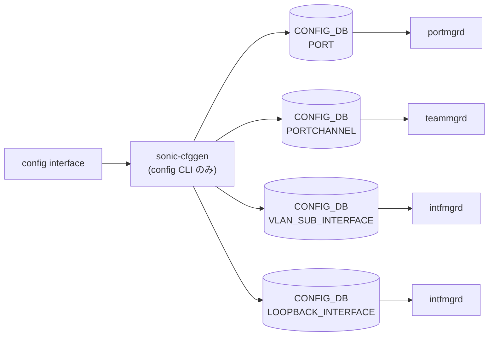

# config interface サブコマンド

## 概要

`config interface` は物理ポート（`PORT`）・[PortChannel](../../reference/glossary.md#term-portchannel)・SubInterface・Loopback の **state / 速度 / FEC / link-training / autoneg / breakout / MTU / TPID** などをまとめて制御するサブグループ。IP アドレスや [VRF](../../reference/glossary.md#term-vrf) 紐付け、IPv6 機能の有無、VRRP 設定、[PFC](../../reference/glossary.md#term-pfc) / Storm-Control / Buffer / Transceiver もここから入る[^1]。

`@config.group(...)` 直下で `--namespace`/`-n` を **multi-ASIC のときだけ required**として受け取り、`ConfigDBConnector(namespace=...)` を `ctx.obj['config_db']` に格納する仕組み。配下の各コマンドはこの connector を使って `PORT` 等を mod する。

```python
# config/main.py L5080-L5092
@config.group(cls=clicommon.AbbreviationGroup)
@click.option('-n', '--namespace', help='Namespace name',
             required=True if multi_asic.is_multi_asic() else False, ...)
@click.pass_context
def interface(ctx, namespace):
    config_db = ConfigDBConnector(use_unix_socket_path=True, namespace=str(namespace))
    config_db.connect()
    ctx.obj = {'config_db': config_db, 'namespace': str(namespace)}
```

## コマンド一覧

### 直下のコマンド

| コマンド | 用途 |
|---------|------|
| `config interface startup <intf>` | 管理 admin_status を up |
| `config interface shutdown <intf>` | 管理 admin_status を down |
| `config interface speed <intf> <speed>` | 速度設定 (`portconfig -s`) |
| `config interface link-training <intf> <on\|off>` | リンクトレーニング (`portconfig -lt`) |
| `config interface autoneg <intf> <enabled\|disabled>` | オートネゴ (`portconfig -an`) |
| `config interface advertised-speeds <intf> <list>` | 広告速度 (`portconfig -S`) |
| `config interface type <intf> <type>` | 物理タイプ (`portconfig -t`) |
| `config interface advertised-types <intf> <list>` | 広告タイプ (`portconfig -T`) |
| `config interface breakout <intf> <mode>` | ブレイクアウト |
| `config interface mtu <intf> <mtu>` | MTU |
| `config interface tpid <intf> <tpid>` | TPID |
| `config interface fec <intf> <fec>` | FEC モード |
| `config interface cable-length <intf> <len>` | ケーブル長 |
| `config interface fast-linkup <intf> <enable\|disable>` | fast link-up |
| `config interface enable <intf>` / `disable <intf>` | sFlow 個別 enable/disable |
| `config interface sample-rate <intf> <rate>` | sFlow サンプル間隔 |
| `config interface sample-direction <intf> <ingress\|egress\|both>` | sFlow 方向 |

### サブグループ

| サブグループ | 用途 |
|------------|------|
| `config interface ip` | IP アドレスの追加・削除（`add` / `remove`） |
| `config interface ipv6` | IPv6 機能 (`enable use-link-local-only` 等) |
| `config interface vrf` | [VRF](../../reference/glossary.md#term-vrf) バインド (`bind` / `unbind`) |
| `config interface mpls` | [MPLS](../../reference/glossary.md#term-mpls) 有効化 (`add` / `remove`) |
| `config interface buffer` | priority-group / queue のプロファイル割当 |
| `config interface transceiver` | SFP / トランシーバ制御 (`lpmode` 等) |
| `config interface vrrp` / `vrrp6` | VRRPv4 / VRRPv6 設定 |
| `config interface pfc` | [PFC](../../reference/glossary.md#term-pfc) 設定 (`asymmetric` / `priority`) |
| `config interface storm-control` | ストーム制御 (`broadcast` / `multicast` / `unknown-unicast`) |
| `config interface dhcp-mitigation-rate` | DHCP DoS 緩和レート |

## 主要コマンドの詳細

### `config interface startup <interface_name>` / `shutdown <interface_name>`

**用法**:

```bash
config interface [-n <namespace>] startup <interface_name>
config interface [-n <namespace>] shutdown <interface_name>
```

**動作**:
`<interface_name>` が `PORT` / `PORTCHANNEL` / `VLAN_SUB_INTERFACE` / `LOOPBACK_INTERFACE` のどれかにマッチしたエントリの `admin_status` を `up` / `down` に更新する。**4 種類のテーブルを順に走査**するので、Ethernet0, PortChannel1, Eth0.10, Loopback0 のいずれにも同じコマンドで使える。

interface naming mode が `alias` の場合は `interface_alias_to_name` で先に正規名へ変換。`Ethernet0-3` のような range は内部 `parse_interface_in_filter` で展開され、multi-ASIC 環境では range 形式は禁止される。

<!-- evidence:
source: sonic-net/sonic-utilities/config/main.py#L5187-L5226 (sha: 39732bceb8bdefe706518ab40623bbbba6ff33b9)
excerpt: |
  @interface.command()
  def startup(ctx, interface_name):
      ...
      for port_name in port_dict:
          if port_name in intf_fs:
              config_db.mod_entry("PORT", port_name, {"admin_status": "up"})
      portchannel_list = config_db.get_table("PORTCHANNEL")
      ...
      subport_list = config_db.get_table("VLAN_SUB_INTERFACE")
      ...
      lo_list = config_db.get_table("LOOPBACK_INTERFACE")
-->

<!-- evidence-rendered:start -->
??? note "📋 検証エビデンス: sonic-net/sonic-utilities/config/main.py#L5187-L5226 (sha: 39732bceb8bdefe706518ab40623bbbba6ff33b9)"

    **出典**:

    `sonic-net/sonic-utilities/config/main.py#L5187-L5226 (sha: 39732bceb8bdefe706518ab40623bbbba6ff33b9)`

    **抜粋**:

    ```text
    @interface.command()
    def startup(ctx, interface_name):
        ...
        for port_name in port_dict:
            if port_name in intf_fs:
                config_db.mod_entry("PORT", port_name, {"admin_status": "up"})
        portchannel_list = config_db.get_table("PORTCHANNEL")
        ...
        subport_list = config_db.get_table("VLAN_SUB_INTERFACE")
        ...
        lo_list = config_db.get_table("LOOPBACK_INTERFACE")
    ```

<!-- evidence-rendered:end -->

### `config interface speed <interface_name> <speed>`

**動作**:
コマンド本体は [CONFIG_DB](../../reference/glossary.md#term-config_db) を直接書かず、外部ツール `portconfig -p <intf> -s <speed>` を `subprocess` 起動する。`portconfig` 内部で `PORT` テーブルの `speed` フィールドが更新される。multi-ASIC 時は `-n <namespace>` が `portconfig` にも転送される。`-v|--verbose` で `-vv` を付与。

### `config interface link-training` / `autoneg` / `advertised-speeds` / `type` / `advertised-types` / `mtu` / `tpid` / `fec`

すべて `portconfig` 経由。フラグの違いだけ:

| サブコマンド | `portconfig` フラグ |
|------------|---------------------|
| `link-training` | `-lt <on\|off>` |
| `autoneg` | `-an <enabled\|disabled>` |
| `advertised-speeds` | `-S <list>` |
| `type` | `-t <type>` |
| `advertised-types` | `-T <list>` |
| `mtu` | `-m <mtu>` |
| `tpid` | `--tpid <tpid>` |
| `fec` | `-f <fec>` |

`cable-length` はサブプロセスではなく、[CONFIG_DB](../../reference/glossary.md#term-config_db) の `CABLE_LENGTH` テーブルを直接書き換える。

### `config interface breakout <interface> <mode>`

**動作**:
`BREAKOUT_CFG` テーブルを更新し、関連 `PORT` エントリの再生成を内部で実施。dynamic breakout を有効にする hwsku のみで動作する。

### `config interface ip add <interface> <ip_addr> [gw] [-s|--secondary]`

**動作**:
インターフェイス種別に応じた IP テーブルを `ValidatedConfigDBConnector` 経由で操作する:

| `<interface>` | 書き込み先テーブル |
|---------------|-------------------|
| `eth0` | `MGMT_INTERFACE` (key: `("eth0", "<ip>")`) |
| `Loopback*` | `LOOPBACK_INTERFACE` |
| `Vlan*` | `VLAN_INTERFACE` |
| `PortChannel*` | `PORTCHANNEL_INTERFACE` |
| `Ethernet*` / `Eth*.*` | `INTERFACE` / `VLAN_SUB_INTERFACE` |

**特殊扱い**:

- `eth0` は **IPv4 / IPv6 各 1 件のみ**保持。既存の同 family 行は削除して上書き
- `--secondary` が `True` の場合、[CONFIG_DB](../../reference/glossary.md#term-config_db) エントリに `secondary: "true"` が付く

### `config interface ip remove <interface> <ip_addr>`

該当テーブルから `set_entry(key, None)` で削除。

### `config interface vrf bind <interface> <vrf_name>` / `vrf unbind <interface>`

`INTERFACE` / `VLAN_INTERFACE` / `PORTCHANNEL_INTERFACE` 等のエントリの `vrf_name` フィールドを書き換える。bind 後は当該インタフェイスの IP は [VRF](../../reference/glossary.md#term-vrf) にひも付き、`VRF` テーブルが先に存在する必要がある。

### `config interface ipv6 enable use-link-local-only <interface>` / `disable use-link-local-only <interface>`

該当インタフェイスの IP テーブルに `ipv6_use_link_local_only` フィールドを `enable` / `disable` で書き込む。

### `config interface mpls add <interface>` / `remove <interface>`

該当インタフェイス IP テーブルの `mpls` フィールドを `enable` / `disable` で書き込み、`intfmgrd` ([sonic-swss](../../reference/glossary.md#term-sonic-swss)/cfgmgr/intfmgr.cpp) が L3 [MPLS](../../reference/glossary.md#term-mpls) を有効化する。

### `config interface buffer priority-group lossless add/remove/set` 等

`BUFFER_PG` テーブルを操作し、ロスレス priority-group のバッファプロファイルをアサイン。

### `config interface transceiver lpmode <interface> <on|off>`

`xcvrd` が SFP の low-power mode を制御する。

### `config interface vrrp / vrrp6` 配下

`VRRP` / `VRRP6` テーブルおよび `VRRP_TRACK` / `VRRP6_TRACK` を操作。VRID 追加・優先度・track interface 追加など。

### `config interface storm-control <type> <interface> <kbps>`

`PORT_STORM_CONTROL|<intf>|<type>` を作成（`type` は `broadcast` / `multicast` / `unknown-unicast`）。`kbps` フィールドが入る。

### `config interface pfc asymmetric <intf> <on|off>` / `priority <intf> <prio> <on|off>`

`PORT` の `pfc_asym` および `pfc_enable` フィールドを更新する。

### `config interface dhcp-mitigation-rate add/del <interface> <rate>`

`PORT` テーブルの `dhcp_rate_limit` フィールドに kpps を書き込む。dhcprelayd が ingress rate-limiter として [SAI](../../reference/glossary.md#term-sai) に反映する。

### `config interface enable / disable / sample-rate / sample-direction`

sFlow 関連。`SFLOW_SESSION` テーブルにポート単位エントリを更新する。

## 関連する CONFIG_DB

| テーブル | 主な操作コマンド |
|----------|------------------|
| `PORT` | `startup` / `shutdown` / `speed`(via portconfig) / `mtu` / `fec` / `pfc *` / `dhcp-mitigation-rate` |
| `PORTCHANNEL` | `startup` / `shutdown` |
| `VLAN_SUB_INTERFACE` | `startup` / `shutdown` |
| `LOOPBACK_INTERFACE` | `startup` / `shutdown` |
| `INTERFACE` / `VLAN_INTERFACE` / `PORTCHANNEL_INTERFACE` | `ip add/remove`, `vrf bind/unbind`, `ipv6 ...`, `mpls add/remove` |
| `MGMT_INTERFACE` | `ip add/remove` (eth0 のみ) |
| `BREAKOUT_CFG` | `breakout` |
| `BUFFER_PG` / `BUFFER_QUEUE` | `buffer priority-group/queue ...` |
| `PORT_STORM_CONTROL` | `storm-control ...` |
| `SFLOW_SESSION` | `enable/disable`, `sample-rate/sample-direction` |
| `VRRP` / `VRRP6` / `VRRP_TRACK` / `VRRP6_TRACK` | `vrrp ...` |

## interface naming mode と alias

`config interface` 配下のほぼ全コマンドが冒頭で:

```python
if clicommon.get_interface_naming_mode() == "alias":
    interface_name = interface_alias_to_name(config_db, interface_name)
```

を実行する。`/etc/sonic/config_db.json` の `DEVICE_METADATA|localhost` の `interface_naming_mode` が `alias` の場合、ユーザは `etp1a` 等のエイリアスを入力でき、内部で `Ethernet0` に変換される。

<!-- ref-triangle:start -->

## 関連リファレンス

- CONFIG_DB: [`PORT`](../config-db/port.md) / [`PORTCHANNEL`](../config-db/portchannel.md) / [`VLAN_SUB_INTERFACE`](../config-db/vlan-sub-interface.md) / [`LOOPBACK_INTERFACE`](../config-db/loopback-interface.md) / [`INTERFACE`](../config-db/interface.md) / [`PORTCHANNEL_INTERFACE`](../config-db/portchannel-interface.md) / [`VLAN_INTERFACE`](../config-db/vlan-interface.md) / [`MGMT_INTERFACE`](../config-db/mgmt-interface.md) / [`BUFFER_PG`](../config-db/buffer-pg.md) / [`BUFFER_QUEUE`](../config-db/buffer-queue.md) / [`PORT_STORM_CONTROL`](../config-db/port-storm-control.md) / [`VRF`](../config-db/vrf.md) / [`CABLE_LENGTH`](../config-db/cable-length.md) / [`BREAKOUT_CFG`](../config-db/breakout-cfg.md) / [`SFLOW_SESSION`](../config-db/sflow-session.md) / [`VRRP_TRACK`](../config-db/vrrp-track.md)

<!-- ref-triangle:end -->

## 引用元

[^1]: `interface` グループ定義は `config/main.py` L5080-L5092。<https://github.com/sonic-net/sonic-utilities/blob/39732bceb8bdefe706518ab40623bbbba6ff33b9/config/main.py#L5080>

<!-- ops-hint -->
## 運用ヒント

### 典型的な利用シーン

- ポートの speed / MTU / FEC / admin 変更、IP アドレス付与。
- breakout 後の子ポートに対する初期化作業の起点。

### よくある落とし穴

- `config interface speed` は対応 speed を超えると [syncd](../../reference/glossary.md#term-syncd) でエラー。`show interfaces capabilities` で事前確認。
- `config interface shutdown` は admin_status を down にするだけで、サブインタフェース・[LAG](../../reference/glossary.md#term-lag) メンバには独立に適用が必要。

### 関連する show / debug

```bash
show interfaces status
show interfaces description
show runningconfiguration interfaces
```
<!-- /ops-hint -->

<!-- cli-sibling -->
### 関連 CLI コマンド

- [`show lldp`](show-lldp.md) — show lldp サブコマンド
- [`show mac`](show-mac.md) — show mac サブコマンド
- [`show storm control`](show-storm-control.md) — show storm-control サブコマンド
- [`show vlan`](show-vlan.md) — show vlan サブコマンド
- [`config portchannel`](config-portchannel.md) — config portchannel サブコマンド

<!-- /cli-sibling -->

## 関連ページ
- [HLD: VRF サポート](../../routing/sonic-vrf-support-design-spec-draft.md)
- [CONFIG_DB: PORT](../config-db/port.md)
- [CONFIG_DB: INTERFACE](../config-db/interface.md)
- [YANG: sonic-interface](../yang/sonic-interface.md)

<!-- usage-example -->
## 実行例

### 典型的な使い方

```bash
# 例 1: インターフェース起動 + IP 付与
sudo config interface startup Ethernet0
sudo config interface ip add Ethernet0 10.0.0.1/24
```

### よくある引数の組み合わせ

```bash
# 速度・MTU・FEC 設定
sudo config interface speed Ethernet0 100000
sudo config interface mtu Ethernet0 9100
sudo config interface fec Ethernet0 rs

# VRF にバインド
sudo config interface vrf bind Ethernet0 Vrf_Red
```

### 期待される出力 (抜粋)

```text
Ethernet0 admin status set to up.
```
<!-- /usage-example -->

<!-- cli-mermaid -->
### データフロー (自動生成)



!!! note "凡例"
    config 系 (CLI → CONFIG_DB → daemon) のミニ図。テーブル → daemon 対応は `docs/reference/config-db-orch-map.md` から機械生成。
<!-- /cli-mermaid -->

<!-- topics-back-ref -->
## 関連 Topics

- [Topics: Platform / Port / Optics / PHY](../../topics/14-platform-port-optics/index.md)

<!-- /topics-back-ref -->

<!-- glossary-links-injected: cc62f0a293fd -->
