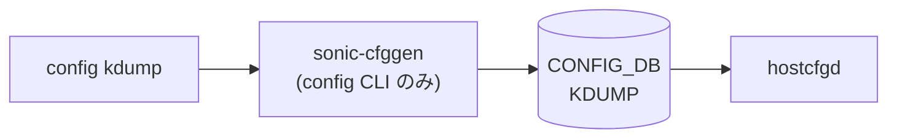

# config kdump サブコマンド

## 概要

`config kdump` は Linux kdump (panic 時のクラッシュダンプ機構) を [CONFIG_DB](../../reference/glossary.md#term-config_db) の `KDUMP` テーブル経由で制御する CLI で、`config/kdump.py` の `@click.group(name='kdump')` がエントリポイントとなる[^1]。書き込み先キーは常に `KDUMP|config` の **単一エントリ** で、フィールドは `enabled` / `memory` / `num_dumps` / `remote` / `ssh_string` / `ssh_path` の 6 つ。

`hostcfgd` がこのテーブルを subscribe して `/etc/default/kdump-tools` を再生成し、`crashkernel=` カーネル引数や ssh 転送設定を反映する。**反映には reboot が必要** で、CLI は変更時に必ずその旨を警告する[^2]。

## コマンド一覧

| コマンド | 用途 |
|---------|------|
| `config kdump enable` | KDUMP 有効化 (`enabled=true`) |
| `config kdump disable` | KDUMP 無効化 (`enabled=false`) |
| `config kdump memory <kdump_memory>` | クラッシュカーネル用予約メモリ (例: `0M-2G:256M,2G-4G:320M,4G-8G:384M,8G-:448M`) |
| `config kdump num_dumps <int>` | 保持する vmcore 最大数 |
| `config kdump remote enable\|disable` | リモート (ssh 転送) モード on/off |
| `config kdump add ssh_string <user@host>` | ssh 送信先 |
| `config kdump add ssh_path <abs_path>` | ssh 鍵などのパス |
| `config kdump remove ssh_string` | ssh 送信先削除 |
| `config kdump remove ssh_path` | ssh パス削除 |

## 各コマンドの詳細

### `config kdump enable` / `disable`

`KDUMP|config` の `enabled` を `true` / `false` に書く。テーブル自体が無い場合は exit code 1 で終了 (`Unable to retrieve 'KDUMP' table from Config DB.`)。

### `config kdump memory <kdump_memory>`

`memory` フィールドを上書き。フォーマット検証は CLI 側では行わない (バリデーションは `kexec-tools` 側で行われ、誤った値は次回 boot で kdump 起動失敗となる)。

### `config kdump num_dumps <int>`

`num_dumps` フィールドを整数で上書き。Click 側で `type=int` のみ。

### `config kdump remote enable` / `disable`

`remote` フィールドを `true` / `false` に書く。冪等性あり (既に該当値ならメッセージのみで書き込みなし)。**`enable` 状態でないと `add ssh_string` / `add ssh_path` は実行できない** (CLI 側で `current_status` を確認し、`false` なら `Remote feature is not enabled. Please enable the remote feature first.` を出力して終了する)[^3]。

### `config kdump add ssh_string <user@host>`

引数を `user@host` 形式 (英数字 user、IP もしくは hostname) でバリデートしてから `ssh_string` フィールドに書く。検証は:

- `@` を含むこと
- user 部が `isalnum()`
- host 部が IPv4 で `ipaddress.IPv4Address` で解釈できる、または `^[a-zA-Z0-9.-]+$` の hostname

### `config kdump add ssh_path <abs_path>`

`os.path.isabs` かつ `os.path.exists` を満たす絶対パスのみを `ssh_path` フィールドに書く。`exists` チェックがあるので、CLI 実行ホスト上に実在しないパスは登録できない。

### `config kdump remove ssh_string` / `remove ssh_path`

該当フィールドを `None` で削除。フィールドが無ければ「not found in KDUMP configuration.」を表示するだけで終了。

## 関連する CONFIG_DB

| テーブル | キー | フィールド |
|----------|------|-----------|
| `KDUMP` | `config` | `enabled`, `memory`, `num_dumps`, `remote`, `ssh_string`, `ssh_path` |

## 注意

- いずれの操作も **`config save` + reboot を経ないと実機には効かない**。`echo_reboot_warning` が enable / disable / memory / num_dumps の各コマンドで明示的に警告を出すのはこのため。
- `config kdump` は [CONFIG_DB](../../reference/glossary.md#term-config_db) しか触らない。`/etc/default/kdump-tools` や initramfs の rebuild は `hostcfgd` が担当する。

<!-- cli-mermaid -->
### データフロー (自動生成)

!!! note "凡例"
    config 系 (CLI → CONFIG_DB → daemon) のミニ図。テーブル → daemon 対応は `docs/reference/config-db-orch-map.md` から機械生成。
<!-- /cli-mermaid -->

<!-- ref-triangle:start -->

## 関連リファレンス

- [CONFIG_DB](../../reference/glossary.md#term-config_db): [`KDUMP`](../config-db/kdump.md)

<!-- ref-triangle:end -->

## 引用元

[^1]: `kdump` グループ定義は `config/kdump.py` L11-L14。`config/main.py` 側で `config.add_command(kdump.kdump)` で登録される。<https://github.com/sonic-net/sonic-utilities/blob/39732bceb8bdefe706518ab40623bbbba6ff33b9/config/kdump.py#L11>

[^2]: `echo_reboot_warning` (`config/kdump.py` L35-L38)。

[^3]: `add_ssh_string` / `add_ssh_path` の `remote` 必須チェックは `config/kdump.py` L171-L174 / L207-L209。

<!-- cli-sibling -->
### 関連 CLI コマンド

- [`show clock`](show-clock.md) — show clock サブコマンド
- [`show environment`](show-environment.md) — show environment サブコマンド
- [`show feature`](show-feature.md) — show feature サブコマンド
- [`show platform`](show-platform.md) — show platform サブコマンド
- [`show services`](show-services.md) — show services サブコマンド

<!-- /cli-sibling -->

## 関連ページ
- [HLD: kdump](../../system/kdump.md)
- [CONFIG_DB: KDUMP](../config-db/kdump.md)

<!-- glossary-links-injected: a35f1b1cdfa7 -->
