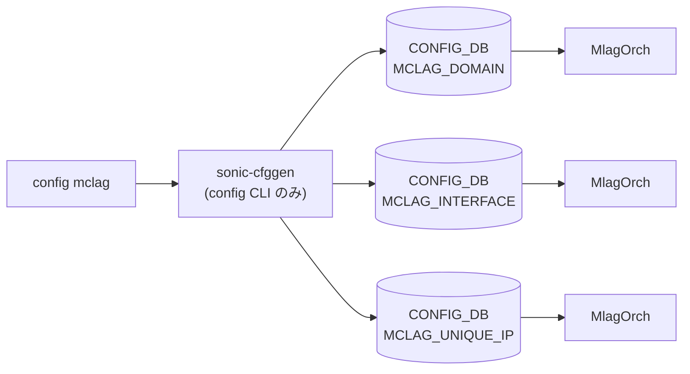

# config mclag サブコマンド

## 概要

`config mclag` は [MCLAG](../../reference/glossary.md#term-mclag) (Multi-Chassis [LAG](../../reference/glossary.md#term-lag)) ドメイン・メンバ [PortChannel](../../reference/glossary.md#term-portchannel)・Vlan インタフェース単位の unique IP を [CONFIG_DB](../../reference/glossary.md#term-config_db) に書き込む CLI で、`config/mclag.py` の `@click.group()` がエントリポイントとなる[^1]。[CONFIG_DB](../../reference/glossary.md#term-config_db) の更新先テーブルは `MCLAG_DOMAIN` / `MCLAG_INTERFACE` / `MCLAG_UNIQUE_IP` の 3 つで、ICCPd (`iccpd` コンテナ) がこれを購読して [MCLAG](../../reference/glossary.md#term-mclag) ピアリングを起動する。

`MCLAG_DOMAIN` は **デバイス内に 1 つしか持てない** (既存 domain がある状態で別 ID を `add` するとエラー)[^2]。

## コマンド一覧

| コマンド | 用途 |
|---------|------|
| `config mclag add <domain_id> <source_ip> <peer_ip> [<peer_ifname>]` | [MCLAG](../../reference/glossary.md#term-mclag) ドメイン作成 |
| `config mclag del <domain_id>` | ドメイン削除 (関連メンバも同時削除) |
| `config mclag keepalive-interval <domain_id> <secs>` | keepalive 周期 (1-60) |
| `config mclag session-timeout <domain_id> <secs>` | session timeout (3-3600) |
| `config mclag member add <domain_id> <portchannels>` | MCLAG メンバ [PortChannel](../../reference/glossary.md#term-portchannel) を追加 |
| `config mclag member del <domain_id> <portchannels>` | MCLAG メンバ削除 |
| `config mclag unique-ip add <vlan_interfaces>` | Vlan インタフェースに unique IP 機能を有効化 |
| `config mclag unique-ip del <vlan_interfaces>` | unique IP 機能を無効化 |

## 各コマンドの詳細

### `config mclag add <domain_id> <source_ip_addr> <peer_ip_addr> [<peer_ifname>]`

**引数**:

- `<domain_id>` ... 1-4095 の整数。既に別の domain が存在するとエラー。
- `<source_ip_addr>` / `<peer_ip_addr>` ... IPv4 必須 (multicast / reserved / 0.0.0.0 / 255.255.255.255 は不可)。
- `<peer_ifname>` ... 任意。指定する場合は `Ethernet*` または `PortChannel*` のみ。`PortChannel` は `PortChannelXXXX` (X は 0-9999、ヘッダ込み 15 文字以内) 規則。

**動作**:
`MCLAG_DOMAIN|<domain_id>` に `{source_ip, peer_ip, peer_link}` を書き込む。既に同じ domain_id がある場合は `mod_entry` で merge、別 domain_id がある場合はエラー終了。

### `config mclag del <domain_id>`

`MCLAG_INTERFACE` から当該 domain に紐づく全エントリを削除した後、`MCLAG_DOMAIN|<domain_id>` を削除する[^3]。

### `config mclag keepalive-interval <domain_id> <secs>`

`MCLAG_DOMAIN|<domain_id>` の `keepalive_interval` を更新。値は 1-60 の整数。`session_timeout` との関係は **`session_timeout >= 3 * keepalive_interval` かつ `session_timeout` が `keepalive_interval` の倍数** で、満たさない場合はエラー終了。`session_timeout` 未設定時はデフォルト 15 で計算する[^4]。

### `config mclag session-timeout <domain_id> <secs>`

`session_timeout` を更新。値は 3-3600 の整数。同じ整合制約 (`session_timeout >= 3 * keepalive_interval` & 倍数) を `keepalive_interval` (未設定時 1) に対して検査する。

### `config mclag member add <domain_id> <portchannels>`

`<portchannels>` は **カンマ区切り** で複数指定可。各名前を `is_portchannel_name_valid` でチェック後、`MCLAG_INTERFACE|<domain_id>|<portchannel>` に `{if_type: PortChannel}` を書く。

### `config mclag member del <domain_id> <portchannels>`

`MCLAG_INTERFACE|<domain_id>|<portchannel>` を削除。バリデーションは name 形式のみ。

### `config mclag unique-ip add <interface_names>`

`<interface_names>` はカンマ区切り、`Vlan` プレフィクス必須。事前に該当 Vlan インタフェースに **[VRF](../../reference/glossary.md#term-vrf) も IP も付いていないこと** を検査し、付いていれば「先に外して再設定せよ」とエラーで返す。OK なら `MCLAG_UNIQUE_IP|<vlan>` に `{unique_ip: enable}` を書く。

### `config mclag unique-ip del <interface_names>`

`unique-ip add` と対称的な制約検査を行ったうえで `MCLAG_UNIQUE_IP|<vlan>` を削除する。

## 関連する CONFIG_DB

| テーブル | キー | 主なフィールド | 操作するコマンド |
|----------|------|----------------|------------------|
| `MCLAG_DOMAIN` | `<domain_id>` | `source_ip`, `peer_ip`, `peer_link`, `keepalive_interval`, `session_timeout` | `add` / `del` / `keepalive-interval` / `session-timeout` |
| `MCLAG_INTERFACE` | `<domain_id>\|<portchannel>` | `if_type` | `member add` / `del` |
| `MCLAG_UNIQUE_IP` | `<vlan_interface>` | `unique_ip` | `unique-ip add` / `del` |

<!-- cli-mermaid -->
### データフロー (自動生成)



!!! note "凡例"
    config 系 (CLI → CONFIG_DB → daemon) のミニ図。テーブル → daemon 対応は `docs/reference/config-db-orch-map.md` から機械生成。
<!-- /cli-mermaid -->

<!-- ref-triangle:start -->

## 関連リファレンス

- [CONFIG_DB](../../reference/glossary.md#term-config_db): [`MCLAG_DOMAIN`](../config-db/mclag-domain.md) / `MCLAG_INTERFACE` / `MCLAG_UNIQUE_IP`

<!-- ref-triangle:end -->

## 引用元

[^1]: `mclag` グループは `config/mclag.py` L110-L115 で定義、`config/main.py` から `config.add_command(mclag.mclag)` で登録される。<https://github.com/sonic-net/sonic-utilities/blob/39732bceb8bdefe706518ab40623bbbba6ff33b9/config/mclag.py#L110>

[^2]: `add_mclag_domain` の重複検査 (`config/mclag.py` L148-L162)。<https://github.com/sonic-net/sonic-utilities/blob/39732bceb8bdefe706518ab40623bbbba6ff33b9/config/mclag.py#L148>

[^3]: `del_mclag_domain` (`config/mclag.py` L167-L200)。

[^4]: `mclag_ka_session_dep_check` (`config/mclag.py` L25-L34)。


<!-- usage-example -->
## 実行例

### 典型的な使い方

```bash
# 例 1: MCLAG domain と peer-link を構成
sudo config mclag add 4095 10.0.0.1 10.0.0.2 PortChannel0001
```

### よくある引数の組み合わせ

```bash
# MCLAG メンバー (LAG) を追加
sudo config mclag member add 4095 PortChannel0002

# unique-ip と session-timeout
sudo config mclag unique-ip add Vlan100
sudo config mclag session-timeout 4095 30
```

### 期待される出力 (抜粋)

```text
MCLAG domain 4095 added.
```
<!-- /usage-example -->

<!-- ops-hint -->
## 運用ヒント

### 典型的な利用シーン

- MC-[LAG](../../reference/glossary.md#term-lag) ドメイン作成、ピアリンク・peer IP・keepalive 設定。
- Unique IP / system MAC の同期設定。

### よくある落とし穴

- 両端で system_mac を一致させないと [LAG](../../reference/glossary.md#term-lag) メンバが flap し続ける。
- keepalive [VLAN](../../reference/glossary.md#term-vlan) を tagged で通すと一部 NIC で MTU 差により断続するため、専用 L3 リンク推奨。

### 関連する show / debug

```bash
show mclag brief
show mclag config
mclagdctl -i 1000 dump state
```
<!-- /ops-hint -->

<!-- cli-sibling -->
### 関連 CLI コマンド

- [`show mclag`](show-mclag.md) — show mclag (mclagdctl) コマンド
- [`config vnet`](config-vnet.md) — config vnet サブコマンド
- [`config vxlan`](config-vxlan.md) — config vxlan サブコマンド

<!-- /cli-sibling -->

<!-- glossary-links-injected: 0bf15a09bb5d -->
