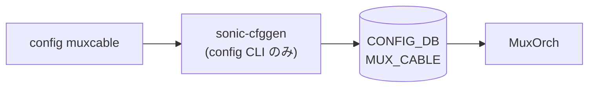

# config muxcable サブコマンド

## 概要

`config muxcable` は Dual-ToR 構成で使用する Y-Cable (NIC ↔ ToR-A / ToR-B) の状態と低レイヤ機能 (PRBS, loopback, FW, FEC, ANLT 等) を CLI から操作する。グループは `config/muxcable.py` の `@click.group(name='muxcable')` で定義される[^1]。

CLI が触る先は [CONFIG_DB](../../reference/glossary.md#term-config_db) の `MUX_CABLE` テーブルだけでなく、xcvrd / [linkmgrd](../../reference/glossary.md#term-linkmgrd) を介した非同期コマンド・レスポンスチャネル ([APPL_DB](../../reference/glossary.md#term-appl_db) / [STATE_DB](../../reference/glossary.md#term-state_db) の `XCVRD_*_CMD` / `_RSP` 系テーブル) を多用する。`update_and_get_response_for_xcvr_cmd` がそのプロトコルの実装で、CMD テーブルに job を書き、RSP テーブルを timeout 付きで poll する作りになっている[^2]。

## コマンド一覧 (主要)

| コマンド | 用途 |
|---------|------|
| `config muxcable mode <state> <port>` | mux 状態 (`active` / `auto` / `manual` / `standby` / `detach`) を [CONFIG_DB](../../reference/glossary.md#term-config_db) に書く |
| `config muxcable probertype <hardware\|software> <port>` | [linkmgrd](../../reference/glossary.md#term-linkmgrd) の probe 方式を切替 |
| `config muxcable kill_radv <enable\|disable>` | radv 停止挙動の knob |
| `config muxcable packetloss reset <port>` | パケロスカウンタリセット (xcvrd 経由) |
| `config muxcable prbs enable <port> <target> <mode> <lanemask> [<dir>]` | Y-Cable PRBS 開始 |
| `config muxcable prbs disable <port> <target> [<dir>]` | PRBS 停止 |
| `config muxcable loopback enable <port> <target> <lanemask> [<mode>]` | loopback 開始 (near-end / far-end) |
| `config muxcable loopback disable <port> <target>` | loopback 停止 |
| `config muxcable hwmode state <active\|standby> <port>` | HW レベルの mux 切替 ([linkmgrd](../../reference/glossary.md#term-linkmgrd) 介さず) |
| `config muxcable hwmode setswitchmode <auto\|manual> <port>` | HW switchmode の更新 |
| `config muxcable firmware download <fwfile> <port>` | FW を inactive bank に書き込み |
| `config muxcable firmware activate <port> [<fwfile>] [--nonhitless]` | inactive bank → active へ切り替え |
| `config muxcable firmware rollback <port> [<fwfile>]` | 直前 FW へロールバック |
| `config muxcable reset <port> <target>` | NIC / TOR の reset |
| `config muxcable set_anlt <port> <target> <0\|1>` | ANLT (Auto Negotiation / Link Training) |
| `config muxcable set_fec <port> <target> <0\|1\|2>` | FEC mode (NONE / RS / FC) |
| `config muxcable telemetry <enable\|disable>` | xcvrd telemetry on/off |
| `config muxcable reset_heartbeat_suspend <port>` | linkmgrd heartbeat suspend を解除 |

## 各コマンドの詳細 (抜粋)

### `config muxcable mode <state> <port>`

**用法**:

```bash
config muxcable mode {active|auto|manual|standby|detach} <port_name|all> [--json]
```

**動作**:
`MUX_CABLE` テーブルから対象ポートの [STATE_DB](../../reference/glossary.md#term-state_db) エントリを引いて遷移可能性を判断し、`MUX_CABLE|<port>` の `state` フィールドを書き換える。`port = "all"` の場合は `MUX_CABLE` に登録されている全ポートを順に処理する。`detach` は [MUX](../../reference/glossary.md#term-mux) 制御から外す指示で、xcvrd / linkmgrd 双方が監視を停止する。出力は `--json` で JSON、無指定で表形式。

### `config muxcable probertype <hardware|software> <port>`

`MUX_LINKMGR` テーブル相当 (`prober_type` フィールド) を更新する。`update_configdb_prober_type` ヘルパが該当ポートの設定を merge する。

### `config muxcable prbs enable <port> <target> <mode_value> <lane_mask> [<prbs_direction>]`

`<target>` は `NIC` / `TORA` / `TORB` / `LOCAL` の 4 値、`<lane_mask>` はビットマスク整数、`<prbs_direction>` は `0` (BOTH) / `1` (GEN) / `2` (CHK)。`update_and_get_response_for_xcvr_cmd("prbs_enable", ...)` が xcvrd の CMD テーブルにジョブを書き、RSP を待つ非同期 RPC で実行する[^3]。

### `config muxcable firmware download <fwfile> <port>`

xcvrd へ "firmware_download" コマンドを発行し、応答 (RSP テーブルの `status` フィールド) を timeout 付きで待つ。`port = "all"` 指定時は順番に全ポート実行。

### `config muxcable firmware activate <port> [<fwfile>] [--nonhitless]`

inactive bank の FW を active へ昇格させる。`--nonhitless` フラグは hitless 切替不可な場合の明示同意で、付与時は xcvrd 側で nonhitless モード経路に切り替わる。

### `config muxcable hwmode state <active|standby> <port>`

linkmgrd を経由せず xcvrd 経由で **直接 Y-Cable の HW state を切り替える** デバッグ向けコマンド。通常運用では `mode` を使う。

### `config muxcable telemetry <enable|disable>`

`XCVRD_LOG` 系テーブルの telemetry knob を更新する (`update_configdb_ycable_telemetry_data`)。

## 関連する CONFIG_DB / 内部テーブル

| テーブル | 主なフィールド | 操作するコマンド |
|----------|---------------|------------------|
| `MUX_CABLE` | `state`, `server_ipv4`, `server_ipv6`, `soc_ipv4` 等 | `mode` / `hwmode` |
| `MUX_LINKMGR` | `prober_type`, `address` 等 | `probertype` / `kill_radv` |
| `XCVRD_*_CMD` / `XCVRD_*_RSP` ([APPL_DB](../../reference/glossary.md#term-appl_db) / [STATE_DB](../../reference/glossary.md#term-state_db)) | xcvrd RPC | `prbs` / `loopback` / `firmware ...` / `reset` / `set_anlt` / `set_fec` / `packetloss reset` |

## 注意

- 大半の low-level コマンド (PRBS / loopback / FW / FEC / ANLT) は **[CONFIG_DB](../../reference/glossary.md#term-config_db) を直接書き換えるのではなく xcvrd への async RPC** で動く。タイムアウト時のリトライや RSP 不整合の検出は CLI 側のフォールバック実装を読む必要がある。
- `port = "all"` 指定をサポートするコマンドと、しないコマンドが混在する。CLI 引数の `default=None` と `MUX_CABLE` 全件ループ実装の有無を要確認。

<!-- ref-triangle:start -->

## 関連リファレンス

- CONFIG_DB: [`MUX_CABLE`](../config-db/mux-cable.md) / `XCVRD_LOG` / [`MUX_LINKMGR`](../config-db/mux-linkmgr.md)

<!-- ref-triangle:end -->

## 引用元

[^1]: `muxcable` グループ定義は `config/muxcable.py` L224-L226。<https://github.com/sonic-net/sonic-utilities/blob/39732bceb8bdefe706518ab40623bbbba6ff33b9/config/muxcable.py#L224>

[^2]: `update_and_get_response_for_xcvr_cmd` (`config/muxcable.py` L71-L207) が CMD/RSP テーブルを使った xcvrd RPC の実装。<https://github.com/sonic-net/sonic-utilities/blob/39732bceb8bdefe706518ab40623bbbba6ff33b9/config/muxcable.py#L71>

[^3]: `prbs.enable` (`config/muxcable.py` L597-L644)。

<!-- usage-example -->
## 実行例

### 典型的な使い方

```bash
# 例 1: Dual-ToR の mux を active 側に切替
sudo config muxcable mode active Ethernet0
```

### よくある引数の組み合わせ

```bash
# 全ポート auto モードへ
sudo config muxcable mode auto all

# Mux hwmode 切替
sudo config muxcable hwmode state active Ethernet0
```

### 期待される出力 (抜粋)

```text
Success in toggling port Ethernet0 to active
```
<!-- /usage-example -->

<!-- cli-mermaid -->
### データフロー (自動生成)



!!! note "凡例"
    config 系 (CLI → CONFIG_DB → daemon) のミニ図。テーブル → daemon 対応は `docs/reference/config-db-orch-map.md` から機械生成。
<!-- /cli-mermaid -->

<!-- topics-back-ref -->

<!-- demoted-by:q52-az-b-demote -->
## 実装との乖離 / 補足

- 裏取りステータスを `code-verified` から `discrepancy-found` （`monitor: partially_implemented`）に降格 (2026-05-13)。`--namespace` 引数サポートの有無は CLI コマンド間で混在しており、本文で「要確認」と明示している。
- 本文に残る「未確認 / 要確認 / 要追跡 / TBD」等の hedge 表現は [HLD](../../reference/glossary.md#term-hld) と実装の差分が未特定であることを示し、後続の裏取り対象。

## 関連 Topics

- [Topics: Dual-ToR と Mux 制御](../../topics/05-dual-tor/index.md)

<!-- /topics-back-ref -->

<!-- ops-hint -->
## 運用ヒント

### 典型的な利用シーン

- Dual-ToR (Active-Standby) 環境での muxcable mode 切替。
- 障害切替や計画切替の手順。

### よくある落とし穴

- `config muxcable mode active all` は強制 active 化。両 ToR で同時実行すると split-brain になる。
- ycabled / linkmgrd が落ちていると CLI は成功表示でも実切替されない。

### 関連する show / debug

```bash
show muxcable status
show muxcable config
show muxcable hwmode state
```
<!-- /ops-hint -->

<!-- cli-sibling -->
### 関連 CLI コマンド

- [`show muxcable`](show-muxcable.md) — show muxcable サブコマンド
- [`show mgmt-vrf`](show-mgmt-vrf.md) — show mgmt-vrf サブコマンド
- [`show running config`](show-running-config.md) — show runningconfiguration / startupconfiguration サブコマンド
- [`config dhcp relay`](config-dhcp-relay.md) — config dhcp_relay / dhcpv4_relay サブコマンド
- [`config mgmt trio`](config-mgmt-trio.md) — config save / load / reload / replace / qos reload

<!-- /cli-sibling -->

<!-- glossary-links-injected: 167700005048 -->
