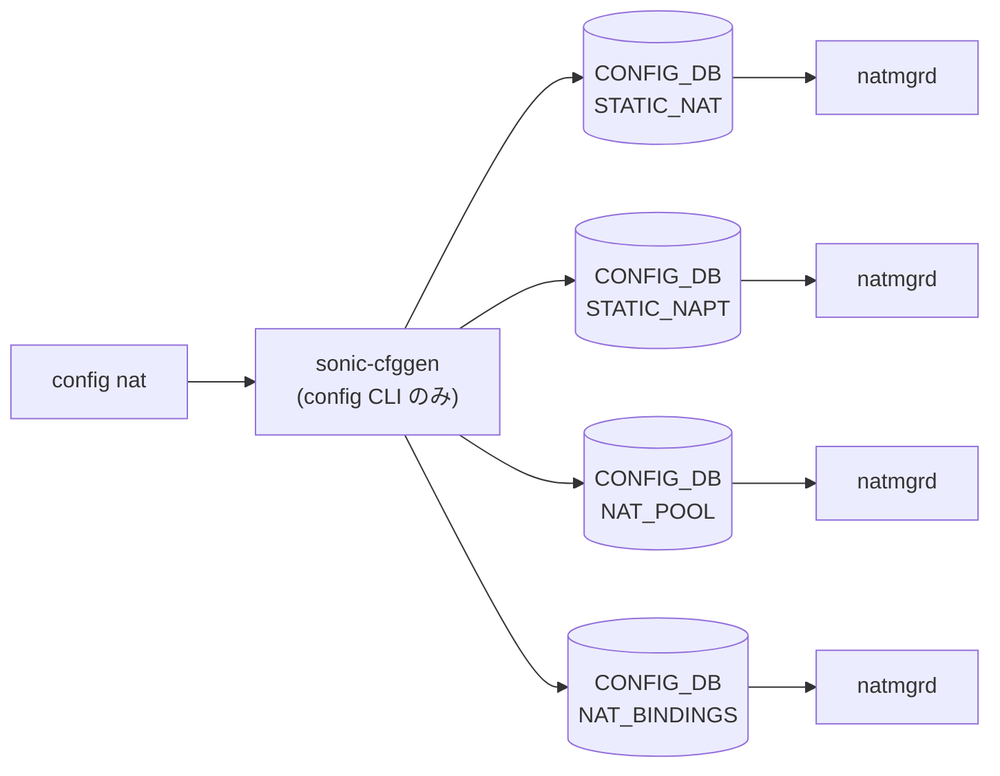

# config nat サブコマンド

## 概要

`config nat` は SONiC の NAT44 ([NAT](../../reference/glossary.md#term-nat) / NAPT) 機能の [CONFIG_DB](../../reference/glossary.md#term-config_db) を直接操作する CLI で、`config/nat.py` の `@click.group('nat')` がエントリポイントとなる[^1]。`add` / `remove` / `set` / `reset` の 4 つのサブグループに分かれ、static エントリ・dynamic pool / binding・interface zone・タイムアウト・feature on/off を扱う。[NAT](../../reference/glossary.md#term-nat) データプレーン本体は [orchagent](../../reference/glossary.md#term-orchagent) 配下の `natorch` が [SAI](../../reference/glossary.md#term-sai) 経由でハードに書き込むが、CLI 層は [CONFIG_DB](../../reference/glossary.md#term-config_db) を更新するだけで、NAT 機能が無効ならそもそも変更がデータプレーンに伝わらない点に注意。

## コマンド一覧

| コマンド | 用途 |
|---------|------|
| `config nat add static basic <global_ip> <local_ip> [-nat_type] [-twice_nat_id]` | 1:1 static [NAT](../../reference/glossary.md#term-nat) エントリ追加 |
| `config nat add static tcp <gip> <gport> <lip> <lport> [-nat_type] [-twice_nat_id]` | static TCP NAPT エントリ追加 |
| `config nat add static udp <gip> <gport> <lip> <lport> [-nat_type] [-twice_nat_id]` | static UDP NAPT エントリ追加 |
| `config nat remove static basic <gip> <lip>` | 1:1 static NAT 削除 |
| `config nat remove static tcp <gip> <gport> <lip> <lport>` | static TCP NAPT 削除 |
| `config nat remove static udp <gip> <gport> <lip> <lport>` | static UDP NAPT 削除 |
| `config nat remove static all` | static / NAPT エントリを全削除 |
| `config nat add pool <pool_name> <global_ip_range> [<global_port_range>]` | dynamic NAT プール追加 |
| `config nat remove pool <pool_name>` / `remove pools` | プール個別削除 / 全削除 |
| `config nat add binding <binding_name> <pool_name> [<acl_name>] [-nat_type] [-twice_nat_id]` | dynamic NAT バインディング追加 |
| `config nat remove binding <binding_name>` / `remove bindings` | バインディング個別 / 全削除 |
| `config nat add interface <if_name> -nat_zone <0-3>` | インタフェースに NAT zone 設定 |
| `config nat remove interface <if_name>` / `remove interfaces` | NAT zone 設定削除 |
| `config nat feature enable` / `disable` | NAT 機能の on/off |
| `config nat set timeout <300-432000>` | UDP 以外の汎用タイムアウト (秒) |
| `config nat set tcp-timeout <300-432000>` | TCP セッションタイムアウト (秒) |
| `config nat set udp-timeout <120-600>` | UDP セッションタイムアウト (秒) |
| `config nat reset timeout` / `reset tcp-timeout` / `reset udp-timeout` | デフォルトに戻す |

## 各コマンドの詳細

### `config nat add static basic <global_ip> <local_ip>`

**用法**:

```bash
config nat add static basic <global_ip> <local_ip>
    [-nat_type {snat|dnat}]
    [-twice_nat_id <1-9999>]
```

**動作**:
`global_ip` / `local_ip` をそれぞれ `is_valid_ipv4_address` で検証 (reserved / multicast / loopback / 0.0.0.0 / 255.255.255.255 を除外) したうえで、`STATIC_NAT|<global_ip>` キーに `{local_ip, nat_type, twice_nat_id}` を書き込む。同一 `global_ip` がプール / NAPT と重複する場合はエラー終了する[^2]。

<!-- evidence:
source: sonic-net/sonic-utilities/config/nat.py#L242-L332 (sha: 39732bceb8bdefe706518ab40623bbbba6ff33b9)
excerpt: |
  @static.command('basic')
  def add_basic(ctx, global_ip, local_ip, nat_type, twice_nat_id):
      ...
      config_db.set_entry('STATIC_NAT', global_ip, dataKey)
-->

<!-- evidence-rendered:start -->
??? note "📋 検証エビデンス: sonic-net/sonic-utilities/config/nat.py#L242-L332 (sha: 39732bceb8bdefe706518ab40623bbbba6ff33b9)"

    **出典**:

    `sonic-net/sonic-utilities/config/nat.py#L242-L332 (sha: 39732bceb8bdefe706518ab40623bbbba6ff33b9)`

    **抜粋**:

    ```text
    @static.command('basic')
    def add_basic(ctx, global_ip, local_ip, nat_type, twice_nat_id):
        ...
        config_db.set_entry('STATIC_NAT', global_ip, dataKey)
    ```

<!-- evidence-rendered:end -->

### `config nat add static tcp|udp <gip> <gport> <lip> <lport>`

`STATIC_NAPT|<gip>|TCP|<gport>` (UDP 同様) に `{local_ip, local_port, nat_type, twice_nat_id}` を書く。port は `IntRange(1, 65535)` でバリデート。

### `config nat add pool <pool_name> <global_ip_range> [<global_port_range>]`

`pool_name` 最大 32 文字、英数字・`-`・`_` のみ。`global_ip_range` は単一 IP または `<start>-<end>` 形式。`global_port_range` は `<start>-<end>` で省略可。`NAT_POOL|<pool_name>` に `{nat_ip, nat_port}` を書く。

### `config nat add binding <binding_name> <pool_name> [<acl_name>]`

`NAT_BINDINGS|<binding_name>` に `{nat_pool, access_list, nat_type, twice_nat_id}` を書く。pool が存在しない場合や、別の binding に同じ pool が既に紐付いていればエラー[^3]。

### `config nat add interface <if_name> -nat_zone <0-3>`

`nat_interface_name_is_valid` でインタフェース種別 (Ethernet / [PortChannel](../../reference/glossary.md#term-portchannel) / Vlan / Loopback) と [CONFIG_DB](../../reference/glossary.md#term-config_db) の存在を確認したうえで、当該テーブル (`PORT` / `PORTCHANNEL` / `VLAN` / `LOOPBACK_INTERFACE`) に `nat_zone` フィールドをマージする。テーブル名は interface ごとに切り替わり、`NAT_ZONE` という独立テーブルが作られるわけではない。

### `config nat feature enable` / `disable`

`NAT_GLOBAL|Values` の `admin_mode` を `enabled` / `disabled` に書き換える。これが `disabled` のままでは他の NAT 設定もデータプレーンに反映されない。

### `config nat set timeout|tcp-timeout|udp-timeout <seconds>` / `reset ...`

`NAT_GLOBAL|Values` の `nat_timeout` (汎用)、`nat_tcp_timeout`、`nat_udp_timeout` フィールドを更新。`reset` は対応するフィールドを削除し、natorch 側のデフォルト (Generic 600s / TCP 86400s / UDP 300s 想定) に戻す。

## 関連する CONFIG_DB

| テーブル | キー | 主なフィールド | 操作するコマンド |
|----------|------|----------------|------------------|
| `STATIC_NAT` | `<global_ip>` | `local_ip`, `nat_type`, `twice_nat_id` | `add/remove static basic` |
| `STATIC_NAPT` | `<global_ip>\|<TCP/UDP>\|<port>` | `local_ip`, `local_port`, `nat_type`, `twice_nat_id` | `add/remove static tcp/udp` |
| `NAT_POOL` | `<pool_name>` | `nat_ip`, `nat_port` | `add/remove pool` |
| `NAT_BINDINGS` | `<binding_name>` | `nat_pool`, `access_list`, `nat_type`, `twice_nat_id` | `add/remove binding` |
| `PORT` / `PORTCHANNEL` / `VLAN` / `LOOPBACK_INTERFACE` | `<if_name>` | `nat_zone` | `add/remove interface` |
| `NAT_GLOBAL` | `Values` | `admin_mode`, `nat_timeout`, `nat_tcp_timeout`, `nat_udp_timeout` | `feature ...` / `set ...` / `reset ...` |

<!-- ref-triangle:start -->

## 関連リファレンス

- CONFIG_DB: `STATIC_NAT` / `STATIC_NAPT` / [`NAT_POOL`](../config-db/nat.md) / [`NAT_BINDINGS`](../config-db/nat.md) / [`NAT_GLOBAL`](../config-db/nat.md) / [`NAT_ZONE` (interface ごと PORT/PORTCHANNEL/VLAN/LOOPBACK_INTERFACE の `nat_zone` フィールド)](../config-db/nat-zone.md)

<!-- ref-triangle:end -->

## 引用元

[^1]: NAT グループ定義は `config/nat.py` L194-L195 (`@click.group('nat')`)、`config/main.py` 側で `config.add_command(nat.nat)` 経由で登録される。<https://github.com/sonic-net/sonic-utilities/blob/39732bceb8bdefe706518ab40623bbbba6ff33b9/config/nat.py#L194>

[^2]: 重複検査は `isOverlappingWithAnyDynamicEntry` / `isIpOverlappingWithAnyStaticEntry` (`config/nat.py` L59-L127)。<https://github.com/sonic-net/sonic-utilities/blob/39732bceb8bdefe706518ab40623bbbba6ff33b9/config/nat.py#L59>

[^3]: `add binding` は `config/nat.py` L778-L842。pool 存在チェックと twice_nat_id 整合検査を含む。<https://github.com/sonic-net/sonic-utilities/blob/39732bceb8bdefe706518ab40623bbbba6ff33b9/config/nat.py#L778>

<!-- usage-example -->
## 実行例

### 典型的な使い方

```bash
# 例 1: NAT 機能を有効化し static エントリを追加
sudo config nat feature enable
sudo config nat add static basic 10.0.0.1 192.168.1.1
```

### よくある引数の組み合わせ

```bash
# zone 設定
sudo config nat add interface Ethernet0 -nat_zone 1

# pool / binding (dynamic NAT)
sudo config nat add pool MyPool 10.0.0.10-10.0.0.20
sudo config nat add binding MyBinding MyPool
```

### 期待される出力 (抜粋)

```text
NAT feature enabled.
```
<!-- /usage-example -->

<!-- cli-mermaid -->
### データフロー (自動生成)



!!! note "凡例"
    config 系 (CLI → CONFIG_DB → daemon) のミニ図。テーブル → daemon 対応は `docs/reference/config-db-orch-map.md` から機械生成。
<!-- /cli-mermaid -->

<!-- topics-back-ref -->
## 関連 Topics

- [Topics: NAT / DHCP Relay / Time-DNS Services](../../topics/16-nat-dhcp-dns/index.md)

<!-- /topics-back-ref -->

<!-- ops-hint -->
## 運用ヒント

### 典型的な利用シーン

- Static NAT / NAPT / Pool ベース dynamic NAT のセットアップ。
- NAT zone を境界インタフェースに割り当てる。

### よくある落とし穴

- ASIC の NAT capability を超えると追加 entry がドロップされる。`show nat statistics` で hardware 反映を確認。
- `nat zone` を変更すると flow がリセットされ既存 connection が切断される。

### 関連する show / debug

```bash
show nat config
show nat translations
show nat statistics
```
<!-- /ops-hint -->

<!-- glossary-links-injected: 0a2da183a336 -->
