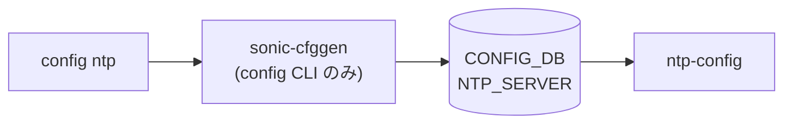

# config ntp サブコマンド

## 概要

`config ntp` は NTP サーバ（chrony で動作）の追加・削除を行う CLI グループ。[CONFIG_DB](../../reference/glossary.md#term-config_db) の `NTP_SERVER` テーブルを直接書き換え、`chrony` サービスを再起動する[^1]。

SONiC では NTP daemon として `chrony` を採用しており、`config ntp` で `NTP_SERVER` テーブルを書くと `chrony.conf` テンプレートが再生成され、`systemctl restart chrony` で反映される。

## コマンド一覧

| コマンド | 用途 |
|---------|------|
| `config ntp add <ntp_ip_address> [options]` | NTP サーバ追加 |
| `config ntp del <ntp_ip_address>` | NTP サーバ削除 |

## 各コマンドの詳細

### `config ntp add <ntp_ip_address> [options]`

**用法**:

```bash
config ntp add <ntp_ip_address>
    [--association-type server|pool]
    [--iburst]
    [--version <int>]
```

**引数**:

- `<ntp_ip_address>` ... NTP サーバの IP アドレス。`--association-type server` (デフォルト) の場合は `clicommon.is_ipaddress` で IP 検証。`pool` の場合は FQDN を許容する。

**オプション**:

- `--association-type {server,pool}` ... デフォルト `server`。`pool` 指定時は chrony の `pool` ディレクティブで構成される。
- `--iburst` ... 起動直後の高頻度同期を有効化（`iburst on`）。
- `--version <int>` ... NTP プロトコルバージョン指定。

**動作**:

1. `ADHOC_VALIDATION` が真のとき、IP 検証を実施 (`association_type != "pool"` の場合)
2. 既存 `NTP_SERVER` テーブルを取得し、同 IP が既存なら `NTP server <ip> is already configured` で no-op return
3. options を辞書化（version / association_type / iburst）し、`db.set_entry('NTP_SERVER', <ip>, opts)` で [CONFIG_DB](../../reference/glossary.md#term-config_db) に書く
4. `systemctl restart chrony` を実行。失敗時は `ctx.fail`

<!-- evidence:
source: sonic-net/sonic-utilities/config/main.py#L8982-L9016 (sha: 39732bceb8bdefe706518ab40623bbbba6ff33b9)
excerpt: |
  @ntp.command('add')
  def add_ntp_server(ctx, ntp_ip_address, association_type, iburst, version):
      if ADHOC_VALIDATION:
          if not clicommon.is_ipaddress(ntp_ip_address) and association_type != "pool":
              ctx.fail('Invalid IP address')
      ...
      db.set_entry('NTP_SERVER', ntp_ip_address, ntp_server_options)
      ...
      clicommon.run_command(['systemctl', 'restart', 'chrony'], display_cmd=False)
-->

<!-- evidence-rendered:start -->
??? note "📋 検証エビデンス: sonic-net/sonic-utilities/config/main.py#L8982-L9016 (sha: 39732bceb8bdefe706518ab40623bbbba6ff33b9)"

    **出典**:

    `sonic-net/sonic-utilities/config/main.py#L8982-L9016 (sha: 39732bceb8bdefe706518ab40623bbbba6ff33b9)`

    **抜粋**:

    ```text
    @ntp.command('add')
    def add_ntp_server(ctx, ntp_ip_address, association_type, iburst, version):
        if ADHOC_VALIDATION:
            if not clicommon.is_ipaddress(ntp_ip_address) and association_type != "pool":
                ctx.fail('Invalid IP address')
        ...
        db.set_entry('NTP_SERVER', ntp_ip_address, ntp_server_options)
        ...
        clicommon.run_command(['systemctl', 'restart', 'chrony'], display_cmd=False)
    ```

<!-- evidence-rendered:end -->

### `config ntp del <ntp_ip_address>`

**用法**:

```bash
config ntp del <ntp_ip_address>
```

**動作**:

1. 既存 `NTP_SERVER` テーブルを取得、未登録 IP なら `NTP server <ip> is not configured.` でエラー終了
2. `db.set_entry('NTP_SERVER', <ip>, None)` で entry を削除
3. `systemctl restart chrony` を実行

## 関連する CONFIG_DB

| テーブル | キー | フィールド |
|----------|------|------------|
| `NTP_SERVER` | `<ip_or_fqdn>` | `version`, `association_type`, `iburst` |

## 注意

- 既存 IP に再度 `add` してもオプションは更新されない（早期 return する）。オプション変更は一度 `del` してから再 `add` する。
- chrony 再起動が伴うため、SSH や [BGP](../../reference/glossary.md#term-bgp) 等が NTP に依存している場合は短時間のタイムスタンプ揺らぎがありうる。

<!-- cli-mermaid -->
### データフロー (自動生成)



!!! note "凡例"
    config 系 (CLI → CONFIG_DB → daemon) のミニ図。テーブル → daemon 対応は `docs/reference/config-db-orch-map.md` から機械生成。
<!-- /cli-mermaid -->

<!-- ref-triangle:start -->

## 関連リファレンス

- [YANG](../../reference/glossary.md#term-yang): [`sonic-ntp`](../yang/sonic-ntp.md)
- [CONFIG_DB](../../reference/glossary.md#term-config_db): [`NTP_SERVER`](../config-db/ntp-server.md)

<!-- ref-triangle:end -->

## 引用元

[^1]: `config ntp` グループ定義は `config/main.py` L8968-L9037。<https://github.com/sonic-net/sonic-utilities/blob/39732bceb8bdefe706518ab40623bbbba6ff33b9/config/main.py#L8968>

<!-- usage-example -->
## 実行例

### 典型的な使い方

```bash
# 例 1: NTP サーバを追加
sudo config ntp add 10.0.0.10
```

### よくある引数の組み合わせ

```bash
sudo config ntp del 10.0.0.10
# Management VRF 経由で NTP を引く
sudo config ntp add 10.0.0.10 --association-type pool
```

### 期待される出力 (抜粋)

```bash
# 実装は `systemctl restart chrony` を `display_cmd=False` で実行するため
# CLI への出力は通常空。chrony サービスが再起動される。
```
<!-- /usage-example -->

<!-- ops-hint -->
## 運用ヒント

### 典型的な利用シーン

- NTP server 追加・削除、[VRF](../../reference/glossary.md#term-vrf) (mgmt) 越し設定。
- 時刻同期失敗の調査前段。

### よくある落とし穴

- mgmt [VRF](../../reference/glossary.md#term-vrf) を使う環境で `config ntp add` に [VRF](../../reference/glossary.md#term-vrf) オプションを忘れると到達できない。
- chronyc / ntpq の出力差で「同期済み」判定がズレる。
- **`show ntp` が mgmt VRF + vrf=default 設定で空出力または "Invalid VRF name" になる** (issue [#4400](https://github.com/sonic-net/sonic-utilities/issues/4400)): mgmt VRF が有効で `NTP|global.vrf = "default"` を設定している場合、`chronyd-starter.sh` はデフォルト VRF で chrony を起動するが `show ntp` は常に mgmt VRF 経由で `chronyc` を呼ぶため VRF が食い違う。回避策: `ip vrf exec default chronyc tracking` / `ip vrf exec default chronyc sources` で直接確認する。
- **tab 補完が機能しない環境がある** (issue [#4398](https://github.com/sonic-net/sonic-utilities/issues/4398)): `bash-completion` パッケージが `sonic-utilities-data` の `Suggests` (非 `Depends`) のため、deb バージョンピニングなしのビルドでは未インストールになりうる。確認: `dpkg -l bash-completion` が `un` の場合は `sudo apt-get install bash-completion && source /etc/bash_completion` で手動インストールする。

### 関連する show / debug

```bash
show ntp
chronyc tracking
chronyc sources
```
<!-- /ops-hint -->

<!-- cli-sibling -->
### 関連 CLI コマンド

- [`show clock`](show-clock.md) — show clock サブコマンド
- [`show environment`](show-environment.md) — show environment サブコマンド
- [`show feature`](show-feature.md) — show feature サブコマンド
- [`show platform`](show-platform.md) — show platform サブコマンド
- [`show services`](show-services.md) — show services サブコマンド

<!-- /cli-sibling -->

## 関連ページ
- [YANG: sonic-ntp](../yang/sonic-ntp.md)

<!-- glossary-links-injected: a7c87bab11c9 -->
