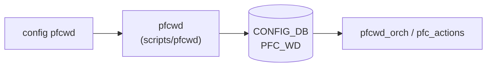

# config pfcwd サブコマンド

## 概要

`config pfcwd` は [PFC](../../reference/glossary.md#term-pfc) watchdog の設定操作を `pfcwd` 実行ファイルへ委譲するラッパー。Click 側で範囲・選択肢を検証し、実際の [CONFIG_DB](../../reference/glossary.md#term-config_db) 更新や daemon 連携は `pfcwd` 側が担う[^1]。

## コマンド一覧

| コマンド | 用途 |
|---------|------|
| `config pfcwd start [options] <ports>... <detection-time>` | port 群で [PFC](../../reference/glossary.md#term-pfc) watchdog を開始 |
| `config pfcwd stop` | [PFC](../../reference/glossary.md#term-pfc) watchdog を停止 |
| `config pfcwd interval <poll_interval>` | counter polling 間隔を設定 |
| `config pfcwd counter_poll enable\|disable` | counter polling を有効/無効化 |
| `config pfcwd big_red_switch enable\|disable` | BIG_RED_SWITCH mode を有効/無効化 |
| `config pfcwd pfc_stat_history enable\|disable [ports]...` | historical statistics を有効/無効化 |
| `config pfcwd start_default` | default 設定で PFC watchdog を開始 |

## 各コマンドの詳細

### `config pfcwd start`

**用法**:

```
config pfcwd start [--action drop|forward|alert]
                   [--restoration-time <100-60000>]
                   [--pfc-stat-history]
                   [--verbose]
                   <ports>... <detection-time>
```

`<detection-time>` は 100-5000 ms。`--restoration-time` は 100-60000 ms。`ports` には個別 port または `all` を渡す想定で、CLI は `pfcwd start ...` を組み立てて実行する[^2]。

### その他の設定

- `stop` は `pfcwd stop` を実行する。
- `interval <poll_interval>` は 100-1000 ms の範囲を Click で検証し、`pfcwd interval <poll_interval>` を実行する。
- `counter_poll`, `big_red_switch`, `pfc_stat_history` は `enable` / `disable` のみ受け付ける。
- `start_default` は `pfcwd start_default` を実行する。

## 注意

- このページで扱う `config pfcwd` は wrapper であり、DB table 名や永続化の詳細は `pfcwd` 側の実装に依存する。
- `show pfcwd config` / `show pfcwd stats` も同じ `pfcwd` 実行ファイルへ委譲される。

<!-- ref-triangle:start -->

## 関連リファレンス

- (関連リンクなし)

<!-- ref-triangle:end -->

## 引用元

[^1]: `config pfcwd` グループと各 command は `config/main.py` の PFC watchdog セクションで定義される。<https://github.com/sonic-net/sonic-utilities/blob/39732bceb8bdefe706518ab40623bbbba6ff33b9/config/main.py#L3450>

[^2]: `start` は Click の range/choice 検証後、`pfcwd start` に引数を渡す。<https://github.com/sonic-net/sonic-utilities/blob/39732bceb8bdefe706518ab40623bbbba6ff33b9/config/main.py#L3454>

<!-- cli-mermaid -->
### データフロー (手動作成)



!!! note "凡例"
    config 系 (CLI → pfcwd → CONFIG_DB → daemon) のミニ図。CONFIG_DB を直接介さないコマンドのため手動で記述。
<!-- /cli-mermaid -->

<!-- topics-back-ref -->
## 関連 Topics

- [Topics: QoS / Buffer / PFC / Watermark](../../topics/08-qos-buffer/index.md)

<!-- /topics-back-ref -->

<!-- ops-hint -->
## 運用ヒント

### 典型的な利用シーン

- PFC watchdog の有効化、polling interval / detection-time / restoration-time の調整。
- deadlock 検出時の counters 取得。

### よくある落とし穴

- PFC が有効でない queue に対して PFCWD を設定しても検知されない。
- `forward` action を選ぶと PFC 自体が無効化されるため、輻輳の影響範囲が広がる。

### 関連する show / debug

```bash
show pfcwd config
show pfcwd stats
show pfc counters
```
<!-- /ops-hint -->

<!-- cli-sibling -->
### 関連 CLI コマンド

- [`show buffer`](show-buffer.md) — show buffer サブコマンド
- [`show buffer pool`](show-buffer-pool.md) — show buffer_pool / headroom-pool サブコマンド
- [`show pfc`](show-pfc.md) — show pfc サブコマンド
- [`show priority group`](show-priority-group.md) — show priority-group サブコマンド
- [`show queue`](show-queue.md) — show queue サブコマンド

<!-- /cli-sibling -->

<!-- glossary-links-injected: 7cb1f9e73b9e -->
