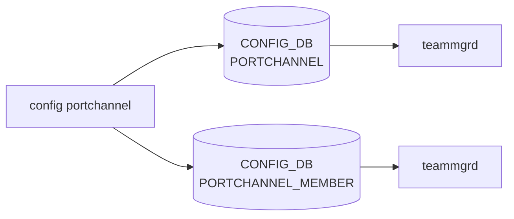

# config portchannel サブコマンド

## 概要

`config portchannel` は [LACP](../../reference/glossary.md#term-lacp) ベースの Link Aggregation ([LAG](../../reference/glossary.md#term-lag)) を設定する。[LAG](../../reference/glossary.md#term-lag) 本体の作成・削除（`add` / `del`）、メンバー Ethernet ポートの追加・削除、`teamd` の retry-count パラメータ取得・設定の 3 グループ[^1]。

[LACP](../../reference/glossary.md#term-lacp) の実体は **`teamd` (libteam)** で、[SONiC](../../reference/glossary.md#term-sonic) の `teammgrd` が `PORTCHANNEL` テーブルを [APPL_DB](../../reference/glossary.md#term-appl_db) へ反映し、[teamd](../../reference/glossary.md#term-teamd-teamsyncd-teammgrd) 設定ファイルを生成する。`config portchannel` は `PORTCHANNEL` / `PORTCHANNEL_MEMBER` テーブルを [CONFIG_DB](../../reference/glossary.md#term-config_db) に直接書き込む役割を担う。

## コマンド一覧

| コマンド | 用途 |
|---------|------|
| `config portchannel add <name> [--min-links N] [--fallback true\|false] [--fast-rate true\|false]` | [LAG](../../reference/glossary.md#term-lag) を作成 |
| `config portchannel del <name>` | LAG を削除 |
| `config portchannel member add <portchannel> <ethernet>` | メンバ追加 |
| `config portchannel member del <portchannel> <ethernet>` | メンバ削除 |
| `config portchannel retry-count get <name>` | [LACP](../../reference/glossary.md#term-lacp) retry-count 取得 (teamdctl) |
| `config portchannel retry-count set <name> <3-10>` | LACP retry-count 設定 (teamdctl) |

## 各コマンドの詳細

### `config portchannel add <portchannel_name> [options]`

**用法**:

```bash
config portchannel [-n <ns>] add <portchannel_name>
    [--min-links <1-1024>]
    [--fallback true|false]
    [--fast-rate true|false]
```

**オプション**:

- `--min-links` ... 集約として up とみなす最小メンバー数（デフォルト 1）
- `--fallback` ... LACP fallback（PDU 不達時にメンバ単独 up）デフォルト `false`
- `--fast-rate` ... LACP fast rate（1 秒間隔の PDU）デフォルト `false`

**動作**:
名前は `PortChannel` 接頭辞 + 数値（最大長 `IFACE_NAME_MAX_LEN`）でバリデート。`PORTCHANNEL|<name>` を以下のフィールドで作成:

| フィールド | 値 |
|-----------|----|
| `admin_status` | `up` |
| `mtu` | `9100` |
| `lacp_key` | `auto` |
| `fast_rate` | オプションを小文字化した値 |
| `min_links` | `--min-links` 値 (0 なら省略) |
| `fallback` | `true`（オプションが `false` 以外のとき） |

<!-- evidence:
source: sonic-net/sonic-utilities/config/main.py#L2832-L2867 (sha: 39732bceb8bdefe706518ab40623bbbba6ff33b9)
excerpt: |
  fvs = {
      'admin_status': 'up',
      'mtu': '9100',
      'lacp_key': 'auto',
      'fast_rate': fast_rate.lower(),
  }
  if min_links != 0:
      fvs['min_links'] = str(min_links)
  if fallback != 'false':
      fvs['fallback'] = 'true'
  db.set_entry('PORTCHANNEL', portchannel_name, fvs)
-->

<!-- evidence-rendered:start -->
??? note "📋 検証エビデンス: sonic-net/sonic-utilities/config/main.py#L2832-L2867 (sha: 39732bceb8bdefe706518ab40623bbbba6ff33b9)"

    **出典**:

    `sonic-net/sonic-utilities/config/main.py#L2832-L2867 (sha: 39732bceb8bdefe706518ab40623bbbba6ff33b9)`

    **抜粋**:

    ```text
    fvs = {
        'admin_status': 'up',
        'mtu': '9100',
        'lacp_key': 'auto',
        'fast_rate': fast_rate.lower(),
    }
    if min_links != 0:
        fvs['min_links'] = str(min_links)
    if fallback != 'false':
        fvs['fallback'] = 'true'
    db.set_entry('PORTCHANNEL', portchannel_name, fvs)
    ```

<!-- evidence-rendered:end -->

### `config portchannel del <portchannel_name>`

**動作**:
削除前に以下を確認し、いずれか引っかかれば失敗:

- 名前が valid (`PortChannel` 接頭辞 + 数字)
- 該当 LAG が存在する
- VLAN_MEMBER に `<portchannel>` が含まれていない (VLAN メンバ解除が先)
- PORTCHANNEL_MEMBER に当該 LAG のメンバが残っていない (空にしてから)
- `dhcpv4_relay` の interface 依存に名指しされていない

クリアされたら `set_entry('PORTCHANNEL', name, None)` で削除。

### `config portchannel member add <portchannel> <port>`

**動作**:
ポート側の以下が満たされる必要がある:

- mirror destination port ではない
- `Ethernet*` で始まる有効な物理ポート
- `INTERFACE` テーブルに IP アドレスが付いていない
- `VLAN_SUB_INTERFACE` の親 interface ではない
- `VLAN_MEMBER` 配下にも入っていない
- 別の `PORTCHANNEL_MEMBER` に組み込まれていない

満たされれば `PORTCHANNEL_MEMBER|<portchannel>|<port>` を作成（フィールドは `NULL: NULL`）。

### `config portchannel member del <portchannel> <port>`

`PORTCHANNEL_MEMBER|<portchannel>|<port>` を削除。

### `config portchannel retry-count get <portchannel_name>`

**動作**:
[CONFIG_DB](../../reference/glossary.md#term-config_db) ではなく `teamdctl <portchannel_name> state item get runner.retry_count` を実行する。multi-[ASIC](../../reference/glossary.md#term-asic) 時は `-n asic<N>` を `teamdctl` に転送（`asic` プレフィックスは除去して数値のみを渡す）。

`runner.enable_retry_count_feature` が `false` の場合は機能未有効でエラー。

### `config portchannel retry-count set <portchannel_name> <3-10>`

**動作**:
`teamdctl <name> state item set runner.retry_count <N>` を実行。範囲は `IntRange(3, 10)` で click が事前検証。[CONFIG_DB](../../reference/glossary.md#term-config_db) は更新されず、[teamd](../../reference/glossary.md#term-teamd-teamsyncd-teammgrd) ランタイム上でのみ適用される（再起動後は config 由来のデフォルトに戻る）[^2]。

## 関連する CONFIG_DB

| テーブル | 操作 | 操作するコマンド |
|---------|------|------------------|
| `PORTCHANNEL` | エントリ作成・削除 | `add` / `del` |
| `PORTCHANNEL_MEMBER` | `<portchannel>|<port>` を作成・削除 | `member add` / `del` |

`retry-count` はランタイム制御のみで CONFIG_DB を変更しない点に注意。

<!-- ref-triangle:start -->

## 関連リファレンス

- CONFIG_DB: [`PORTCHANNEL`](../config-db/portchannel.md) / [`PORTCHANNEL_MEMBER`](../config-db/portchannel-member.md)

<!-- ref-triangle:end -->

## 引用元

[^1]: `portchannel` グループは `config/main.py` L2817-L2830 で定義される。<https://github.com/sonic-net/sonic-utilities/blob/39732bceb8bdefe706518ab40623bbbba6ff33b9/config/main.py#L2817>

[^2]: `retry-count` は [teamd](../../reference/glossary.md#term-teamd-teamsyncd-teammgrd) ランタイム上の値であり CONFIG_DB に保存されない。L3072-L3140 を参照。<https://github.com/sonic-net/sonic-utilities/blob/39732bceb8bdefe706518ab40623bbbba6ff33b9/config/main.py#L3072>

<!-- usage-example -->
## 実行例

### 典型的な使い方

```bash
# 例 1: PortChannel 作成と member 追加
sudo config portchannel add PortChannel0001
sudo config portchannel member add PortChannel0001 Ethernet0
sudo config portchannel member add PortChannel0001 Ethernet4
```

### よくある引数の組み合わせ

```bash
# fast-rate を有効化（PortChannel add は --min-links / --fallback / --fast-rate のみ。--static オプションは存在しない）
sudo config portchannel add PortChannel0002 --fast-rate true

# fallback / min-links 指定
sudo config portchannel add PortChannel0003 --fallback true --min-links 2
```

### 期待される出力 (抜粋)

```text
Ethernet0 added to PortChannel0001
```
<!-- /usage-example -->

<!-- cli-mermaid -->
### データフロー (自動生成)



!!! note "凡例"
    config 系 (CLI → CONFIG_DB → daemon) のミニ図。テーブル → daemon 対応は `docs/reference/config-db-orch-map.md` から機械生成。
<!-- /cli-mermaid -->

<!-- topics-back-ref -->
## 関連 Topics

- [Topics: L2 / VLAN / LAG / MC-LAG](../../topics/06-l2-vlan-lag/index.md)

<!-- /topics-back-ref -->

<!-- ops-hint -->
## 運用ヒント

### 典型的な利用シーン

- LAG 新設、メンバ追加、`min-links` / `fallback` / `fast-rate` の設定（`lacp_key` は `auto` 固定でCLIから変更不可）。
- MC-LAG 配下の LAG 設定の前段。

### よくある落とし穴

- LAG メンバ追加前にメンバポートに IP が付いていると teamd が拒否する。`config interface ip remove` を先に。
- `fallback` を有効にした LAG は LACPDU が来なくても active member 1 本で UP するため、誤接続を検出しにくい。

### 関連する show / debug

```bash
show interfaces portchannel
teamdctl PortChannel0001 state
show runningconfiguration | grep -i portchannel
```
<!-- /ops-hint -->

<!-- cli-sibling -->
### 関連 CLI コマンド

- [`show lldp`](show-lldp.md) — show lldp サブコマンド
- [`show mac`](show-mac.md) — show mac サブコマンド
- [`show storm control`](show-storm-control.md) — show storm-control サブコマンド
- [`show vlan`](show-vlan.md) — show vlan サブコマンド
- [`config interface`](config-interface.md) — config interface サブコマンド

<!-- /cli-sibling -->

<!-- glossary-links-injected: ec18b66e3507 -->
