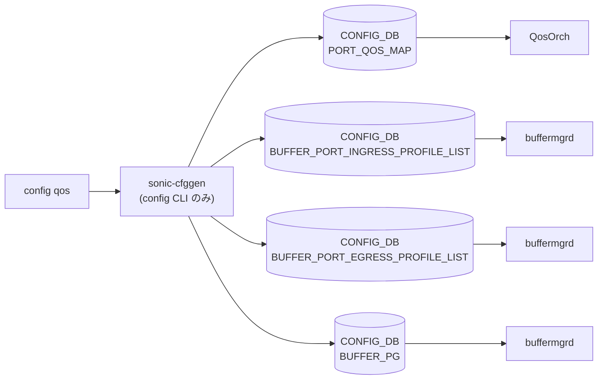

# config qos サブコマンド

## 概要

`config qos` は [QoS](../../reference/glossary.md#term-qos) と buffer 関連テンプレートを再生成して [CONFIG_DB](../../reference/glossary.md#term-config_db) に反映する CLI グループ。`clear` は既存 [QoS](../../reference/glossary.md#term-qos) 設定を削除し、`reload` は platform/HWSKU の `qos.json.j2` と `buffers*.json.j2` を `sonic-cfggen` で展開する[^1]。

## コマンド一覧

| コマンド | 用途 |
|---------|------|
| `config qos clear [--verbose]` | [QoS](../../reference/glossary.md#term-qos) 設定を削除 |
| `config qos reload [options]` | QoS/buffer 設定をテンプレートから再投入 |

## `config qos reload`

**用法**:

```bash
config qos reload [--ports <port[,port...]>]
                  [--no-dynamic-buffer]
                  [--dry_run <file-prefix>]
                  [--json-data <json>]
                  [--verbose]
```

`--ports` がある場合は、対象 port に関連する table だけを再計算する `_qos_update_ports()` に進む。対象 table は port 単独 key の `PORT_QOS_MAP`, `BUFFER_PORT_INGRESS_PROFILE_LIST`, `BUFFER_PORT_EGRESS_PROFILE_LIST` と、複合 key の `QUEUE`, `BUFFER_PG`, `BUFFER_QUEUE`[^2]。

`--ports` がない場合、既存 QoS を clear してから HWSKU 配下の template を展開する。Mellanox/Barefoot で `--no-dynamic-buffer` が無い場合は `buffers_dynamic.json.j2` を使い、`DEVICE_METADATA|localhost` の `buffer_model` を `dynamic` に更新する。そうでない場合は `buffers.json.j2` を使い、対応 ASIC では `traditional` に更新する[^3]。

`--dry_run` を指定すると [CONFIG_DB](../../reference/glossary.md#term-config_db) に書かず、展開後 JSON をファイルへ出力する。

## 関連する CONFIG_DB

| テーブル | 操作 |
|----------|------|
| `DEVICE_METADATA` | `buffer_model` を `dynamic` / `traditional` に更新 |
| `PORT_QOS_MAP` | port 別 QoS map |
| `BUFFER_PORT_INGRESS_PROFILE_LIST` | ingress buffer profile list |
| `BUFFER_PORT_EGRESS_PROFILE_LIST` | egress buffer profile list |
| `BUFFER_PG` / `BUFFER_QUEUE` | port + PG/queue 単位の buffer 設定 |

<!-- ref-triangle:start -->

## 関連リファレンス

- [CONFIG_DB](../../reference/glossary.md#term-config_db): [`PORT_QOS_MAP`](../config-db/port-qos-map.md) / [`BUFFER_PORT_INGRESS_PROFILE_LIST`](../config-db/buffer-port-ingress-profile-list.md) / [`BUFFER_PORT_EGRESS_PROFILE_LIST`](../config-db/buffer-port-egress-profile-list.md) / [`BUFFER_PG`](../config-db/buffer-pg.md) / [`BUFFER_QUEUE`](../config-db/buffer-queue.md) / [`DEVICE_METADATA`](../config-db/device-metadata.md)

<!-- ref-triangle:end -->

## 引用元

[^1]: `config qos` グループ、`clear`、`reload` 定義。<https://github.com/sonic-net/sonic-utilities/blob/39732bceb8bdefe706518ab40623bbbba6ff33b9/config/main.py#L3631>

[^2]: `_qos_update_ports()` の対象 table。<https://github.com/sonic-net/sonic-utilities/blob/39732bceb8bdefe706518ab40623bbbba6ff33b9/config/main.py#L3715>

[^3]: `reload()` 内の buffer template 選択と `DEVICE_METADATA` 更新。<https://github.com/sonic-net/sonic-utilities/blob/39732bceb8bdefe706518ab40623bbbba6ff33b9/config/main.py#L3666>

<!-- usage-example -->
## 実行例

### 典型的な使い方

```bash
# 例 1: QoS 設定の再ロード（platform 既定 template を再適用）
sudo config qos reload
```

### よくある引数の組み合わせ

```bash
# 既存設定をクリアして再ロード
sudo config qos clear
sudo config qos reload --no-dynamic-buffer

# 特定ポートだけ再適用
sudo config qos reload --ports Ethernet0,Ethernet4
```

### 期待される出力 (抜粋)

```text
Running command: /usr/local/bin/sonic-cfggen ...
QoS reload completed.
```
<!-- /usage-example -->

<!-- cli-mermaid -->
### データフロー (自動生成)



!!! note "凡例"
    config 系 (CLI → CONFIG_DB → daemon) のミニ図。テーブル → daemon 対応は `docs/reference/config-db-orch-map.md` から機械生成。
<!-- /cli-mermaid -->

<!-- topics-back-ref -->
## 関連 Topics

- [Topics: QoS / Buffer / PFC / Watermark](../../topics/08-qos-buffer/index.md)

<!-- /topics-back-ref -->

<!-- ops-hint -->
## 運用ヒント

### 典型的な利用シーン

- QoS プロファイルの再ロード、TC マップ・スケジューラ・[WRED](../../reference/glossary.md#term-wred) の更新。
- [DSCP](../../reference/glossary.md#term-dscp) / dot1p / [PFC](../../reference/glossary.md#term-pfc) priority の対応付け確認。

### よくある落とし穴

- `config qos reload` は既存 buffer profile を一旦消すため、瞬断・パケロスが出る可能性。
- `--no-dynamic-buffer` 機種で dynamic buffer 設定を投入しても無視される。
- **`config reload <file>` でパイプ文字を含む QoS マップ参照が [YANG](../../reference/glossary.md#term-yang) 検証エラーになる** (issue [#4107](https://github.com/sonic-net/sonic-utilities/issues/4107)): `PORT_QOS_MAP` の `dot1p_to_tc_map` / `dscp_to_tc_map` 等に `"DOT1P_TO_TC_MAP|ROCE"` のようにパイプ文字 (`|`) を含む参照値があると、`config reload -y <explicit-file>` の [YANG](../../reference/glossary.md#term-yang) 検証で `Value does not satisfy the constraint` エラーが出て中断する。ファイル指定なしの `config reload -y` は検証コードパスが異なり発生しない。回避策: (1) `config reload -y` (引数なし) を使う、または (2) 参照値をパイプなしの名称に変更する。

### 関連する show / debug

```bash
show qos
show priority-group persistent-watermark headroom
show queue counters
```
<!-- /ops-hint -->

<!-- cli-sibling -->
### 関連 CLI コマンド

- [`show buffer`](show-buffer.md) — show buffer サブコマンド
- [`show buffer pool`](show-buffer-pool.md) — show buffer_pool / headroom-pool サブコマンド
- [`show pfc`](show-pfc.md) — show pfc サブコマンド
- [`show priority group`](show-priority-group.md) — show priority-group サブコマンド
- [`show queue`](show-queue.md) — show queue サブコマンド

<!-- /cli-sibling -->

<!-- glossary-links-injected: b5626ca1f0f9 -->
