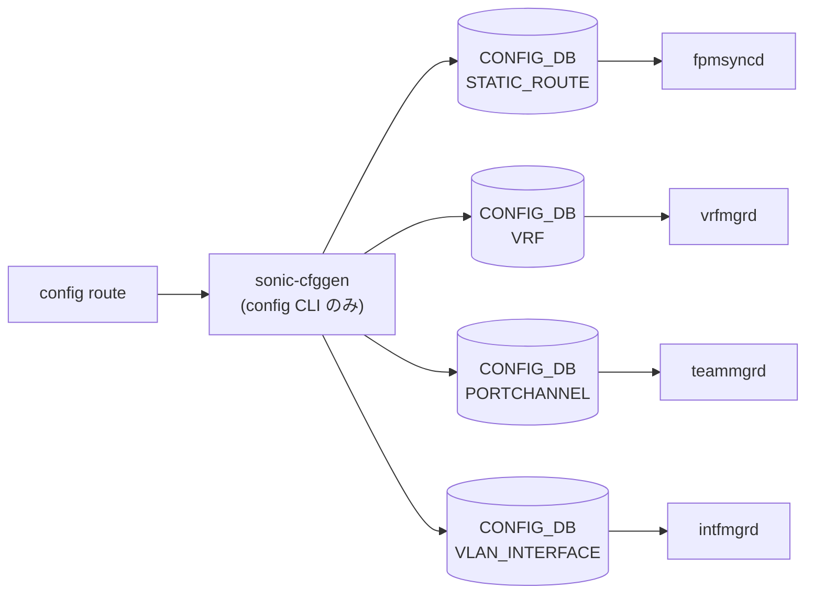

# config route サブコマンド（static route）

## 概要

`config route` は [CONFIG_DB](../../reference/glossary.md#term-config_db) の `STATIC_ROUTE` テーブルに対する static route の add / del を行う。[FRR](../../reference/glossary.md#term-frr) の Zebra に対しては `bgpcfgd` 経由で反映される（CLI は [CONFIG_DB](../../reference/glossary.md#term-config_db) のみを書く）。コマンドは `cli_sroute_to_config` という共通パーサで CLI トークンを解析し、`STATIC_ROUTE` テーブルのキー (`vrf|prefix` または `prefix`) と value 辞書 (`nexthop` / `nexthop-vrf` / `ifname` / `distance` / `blackhole`) に展開する[^1]。

multi-[ASIC](../../reference/glossary.md#term-asic) 対応として `-n / --namespace` を持ち、対象 namespace の [CONFIG_DB](../../reference/glossary.md#term-config_db) に書く。

## コマンド一覧

| コマンド | 用途 |
|---------|------|
| `config route [-n NS] add prefix [vrf <vrf>] <A.B.C.D/M> nexthop [vrf <vrf>] <NH> [dev <intf>]` | 静的経路追加 |
| `config route [-n NS] del prefix [vrf <vrf>] <A.B.C.D/M> [nexthop ...]` | 静的経路削除（特定 nexthop だけ抜く / 全削除） |

## 構文

`add` / `del` 共通の引数構造（`cli_sroute_to_config` の解析対象）:

```text
prefix [vrf <vrf_name>] <A.B.C.D/M>
       nexthop [vrf <vrf_name>] <A.B.C.D>
       nexthop [vrf <vrf_name>] dev <dev_name>
       nexthop [vrf <vrf_name>] <A.B.C.D> dev <dev_name>
```

- `vrf` の省略は `default` [VRF](../../reference/glossary.md#term-vrf) を意味する。
- [ECMP](../../reference/glossary.md#term-ecmp) は **`,` 区切り** で複数の nexthop / ifname を 1 文字列に並べることで表現する（CLI 1 回の呼び出しで複数 nexthop を入れる）。
- `dev null` を渡すと `blackhole=true` の経路として登録される（discard route）。

## 各コマンドの詳細

### `config route add prefix ... nexthop ...`

**動作**:

1. `cli_sroute_to_config` が `prefix` / `nexthop` の語をキーに分割し、`ipaddress.ip_network(ip_prefix)` と `ip_address(nh)` で書式検証。
2. `ifname` が指定されたら、`PortChannel*` は `PORTCHANNEL`、`Vlan*` は `VLAN_INTERFACE`、それ以外は `INTERFACE` / `VLAN_SUB_INTERFACE` に該当エントリがあるか確認。`null` のみ「ブラックホール」用として通す。
3. nexthop が `,` 区切り複数の場合、`distance` / `blackhole` も同じ要素数に揃えてカラム化する。`distance` が省略されたら `'0'`、`blackhole` は `ifname=='null'` を見て `'true'` / `'false'` を埋める。
4. 既存エントリがある場合は **値を merge** して `set_entry` で書く（同じ prefix への追加 nexthop は既存に対して append される）。

書き込み先: `STATIC_ROUTE|<vrf>|<prefix>` または `STATIC_ROUTE|<prefix>`（[VRF](../../reference/glossary.md#term-vrf) 指定なし）。

<!-- evidence:
source: sonic-net/sonic-utilities/config/main.py#L7812-L7889 (sha: 39732bceb8bdefe706518ab40623bbbba6ff33b9)
excerpt: |
  @route.command('add', context_settings={"ignore_unknown_options": True})
  def add_route(ctx, command_str):
      key, route, vrf = cli_sroute_to_config(ctx, command_str)
      ...
      config_db.set_entry("STATIC_ROUTE", key, current_entry)
-->

<!-- evidence-rendered:start -->
??? note "📋 検証エビデンス: sonic-net/sonic-utilities/config/main.py#L7812-L7889 (sha: 39732bceb8bdefe706518ab40623bbbba6ff33b9)"

    **出典**:

    `sonic-net/sonic-utilities/config/main.py#L7812-L7889 (sha: 39732bceb8bdefe706518ab40623bbbba6ff33b9)`

    **抜粋**:

    ```text
    @route.command('add', context_settings={"ignore_unknown_options": True})
    def add_route(ctx, command_str):
        key, route, vrf = cli_sroute_to_config(ctx, command_str)
        ...
        config_db.set_entry("STATIC_ROUTE", key, current_entry)
    ```

<!-- evidence-rendered:end -->

### `config route del prefix ...`

**動作**:

1. `cli_sroute_to_config(strict_nh=False)` で同じ語句を解析（`nexthop` の省略可）。
2. `nexthop` も `ifname` も指定されない場合は **エントリ全削除**（`set_entry(..., None)`）。
3. 指定された場合は既存エントリの [ECMP](../../reference/glossary.md#term-ecmp) nexthop リストから当該 tuple を `index` で探して 1 件抜き、残りを再書き込みする。残ゼロなら全削除。
4. 一度に 1 nexthop しか削除できない（`,` 区切り複数を渡すと `Only one nexthop can be deleted at a time` でエラー）。

## 関連する CONFIG_DB

| テーブル | key | フィールド |
|----------|-----|----------|
| `STATIC_ROUTE` | `<vrf>\|<prefix>` または `<prefix>` | `nexthop` / `nexthop-vrf` / `ifname` / `distance` / `blackhole`（すべてカンマ連結文字列） |
| `VRF` | `<vrf_name>` | 参照のみ。`is_vrf_exists` で存在確認 |
| `PORTCHANNEL` / `VLAN_INTERFACE` / `INTERFACE` / `VLAN_SUB_INTERFACE` | `<intf>` | 参照のみ。dev 指定時の存在確認 |

## multi-ASIC

- `-n / --namespace` 必須（multi-[ASIC](../../reference/glossary.md#term-asic) 環境）。
- 各 namespace の CONFIG_DB に対して個別に書く。[FRR](../../reference/glossary.md#term-frr) への反映は namespace 内の `bgpcfgd` が担当する。

## 制限・癖

- [ECMP](../../reference/glossary.md#term-ecmp) の表現は **CLI 1 行に `,` 区切りで詰め込む** 方式で、設定ファイル系統からは扱いにくい。
- `dev null` 経路は `blackhole=true` として登録される。
- `distance`（admin distance）は CLI 引数として直接は受けない。コードは `,0` をデフォルトで埋めるため、現状 CLI からは distance のカスタマイズは不可。

<!-- cli-mermaid -->
### データフロー (自動生成)



!!! note "凡例"
    config 系 (CLI → CONFIG_DB → daemon) のミニ図。テーブル → daemon 対応は `docs/reference/config-db-orch-map.md` から機械生成。
<!-- /cli-mermaid -->

<!-- ref-triangle:start -->

## 関連リファレンス

- CONFIG_DB: [`STATIC_ROUTE`](../config-db/static-route.md) / [`VRF`](../config-db/vrf.md) / [`PORTCHANNEL`](../config-db/portchannel.md) / [`VLAN_INTERFACE`](../config-db/vlan-interface.md) / [`INTERFACE`](../config-db/interface.md) / [`VLAN_SUB_INTERFACE`](../config-db/vlan-sub-interface.md)

<!-- ref-triangle:end -->

## 引用元

[^1]: `cli_sroute_to_config` の実装は `config/main.py` L1395-L1481。`prefix` / `nexthop` キーを基準に分割し、IP / [VRF](../../reference/glossary.md#term-vrf) / interface の存在を検証する。<https://github.com/sonic-net/sonic-utilities/blob/39732bceb8bdefe706518ab40623bbbba6ff33b9/config/main.py#L1395>

<!-- ops-hint -->
## 運用ヒント

### 典型的な利用シーン

- static route の追加・更新、nexthop multipath 設定。

### よくある落とし穴

- `config route add` は CONFIG_DB の STATIC_ROUTE に書く。[FRR](../../reference/glossary.md#term-frr) の [zebra](../../reference/glossary.md#term-zebra) に渡るまで 1〜2 秒遅延あり。
- nexthop が unreachable な route は kernel route table に出ない。

### 関連する show / debug

```bash
show ip route
sonic-db-cli CONFIG_DB keys 'STATIC_ROUTE|*'
vtysh -c 'show ip route static'
```
<!-- /ops-hint -->

<!-- cli-sibling -->
### 関連 CLI コマンド

- [`show route map`](show-route-map.md) — show route-map コマンド
- [`config default route`](config-default-route.md) — config default-route（デフォルトルート設定パターン）
- [`show arp`](show-arp.md) — show arp サブコマンド
- [`show bfd`](show-bfd.md) — show bfd サブコマンド
- [`show bgp`](show-bgp.md) — show bgp / show ip bgp / show ipv6 bgp サブコマンド

<!-- /cli-sibling -->

<!-- glossary-links-injected: e82be350a384 -->
