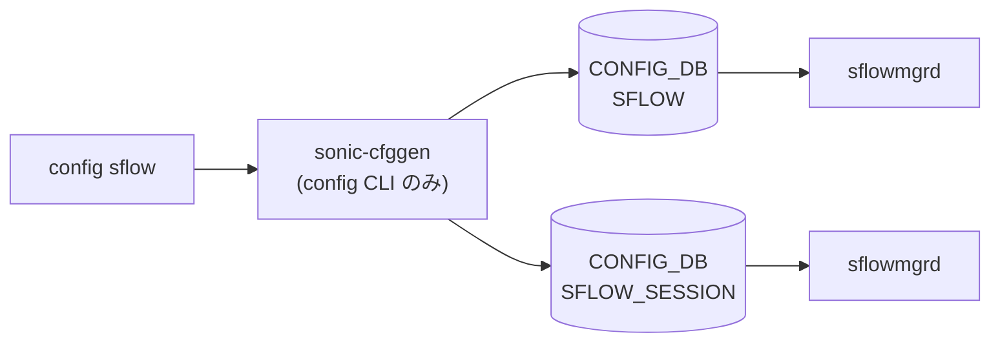

# config sflow サブコマンド

## 概要

`config sflow` は sFlow のグローバル制御（admin / polling-interval / sample-direction / agent-id）と、インターフェイス単位のサンプル設定、最大 2 件のコレクタ登録を扱う。すべて `config/main.py` 内に直接定義され、3 段の click group (`sflow` / `sflow interface` / `sflow collector` / `sflow agent-id`) で構成される[^1]。

`config sflow enable` だけは特殊で、`SFLOW|global.admin_state` を `up` にしたうえで `systemctl is-active sflow` を確認し、未アクティブなら `systemctl enable sflow` + `start sflow` を実行する。それ以外のコマンドは [CONFIG_DB](../../reference/glossary.md#term-config_db) 書き込みのみ。

## コマンド一覧

| コマンド | 用途 |
|---------|------|
| `config sflow enable` | sFlow グローバル ON。サービス未起動なら起動 |
| `config sflow disable` | sFlow グローバル OFF |
| `config sflow polling-interval <0\|5-300>` | カウンタサンプル周期（秒）。0 で無効 |
| `config sflow sample-direction <rx\|tx\|both>` | グローバルサンプル方向 |
| `config sflow agent-id add <interface_name>` | sFlow agent 用インターフェイス登録 |
| `config sflow agent-id del` | agent 設定を削除 |
| `config sflow interface enable <ifname\|all>` | インターフェイス単位で有効化 |
| `config sflow interface disable <ifname\|all>` | インターフェイス単位で無効化 |
| `config sflow interface sample-rate <ifname> <256-8388608\|default>` | サンプルレート |
| `config sflow interface sample-direction <ifname> <rx\|tx\|both>` | インターフェイスサンプル方向 |
| `config sflow collector add <name> <ipv4/v6> [--port N] [--vrf default\|mgmt]` | コレクタ追加（最大 2 件） |
| `config sflow collector del <name>` | コレクタ削除 |

## 各コマンドの詳細

### `config sflow enable` / `disable`

`SFLOW|global` の `admin_state` を `up` / `down` に書き換える。既存のテーブルが無い場合は `{'global': {'admin_state': 'up'}}` を新規作成。`enable` は加えて、systemd ユニット `sflow` が active でなければ enable + start する[^2]。

### `config sflow polling-interval <interval>`

範囲: 0 (無効) または 5-300 秒。`SFLOW|global.polling_interval` を整数で書く。

### `config sflow sample-direction <direction>`

`rx` / `tx` / `both` の Choice。**`tx` / `both` は `STATE_DB.SWITCH_CAPABILITY|switch.PORT_EGRESS_SAMPLE_CAPABLE` が `true` のプラットフォームでのみ許可される**[^3]。

<!-- evidence:
source: sonic-net/sonic-utilities/config/main.py#L9136-L9159 (sha: 39732bceb8bdefe706518ab40623bbbba6ff33b9)
excerpt: |
  if ((direction == 'tx' or direction == 'both') and (is_port_egress_sflow_supported() == 'false')):
      ctx.fail("Sample direction {} is not supported on this platform".format(direction))
-->

<!-- evidence-rendered:start -->
??? note "📋 検証エビデンス: sonic-net/sonic-utilities/config/main.py#L9136-L9159 (sha: 39732bceb8bdefe706518ab40623bbbba6ff33b9)"

    **出典**:

    `sonic-net/sonic-utilities/config/main.py#L9136-L9159 (sha: 39732bceb8bdefe706518ab40623bbbba6ff33b9)`

    **抜粋**:

    ```text
    if ((direction == 'tx' or direction == 'both') and (is_port_egress_sflow_supported() == 'false')):
        ctx.fail("Sample direction {} is not supported on this platform".format(direction))
    ```

<!-- evidence-rendered:end -->

### `config sflow interface enable <ifname|all>`

`ifname` は `interface_name_is_valid` で検証、ただし特殊値 `all` も許可。`SFLOW_SESSION|<ifname>` の `admin_state` を `up` に書く。テーブルにエントリが無ければ新規作成。

### `config sflow interface sample-rate <ifname> <rate|default>`

`rate` は 256 〜 8388608 の整数文字列。`default` 指定時は当該インターフェイスエントリから `sample_rate` フィールドを削除する（エントリ自体は残る）。

### `config sflow interface sample-direction <ifname> <direction>`

interface 用 sample-direction。グローバルと同じ `tx/both` の egress capability チェックを行う。

### `config sflow collector add <name> <ipaddr> [--port N] [--vrf default|mgmt]`

**制約**:

- `<name>` は 16 文字以下
- `<ipaddr>` は `is_ipaddress` で検証
- `--port` 0-65535、default 6343
- `--vrf` は `default` または `mgmt` のみ
- `SFLOW_COLLECTOR` は **最大 2 件まで**[^4]

**書き込み**: `SFLOW_COLLECTOR|<name>` に `collector_ip` / `collector_port` / `collector_vrf` を `mod_entry` で書く。

### `config sflow agent-id add <interface_name>`

`netifaces.interfaces()` に存在する name のみ許可。`SFLOW|global.agent_id` を書き換える。既に `agent_id` が存在する場合は `Agent already configured` で終了し、`del` 経由で先に削除する必要がある。

## 関連する CONFIG_DB

| テーブル | key | 主なフィールド |
|----------|-----|--------------|
| `SFLOW` | `global` | `admin_state` / `polling_interval` / `sample_direction` / `agent_id` |
| `SFLOW_SESSION` | `<interface>` | `admin_state` / `sample_rate` / `sample_direction` |
| `SFLOW_COLLECTOR` | `<name>` | `collector_ip` / `collector_port` / `collector_vrf` |

## プラットフォーム依存

- **egress sampling**（`tx` / `both`）: `STATE_DB.SWITCH_CAPABILITY|switch.PORT_EGRESS_SAMPLE_CAPABLE` を見て無効化される。
- **コレクタ数**: 2 件固定（コード上のリテラル）。
- **[VRF](../../reference/glossary.md#term-vrf)**: `default` と `mgmt` のみ。任意 data [VRF](../../reference/glossary.md#term-vrf) はサポート外。

<!-- ref-triangle:start -->

## 関連リファレンス

- [CONFIG_DB](../../reference/glossary.md#term-config_db): [`SFLOW`](../config-db/sflow.md) / [`SFLOW_SESSION`](../config-db/sflow.md) / [`SFLOW_COLLECTOR`](../config-db/sflow.md)

<!-- ref-triangle:end -->

## 引用元

[^1]: `config sflow` グループ定義は `config/main.py` L9042-L9048。<https://github.com/sonic-net/sonic-utilities/blob/39732bceb8bdefe706518ab40623bbbba6ff33b9/config/main.py#L9042>

[^2]: `enable` の systemd 起動分岐は L9070-L9079。<https://github.com/sonic-net/sonic-utilities/blob/39732bceb8bdefe706518ab40623bbbba6ff33b9/config/main.py#L9070>

[^3]: egress capability チェック関数は `is_port_egress_sflow_supported`（L9126-L9131）。

[^4]: コレクタ件数チェックは L9354 `len(collector_tbl) == 2` で 2 件固定。<https://github.com/sonic-net/sonic-utilities/blob/39732bceb8bdefe706518ab40623bbbba6ff33b9/config/main.py#L9354>

<!-- usage-example -->
## 実行例

### 典型的な使い方

```bash
# 例 1: sFlow を有効化
sudo config sflow enable
```

### よくある引数の組み合わせ

```bash
# Collector 追加 + agent ID 指定
sudo config sflow collector add collector1 10.0.0.50 --port 6343
sudo config sflow agent-id add Loopback0

# ポートごとの sampling-rate
sudo config sflow interface sample-rate Ethernet0 8192
```

### 期待される出力 (抜粋)

```text
Enabling sFlow ...
```
<!-- /usage-example -->

<!-- cli-mermaid -->
### データフロー (自動生成)



!!! note "凡例"
    config 系 (CLI → CONFIG_DB → daemon) のミニ図。テーブル → daemon 対応は `docs/reference/config-db-orch-map.md` から機械生成。
<!-- /cli-mermaid -->

<!-- topics-back-ref -->
## 関連 Topics

- [Topics: Telemetry / SNMP / Observability](../../topics/09-telemetry-snmp/index.md)

<!-- /topics-back-ref -->

<!-- ops-hint -->
## 運用ヒント

### 典型的な利用シーン

- sFlow agent / collector / sampling-rate の設定とインタフェース別 polling。
- テレメトリ収集系（InfluxDB / Kafka）連携前段。

### よくある落とし穴

- sampling-rate を小さくしすぎると CPU 使用率が跳ねる。1:1024 程度を目安に。
- Mgmt port は sFlow 対象外。データプレーン経由で collector に到達できる経路が必要。

### 関連する show / debug

```bash
show sflow
show sflow interface
docker logs sflow
```
<!-- /ops-hint -->

<!-- cli-sibling -->
### 関連 CLI コマンド

- [`show flowcnt`](show-flowcnt.md) — show flowcnt-trap / flowcnt-route サブコマンド
- [`show snmpagentaddress`](show-snmpagentaddress.md) — show snmpagentaddress サブコマンド
- [`show snmptrap`](show-snmptrap.md) — show snmptrap サブコマンド
- [`show techsupport`](show-techsupport.md) — show techsupport コマンド
- [`config mirror session`](config-mirror-session.md) — config mirror_session サブコマンド

<!-- /cli-sibling -->

<!-- glossary-links-injected: 84c52960aadd -->
