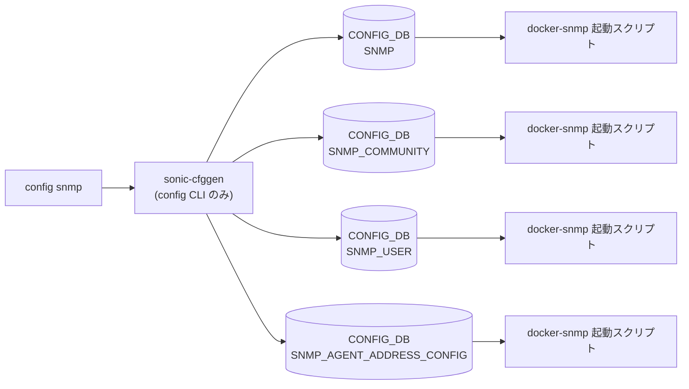

# config snmp / snmpagentaddress / snmptrap サブコマンド

## 概要

[SNMP](../../reference/glossary.md#term-snmp) 関連の CLI は **3 つの独立したトップレベルグループ** に分かれている: `config snmp`、`config snmpagentaddress`、`config snmptrap`。すべて `config/main.py` 内に直接定義されており、`snmpd.conf` を再生成するために各操作後に `systemctl restart snmp` が走る[^1]。

- `config snmp ...` ... `SNMP` / `SNMP_COMMUNITY` / `SNMP_USER` テーブルへの contact / location / community / user 操作
- `config snmpagentaddress ...` ... snmpd の bind IP:Port:[VRF](../../reference/glossary.md#term-vrf) を `SNMP_AGENT_ADDRESS_CONFIG` に登録
- `config snmptrap ...` ... v1/v2/v3 の trap 送信先を `SNMP_TRAP_CONFIG` に登録

## コマンド一覧

### `config snmp ...`

| コマンド | 用途 |
|---------|------|
| `config snmp community add <community> <RO\|RW>` | community string 追加 |
| `config snmp community del <community>` | community string 削除 |
| `config snmp community replace <current> <new>` | community 置換（type は維持） |
| `config snmp contact add <name> <email>` | コンタクト追加（1 件まで） |
| `config snmp contact del <name>` | コンタクト削除 |
| `config snmp contact modify <name> <email>` | コンタクト変更 |
| `config snmp location add <location...>` | ロケーション追加（nargs=-1 でスペース許可） |
| `config snmp location del <location...>` | ロケーション削除 |
| `config snmp location modify <location...>` | ロケーション変更 |
| `config snmp user add <user> <type> <RO\|RW> [<auth_type> <auth_pw> [<enc_type> <enc_pw>]]` | SNMPv3 user 追加 |
| `config snmp user del <user>` | user 削除 |

### `config snmpagentaddress ...`

| コマンド | 用途 |
|---------|------|
| `config snmpagentaddress add <ip> [-p PORT] [-v VRF]` | snmpd 待ち受け IP:Port を登録 |
| `config snmpagentaddress del <ip> [-p PORT] [-v VRF]` | 同上を削除 |

### `config snmptrap ...`

| コマンド | 用途 |
|---------|------|
| `config snmptrap modify <1\|2\|3> <serverip> [-p PORT] [-v VRF] [-c COMMUNITY]` | trap 送信先を設定/上書き（version 単位） |
| `config snmptrap del <1\|2\|3>` | 当該 version の trap 設定を削除 |

## 各コマンドの詳細

### `config snmp community add <community> <RO|RW>`

**動作**:

- `community` 文字列は最大 32 文字、`@` `:` を含まないこと（`snmp_community_secret_check`）。
- `string_type` は `RO` / `RW` の 2 値。
- 既存と重複なら sys.exit(3) で終了。重複がなければ `set_entry('SNMP_COMMUNITY', community, {'TYPE': string_type})`。
- 完了後に `systemctl reset-failed` + `systemctl restart snmp.service`。

<!-- evidence:
source: sonic-net/sonic-utilities/config/main.py#L4372-L4403 (sha: 39732bceb8bdefe706518ab40623bbbba6ff33b9)
excerpt: |
  @community.command('add')
  def add_community(db, community, string_type):
      ...
      config_db.set_entry('SNMP_COMMUNITY', community, {'TYPE': string_type})
-->

<!-- evidence-rendered:start -->
??? note "📋 検証エビデンス: sonic-net/sonic-utilities/config/main.py#L4372-L4403 (sha: 39732bceb8bdefe706518ab40623bbbba6ff33b9)"

    **出典**:

    `sonic-net/sonic-utilities/config/main.py#L4372-L4403 (sha: 39732bceb8bdefe706518ab40623bbbba6ff33b9)`

    **抜粋**:

    ```text
    @community.command('add')
    def add_community(db, community, string_type):
        ...
        config_db.set_entry('SNMP_COMMUNITY', community, {'TYPE': string_type})
    ```

<!-- evidence-rendered:end -->

### `config snmp user add <user> <type> <RO|RW> [<auth_type> <auth_pw> [<enc_type> <enc_pw>]]`

**引数**（`SnmpUserError` 列挙で網羅）:

- `<user>` ... 32 文字以下、`@` `:` 不可
- `<type>` ... `noAuthNoPriv` / `AuthNoPriv` / `Priv`（小文字でも入力可、内部正規化）
- `<RO|RW>` ... 権限
- `<auth_type>` ... `MD5` / `SHA` / `HMAC-SHA-2`（type が `noAuthNoPriv` 以外で必須）
- `<auth_pw>` ... 8 文字以上 64 文字以下、`@` `:` 不可
- `<enc_type>` ... `DES` / `AES`（type が `Priv` のときに必須）
- `<enc_pw>` ... `auth_pw` と同じ複雑性ルール

**動作**:
組合せ違反は `SnmpUserError` の対応する exit code で終了する（`TypeNoAuthNoPrivOrAuthNoPrivOrPrivCheckFailure = 2`、`AuthPasswordMissing = 7` など 14 種）。問題なければ `SNMP_USER|<user>` に `SNMP_USER_TYPE` / `SNMP_USER_PERMISSION` / `SNMP_USER_AUTH_TYPE` / `SNMP_USER_AUTH_PASSWORD` / `SNMP_USER_ENCRYPTION_TYPE` / `SNMP_USER_ENCRYPTION_PASSWORD` の 6 フィールドを書く。

### `config snmp contact add <name> <email>`

`SNMP|CONTACT` に `{name: email}` を `set_entry` で書く。**name はキーとして使われる**ため、既に `CONTACT` が存在すると失敗（modify を使えと案内）[^2]。

### `config snmp location add <location...>`

`location` は `nargs=-1`（複数引数を空白で連結）。`SNMP|LOCATION` の `Location` フィールドに格納。1 件しか持てない（既存があれば `Location already exists`）。

### `config snmpagentaddress add <ip> [-p PORT] [-v VRF]`

**動作**:

- IP は `is_ipaddress` で検証。リンクローカルは `<ip>%<zone>` 形式 (`fe80::1%eth0` 等) 可。
- ManagementVRF が `MGMT_VRF_CONFIG.mgmtVrfEnabled = "true"` のとき、`-v` 必須。
- 当該 IP がローカルインターフェイスに付与されているか `netifaces` で確認。
- `SNMP_AGENT_ADDRESS_CONFIG` の key は `<ip>|<port>|<vrf>` 形式。同一 ip:port のエントリが既存なら追加せず警告。
- 書き込み後に `systemctl restart snmp`。

### `config snmptrap modify <ver> <serverip> [-p PORT] [-v VRF] [-c COMMUNITY]`

`SNMP_TRAP_CONFIG` の固定キー `v1TrapDest` / `v2TrapDest` / `v3TrapDest` の `DestIp` / `DestPort` / `vrf` / `Community` を `mod_entry` で更新する。デフォルト: port=162、vrf=`None`、community=`public`。

## 関連する CONFIG_DB

| テーブル | key | 主なフィールド |
|----------|-----|--------------|
| `SNMP` | `CONTACT` / `LOCATION` | `<name>: <email>` / `Location: <str>` |
| `SNMP_COMMUNITY` | `<community>` | `TYPE` (`RO`/`RW`) |
| `SNMP_USER` | `<user>` | `SNMP_USER_TYPE` / `SNMP_USER_PERMISSION` / `SNMP_USER_AUTH_TYPE` / `SNMP_USER_AUTH_PASSWORD` / `SNMP_USER_ENCRYPTION_TYPE` / `SNMP_USER_ENCRYPTION_PASSWORD` |
| `SNMP_AGENT_ADDRESS_CONFIG` | `<ip>\|<port>\|<vrf>` | (空 dict) |
| `SNMP_TRAP_CONFIG` | `v1TrapDest` / `v2TrapDest` / `v3TrapDest` | `DestIp` / `DestPort` / `vrf` / `Community` |
| `MGMT_VRF_CONFIG` | `vrf_global` | `mgmtVrfEnabled`（参照のみ） |

## 副作用

ほぼすべてのコマンドが完了直前に `systemctl reset-failed snmp.service` + `systemctl restart snmp.service` を実行する。即座に snmpd 再起動が走るため、本番ではバッチ的にまとめて発行する運用が望ましい。

!!! warning "連続操作で SNMP コンテナが落ちる (issue [#4514](https://github.com/sonic-net/sonic-utilities/issues/4514))"
    `config snmptrap del` に続けてすぐ `config snmptrap modify` を実行すると、systemd の start rate limit に達して snmp サービスが起動失敗する。操作の間に少なくとも 5 秒の待機を入れること。コンテナが停止した場合は `systemctl reset-failed snmp.service && systemctl start snmp.service` で回復できる。

<!-- ref-triangle:start -->

## 関連リファレンス

- [CONFIG_DB](../../reference/glossary.md#term-config_db): [`SNMP`](../config-db/snmp.md) / [`SNMP_COMMUNITY`](../config-db/snmp.md) / [`SNMP_USER`](../config-db/snmp.md) / [`SNMP_AGENT_ADDRESS_CONFIG`](../config-db/snmp-agent-address-config.md) / [`SNMP_TRAP_CONFIG`](../config-db/snmp.md) / [`MGMT_VRF_CONFIG`](../config-db/mgmt-vrf-config.md)

<!-- ref-triangle:end -->

## 引用元

[^1]: `config snmp` 系の各コマンドが `clicommon.run_command(['systemctl', 'restart', 'snmp.service'], ...)` を呼ぶ。`config/main.py` L4399-L4403, L4427-L4431 など。<https://github.com/sonic-net/sonic-utilities/blob/39732bceb8bdefe706518ab40623bbbba6ff33b9/config/main.py#L4399>

[^2]: `add_contact` は `CONTACT` キーが既存なら `Use sudo config snmp contact modify instead` で sys.exit(1)。<https://github.com/sonic-net/sonic-utilities/blob/39732bceb8bdefe706518ab40623bbbba6ff33b9/config/main.py#L4471>

<!-- usage-example -->
## 実行例

### 典型的な使い方

```bash
# 例 1: SNMPv2 community 追加
sudo config snmp community add public RO
```

### よくある引数の組み合わせ

```bash
# location / contact メタ情報
sudo config snmp location add "Tokyo DC1 Rack-A12"
sudo config snmp contact add netops netops@example.com

# SNMPv3 user 追加
sudo config snmp user add snmpadmin priv RW MD5 authpass AES privpass
```

### 期待される出力 (抜粋)

```text
SNMP community public added to configuration
Restarting SNMP service...
```
<!-- /usage-example -->

<!-- cli-mermaid -->
### データフロー (自動生成)



!!! note "凡例"
    config 系 (CLI → CONFIG_DB → daemon) のミニ図。テーブル → daemon 対応は `docs/reference/config-db-orch-map.md` から機械生成。
<!-- /cli-mermaid -->

<!-- topics-back-ref -->
## 関連 Topics

- [Topics: Telemetry / SNMP / Observability](../../topics/09-telemetry-snmp/index.md)

<!-- /topics-back-ref -->

<!-- ops-hint -->
## 運用ヒント

### 典型的な利用シーン

- community / user / target host を追加して NMS から監視させる。
- v3 移行時の auth/priv 鍵切り替え。

### よくある落とし穴

- [ACL](../../reference/glossary.md#term-acl) で [SNMP](../../reference/glossary.md#term-snmp) ポート (UDP 161) を許可していないと外から見えない（CTRLPLANE [ACL](../../reference/glossary.md#term-acl)）。
- `config snmp community add` の type は `RO` / `RW`。RW を不用意に開けない。

### 関連する show / debug

```bash
show snmp community
show snmp user
show runningconfiguration snmp
```
<!-- /ops-hint -->

<!-- cli-sibling -->
### 関連 CLI コマンド

- [`show flowcnt`](show-flowcnt.md) — show flowcnt-trap / flowcnt-route サブコマンド
- [`show snmpagentaddress`](show-snmpagentaddress.md) — show snmpagentaddress サブコマンド
- [`show snmptrap`](show-snmptrap.md) — show snmptrap サブコマンド
- [`show techsupport`](show-techsupport.md) — show techsupport コマンド
- [`config mirror session`](config-mirror-session.md) — config mirror_session サブコマンド

<!-- /cli-sibling -->

<!-- glossary-links-injected: 44c799d378f8 -->
