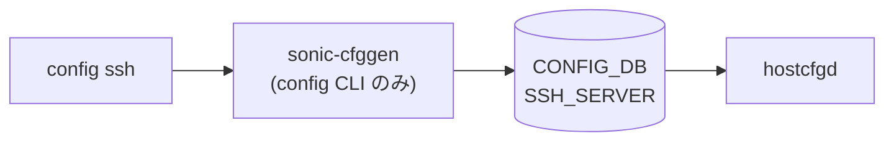

# config ssh サブコマンド

## 概要

`config ssh` は SSH デーモンの動作ポリシー（無操作タイムアウト、最大同時セッション数）を [CONFIG_DB](../../reference/glossary.md#term-config_db) の `SSH_SERVER|POLICIES` に書き込む CLI グループ[^1]。実 sshd への反映は `hostcfgd` 系の設定再生成パスを通じて行われる。

## コマンド一覧

| コマンド | 用途 |
|---------|------|
| `config ssh inactivity-timeout <timeout>` | 無操作タイムアウト（分）を設定 |
| `config ssh max-sessions <max-sessions>` | 最大同時セッション数を設定 |

## 各コマンドの詳細

### `config ssh inactivity-timeout <timeout>`

**用法**:

```bash
config ssh inactivity-timeout <timeout>
```

**引数**:

- `<timeout>` ... `0` 〜 `35000` の整数（単位は分）。`0` でタイムアウトを無効化（`click.IntRange(0, 35000)`）。[YANG](../../reference/glossary.md#term-yang) `sonic-ssh-server` のデフォルトは `15`[^3]

**動作**:
[CONFIG_DB](../../reference/glossary.md#term-config_db) の `SSH_SERVER|POLICIES` テーブルに `inactivity_timeout` フィールドを `mod_entry` で書き込む[^2]。

<!-- evidence:
source: sonic-net/sonic-utilities/config/main.py#L9979-L9988 (sha: 39732bceb8bdefe706518ab40623bbbba6ff33b9)
excerpt: |
  @ssh.command('inactivity-timeout')
  @click.argument('inactivity_timeout', type=click.IntRange(0, 35000))
  def inactivity_timeout_ssh(inactivity_timeout):
      config_db.mod_entry("SSH_SERVER", 'POLICIES',
                          {'inactivity_timeout': inactivity_timeout})
-->

<!-- evidence-rendered:start -->
??? note "📋 検証エビデンス: sonic-net/sonic-utilities/config/main.py#L9979-L9988 (sha: 39732bceb8bdefe706518ab40623bbbba6ff33b9)"

    **出典**:

    `sonic-net/sonic-utilities/config/main.py#L9979-L9988 (sha: 39732bceb8bdefe706518ab40623bbbba6ff33b9)`

    **抜粋**:

    ```text
    @ssh.command('inactivity-timeout')
    @click.argument('inactivity_timeout', type=click.IntRange(0, 35000))
    def inactivity_timeout_ssh(inactivity_timeout):
        config_db.mod_entry("SSH_SERVER", 'POLICIES',
                            {'inactivity_timeout': inactivity_timeout})
    ```

<!-- evidence-rendered:end -->

### `config ssh max-sessions <max-sessions>`

**用法**:

```bash
config ssh max-sessions <max-sessions>
```

**引数**:

- `<max-sessions>` ... `0` 〜 `100` の整数（`click.IntRange(0, 100)`）。[YANG](../../reference/glossary.md#term-yang) `sonic-ssh-server` のデフォルトは `0`（=無制限）[^3]

**動作**:
[CONFIG_DB](../../reference/glossary.md#term-config_db) の `SSH_SERVER|POLICIES` テーブルに `max_sessions` フィールドを `mod_entry` で書き込む[^4]。

<!-- evidence:
source: sonic-net/sonic-utilities/config/main.py#L9991-L10000 (sha: 39732bceb8bdefe706518ab40623bbbba6ff33b9)
excerpt: |
  @ssh.command('max-sessions')
  @click.argument('max-sessions', metavar='<max-sessions>', required=True,
                  type=click.IntRange(0, 100))
  def max_sessions(max_sessions):
      config_db.mod_entry("SSH_SERVER", 'POLICIES',
                          {'max_sessions': max_sessions})
-->

<!-- evidence-rendered:start -->
??? note "📋 検証エビデンス: sonic-net/sonic-utilities/config/main.py#L9991-L10000 (sha: 39732bceb8bdefe706518ab40623bbbba6ff33b9)"

    **出典**:

    `sonic-net/sonic-utilities/config/main.py#L9991-L10000 (sha: 39732bceb8bdefe706518ab40623bbbba6ff33b9)`

    **抜粋**:

    ```text
    @ssh.command('max-sessions')
    @click.argument('max-sessions', metavar='<max-sessions>', required=True,
                    type=click.IntRange(0, 100))
    def max_sessions(max_sessions):
        config_db.mod_entry("SSH_SERVER", 'POLICIES',
                            {'max_sessions': max_sessions})
    ```

<!-- evidence-rendered:end -->

## 関連する CONFIG_DB

| テーブル | キー | フィールド |
|----------|------|------------|
| `SSH_SERVER` | `POLICIES` | `inactivity_timeout`, `max_sessions` |

## 注意

- 反映には sshd 再ロードが必要。[SONiC](../../reference/glossary.md#term-sonic) では [hostcfgd](../../reference/glossary.md#term-hostcfgd) が CONFIG_DB の変更を監視して `/etc/ssh/sshd_config` を再生成する。
- 同名の `config serial_console inactivity-timeout` という別ファミリがあり、こちらは `SERIAL_CONSOLE|POLICIES` テーブルへ書く。

<!-- cli-mermaid -->
### データフロー (自動生成)



!!! note "凡例"
    config 系 (CLI → CONFIG_DB → daemon) のミニ図。テーブル → daemon 対応は `docs/reference/config-db-orch-map.md` から機械生成。
<!-- /cli-mermaid -->

<!-- ref-triangle:start -->

## 関連リファレンス

- CONFIG_DB: [`SSH_SERVER`](../config-db/ssh-server.md)

<!-- ref-triangle:end -->

## 引用元

[^1]: `config ssh` グループ定義は `config/main.py` L9970-L10000。<https://github.com/sonic-net/sonic-utilities/blob/39732bceb8bdefe706518ab40623bbbba6ff33b9/config/main.py#L9970>

[^2]: 書き込みは `ConfigDBConnector().mod_entry("SSH_SERVER", "POLICIES", ...)` で行う。`config/main.py` L9985-L9988。

[^3]: `sonic-buildimage/src/sonic-yang-models/yang-models/sonic-ssh-server.yang` L49-L62 に `inactivity_timeout` (default 15、range 0..35000) / `max_sessions` (default 0、range 0..100) を定義。<https://github.com/sonic-net/sonic-buildimage/blob/master/src/sonic-yang-models/yang-models/sonic-ssh-server.yang>

[^4]: `config/main.py` L9991-L10000 で `max-sessions` サブコマンドを定義し、`SSH_SERVER|POLICIES` に `max_sessions` を `mod_entry` で書く。

<!-- cli-sibling -->
### 関連 CLI コマンド

- [`show aaa`](show-aaa.md) — show aaa サブコマンド
- [`show acl`](show-acl.md) — show acl サブコマンド
- [`config aaa`](config-aaa.md) — config aaa / tacacs / radius サブコマンド
- [`config acl`](config-acl.md) — config acl サブコマンド

<!-- /cli-sibling -->

<!-- glossary-links-injected: b5626ca1f0f9 -->
