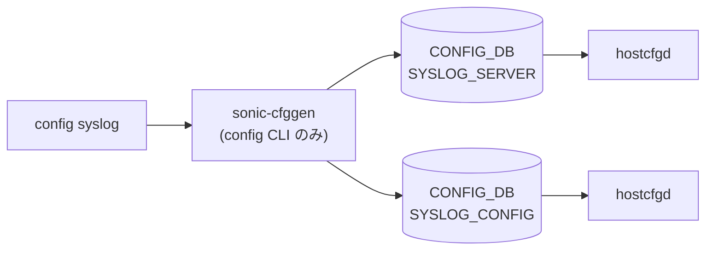

# config syslog サブコマンド

## 概要

`config syslog` は [SONiC](../../reference/glossary.md#term-sonic) ホストおよび feature コンテナの syslog 設定 (リモート送信先 / レート制限 / ログレベル) を [CONFIG_DB](../../reference/glossary.md#term-config_db) に書き込む CLI で、`config/syslog.py` の `@click.group()` がエントリポイントとなる[^1]。

反映経路はサブコマンドごとに異なる。`add` / `del` は [CONFIG_DB](../../reference/glossary.md#term-config_db) 書き込み後に CLI 自身が `systemctl reset-failed rsyslog-config rsyslog` と `systemctl restart rsyslog-config` を即時実行し、`rsyslog-config.service` がテンプレートから設定を再生成する[^3]。一方 `rate-limit-host` / `rate-limit-container` / `rate-limit-feature` / `level` は CONFIG_DB を更新するだけで、`hostcfgd` および各 feature コンテナの supervisord ラッパが購読側で `rsyslog` 設定を再生成する設計のため、反映までにタイムラグが出る場合がある。

## コマンド一覧

| コマンド | 用途 |
|---------|------|
| `config syslog add <server_ip> [--source <src>] [--port <p>] [--vrf <vrf>]` | リモート syslog サーバ追加 |
| `config syslog del <server_ip>` | リモートサーバ削除 |
| `config syslog rate-limit-host [-i <sec>] [-b <num>]` | ホスト rsyslog のレート制限 (interval / burst) |
| `config syslog rate-limit-container <service> [-i <sec>] [-b <num>] [-n <ns>]` | feature コンテナのレート制限 |
| `config syslog rate-limit-feature enable [<service>] [-n <ns>]` | feature 単位でレート制限機能を on |
| `config syslog rate-limit-feature disable [<service>] [-n <ns>]` | レート制限を off |
| `config syslog level -i <id> -l <level> [--container <c>] [--program <p>] [--pid] [-n <ns>]` | サブコンポーネントのログレベル設定 |

## 各コマンドの詳細

### `config syslog add <server_ip> [--source ...] [--port ...] [--vrf ...]`

**引数 / オプション**:

- `<server_ip_address>` ... IPv4 / IPv6。`ip_addr_validator` で検証。
- `--source <ip>` ... 送信元 IP (Loopback 等を想定)。`source_validator` がアドレス整合と存在検査を行う。
- `--port <port>` ... 送信先 UDP port (省略時 514)。
- `--vrf <vrf>` ... 出力 [VRF](../../reference/glossary.md#term-vrf)。`mgmt` (mgmt-vrf) または [CONFIG_DB](../../reference/glossary.md#term-config_db) の `VRF` テーブルに存在する [VRF](../../reference/glossary.md#term-vrf)。`source` と組み合わせる場合 `source_to_vrf_validator` で同 [VRF](../../reference/glossary.md#term-vrf) 内のインタフェースかをチェックする。

**動作**:
`SYSLOG_SERVER|<server_ip>` を新規作成する。同じ key が既存ならエラー終了 (重複はサポートしない)[^2]。エントリ書き込み後に CLI が `systemctl reset-failed rsyslog-config rsyslog` と `systemctl restart rsyslog-config` を実行するため、サーバ追加は即時に rsyslog 構成に反映される[^3]。

### `config syslog del <server_ip>`

`SYSLOG_SERVER|<server_ip>` を削除。存在しないアドレスを与えるとエラー終了。削除時も `add` と同様に `rsyslog-config` を再起動する[^3]。

### `config syslog rate-limit-host [-i <interval>] [-b <burst>]`

`SYSLOG_CONFIG|GLOBAL` (または同等のグローバル key) に `rate_limit_interval` / `rate_limit_burst` を書く。`interval` `burst` の `IntRange(0, 2147483647)` 制約だけ CLI 側で適用される。

### `config syslog rate-limit-container <service_name> [-i <interval>] [-b <burst>] [-n <namespace>]`

`SYSLOG_CONFIG_FEATURE|<service>` に同フィールドを書く。`-n` を付けると multi-[ASIC](../../reference/glossary.md#term-asic) namespace の CONFIG_DB に書き込む。

### `config syslog rate-limit-feature enable|disable [<service>] [-n <ns>]`

`get_feature_names_to_proceed` がサービス名を解決し、各 `SYSLOG_CONFIG_FEATURE` エントリの rate-limit 機能 on/off フラグを更新する。`<service>` 省略時は全 feature を一括処理する。

### `config syslog level -i <identifier> -l <level> [--container <c>] [--program <p>] [--pid] [-n <ns>]`

`LOGGER` テーブル (またはサブシステム別の logger テーブル) に `severity` を書く。識別子は `(container, program, pid)` の組み合わせで、`--container` / `--program` を併用すると特定の rsyslog ログタグだけを対象にする。`--pid` は実行中プロセスの PID にひもづけたい場合のオプション。

## 関連する CONFIG_DB

| テーブル | キー | 主なフィールド | 操作するコマンド |
|----------|------|---------------|------------------|
| `SYSLOG_SERVER` | `<server_ip>` | `source`, `port`, `vrf` | `add` / `del` |
| `SYSLOG_CONFIG` | `GLOBAL` | `rate_limit_interval`, `rate_limit_burst` | `rate-limit-host` |
| `SYSLOG_CONFIG_FEATURE` | `<service>` | `rate_limit_interval`, `rate_limit_burst`, enable/disable | `rate-limit-container` / `rate-limit-feature` |
| `LOGGER` | `<identifier>` 等 | `LOGLEVEL`, `LOGOUTPUT` | `level` |

## 注意

- VRF を指定する場合、mgmt-vrf を使うには `is_mgmt_vrf_enabled` で `MGMT_VRF_CONFIG` の有効性が確認される。mgmt-vrf 未設定で `--vrf mgmt` を渡すとエラー。
- `add` コマンドは IPv4 / IPv6 両対応だが、CLI 引数では区別せず、`ipaddress.ip_address()` で自動判別する。
- レート制限の単位は **rsyslog の `imuxsock` ratelimit** (interval 秒間に burst 件まで) であり、CLI が指定するのはそれの interval / burst パラメータそのまま。

<!-- ref-triangle:start -->

## 関連リファレンス

- CONFIG_DB: [`SYSLOG_SERVER`](../config-db/syslog-server.md) / [`SYSLOG_CONFIG`](../config-db/syslog-config.md) / [`SYSLOG_CONFIG_FEATURE`](../config-db/syslog-config-feature.md) / `LOGGER`

<!-- ref-triangle:end -->

## 引用元

[^1]: `syslog` グループは `config/syslog.py` L361-L368。<https://github.com/sonic-net/sonic-utilities/blob/39732bceb8bdefe706518ab40623bbbba6ff33b9/config/syslog.py#L361>

[^2]: `add` / `delete` は `config/syslog.py` L370-L452。重複検査は `server_validator`。

[^3]: `add` ハンドラ内の `systemctl restart rsyslog-config` 呼び出しは `config/syslog.py` L415-L416、`del` ハンドラは L447-L448。<https://github.com/sonic-net/sonic-utilities/blob/39732bceb8bdefe706518ab40623bbbba6ff33b9/config/syslog.py#L415>

<!-- ops-hint -->
## 運用ヒント

### 典型的な利用シーン

- 外部 syslog server への転送設定、severity 調整。
- rate-limit による flood 抑止。

### よくある落とし穴

- VRF (mgmt) 越しに送る場合 `--source` と VRF 指定を忘れると届かない。
- rate-limit を厳しくしすぎると障害時のログが欠落する。

### 関連する show / debug

```bash
show syslog
show runningconfiguration syslog
systemctl status rsyslog
```
<!-- /ops-hint -->

<!-- cli-sibling -->
### 関連 CLI コマンド

- [`show flowcnt`](show-flowcnt.md) — show flowcnt-trap / flowcnt-route サブコマンド
- [`show snmpagentaddress`](show-snmpagentaddress.md) — show snmpagentaddress サブコマンド
- [`show snmptrap`](show-snmptrap.md) — show snmptrap サブコマンド
- [`show techsupport`](show-techsupport.md) — show techsupport コマンド
- [`config mirror session`](config-mirror-session.md) — config mirror_session サブコマンド

<!-- /cli-sibling -->

## 関連ページ
- [HLD: Syslog Source IP](../../system/sonic-syslog-source-ip.md)
- [CONFIG_DB: SYSLOG_SERVER](../config-db/syslog-server.md)
- [YANG: sonic-syslog](../yang/sonic-syslog.md)

<!-- usage-example -->
## 実行例

### 典型的な使い方

```bash
# 例 1: リモート syslog サーバを追加
sudo config syslog add 10.0.0.100
```

### よくある引数の組み合わせ

```bash
# VRF / source / port 指定
sudo config syslog add 10.0.0.100 --source 10.0.0.1 --vrf mgmt --port 514

# 削除
sudo config syslog del 10.0.0.100
```

### 期待される出力 (抜粋)

```bash
Restarting rsyslog-config service ...
```
<!-- /usage-example -->

<!-- cli-mermaid -->
### データフロー (自動生成)



!!! note "凡例"
    config 系 (CLI → CONFIG_DB → daemon) のミニ図。テーブル → daemon 対応は `docs/reference/config-db-orch-map.md` から機械生成。
<!-- /cli-mermaid -->

<!-- topics-back-ref -->
## 関連 Topics

- [Topics: Telemetry / SNMP / Observability](../../topics/09-telemetry-snmp/index.md)

<!-- /topics-back-ref -->

<!-- glossary-links-injected: ec18b66e3507 -->
