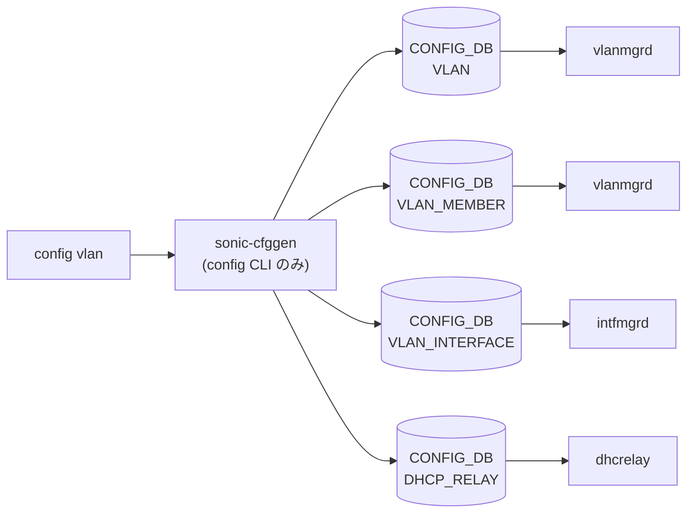

# config vlan サブコマンド

## 概要

`config vlan` は [VLAN](../../reference/glossary.md#term-vlan) の作成・削除、メンバ追加・削除、Proxy-[ARP](../../reference/glossary.md#term-arp) のオン／オフを担当する。`config/vlan.py` に実装が分離されており、`config/main.py` 末尾の `config.add_command(vlan.vlan)` で登録される構造[^1]。

新規 [VLAN](../../reference/glossary.md#term-vlan) 作成時は `VLAN` テーブルだけでなく **`DHCP_RELAY` テーブルにも空エントリを書き込む**仕様。これは `dhcp_relay` の対象 [VLAN](../../reference/glossary.md#term-vlan) が `VLAN` テーブルではなく `DHCP_RELAY` テーブルから引かれるための互換的な設計。

## コマンド一覧

| コマンド | 用途 |
|---------|------|
| `config vlan add <vid>` | VLAN を作成 |
| `config vlan del <vid>` | VLAN を削除 |
| `config vlan proxy_arp <vid> <enabled\|disabled>` | VLAN_INTERFACE の proxy [ARP](../../reference/glossary.md#term-arp) を切替 |
| `config vlan member add <vid> <port>` | VLAN にポートをメンバ追加 |
| `config vlan member del <vid> <port>` | VLAN メンバを削除 |

## 各コマンドの詳細

### `config vlan add <vid> [-m|--multiple]`

**用法**:

```bash
config vlan add <vid> [-m|--multiple]
```

**引数**:

- `<vid>` ... 単一 VLAN ID（2-4094 の整数）。`-m` 指定時は `100,200,300` や `100-110` のような複数指定が可能

**動作**:

1. `is_vlanid_in_range` で VLAN ID が `2-4094` であることを検証（`1` は default として弾く）
2. 既存 `VLAN` エントリ・`DHCP_RELAY` エントリと衝突しないか確認
3. PVST がグローバルに有効なら `stp.vlan_enable_stp` で `STP_VLAN` を埋める
4. `set_dhcp_relay_table('VLAN', ...)` で **`VLAN` テーブルと `DHCP_RELAY` テーブル両方**に `Vlan<vid>` のエントリを作成

<!-- evidence:
source: sonic-net/sonic-utilities/config/vlan.py#L95-L141 (sha: 39732bceb8bdefe706518ab40623bbbba6ff33b9)
excerpt: |
  @vlan.command('add')
  def add_vlan(ctx, vid, multiple):
      ...
      stp.vlan_enable_stp(config_db, vlan)
      set_dhcp_relay_table('VLAN', config_db, vlan, {'vlanid': str(vid)})
-->

<!-- evidence-rendered:start -->
??? note "📋 検証エビデンス: sonic-net/sonic-utilities/config/vlan.py#L95-L141 (sha: 39732bceb8bdefe706518ab40623bbbba6ff33b9)"

    **出典**:

    `sonic-net/sonic-utilities/config/vlan.py#L95-L141 (sha: 39732bceb8bdefe706518ab40623bbbba6ff33b9)`

    **抜粋**:

    ```text
    @vlan.command('add')
    def add_vlan(ctx, vid, multiple):
        ...
        stp.vlan_enable_stp(config_db, vlan)
        set_dhcp_relay_table('VLAN', config_db, vlan, {'vlanid': str(vid)})
    ```

<!-- evidence-rendered:end -->

### `config vlan del <vid> [-m|--multiple] [--no_restart_dhcp_relay]`

**用法**:

```bash
config vlan del <vid> [-m|--multiple] [--no_restart_dhcp_relay]
```

**動作**:
`VLAN_MEMBER` 配下の関連エントリ、`VLAN_INTERFACE`、`STP_VLAN` / `STP_VLAN_PORT`、最後に `VLAN` 本体を順に削除する。`--no_restart_dhcp_relay` 指定時は `dhcp_relay` サービスの再起動を抑制（DHCPv6 Relay 設定が空であることが前提）。

### `config vlan proxy_arp <vid> <enabled|disabled>`

**動作**:
`VLAN_INTERFACE|Vlan<vid>` の `proxy_arp` フィールドを `enabled` / `disabled` で書き換え、その後 `restart_ndppd()` で `ndppd` を再起動する[^2]。

### `config vlan member add <vid> <port> [-u] [-m] [-e]`

**オプション**:

- `-u, --untagged` ... untagged メンバとして登録
- `-m, --multiple` ... `<vid>` をカンマ区切り or 範囲で複数指定
- `-e, --except_flag` ... 指定 vlan 以外の全 VLAN にメンバ追加

**動作**:
`VLAN_MEMBER|<vlan>|<port>` を `tagging_mode: untagged|tagged` で作成。多数の事前チェックを行う:

- VLAN が存在するか
- ポート (`PORT` または `PORTCHANNEL`) が存在し、PORTCHANNEL_MEMBER に既に組み込まれていないか
- ポートが mirror destination ではないか
- ポートの `mode` が `routed` でないか（`access` / `trunk` の整合性も確認）
- グローバル STP 有効時は `enable_stp_on_port` で `STP_PORT` を埋める

### `config vlan member del <vid> <port> [-m] [-e]`

**動作**:
`VLAN_MEMBER|<vlan>|<port>` を削除し、グローバル STP が有効なら `disable_stp_on_vlan_port` で `STP_VLAN_PORT` / `STP_PORT` を整理。さらに `STATE_DB` の `DHCPv6_COUNTER_TABLE|<port>` / `DHCP_COUNTER_TABLE|<port>` も掃除する。

## 関連する CONFIG_DB

| テーブル | 書き換え内容 | 操作するコマンド |
|----------|--------------|------------------|
| `VLAN` | エントリ作成・削除 | `add` / `del` |
| `DHCP_RELAY` | `vlanid` 付きエントリ作成・削除 | `add` / `del` |
| `VLAN_INTERFACE` | `proxy_arp` フィールド | `proxy_arp` |
| `VLAN_MEMBER` | `<vlan>|<port>` の `tagging_mode` | `member add` / `del` |
| `STP_VLAN` / `STP_VLAN_PORT` / `STP_PORT` | PVST 有効時の追従 | `add` / `del` / `member ...` |

<!-- ref-triangle:start -->

## 関連リファレンス

- [CONFIG_DB](../../reference/glossary.md#term-config_db): [`VLAN`](../config-db/vlan.md) / [`VLAN_MEMBER`](../config-db/vlan-member.md) / [`VLAN_INTERFACE`](../config-db/vlan-interface.md) / [`DHCP_RELAY`](../config-db/dhcp-relay.md) / `STP_VLAN` / `STP_VLAN_PORT` / `STP_PORT`

<!-- ref-triangle:end -->

## 引用元

[^1]: `vlan` グループは `config/vlan.py` で定義され、`config/main.py` 末尾で `config.add_command(vlan.vlan)` 相当の登録が行われる。<https://github.com/sonic-net/sonic-utilities/blob/39732bceb8bdefe706518ab40623bbbba6ff33b9/config/vlan.py>

[^2]: `proxy_arp` は VLAN そのものではなく `VLAN_INTERFACE` テーブルに書き込まれる（L3 SVI 機能のため）。`config/vlan.py` L302-L320。<https://github.com/sonic-net/sonic-utilities/blob/39732bceb8bdefe706518ab40623bbbba6ff33b9/config/vlan.py#L302>

<!-- ops-hint -->
## 運用ヒント

### 典型的な利用シーン

- VLAN 新設・メンバ追加・IP 付与の典型フロー。
- DHCP relay や [VRF](../../reference/glossary.md#term-vrf) 紐付けの前段としての VLAN セットアップ。

### よくある落とし穴

- `config vlan member del` はメンバを外すのみで VLAN 本体は残る。`config vlan del` で本体削除。
- VLAN に IP を付けた状態で `config vlan del` するとエラー。先に `config interface ip remove` が必要。

### 関連する show / debug

```bash
show vlan brief
show vlan config
show interfaces status
```
<!-- /ops-hint -->

<!-- cli-sibling -->
### 関連 CLI コマンド

- [`show vlan`](show-vlan.md) — show vlan サブコマンド
- [`show lldp`](show-lldp.md) — show lldp サブコマンド
- [`show mac`](show-mac.md) — show mac サブコマンド
- [`show storm control`](show-storm-control.md) — show storm-control サブコマンド
- [`config interface`](config-interface.md) — config interface サブコマンド

<!-- /cli-sibling -->

## 関連ページ
- [HLD: Switchport モードと VLAN CLI 拡張](../../switching/switch-port-modes-and-vlan-cli-enhancement.md)
- [CONFIG_DB: VLAN](../config-db/vlan.md)
- [CONFIG_DB: VLAN_MEMBER](../config-db/vlan-member.md)
- [YANG: sonic-vlan](../yang/sonic-vlan.md)

<!-- usage-example -->
## 実行例

### 典型的な使い方

```bash
# 例 1: VLAN を作成して member を追加
sudo config vlan add 100
sudo config vlan member add 100 Ethernet0
```

### よくある引数の組み合わせ

```bash
# untagged member として追加（-u）
sudo config vlan member add -u 100 Ethernet4

# DHCP relay を VLAN 100 に追加（`config vlan` 直下ではなく専用コマンド）
sudo config dhcp_relay ipv4 add 100 10.0.0.1

# proxy-arp を有効化
sudo config vlan proxy_arp 100 enabled
```

### 期待される出力 (抜粋)

```text
Restarting DHCP relay service ...
```
<!-- /usage-example -->

<!-- cli-mermaid -->
### データフロー (自動生成)



!!! note "凡例"
    config 系 (CLI → CONFIG_DB → daemon) のミニ図。テーブル → daemon 対応は `docs/reference/config-db-orch-map.md` から機械生成。
<!-- /cli-mermaid -->

<!-- topics-back-ref -->
## 関連 Topics

- [Topics: L2 / VLAN / LAG / MC-LAG](../../topics/06-l2-vlan-lag/index.md)

<!-- /topics-back-ref -->

<!-- glossary-links-injected: a90586777d5a -->
