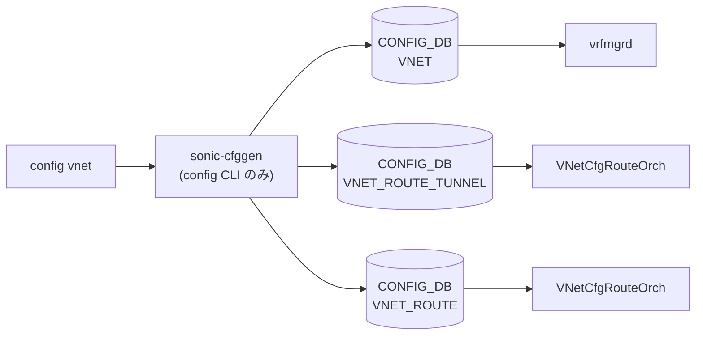

# config vnet サブコマンド

## 概要

`config vnet` は overlay [VNET](../../reference/glossary.md#term-vnet) と [VNET](../../reference/glossary.md#term-vnet) route を [CONFIG_DB](../../reference/glossary.md#term-config_db) に作成・削除する CLI グループ。multi-[ASIC](../../reference/glossary.md#term-asic) では `--namespace` で対象 namespace を選択できる[^1]。

## コマンド一覧

| コマンド | 用途 |
|---------|------|
| `config vnet add <vnet_name> <vni> <vxlan_tunnel> [<peer_list> [<guid> [<scope> [<advertise_prefix> [<overlay_dmac> [<src_mac>]]]]]]` | `VNET|<vnet_name>` を追加/更新 |
| `config vnet del <vnet_name>` | [VNET](../../reference/glossary.md#term-vnet) と関連 interface/route を削除 |
| `config vnet add-route <vnet_name> <prefix> <endpoint> [<vni> [<mac_address> [<endpoint_monitor> [<profile> [<primary> [<monitoring> [<adv_prefix>]]]]]]]` | tunnel route を追加/更新 |
| `config vnet del-route <vnet_name> [<prefix>]` | route 1件または VNET 配下全 route を削除 |

## 各コマンドの詳細

### `config vnet add`

**用法**:

```bash
config vnet add <vnet_name> <vni> <vxlan_tunnel>
                [<peer_list>
                 [<guid>
                  [<scope>
                   [<advertise_prefix>
                    [<overlay_dmac>
                     [<src_mac>]]]]]]
```

引数はすべて **位置引数 (positional)** で、`--peer_list=...` のような option 形式では受け付けない[^2]。`<peer_list>` はカンマ区切りで、内部で `split(',')` される[^2]。`<scope>` は実装上 `default` のみ許容 (それ以外を渡すと `ctx.fail` で拒否)[^2]。省略した場合は CONFIG_DB エントリにそのフィールドを書き込まない動作になる。

`<vnet_name>` は `Vnet` で始まり、最大 15 文字 (`vnet_name_is_valid()`)[^3]。`<vni>` は 1〜16777215 の整数、`<vxlan_tunnel>` は既存の VxLAN tunnel 名でなければエラーとなる[^2]。`VNET|<vnet_name>` に `vni`, `vxlan_tunnel` と指定された値を書き込み、`peer_list` の各 peer も同じ VNET 名検証を受ける[^2]。

### `config vnet del`

`VNET|<vnet_name>` が存在することを確認し、関連 interface の `vnet_name` と `VNET_ROUTE_TUNNEL` / `VNET_ROUTE` を削除してから VNET entry を削除する[^4]。

### `config vnet add-route`

**用法**:

```bash
config vnet add-route <vnet_name> <prefix> <endpoint>
                      [<vni>
                       [<mac_address>
                        [<endpoint_monitor>
                         [<profile>
                          [<primary>
                           [<monitoring>
                            [<adv_prefix>]]]]]]]
```

`add` 同様、すべて位置引数で `--vni=...` のような option 形式は受け付けない[^5]。`VNET_ROUTE_TUNNEL|<vnet_name>|<prefix>` に endpoint, vni, mac_address, endpoint_monitor, profile, primary, monitoring, adv_prefix を書き込む。対象 VNET が無い場合や `prefix` / `endpoint` が IP として不正な場合はエラーで abort する[^5]。

### `config vnet del-route`

`<prefix>` 指定時は該当 route だけを削除する。省略時は対象 VNET に紐づく route をまとめて削除する[^6]。

<!-- cli-mermaid -->
### データフロー (自動生成)



!!! note "凡例"
    config 系 (CLI → CONFIG_DB → daemon) のミニ図。テーブル → daemon 対応は `docs/reference/config-db-orch-map.md` から機械生成。
<!-- /cli-mermaid -->

<!-- ref-triangle:start -->

## 関連リファレンス

- [CONFIG_DB](../../reference/glossary.md#term-config_db): [`VNET`](../config-db/vnet.md) / [`VNET_ROUTE_TUNNEL`](../config-db/vnet.md) / [`VNET_ROUTE`](../config-db/vnet.md)

<!-- ref-triangle:end -->

## 引用元

[^1]: `config vnet` グループ定義 (`@config.group(name='vnet')` + `--namespace`)。<https://github.com/sonic-net/sonic-utilities/blob/39732bceb8bdefe706518ab40623bbbba6ff33b9/config/main.py#L10059-L10064>

[^2]: `config vnet add` のシグネチャ (`@click.argument` 9 つ) と VNI/VxLAN tunnel 検証ロジック。<https://github.com/sonic-net/sonic-utilities/blob/39732bceb8bdefe706518ab40623bbbba6ff33b9/config/main.py#L10067-L10131>

[^3]: `vnet_name_is_valid()` の定義 (`Vnet` 接頭辞 + 最大 15 文字)。<https://github.com/sonic-net/sonic-utilities/blob/39732bceb8bdefe706518ab40623bbbba6ff33b9/config/main.py#L467>

[^4]: `config vnet del` の実装 (関連 interface / route の cleanup)。<https://github.com/sonic-net/sonic-utilities/blob/39732bceb8bdefe706518ab40623bbbba6ff33b9/config/main.py#L10134-L10160>

[^5]: `config vnet add-route` のシグネチャ (`@click.argument` 10 個) と prefix / endpoint 検証。<https://github.com/sonic-net/sonic-utilities/blob/39732bceb8bdefe706518ab40623bbbba6ff33b9/config/main.py#L10161-L10232>

[^6]: `config vnet del-route` のシグネチャ (`prefix` は `required=False`)。<https://github.com/sonic-net/sonic-utilities/blob/39732bceb8bdefe706518ab40623bbbba6ff33b9/config/main.py#L10234-L10260>

<!-- ops-hint -->
## 運用ヒント

### 典型的な利用シーン

- [DASH](../../reference/glossary.md#term-dash) / T1 [SmartSwitch](../../reference/glossary.md#term-smartswitch) 向けに VNET ([VRF](../../reference/glossary.md#term-vrf) + VxLAN) を作成する。
- VNET route / VNET neighbor の追加メンテ。

### よくある落とし穴

- VNET に紐付ける VxLAN tunnel が未作成だと [CONFIG_DB](../../reference/glossary.md#term-config_db) に入っても `vnetorch` が起動できない。
- guid / scope を変えると既存 route が無効化される。

### 関連する show / debug

```bash
show vnet brief
show vnet routes all
show vnet endpoint
```
<!-- /ops-hint -->

<!-- cli-sibling -->
### 関連 CLI コマンド

- [`show mclag`](show-mclag.md) — show mclag (mclagdctl) コマンド
- [`config mclag`](config-mclag.md) — config mclag サブコマンド
- [`config vxlan`](config-vxlan.md) — config vxlan サブコマンド

<!-- /cli-sibling -->

<!-- glossary-links-injected: c006405759d8 -->
