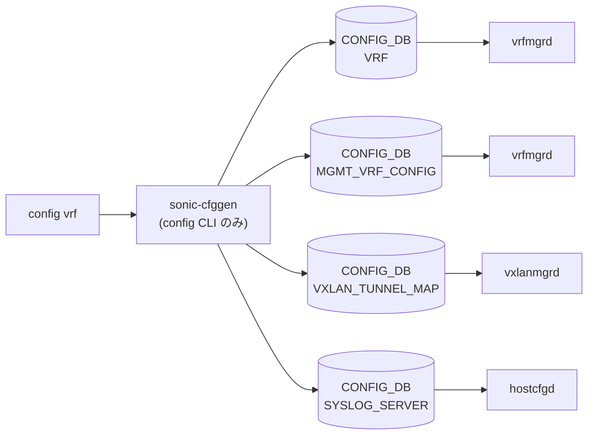

# config vrf サブコマンド

## 概要

`config vrf` は [VRF](../../reference/glossary.md#term-vrf) (Virtual Routing and Forwarding) インスタンスの作成・削除と、L3 VNI マッピング（[VXLAN](../../reference/glossary.md#term-vxlan) [EVPN](../../reference/glossary.md#term-evpn) 用）を提供する。`config/main.py` 内に二重定義があり、上段（L6569）の `vrf` グループは古い定義で実際の `config` 直下に登録されているのは後段（L7673）の `@config.group(cls=clicommon.AbbreviationGroup, name='vrf')`。[CONFIG_DB](../../reference/glossary.md#term-config_db) の `VRF` テーブルに対する add/del と、`MGMT_VRF_CONFIG` に対する管理 [VRF](../../reference/glossary.md#term-vrf) の有効化を扱う[^1]。

ManagementVRF (`mgmt` / `management`) は通常データプレーン用の `Vrf<name>` とは扱いが異なり、`vrf_add_management_vrf` / `vrf_delete_management_vrf` が `MGMT_VRF_CONFIG` を直接操作する。

## コマンド一覧

| コマンド | 用途 |
|---------|------|
| `config vrf add <vrf_name>` | データ [VRF](../../reference/glossary.md#term-vrf) または management VRF を追加 |
| `config vrf del <vrf_name>` | VRF を削除（ヒットする interface IP も全消去） |
| `config vrf add_vrf_vni_map <vrf-name> <vni>` | VRF に L3 VNI を割り当て |
| `config vrf del_vrf_vni_map <vrf-name>` | VRF の VNI マッピングを 0 にリセット |

## 各コマンドの詳細

### `config vrf add <vrf_name>`

**引数**:

- `<vrf_name>` ... `Vrf` で始まる任意名、もしくは `mgmt` / `management`

**動作**:
名前のバリデーション → `Vrf` で始まる、または `mgmt`/`management` のみ許可。`isInterfaceNameValid` で長さ制限（`IFACE_NAME_MAX_LEN`）もチェックする[^2]。

- データ VRF: `VRF|<vrf_name>` を `set_entry(..., {"NULL": "NULL"})` で作成。
- 管理 VRF: `vrf_add_management_vrf` が `MGMT_VRF_CONFIG|vrf_global` の `mgmtVrfEnabled = "true"` を立てる。

既存 VRF を再追加するとエラーで終了する。

<!-- evidence:
source: sonic-net/sonic-utilities/config/main.py#L7682-L7700 (sha: 39732bceb8bdefe706518ab40623bbbba6ff33b9)
excerpt: |
  @vrf.command('add')
  def add_vrf(ctx, vrf_name):
      ...
      elif (vrf_name == 'mgmt' or vrf_name == 'management'):
          vrf_add_management_vrf(config_db)
      else:
          config_db.set_entry('VRF', vrf_name, {"NULL": "NULL"})
-->

<!-- evidence-rendered:start -->
??? note "📋 検証エビデンス: sonic-net/sonic-utilities/config/main.py#L7682-L7700 (sha: 39732bceb8bdefe706518ab40623bbbba6ff33b9)"

    **出典**:

    `sonic-net/sonic-utilities/config/main.py#L7682-L7700 (sha: 39732bceb8bdefe706518ab40623bbbba6ff33b9)`

    **抜粋**:

    ```text
    @vrf.command('add')
    def add_vrf(ctx, vrf_name):
        ...
        elif (vrf_name == 'mgmt' or vrf_name == 'management'):
            vrf_add_management_vrf(config_db)
        else:
            config_db.set_entry('VRF', vrf_name, {"NULL": "NULL"})
    ```

<!-- evidence-rendered:end -->

### `config vrf del <vrf_name>`

**動作**:

1. `SYSLOG_SERVER` テーブルを走査し、`vrf` フィールドが当該 VRF を指すエントリがあれば失敗。
2. `check_dhcpv4_relay_dependencies` で DHCPv4 リレーから参照されていないか確認。
3. `del_interface_bind_to_vrf` で `INTERFACE` / `VLAN_INTERFACE` / `PORTCHANNEL_INTERFACE` テーブルの該当 IP エントリを連鎖削除。
4. `VRF|<vrf_name>` を `set_entry(None)` で削除。

管理 VRF (`mgmt` / `management`) は `vrf_delete_management_vrf` 経由で `MGMT_VRF_CONFIG` 側を操作する。

### `config vrf add_vrf_vni_map <vrf-name> <vni>`

**動作**:

- 対象 VRF が `VRF` テーブルにあること
- `vni` が数値かつ `clicommon.vni_id_is_valid` (1 - 16777215)
- `VXLAN_TUNNEL_MAP` テーブル内に同じ VNI を持つ [VLAN](../../reference/glossary.md#term-vlan)-VNI マップが既に存在していること（先に作成しておくこと）
- 同じ VNI が他の VRF に既に割り当てられていないこと

すべて満たしたら `mod_entry('VRF', vrfname, {"vni": vni})` で `VRF|<vrf>` の `vni` フィールドを更新する。

### `config vrf del_vrf_vni_map <vrf-name>`

`VRF|<vrf>` の `vni` を `0` に設定（エントリ削除ではなく値リセット）。

## 関連する CONFIG_DB

| テーブル | key | フィールド | 操作 |
|----------|-----|----------|------|
| `VRF` | `<vrf_name>` (`Vrf*`) | `NULL` (placeholder) / `vni` | add / del / add_vrf_vni_map / del_vrf_vni_map |
| `MGMT_VRF_CONFIG` | `vrf_global` | `mgmtVrfEnabled` | `mgmt` / `management` 名での add / del |
| `VXLAN_TUNNEL_MAP` | `<map>` | `vni` (依存) | `add_vrf_vni_map` の事前条件 |
| `SYSLOG_SERVER` | `<host>` | `vrf` (依存) | `del` の安全性チェック |

## 制約

- VRF 名は `Vrf` プレフィックス、または `mgmt` / `management` の固定名のみ。
- ManagementVRF と Data VRF は内部の格納先テーブルが異なるが、CLI 上では同じ `config vrf add` で透過に扱える。
- `del` は IP・SYSLOG・DHCPv4 relay から参照されている VRF を拒否する（依存解消が先）。

<!-- cli-mermaid -->
### データフロー (自動生成)



!!! note "凡例"
    config 系 (CLI → CONFIG_DB → daemon) のミニ図。テーブル → daemon 対応は `docs/reference/config-db-orch-map.md` から機械生成。
<!-- /cli-mermaid -->

<!-- ref-triangle:start -->

## 関連リファレンス

- [CONFIG_DB](../../reference/glossary.md#term-config_db): [`VRF`](../config-db/vrf.md) / [`MGMT_VRF_CONFIG`](../config-db/mgmt-vrf-config.md) / [`VXLAN_TUNNEL_MAP`](../config-db/vxlan-tunnel-map.md) / [`SYSLOG_SERVER`](../config-db/syslog-server.md)

<!-- ref-triangle:end -->

## 引用元

[^1]: `config vrf` グループの正式な登録は `config/main.py` L7673。<https://github.com/sonic-net/sonic-utilities/blob/39732bceb8bdefe706518ab40623bbbba6ff33b9/config/main.py#L7673>

[^2]: VRF 名のバリデータ `isInterfaceNameValid` と `IFACE_NAME_MAX_LEN` は `config/main.py` 上部のヘルパで定義される。<https://github.com/sonic-net/sonic-utilities/blob/39732bceb8bdefe706518ab40623bbbba6ff33b9/config/main.py>

## 既知の挙動・制限

!!! warning "`show vrf <name>` の終了コードが誤動作する (issue [#4378](https://github.com/sonic-net/sonic-utilities/issues/4378))"
    未設定の VRF 名を指定しても空のテーブルが表示されて exit code 0 で返る。スクリプトで VRF 存在確認に使うと誤判定する。回避策: `show vrf <name>` の出力行数で判定するか、`ip vrf show <name> 2>&1 | grep -q <name>` で確認する。

!!! warning "`config reload` 後に YANG 検証が失敗する場合 (issue [#4307](https://github.com/sonic-net/sonic-utilities/issues/4307))"
    `minigraph.xml` で `docker_routing_config_mode` 要素が空 (`None`) の場合、`config reload` 後に文字列 `"None"` として CONFIG_DB に書かれ YANG バリデーションが失敗する。回避策: `sonic-db-cli CONFIG_DB HDEL "DEVICE_METADATA|localhost" docker_routing_config_mode` でフィールドを削除してから再度 `config reload` を実行する。

<!-- usage-example -->
## 実行例

### 典型的な使い方

```bash
# 例 1: VRF を作成しインターフェースをバインド
sudo config vrf add Vrf_Red
sudo config interface vrf bind Ethernet0 Vrf_Red
```

### よくある引数の組み合わせ

```bash
# VRF 削除
sudo config vrf del Vrf_Red

# Management VRF を有効化
sudo config vrf add mgmt
```

### 期待される出力 (抜粋)

```text
VRF Vrf_Red added.
```
<!-- /usage-example -->

<!-- cli-sibling -->
### 関連 CLI コマンド

- [`show mgmt-vrf`](show-mgmt-vrf.md) — show mgmt-vrf サブコマンド
- [`show arp`](show-arp.md) — show arp サブコマンド
- [`show bfd`](show-bfd.md) — show bfd サブコマンド
- [`show bgp`](show-bgp.md) — show bgp / show ip bgp / show ipv6 bgp サブコマンド
- [`show ip`](show-ip.md) — show ip サブコマンド

<!-- /cli-sibling -->

## 関連ページ
- [HLD: VRF サポート](../../routing/sonic-vrf-support-design-spec-draft.md)
- [CONFIG_DB: VRF](../config-db/vrf.md)
- [CONFIG_DB: MGMT_VRF_CONFIG](../config-db/mgmt-vrf-config.md)
- [YANG: sonic-vrf](../yang/sonic-vrf.md)

<!-- glossary-links-injected: daea650a90b0 -->
