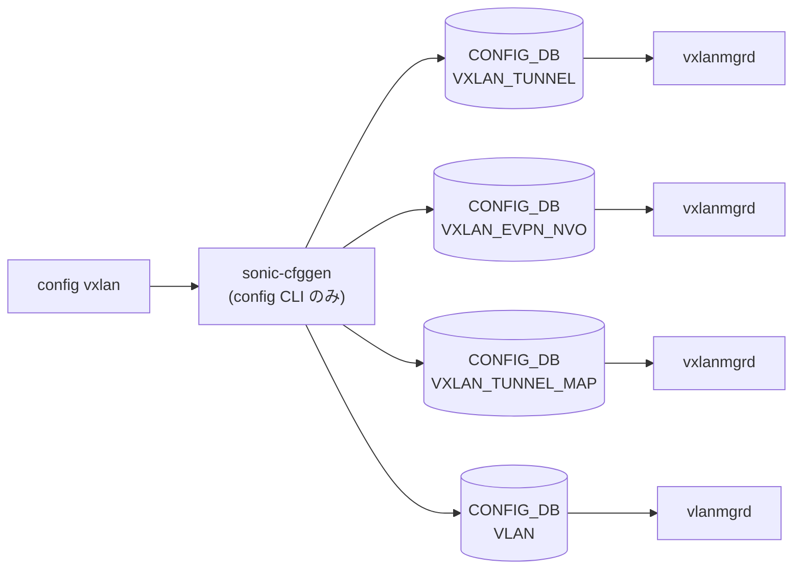

# config vxlan サブコマンド

## 概要

`config vxlan` は [VXLAN](../../reference/glossary.md#term-vxlan) VTEP (`VXLAN_TUNNEL`)、[EVPN](../../reference/glossary.md#term-evpn) NVO (`VXLAN_EVPN_NVO`)、および [VLAN](../../reference/glossary.md#term-vlan)-VNI マッピング (`VXLAN_TUNNEL_MAP`) を管理する。`config/vxlan.py` に分離されており、`config/main.py` 末尾の `config.add_command(vxlan.vxlan)` で登録される構造[^1]。

VTEP **1 デバイスにつき 1 つだけ**しか作れない（`vxlan add` 時に既存件数 > 0 でエラー）。[EVPN](../../reference/glossary.md#term-evpn) NVO も 1 つだけ。

## コマンド一覧

| コマンド | 用途 |
|---------|------|
| `config vxlan add <vxlan_name> <src_ip>` | VTEP を作成 |
| `config vxlan del <vxlan_name>` | VTEP を削除 |
| `config vxlan evpn_nvo add <nvo_name> <vxlan_name>` | [EVPN](../../reference/glossary.md#term-evpn) NVO を作成 |
| `config vxlan evpn_nvo del <nvo_name>` | EVPN NVO を削除 |
| `config vxlan map add <vxlan_name> <vlan_id> <vni>` | [VLAN](../../reference/glossary.md#term-vlan)-VNI マップを 1 つ作成 |
| `config vxlan map del <vxlan_name> <vlan_id> <vni>` | [VLAN](../../reference/glossary.md#term-vlan)-VNI マップを 1 つ削除 |
| `config vxlan map_range add <vxlan_name> <vlan_start> <vlan_end> <vni_start>` | VLAN 範囲をまとめてマップ |
| `config vxlan map_range del <vxlan_name> <vlan_start> <vlan_end> <vni_start>` | VLAN 範囲のマップを削除 |

`-n|--namespace` オプションは `vxlan` グループ全体に必須（`@multi_asic_util.multi_asic_click_option_namespace(required=True)`）。

## 各コマンドの詳細

### `config vxlan add <vxlan_name> <src_ip>`

**動作**:

- `src_ip` を `is_ipaddress` で検証
- `vxlan_name` の長さを `IFACE_NAME_MAX_LEN` でバリデート
- **既存 `VXLAN_TUNNEL` エントリが 1 件でもあればエラー**（VTEP は 1 つ限定）
- `VXLAN_TUNNEL|<vxlan_name>` を `{src_ip: <src_ip>}` で作成

<!-- evidence:
source: sonic-net/sonic-utilities/config/vxlan.py#L19-L51 (sha: 39732bceb8bdefe706518ab40623bbbba6ff33b9)
excerpt: |
  if(vxlan_count > 0):
      ctx.fail("VTEP already configured.")
  fvs = {'src_ip': src_ip}
  config_db.set_entry('VXLAN_TUNNEL', vxlan_name, fvs)
-->

<!-- evidence-rendered:start -->
??? note "📋 検証エビデンス: sonic-net/sonic-utilities/config/vxlan.py#L19-L51 (sha: 39732bceb8bdefe706518ab40623bbbba6ff33b9)"

    **出典**:

    `sonic-net/sonic-utilities/config/vxlan.py#L19-L51 (sha: 39732bceb8bdefe706518ab40623bbbba6ff33b9)`

    **抜粋**:

    ```text
    if(vxlan_count > 0):
        ctx.fail("VTEP already configured.")
    fvs = {'src_ip': src_ip}
    config_db.set_entry('VXLAN_TUNNEL', vxlan_name, fvs)
    ```

<!-- evidence-rendered:end -->

### `config vxlan del <vxlan_name>`

**動作**:
**削除前依存チェック**:

- 当該 VTEP が存在する
- `VXLAN_EVPN_NVO` が空（1 件でも残っているとエラー）
- `VXLAN_TUNNEL_MAP` が空
- `VNET` テーブルでこの VTEP を参照しているエントリが無い

依存が全部解消されていれば `set_entry('VXLAN_TUNNEL', name, None)`。

### `config vxlan evpn_nvo add <nvo_name> <vxlan_name>`

**動作**:

- 既存 `VXLAN_EVPN_NVO` が空であること（NVO も 1 つ限定）
- `<vxlan_name>` で指定された VTEP が存在すること
- `VXLAN_EVPN_NVO|<nvo_name>` を `{source_vtep: <vxlan_name>}` で作成

### `config vxlan evpn_nvo del <nvo_name>`

`VXLAN_TUNNEL_MAP` が空であることを確認した上で `VXLAN_EVPN_NVO|<nvo_name>` を削除。

### `config vxlan map add <vxlan_name> <vlan_id> <vni>`

**動作**:

- `vlan_id` 1-4094, `vni` 1-16777215 をバリデート
- `VXLAN_TUNNEL|<vxlan_name>` の存在確認
- `VLAN|Vlan<vlan_id>` の存在確認
- `VXLAN_TUNNEL_MAP` に同じ vlan / vni が他で使われていないか走査
- key を `<vxlan_name>|map_<vni>_Vlan<vlan_id>` の形で作成、value は `{vni: <vni>, vlan: Vlan<vlan_id>}`

### `config vxlan map del <vxlan_name> <vlan_id> <vni>`

**動作**:

- `<vni>` が `VRF` テーブルから参照されていればエラー（先に [VRF](../../reference/glossary.md#term-vrf) VNI 関連付けを外す必要あり）
- key を **2 つのフォーマットで削除**を試みる: `map_<vni>_<vlan_id>` および `map_<vni>_Vlan<vlan_id>`（実装上は両方とも `set_entry(..., None)` で安全側）

### `config vxlan map_range add <vxlan_name> <vlan_start> <vlan_end> <vni_start>`

**動作**:
`vlan_start..vlan_end` まで連続的にループし、各 `vid` に対して `vni_start + (vid - vlan_start)` の VNI を割り当てる。VLAN が存在しなかったり VNI / VLAN がすでにマップ済みの行はスキップ（エラーではない）。各成功エントリは `<vxlan_name>|map_<vni>_Vlan<vid>` で作成。

### `config vxlan map_range del <vxlan_name> <vlan_start> <vlan_end> <vni_start>`

範囲内の各 (vlan, vni) について、**VRF に紐付いていない VNI のみ削除**し、VRF にマップ済みの VNI はスキップ（保護）する仕様[^2]。完全に削除したい場合は先に `config vrf del_vrf_vni_map` で VRF-VNI マッピングを解除してから `map del` を使う。スキップされた行は print メッセージのみで警告扱い。

## 関連する CONFIG_DB

| テーブル | 操作 | 操作するコマンド |
|----------|------|------------------|
| `VXLAN_TUNNEL` | エントリ作成・削除 | `add` / `del` |
| `VXLAN_EVPN_NVO` | エントリ作成・削除 | `evpn_nvo add` / `evpn_nvo del` |
| `VXLAN_TUNNEL_MAP` | エントリ作成・削除 (key 形式 `<tunnel>|map_<vni>_Vlan<id>`) | `map add/del` / `map_range add/del` |

`VLAN` / `VNET` / `VRF` は読み取りのみ（依存チェック）。

## 注意点

- VTEP / NVO は **デバイス 1 つあたり 1 つ限定**
- `map_range del` は **VRF 紐付けのない VNI のみ削除**し、VRF に紐付け済みの VNI はスキップ（保護）する。スキップされた行は print メッセージのみ。VRF 紐付け済み VNI を含めて削除するには先に `config vrf del_vrf_vni_map` を実行する

<!-- cli-mermaid -->
### データフロー (自動生成)



!!! note "凡例"
    config 系 (CLI → CONFIG_DB → daemon) のミニ図。テーブル → daemon 対応は `docs/reference/config-db-orch-map.md` から機械生成。
<!-- /cli-mermaid -->

<!-- ref-triangle:start -->

## 関連リファレンス

- [CONFIG_DB](../../reference/glossary.md#term-config_db): [`VXLAN_TUNNEL`](../config-db/vxlan-tunnel.md) / [`VXLAN_EVPN_NVO`](../config-db/vxlan-evpn-nvo.md) / [`VXLAN_TUNNEL_MAP`](../config-db/vxlan-tunnel-map.md) / [`VLAN`](../config-db/vlan.md) / [`VNET`](../config-db/vnet.md) / [`VRF`](../config-db/vrf.md)

<!-- ref-triangle:end -->

## 引用元

[^1]: `vxlan` グループ全体の定義は `config/vxlan.py` L14-L17。`-n` 必須。<https://github.com/sonic-net/sonic-utilities/blob/39732bceb8bdefe706518ab40623bbbba6ff33b9/config/vxlan.py>

[^2]: `map_range del` の VRF 紐付けスキップは L353-L355。<https://github.com/sonic-net/sonic-utilities/blob/39732bceb8bdefe706518ab40623bbbba6ff33b9/config/vxlan.py#L353>

<!-- usage-example -->
## 実行例

### 典型的な使い方

```bash
# 例 1: VxLAN tunnel と EVPN map を構成
sudo config vxlan add vtep1 10.0.0.1
sudo config vxlan map add vtep1 100 10100
```

### よくある引数の組み合わせ

```bash
sudo config vxlan evpn_nvo add nvo1 vtep1
# VLAN 100〜200 を VNI 10100〜10200 に連続マップ（引数は4つのみ）
sudo config vxlan map_range add vtep1 100 200 10100
sudo config vxlan del vtep1
```

### 期待される出力 (抜粋)

```text
VxLAN tunnel vtep1 added.
```
<!-- /usage-example -->

<!-- ops-hint -->
## 運用ヒント

### 典型的な利用シーン

- VxLAN tunnel 作成、VLAN-VNI map、EVPN VNI 紐付け。
- [VNET](../../reference/glossary.md#term-vnet) (asymmetric IRB) のセットアップ起点。

### よくある落とし穴

- source IP に Loopback を指定しないと [FRR](../../reference/glossary.md#term-frr)/EVPN 経路が広告されない。
- `config vxlan map add` の VNI は uint24 上限。`vlan` を消す前に map を外さないと残骸が [STATE_DB](../../reference/glossary.md#term-state_db) に残る。

### 関連する show / debug

```bash
show vxlan tunnel
show vxlan vlanvnimap
show vxlan name <tunnel>
```
<!-- /ops-hint -->

<!-- cli-sibling -->
### 関連 CLI コマンド

- [`show mclag`](show-mclag.md) — show mclag (mclagdctl) コマンド
- [`config mclag`](config-mclag.md) — config mclag サブコマンド
- [`config vnet`](config-vnet.md) — config vnet サブコマンド

<!-- /cli-sibling -->

## 関連ページ
- [HLD: VXLAN / VNet 全体設計](../../overlay/vxlan-sonic.md)
- [HLD: EVPN VXLAN](../../routing/evpn-vxlan-hld.md)
- [CONFIG_DB: VXLAN_TUNNEL](../config-db/vxlan-tunnel.md)
- [CONFIG_DB: VXLAN_TUNNEL_MAP](../config-db/vxlan-tunnel-map.md)
- [YANG: sonic-vxlan](../yang/sonic-vxlan.md)

<!-- glossary-links-injected: 30b3c32e2ff3 -->
