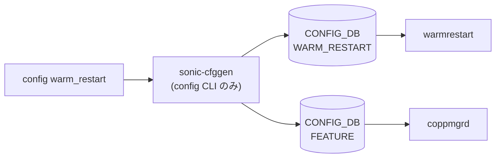

# config warm_restart サブコマンド

## 概要

`config warm_restart` は warm restart の enable 状態と daemon timer を設定する CLI グループ。enable/disable は [STATE_DB](../../reference/glossary.md#term-state_db) の `WARM_RESTART_ENABLE_TABLE|<module>` を更新し、timer 系は [CONFIG_DB](../../reference/glossary.md#term-config_db) の `WARM_RESTART` を更新する[^1]。

## コマンド一覧

| コマンド | 用途 |
|---------|------|
| `config warm_restart enable [--namespace <ns>] [<module>]` | module の warm restart を有効化 |
| `config warm_restart disable [--namespace <ns>] [<module>]` | module の warm restart を無効化 |
| `config warm_restart neighsyncd_timer [--namespace <ns>] <seconds>` | `swss` の [neighsyncd](../../reference/glossary.md#term-neighsyncd) timer を設定 |
| `config warm_restart bgp_timer [--namespace <ns>] <seconds>` | `bgp` の timer を設定 |
| `config warm_restart teamsyncd_timer [--namespace <ns>] <seconds>` | `teamd` の teamsyncd timer を設定 |
| `config warm_restart bgp_eoiu [--namespace <ns>] [true|false]` | [BGP](../../reference/glossary.md#term-bgp) EOIU を設定 |

## 各コマンドの詳細

### enable / disable

`<module>` を省略すると `system`。`module != system` の場合は [CONFIG_DB](../../reference/glossary.md#term-config_db) `FEATURE` テーブルに存在する feature 名だけを受け付ける。namespace 指定が無い場合、single-[ASIC](../../reference/glossary.md#term-asic) では default namespace、multi-[ASIC](../../reference/glossary.md#term-asic) では default + [ASIC](../../reference/glossary.md#term-asic) namespace 群に反映する[^2]。

### timer 系

範囲チェックは `config/main.py` 冒頭の `ADHOC_VALIDATION = True` というモジュール定数でゲートされる。これは master のソースコード上で **常に `True` 固定**（CLI option や環境変数で切り替える経路は無い）であり、コミュニティ版 [SONiC](../../reference/glossary.md#term-sonic) を `sonic-utilities` の標準ビルドで使う限り範囲外値は CLI 段で `ctx.fail` され CONFIG_DB には書かれない[^3]。

- `neighsyncd_timer` は `WARM_RESTART|swss` の `neighsyncd_timer` を更新する。許容範囲は 1-9998 秒（`range(1, 9999)`）。範囲外で `neighsyncd warm restart timer must be in range 1-9999` を返し abort する[^3]。
- `bgp_timer` は `WARM_RESTART|bgp` の `bgp_timer` を更新する。許容範囲は 1-3599 秒（`range(1, 3600)`）。範囲外で `bgp warm restart timer must be in range 1-3600` を返し abort する[^3]。
- `teamsyncd_timer` は `WARM_RESTART|teamd` の `teamsyncd_timer` を更新する。許容範囲は 1-3599 秒（`range(1, 3600)`）。範囲外で `teamsyncd warm restart timer must be in range 1-3600` を返し abort する[^3]。
- `bgp_eoiu` は `WARM_RESTART|bgp` の `bgp_eoiu` を `true` / `false` で更新する。Click の `Choice(["true", "false"])` で値を制限するため、それ以外を渡すと CLI usage error になる[^3]。

!!! note "エラーメッセージと実際の許容範囲"
    エラーメッセージは `1-9999` / `1-3600` と表示されるが、内部判定は `range(1, 9999)` / `range(1, 3600)` で **upper bound は exclusive**。したがって 9999 / 3600 自体は **拒否される**。実運用での上限はそれぞれ 9998 / 3599 秒[^3]。

<!-- ref-triangle:start -->

## 関連リファレンス

- [CONFIG_DB](../../reference/glossary.md#term-config_db): [`WARM_RESTART`](../config-db/warm-restart.md) / [`FEATURE`](../config-db/feature.md)

<!-- ref-triangle:end -->

## 引用元

[^1]: `config warm_restart` グループは CONFIG_DB と [STATE_DB](../../reference/glossary.md#term-state_db) connector を namespace ごとに初期化する。<https://github.com/sonic-net/sonic-utilities/blob/39732bceb8bdefe706518ab40623bbbba6ff33b9/config/main.py#L3940>

[^2]: `enable` / `disable` は `WARM_RESTART_ENABLE_TABLE|<module>` の `enable` フィールドを書き込む。<https://github.com/sonic-net/sonic-utilities/blob/39732bceb8bdefe706518ab40623bbbba6ff33b9/config/main.py#L3973>

[^3]: `ADHOC_VALIDATION = True` のモジュール定数と各 timer サブコマンドの `range(1, 9999)` / `range(1, 3600)` チェック、および `bgp_eoiu` の `click.Choice(["true", "false"])`。<https://github.com/sonic-net/sonic-utilities/blob/39732bceb8bdefe706518ab40623bbbba6ff33b9/config/main.py#L132> / <https://github.com/sonic-net/sonic-utilities/blob/39732bceb8bdefe706518ab40623bbbba6ff33b9/config/main.py#L4015-L4096>

<!-- cli-mermaid -->
### データフロー (自動生成)



!!! note "凡例"
    config 系 (CLI → CONFIG_DB → daemon) のミニ図。テーブル → daemon 対応は `docs/reference/config-db-orch-map.md` から機械生成。
<!-- /cli-mermaid -->

<!-- topics-back-ref -->
## 関連 Topics

- [Topics: Reboot / Upgrade / Lifecycle](../../topics/11-reboot/index.md)

<!-- /topics-back-ref -->

<!-- ops-hint -->
## 運用ヒント

### 典型的な利用シーン

- [BGP](../../reference/glossary.md#term-bgp) / [teamd](../../reference/glossary.md#term-teamd-teamsyncd-teammgrd) / swss / [syncd](../../reference/glossary.md#term-syncd) の warm-restart 有効化と timer 調整。
- ソフト再起動前の安全弁としての有効化。

### よくある落とし穴

- warm-restart 中に CONFIG_DB を書き換えると state が破損する。
- timer を短くしすぎると hardware 復旧前に reconcile が走り経路ドロップ。

### 関連する show / debug

```bash
show warm_restart config
show warm_restart state
sonic-db-cli STATE_DB keys 'WARM_RESTART_TABLE|*'
```
<!-- /ops-hint -->

<!-- glossary-links-injected: 8ba32e5aa69d -->
