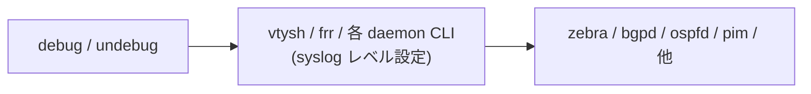

# debug / undebug コマンド群

## 概要

[SONiC](../../reference/glossary.md#term-sonic) の `debug` および `undebug` コマンドは、`config` / `show` とは別の独立した Click root として実装される (`debug = debug.main:cli`、`undebug = undebug.main:cli`)[^1]。

対象は主に **[FRR](../../reference/glossary.md#term-frr) ([BGP](../../reference/glossary.md#term-bgp) / [zebra](../../reference/glossary.md#term-zebra))** と **STP (`stpctl`)** の動的デバッグスイッチで、いずれも実体は `vtysh` または `stpctl` のラッパー。[CONFIG_DB](../../reference/glossary.md#term-config_db) は触らず、対象プロセスの runtime ログレベルや trace を切り替えるだけ。`undebug` は `debug` のミラーで、各 `debug ...` コマンドに対応する `no debug ...` を [vtysh](../../reference/glossary.md#term-vtysh) に投げる。

`debug.main` は **import 時に `sudo vtysh -c 'show version'` を実行して [FRR](../../reference/glossary.md#term-frr) か Quagga かを判定**し、コマンドツリーを動的に切り替える点が特徴的[^2]。本ドキュメントでは現役の [FRR](../../reference/glossary.md#term-frr) ブランチを中心に記述する。

## コマンド一覧

### `debug bgp` (FRR)

| コマンド | [vtysh](../../reference/glossary.md#term-vtysh) 経由で実行されるコマンド |
|---------|--------------------------------|
| `debug bgp allow-martians` | `debug bgp allow-martians` |
| `debug bgp as4 [segment]` | `debug bgp as4 [segment]` |
| `debug bgp bestpath <prefix>` | `debug bgp bestpath <prefix>` |
| `debug bgp keepalives [<prefix_or_iface>]` | `debug bgp keepalives [..]` |
| `debug bgp neighbor-events [<prefix_or_iface>]` | `debug bgp neighbor-events [..]` |
| `debug bgp nht` | `debug bgp nht` |
| `debug bgp pbr [error]` | `debug bgp pbr [error]` |
| `debug bgp update-groups` | `debug bgp update-groups` |
| `debug bgp updates [in\|out\|prefix] [<prefix>]` | `debug bgp updates [..]` |
| `debug bgp zebra [<prefix>]` | `debug bgp zebra [prefix <prefix>]` |

prefix 引数は `^[A-Za-z0-9.:/]*$` の正規表現でバリデートされ、不正値は `sys.exit('Prefix contains only number, alphabet, period, colon, and forward slash')`[^3]。

### `debug zebra` (FRR)

| コマンド | [vtysh](../../reference/glossary.md#term-vtysh) コマンド |
|---------|----------------|
| `debug zebra dplane [detailed]` | `debug zebra dplane [detailed]` |
| `debug zebra events` | `debug zebra events` |
| `debug zebra fpm` | `debug zebra fpm` |
| `debug zebra kernel` | `debug zebra kernel` |
| `debug zebra nht` | `debug zebra nht` |
| `debug zebra packet` | `debug zebra packet` |
| `debug zebra rib [detailed]` | `debug zebra rib [detailed]` |
| `debug zebra vxlan` | `debug zebra vxlan` |

### `debug spanning_tree` (`debug stp` 兼用)

| コマンド | 内部コマンド |
|---------|--------------|
| `debug spanning_tree` | `sudo stpctl dbg enable` |
| `debug spanning_tree dump global` | `sudo stpctl global` |
| `debug spanning_tree dump vlan <vlan_id>` | `sudo stpctl vlan <vlan_id>` |
| `debug spanning_tree dump interface <vlan_id> <if>` | `sudo stpctl port <vlan_id> <if>` |

### `debug muxcable` (Dual-ToR)

current の `debug.main` ツリーには `bgp` / `zebra` / `spanning_tree` のみが組み込まれている。Dual-ToR 関連の muxcable に対するデバッグ操作は `config muxcable` 配下に `hwmode state` / `prbs` / `loopback` 等として置かれている (CLI ツリー上は `debug` ではなく `config` 名前空間)。実装上、`debug` Click root には muxcable サブグループは追加されておらず、本ページではその点を明示する。

## `undebug` 側

`undebug` は `debug` と同じツリー構造で、各コマンドが対応する `no debug ...` を vtysh に発行する。例:

- `undebug bgp keepalives` → `vtysh -c "no debug bgp keepalives"`
- `undebug zebra rib detailed` → `vtysh -c "no debug zebra rib detailed"`

実装も `undebug/main.py` で同様に `vtysh -c 'show version'` で FRR/Quagga 判定する形態。

## 各コマンドの詳細 (一部)

### `debug bgp updates [in|out|prefix] [<prefix>]`

引数 `direction` は `click.Choice(['in', 'out', 'prefix'])` で、3 番目を選んだ場合に `<prefix>` を併用する。`prefix` は前述の正規表現バリデーション。生成される vtysh 文字列は引数によって `debug bgp updates`, `debug bgp updates in 10.0.0.0/8`, `debug bgp updates prefix fe80::/10` 等。

### `debug spanning_tree`

サブコマンド無しで実行すると `sudo stpctl dbg enable` を起動し、`stpd` / `stpmgrd`（docker-stp の critical_processes に登録されている 2 プロセス）のデバッグ出力を有効化する。`dump global` / `vlan` / `interface` は内部状態のスナップショット表示。

## 注意

- `debug.main` の **import 時に `subprocess.check_output(['sudo', 'vtysh', '-c', 'show version'])` が走る**。これは tab 補完のような副次的な呼び出しでも実行されるため、bgp コンテナが起動していない環境で `debug` コマンドの help を見るだけでもエラーで終了する場合がある。
- `debug` の効果は **プロセス再起動で消える**。永続化したい場合は FRR 側 (`/etc/frr/frr.conf` 内 `debug ...` 行) に書く運用となる。
- Quagga ブランチ (legacy) のコマンド集合は FRR ブランチと部分的に異なる (`debug bgp filters` / `fsm` などは Quagga のみ)。`vtysh -c 'show version'` で判定するため、現役 [SONiC](../../reference/glossary.md#term-sonic) では FRR 経路のみが効く。

<!-- cli-mermaid -->
### データフロー (手動作成)

!!! note "凡例"
    debug 系 (CLI → vtysh/daemon CLI → 各 daemon) のミニ図。CONFIG_DB を直接介さないコマンドのため手動で記述。
<!-- /cli-mermaid -->

<!-- ref-triangle:start -->

## 関連リファレンス

- (関連リンクなし)

<!-- ref-triangle:end -->

## 引用元

[^1]: `setup.py` の entry point `'debug = debug.main:cli'` / `'undebug = undebug.main:cli'`、および `data_files` への登録。<https://github.com/sonic-net/sonic-utilities/blob/39732bceb8bdefe706518ab40623bbbba6ff33b9/setup.py>

[^2]: `debug.main` の import 時 FRR 判定 (`debug/main.py` L31-L32)。<https://github.com/sonic-net/sonic-utilities/blob/39732bceb8bdefe706518ab40623bbbba6ff33b9/debug/main.py#L31>

[^3]: prefix バリデーション (`debug/main.py` L30 + L60-L63 etc.)。<https://github.com/sonic-net/sonic-utilities/blob/39732bceb8bdefe706518ab40623bbbba6ff33b9/debug/main.py#L30>

<!-- glossary-links-injected: 4184f5fdb3c1 -->
