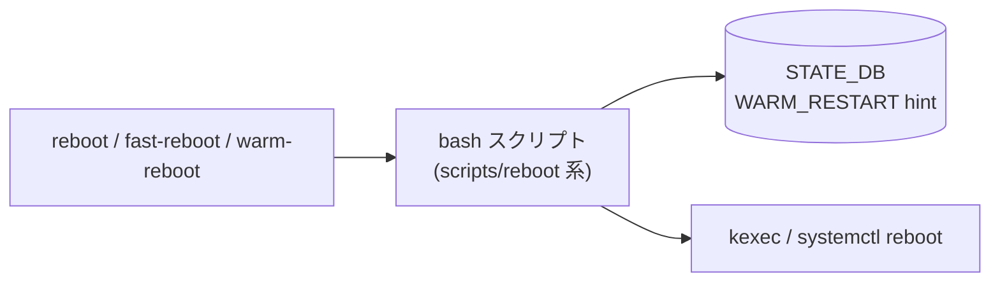

# reboot / fast-reboot / warm-reboot コマンド

## 概要

[SONiC](../../reference/glossary.md#term-sonic) の再起動コマンドは Click ベースではなく **bash スクリプト** として実装されており、`sonic-utilities/scripts/` 配下に置かれる。本ページは以下の 3 系統を一括して扱う:

- **`reboot`** ... 通常 (cold) reboot。`scripts/reboot`
- **`fast-reboot`** ... fast-reboot。`scripts/fast-reboot`
- **`warm-reboot`** ... warm-reboot。**`fast-reboot` への symlink** であり、起動時の `$0` (= `REBOOT_SCRIPT_NAME`) によって warm モードに分岐する[^1]

3 つとも `setup.py` の `data_files` で `/usr/local/bin/` 配下にインストールされる[^2]。

## 共通の動作概要

- `vmcore` (前回の kernel panic dump) があれば、そのまま再 reboot して OS を起動するだけのリカバリ経路に入る (`reboot` script 冒頭)。
- `sonic-cfggen` で platform / asic_type / subtype / asan を取得し、platform-specific な `platform_reboot` / `platform_reboot_pre_check` バイナリを呼び出せるようにする。
- `sonic-installer verify-next-image` で次回 boot 用イメージを検証 (失敗時 `EXIT_SONIC_INSTALLER_VERIFY_REBOOT=21` で終了)。

## `reboot` (cold)

### 用法

```text
reboot [-h|-?] [-v] [-f] [-d <DPU>] [-p] [-b]
```

### オプション (`getopts "h?vfpd:b"`)[^3]

| オプション | 用途 |
|-----------|------|
| `-h` / `-?` | ヘルプ表示 |
| `-v` | verbose (詳細ログ + blocking モードでは進捗ドット出力) |
| `-f` | 内部 reboot コマンドに `-f` を引き継ぐ (force) |
| `-d <DPU>` | smart switch の特定 [DPU](../../reference/glossary.md#term-dpu) module 名を指定して [DPU](../../reference/glossary.md#term-dpu) だけ reboot |
| `-p` | [DPU](../../reference/glossary.md#term-dpu) 上での pre-shutdown 段階 |
| `-b` | blocking モード (タイムアウト 180 秒) |

### 動作

1. `reboot_pre_check` … `/host` の書込みテスト、platform pre-check、`sonic-installer verify-next-image`。
2. `check_conflict_boot_in_fw_update` … FW auto update が他種 reboot に予約済みでないことを確認。
3. `linecard_reboot_notify_supervisor` … chassis のラインカードの場合、CHASSIS_STATE_DB に `reboot=expected` を書いてスーパーバイザに通知。
4. `stop_sonic_services` … DualToR なら `mux` を停止、[syncd](../../reference/glossary.md#term-syncd) を `syncd_request_shutdown --cold` でクリーンシャットダウン、PMon を停止。
5. platform-specific `platform_reboot` を `exec` する。存在しない場合は `/sbin/reboot`、それでもダメなら `echo b > /proc/sysrq-trigger`。

`reboot` は **データプレーン断絶を伴う通常の電源再投入**。[BGP](../../reference/glossary.md#term-bgp) / [LACP](../../reference/glossary.md#term-lacp) セッションも一旦落ちる。

## `fast-reboot`

### 用法

```text
fast-reboot [-h|-?] [-v] [-f] [-i] [-d] [-r|-k] [-x] [-c <ip_list>] [-s] [-D] [-u] [-n|-N] [-m <asic_list>]
```

### オプション (`getopts "vfidh?rkxc:sDunNm:"`)[^4]

| オプション | 用途 |
|-----------|------|
| `-h` / `-?` | ヘルプ |
| `-v` | verbose |
| `-f` | Orchagent RESTARTCHECK の失敗を無視 |
| `-i` | [ASIC](../../reference/glossary.md#term-asic) MD5 検証を無視 |
| `-d` | DB integrity check を無視 |
| `-r` | `/sbin/reboot` で再起動 |
| `-k` | `/sbin/kexec -e` (デフォルト) |
| `-x` | スクリプトを `set -x` で実行 |
| `-c <ip_list>` | control plane assistant (CPA) IP リスト |
| `-s` | strict モード (CPA リスト無しでは進めない) |
| `-t` | kube image を `latest` タグ付けしない (注: `getopts` 文字列に含まれず実際は無効。コードコメントに `TODO "t" is missing` あり) |
| `-D` | detached モード (端末切断で reboot を中断しない) |
| `-u` | boot オプションに ssd-upgrader-part を含める |
| `-n` | peer device に [SONiC](../../reference/glossary.md#term-sonic) retry-count 機能を要求しない (デフォルト) |
| `-N` | peer device に retry-count 機能を要求する |
| `-m <list>` | カンマ区切り [ASIC](../../reference/glossary.md#term-asic) 番号を warm-reboot 対象から除外 (multi-[ASIC](../../reference/glossary.md#term-asic) 専用) |

### 動作

`kexec` ベースで kernel を切り替えてダウンタイムを数秒〜十数秒に抑える。warm 系とは異なり data plane / control plane も停止するが、[syncd](../../reference/glossary.md#term-syncd) の DB を保存して新カーネル起動後に `wb` 復元する経路を持つ。

## `warm-reboot`

`fast-reboot` への symlink。スクリプト先頭で `REBOOT_SCRIPT_NAME=$(basename $0)` を取り、`warm-reboot` の場合は warm モード (`pre-shutdown` / `request_pre_shutdown` / `init_warm_reboot_states` / data plane を保ったままの `kexec`) に分岐する[^5]。

オプションは `fast-reboot` と共通。warm-specific な制御 (`-m` での ASIC スキップ、`-N` での peer 検査強化など) も同じ getopts で受け付ける。

### warm-reboot で増える動作

- `initialize_pre_shutdown` … [syncd](../../reference/glossary.md#term-syncd) / [orchagent](../../reference/glossary.md#term-orchagent) に warm-shutdown 準備を要求。
- `request_pre_shutdown` + `wait_for_pre_shutdown_complete_or_fail` … pre-shutdown ACK を 待つ。
- `setup_control_plane_assistant` … `-c` で指定された外部 CPA に対して [ARP](../../reference/glossary.md#term-arp)/ND を打ち、データ平面のスチール先 (黒穴) を作って fail-open を防ぐ。
- `backup_database` … [STATE_DB](../../reference/glossary.md#term-state_db) / [APPL_DB](../../reference/glossary.md#term-appl_db) のスナップショット保存 (warm boot 時の差分 reconcile 用)。
- 失敗時 `clear_boot` で `kexec -u -a` を呼んで kexec slot を解放し、CPA も撤去する。

## 終了コード

| 値 | 意味 |
|----|------|
| 0 | 成功 |
| 1 | 一般エラー |
| 2 | timeout |
| 4 | 次回 boot イメージが存在しない (`EXIT_NEXT_IMAGE_NOT_EXISTS`) |
| 21 | `sonic-installer verify-next-image` 失敗 (`EXIT_SONIC_INSTALLER_VERIFY_REBOOT`) |
| 22 | platform FW auto-update reboot 失敗 (`EXIT_PLATFORM_FW_AU_FAILURE`) |

## 注意

- `warm-reboot` で [BGP](../../reference/glossary.md#term-bgp) セッションを保持するには **GR ([Graceful Restart](../../reference/glossary.md#term-graceful-restart)) が peer 側で有効** なことが前提。
- `fast-reboot` / `warm-reboot` は **data plane traffic loss** をゼロにするものではない。[SONiC](../../reference/glossary.md#term-sonic) 標準実装でも数秒〜数百ミリ秒の packet drop は出る。`-c` の CPA 構成と GR をきちんと組まないと L3 セッションが切れる。
- chassis (multi-asic + supervisor + linecard) では `reboot` が CHASSIS_STATE_DB に通知を出すため、ラインカード単独 reboot とシステム全体 reboot で挙動が変わる。

<!-- ref-triangle:start -->

## 関連リファレンス

- (関連リンクなし)

<!-- ref-triangle:end -->

## 引用元

[^1]: `warm-reboot` は `fast-reboot` への symlink (`scripts/warm-reboot -> fast-reboot`)。スクリプト中で `REBOOT_SCRIPT_NAME=$(basename $0)` を分岐に使う。<https://github.com/sonic-net/sonic-utilities/blob/39732bceb8bdefe706518ab40623bbbba6ff33b9/scripts/warm-reboot>

[^2]: `setup.py` の `data_files` に 3 つとも登録 (`scripts/reboot`, `scripts/fast-reboot`, `scripts/warm-reboot`)。

[^3]: `reboot` の `parse_options` (`scripts/reboot` L205-L234) と `show_help_and_exit` (L145-L159)。<https://github.com/sonic-net/sonic-utilities/blob/39732bceb8bdefe706518ab40623bbbba6ff33b9/scripts/reboot#L205>

[^4]: `fast-reboot` の `parseOptions` (`scripts/fast-reboot` L253-L307) と `showHelpAndExit` (L229-L251)。<https://github.com/sonic-net/sonic-utilities/blob/39732bceb8bdefe706518ab40623bbbba6ff33b9/scripts/fast-reboot#L229>

[^5]: warm 専用の補助関数 `initialize_pre_shutdown` / `request_pre_shutdown` / `wait_for_pre_shutdown_complete_or_fail` (`scripts/fast-reboot` L385-L449)。

<!-- usage-example -->
## 実行例

### 典型的な使い方

```bash
# 例 1: 通常 reboot
sudo reboot
```

### よくある引数の組み合わせ

```bash
# Fast-reboot（control-plane のみ短時間ダウン）
sudo fast-reboot

# Warm-reboot（データプレーン無停止再起動）
sudo warm-reboot

# 再起動前に warm restart モードを有効化（必要なら）
sudo config warm_restart enable
```

### 期待される出力 (抜粋)

```text
Stopping bgp ...
Backing up database ...
Warm reboot ...
```
<!-- /usage-example -->

<!-- cli-mermaid -->
### データフロー (手動作成)



!!! note "凡例"
    再起動系 (CLI → スクリプト → STATE_DB / kexec) のミニ図。CONFIG_DB を直接介さないコマンドのため手動で記述。
<!-- /cli-mermaid -->

<!-- topics-back-ref -->
## 関連 Topics

- [Topics: Reboot / Upgrade / Lifecycle](../../topics/11-reboot/index.md)

<!-- /topics-back-ref -->

<!-- ops-hint -->
## 運用ヒント

### 典型的な利用シーン

- メンテナンスでのソフト再起動（fast / warm）の選択。
- warm-restart 有効時のサービス継続再起動。

### よくある落とし穴

- warm-reboot 中に [CONFIG_DB](../../reference/glossary.md#term-config_db) を変更すると整合が崩れて再起動失敗する。
- fast-reboot は kernel まで再起動するため通信断は数十秒発生する。

### 関連する show / debug

```bash
show reboot-cause
show warm_restart state
journalctl -u warm-reboot -b -0
```
<!-- /ops-hint -->

<!-- glossary-links-injected: 8de83b4fd2a7 -->
