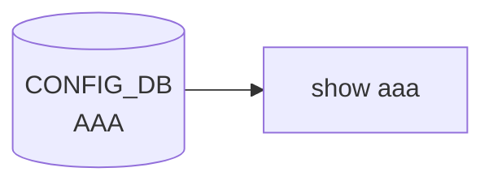

# show aaa サブコマンド

## 概要

`show aaa` は [CONFIG_DB](../../reference/glossary.md#term-config_db) の **`AAA` テーブル**を読み、`authentication` / `authorization` / `accounting` 各機能の現在値（または default 値）を行ごとに表示する click コマンド[^1]。`show tacacs` / `show radius` とセットで運用する。

## シグネチャ

```bash
show aaa
```

引数・オプションなし。

## 動作

1. `db.cfgdb.get_table('AAA')` で `AAA` テーブルを取得。
2. 内部に以下のデフォルト辞書を用意:

   ```python
   aaa = {
       'authentication': {
           'login':       'local (default)',
           'failthrough': 'False (default)',
       },
       'authorization': {
           'login': 'local (default)',
       },
       'accounting': {
           'login': 'disable (default)',
       },
   }
   ```

3. [CONFIG_DB](../../reference/glossary.md#term-config_db) 側に `authentication` / `authorization` / `accounting` 各 row があれば、それで上記辞書を `update()` で上書き。
4. `AAA <function> <key> <value>` の形式で 1 行ずつ `click.echo()` する。

例:

```text
AAA authentication login tacacs+,local
AAA authentication failthrough True
AAA authorization login tacacs+
AAA accounting login tacacs+
```

[CONFIG_DB](../../reference/glossary.md#term-config_db) に該当キーが無ければ `(default)` 表記のまま出る（実装上、上書きされなかった項目に対しては default 文字列がそのまま残る）。

## CONFIG_DB との接点

| テーブル | キー | 説明 |
|---|---|---|
| `AAA` | `authentication` / `authorization` / `accounting` | `login` / `failthrough` などの値を保持。`config aaa` 系コマンドで書き込まれる |

書き込み側は `config/aaa.py` 経由。実サーバ定義は `TACPLUS` / `TACPLUS_SERVER` / `RADIUS` / `RADIUS_SERVER` 等の別テーブルにあり、それぞれ `show tacacs` / `show radius` で表示する。

<!-- cli-mermaid -->
### データフロー (自動生成)



!!! note "凡例"
    show 系 (CONFIG_DB → CLI) のミニ図。テーブル → daemon 対応は `docs/reference/config-db-orch-map.md` から機械生成。
<!-- /cli-mermaid -->

<!-- ref-triangle:start -->

## 関連リファレンス

- [YANG](../../reference/glossary.md#term-yang): `sonic-system-aaa`
- CONFIG_DB: [`AAA`](../config-db/aaa.md)

<!-- ref-triangle:end -->

## 引用元

[^1]: `aaa()` コマンドの実装は `show/main.py` L2269-L2299。<https://github.com/sonic-net/sonic-utilities/blob/39732bceb8bdefe706518ab40623bbbba6ff33b9/show/main.py#L2269>

<!-- ops-hint -->
## 運用ヒント

### 典型的な利用シーン

- [AAA](../../reference/glossary.md#term-aaa) login / authorization / accounting の現状確認。
- TACACS+ / RADIUS との連携検証。

### よくある落とし穴

- `local` を fallback に含めないと [AAA](../../reference/glossary.md#term-aaa) server 不達時に全員ログインできなくなる。
- TACACS+ 共有鍵が syslog に出力されてしまう古いビルドあり。

### 関連する show / debug

```bash
show aaa
show tacacs
show radius
```
<!-- /ops-hint -->

<!-- cli-sibling -->
### 関連 CLI コマンド

- [`config aaa`](config-aaa.md) — config aaa / tacacs / radius サブコマンド
- [`config acl`](config-acl.md) — config acl サブコマンド
- [`config ssh`](config-ssh.md) — config ssh サブコマンド
- [`show acl`](show-acl.md) — show acl サブコマンド

<!-- /cli-sibling -->

<!-- glossary-links-injected: 5b719dba66a4 -->
