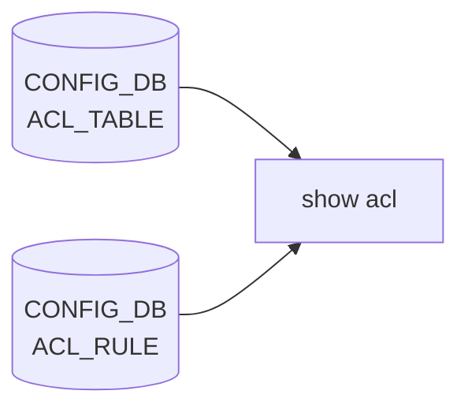

# show acl サブコマンド

## 概要

`show acl` は [ACL](../../reference/glossary.md#term-acl) テーブルとルールの一覧表示専用サブグループ。**実装は `acl-loader show ...` の薄いラッパ**で、[CONFIG_DB](../../reference/glossary.md#term-config_db) の読み出しは `acl-loader` 側が行う[^1]。

## コマンド一覧

| コマンド | 用途 |
|---------|------|
| `show acl table [<table_name>]` | ACL_TABLE テーブル一覧。`<table_name>` 指定で 1 件のみ |
| `show acl rule [<table_name> [<rule_id>]]` | ACL_RULE 一覧。table / rule で絞り込み可能 |

## 各コマンドの詳細

### `show acl table [<table_name>] [--verbose]`

**動作**:
`acl-loader show table [<table_name>]` を起動。出力列は acl-loader が決める:

- `Name` ... ACL_TABLE のキー
- `Type` ... `L3`, `L3V6`, `MIRROR`, `MIRROR_DSCP`, `CTRLPLANE` 等
- `Binding` ... ports カラム（`PORT`, `PORTCHANNEL`, `Vlan*` 等）
- `Description` ... `policy_desc`
- `Stage` ... `ingress` / `egress`

### `show acl rule [<table_name>] [<rule_id>] [--verbose]`

**動作**:
`acl-loader show rule [<table_name>] [<rule_id>]` を起動。引数の順序が固定で、`rule_id` のみで絞ることはできない（先に table_name を渡す必要がある）。出力は table / rule / priority / action / match条件のカラム形式。

## 関連する CONFIG_DB

| テーブル | 表示するコマンド |
|----------|------------------|
| `ACL_TABLE` | `table` |
| `ACL_RULE` | `rule` |

## 注意点

- **set / counter / history 系のサブコマンドは `show acl` 配下に存在しない**。[ACL](../../reference/glossary.md#term-acl) カウンタは `aclshow` という別ユーティリティ（`show/main.py` から `aclshow` コマンドに直接バインド）で取得する設計
- ルール定義の入力側 (`config acl update full`) と表示側 (`show acl rule`) は両方とも `acl-loader` を経由する一貫した設計

<!-- ref-triangle:start -->

## 関連リファレンス

- [CONFIG_DB](../../reference/glossary.md#term-config_db): [`ACL_TABLE`](../config-db/acl-table.md) / [`ACL_RULE`](../config-db/acl-rule.md)

<!-- ref-triangle:end -->

## 引用元

[^1]: `acl` グループ全体は `show/acl.py` で定義。table / rule の 2 コマンドのみで、本体ロジックは `acl-loader` ユーティリティ（別パッケージ）に委譲。<https://github.com/sonic-net/sonic-utilities/blob/39732bceb8bdefe706518ab40623bbbba6ff33b9/show/acl.py>

<!-- cli-sibling -->
### 関連 CLI コマンド

- [`config acl`](config-acl.md) — config acl サブコマンド

<!-- /cli-sibling -->

## 関連ページ
- [HLD: ACL の基本設計](../../acl-qos/acl-support-in-sonic.md)
- [CLI: config acl](config-acl.md)
- [CONFIG_DB: ACL_TABLE](../config-db/acl-table.md)
- [CONFIG_DB: ACL_RULE](../config-db/acl-rule.md)

<!-- usage-example -->
## 実行例

### 典型的な使い方

```bash
# 例 1: ACL テーブル一覧
show acl table
```

### よくある引数の組み合わせ

```bash
show acl rule
show acl rule DATA_ACL
```

### 期待される出力 (抜粋)

```text
Name      Type    Binding              Description              Stage
--------  ------  -------------------  -----------------------  -------
DATA_ACL  L3      Ethernet0,Ethernet4  Data plane ingress ACL   ingress
```
<!-- /usage-example -->

<!-- cli-mermaid -->
### データフロー (自動生成)



!!! note "凡例"
    show 系 (CONFIG_DB → CLI) のミニ図。テーブル → daemon 対応は `docs/reference/config-db-orch-map.md` から機械生成。
<!-- /cli-mermaid -->

<!-- topics-back-ref -->
## 関連 Topics

- [Topics: ACL / CoPP / Mirror / Packet Action](../../topics/07-acl-copp-mirror/index.md)

<!-- /topics-back-ref -->

<!-- glossary-links-injected: 31c264e58317 -->
