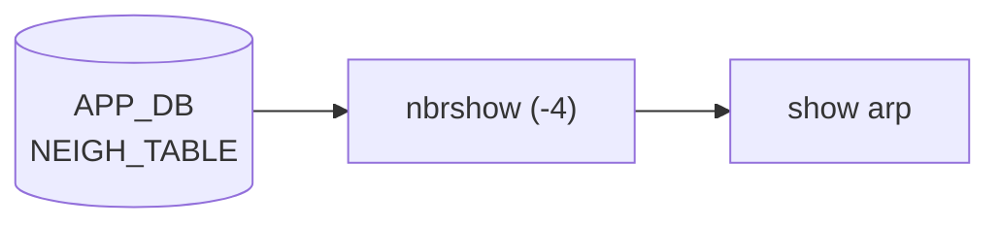

# show arp サブコマンド

## 概要

`show arp` は IPv4 の **隣接テーブル（[ARP](../../reference/glossary.md#term-arp) テーブル）**を表示する click コマンド。実装は単なる薄いラッパで、内部では `scripts/nbrshow` を `-4` 付きで起動する[^1]。`nbrshow` 側が [APPL_DB](../../reference/glossary.md#term-appl_db) の `NEIGH_TABLE` と kernel の `ip neigh` 出力を突き合わせて表形式に整形する。

## シグネチャ

```bash
show arp [<ipaddress>] [-if <iface>] [-n <namespace>] [-d <display>] [--verbose]
```

| オプション | 意味 |
|---|---|
| `<ipaddress>` (positional, optional) | 1 エントリのみ絞り込む IPv4 アドレス |
| `-if`, `--iface` | インタフェース名でフィルタ。`alias` モード時は `iface_alias_converter.alias_to_name()` で内部名へ変換 |
| `-n`, `--namespace` | multi-ASIC 時の namespace 指定（`multi_asic_click_options` 由来） |
| `-d`, `--display` | `all` / `frontend` 等の display スコープ |
| `--verbose` | 起動する `nbrshow` コマンド文字列を echo |

## 起動コマンド

```python
cmd = ['nbrshow', '-4']
if ipaddress: cmd += ['-ip', str(ipaddress)]
if iface:     cmd += ['-if', str(iface)]      # alias 名は内部名に変換
if namespace: cmd += ['-n', str(namespace)]
cmd += ['-d', str(display)]
```

`nbrshow` 自体は Python スクリプトで、`scripts/nbrshow` に置かれている。

## 別名と関連

`show ip arp` も同じ `arp` コマンドを `show ip` グループに `add_command` した結果として動く（cli 直下と `ip` サブ両方に同じ関数が登録される）。

クリア側は `sonic-clear arp [<ipaddress>] [-n <ns>]` が対称。詳細は [clear (sonic-clear) コマンド](clear.md) を参照。

## CONFIG_DB との接点

[ARP](../../reference/glossary.md#term-arp) テーブルは **kernel の neighbor table**（および swss/[neighsyncd](../../reference/glossary.md#term-neighsyncd) 経由で [APPL_DB](../../reference/glossary.md#term-appl_db) の `NEIGH_TABLE` に同期）で管理されるため、`show arp` 自体は [CONFIG_DB](../../reference/glossary.md#term-config_db) を読まない。

<!-- cli-mermaid -->
### データフロー (自動生成)



!!! note "凡例"
    show 系 (データソース → ラッパスクリプト → CLI) のミニ図。CONFIG_DB は経由しない。
<!-- /cli-mermaid -->

<!-- ref-triangle:start -->

## 関連リファレンス

- (関連リンクなし)

<!-- ref-triangle:end -->

## 引用元

[^1]: `arp` の click 定義と `nbrshow -4` 起動部分は `show/main.py` L421-L446。<https://github.com/sonic-net/sonic-utilities/blob/39732bceb8bdefe706518ab40623bbbba6ff33b9/show/main.py#L421>


<!-- usage-example -->
## 実行例

### 典型的な使い方

```bash
# 例 1: ARP テーブル表示
show arp
```

### よくある引数の組み合わせ

```bash
show arp 10.0.0.1
show arp -if Ethernet0
# VRF 別の ARP は kernel コマンドで取得（show arp 自体には -vrf / -V オプションはない）
ip neigh show vrf Vrf_Red
```

### 期待される出力 (抜粋)

```text
Address         MacAddress         Iface         Vlan
--------------  -----------------  ------------  ----
10.0.0.1        00:11:22:33:44:55  Ethernet0     -
10.0.0.5        00:11:22:33:44:66  Ethernet4     -
Total number of entries 2
```
<!-- /usage-example -->

<!-- ops-hint -->
## 運用ヒント

### 典型的な利用シーン

- L3 隣接の MAC 解決状況、aging 状態の確認。
- MC-[LAG](../../reference/glossary.md#term-lag) / VRRP 構成での [ARP](../../reference/glossary.md#term-arp) 同期検証。

### よくある落とし穴

- `show arp` は default [VRF](../../reference/glossary.md#term-vrf) のみ。[VRF](../../reference/glossary.md#term-vrf) 内 ARP を見るオプション (`-vrf` / `-V`) は arp コマンドには存在しないため、`ip neigh show vrf <vrf>` を使う。
- [STATE_DB](../../reference/glossary.md#term-state_db) の NEIGH_TABLE と kernel ARP がズレる場合あり。両方で裏取り。

### 関連する show / debug

```bash
show arp
ip neigh show
sonic-db-cli APPL_DB keys 'NEIGH_TABLE:*'
```
<!-- /ops-hint -->

<!-- cli-sibling -->
### 関連 CLI コマンド

- [`config bgp`](config-bgp.md) — config bgp サブコマンド
- [`config default route`](config-default-route.md) — config default-route（デフォルトルート設定パターン）
- [`config route`](config-route.md) — config route サブコマンド（static route）
- [`config vrf`](config-vrf.md) — config vrf サブコマンド
- [`show bfd`](show-bfd.md) — show bfd サブコマンド

<!-- /cli-sibling -->

<!-- glossary-links-injected: 2a3b0952d27c -->
