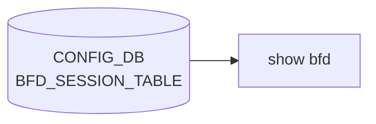

# show bfd サブコマンド

## 概要

`show bfd` は [BFD](../../reference/glossary.md#term-bfd) (Bidirectional Forwarding Detection) セッションの状態を表示するグループ。データ源は **[STATE_DB](../../reference/glossary.md#term-state_db)** の `BFD_SESSION_TABLE|<vrf>|<interface>|<peer>` であり、[CONFIG_DB](../../reference/glossary.md#term-config_db) ではない[^1]。[BFD](../../reference/glossary.md#term-bfd) セッションは [BGP](../../reference/glossary.md#term-bgp) や static route との連動で動的に生成・破棄されるため、状態は [STATE_DB](../../reference/glossary.md#term-state_db) のみが正となる。

## コマンド一覧

| コマンド | 用途 |
|---------|------|
| `show bfd summary` | 全 [BFD](../../reference/glossary.md#term-bfd) セッションの一覧 |
| `show bfd peer <peer_ip>` | 指定 peer IP のセッションのみ表示 |

## 各コマンドの詳細

### `show bfd summary`

**用法**:

```bash
show bfd summary [-n|--namespace <ns>]
```

**オプション**:

- `-n / --namespace` ... multi-[ASIC](../../reference/glossary.md#term-asic) 環境での namespace 指定（`multi_asic_namespace_validation_callback` で検証）

**動作**:
multi-[ASIC](../../reference/glossary.md#term-asic) 環境では `multi_asic.get_namespace_list()` を全走査、それ以外は `DEFAULT_NAMESPACE` のみ。各 namespace の [STATE_DB](../../reference/glossary.md#term-state_db) から `BFD_SESSION_TABLE|*` の全キーを列挙し、`local_discriminator` が無い場合は `NA` を補って表示する[^2]。

**表示カラム**:

```text
Peer Addr | Interface | Vrf | State | Type | Local Addr |
TX Interval | RX Interval | Multiplier | Multihop | Local Discriminator
```

key 構造: `BFD_SESSION_TABLE|<vrf>|<interface>|<peer_addr>`、splitting で `key_values[3]=peer`, `key_values[2]=interface`, `key_values[1]=vrf`。

<!-- evidence:
source: sonic-net/sonic-utilities/show/main.py#L2682-L2710 (sha: 39732bceb8bdefe706518ab40623bbbba6ff33b9)
excerpt: |
  @bfd.command()
  def summary(db, namespace):
      ...
      for ns in namespace_list:
          bfd_keys = db.db_clients[ns].keys(db.db.STATE_DB, "BFD_SESSION_TABLE|*")
          ...
          for key in bfd_keys:
              key_values = key.split('|')
              values = db.db_clients[ns].get_all(db.db.STATE_DB, key)
-->

<!-- evidence-rendered:start -->
??? note "📋 検証エビデンス: sonic-net/sonic-utilities/show/main.py#L2682-L2710 (sha: 39732bceb8bdefe706518ab40623bbbba6ff33b9)"

    **出典**:

    `sonic-net/sonic-utilities/show/main.py#L2682-L2710 (sha: 39732bceb8bdefe706518ab40623bbbba6ff33b9)`

    **抜粋**:

    ```text
    @bfd.command()
    def summary(db, namespace):
        ...
        for ns in namespace_list:
            bfd_keys = db.db_clients[ns].keys(db.db.STATE_DB, "BFD_SESSION_TABLE|*")
            ...
            for key in bfd_keys:
                key_values = key.split('|')
                values = db.db_clients[ns].get_all(db.db.STATE_DB, key)
    ```

<!-- evidence-rendered:end -->

### `show bfd peer <peer_ip>`

**用法**:

```bash
show bfd peer <peer_ip> [-n|--namespace <ns>]
```

**引数**:

- `<peer_ip>` ... 必須。表示対象 BFD peer の IP アドレス

**動作**:
`BFD_SESSION_TABLE|*|<peer_ip>` でフィルタリングして該当セッションのみ表示。同じ peer に対して複数 [VRF](../../reference/glossary.md#term-vrf) / interface のセッションが存在し得るため、複数行が返ることがある。該当セッションが無ければ `No BFD sessions found for peer IP <peer_ip>`。

## 関連する STATE_DB

| テーブル / key | フィールド |
|----------------|------------|
| `BFD_SESSION_TABLE|<vrf>|<interface>|<peer>` | `state`, `type`, `local_addr`, `tx_interval`, `rx_interval`, `multiplier`, `multihop`, `local_discriminator` |

## 補足

- BFD セッションの **生成・削除** は `show bfd` のスコープ外。[BGP](../../reference/glossary.md#term-bgp)/static route 側の設定や `bfdsyncd` の動作による
- `local_discriminator` は古い実装では存在しないため `NA` に置換するガードがある

!!! warning "software-BFD ピアが `show bfd summary` に表示されない (issue [#4139](https://github.com/sonic-net/sonic-utilities/issues/4139))"
    FRR の BGP neighbor で設定した software-BFD ピアはダイナミックに生成・削除されるが、`BFD_SESSION_TABLE` への書き込みは `bfdsyncd` が行う。実装の差異により、BGP 経由で生成した software-BFD セッションが `STATE_DB` に書かれないケースがある。`show bfd summary` が 0 件でも `vtysh -c "show bfd peer"` で確認できる場合は FRR 側のセッションであり正常。software-BFD の状態確認には `vtysh -c "show bfd peer"` を使うこと。

<!-- cli-mermaid -->
### データフロー (自動生成)



!!! note "凡例"
    show 系 (CONFIG_DB → CLI) のミニ図。テーブル → daemon 対応は `docs/reference/config-db-orch-map.md` から機械生成。
<!-- /cli-mermaid -->

<!-- ref-triangle:start -->

## 関連リファレンス

- [CONFIG_DB](../../reference/glossary.md#term-config_db): `BFD_SESSION_TABLE`

<!-- ref-triangle:end -->

## 引用元

[^1]: STATE_DB を参照する `db.db_clients[ns].keys(db.db.STATE_DB, "BFD_SESSION_TABLE|*")` のロジック。

[^2]: <https://github.com/sonic-net/sonic-utilities/blob/39732bceb8bdefe706518ab40623bbbba6ff33b9/show/main.py#L2672>

<!-- ops-hint -->
## 運用ヒント

### 典型的な利用シーン

- [BGP](../../reference/glossary.md#term-bgp)/Static の高速断検知で BFD セッションが UP しているかを確認する。
- 障害時に session state と TX/RX interval、multiplier を確認して片側設定漏れを検出する。

### よくある落とし穴

- `show bfd summary` は STATE_DB ベースで、[CONFIG_DB](../../reference/glossary.md#term-config_db) に session があっても peer 未到達なら DOWN のまま。
- multi-hop BFD は別グループ。`show bfd peer <ip> multihop` を使う必要がある。

### 関連する show / debug

```bash
show bfd summary
show bfd peer 10.0.0.1
sonic-db-cli STATE_DB keys 'BFD_SESSION_TABLE|*'
```
<!-- /ops-hint -->

<!-- cli-sibling -->
### 関連 CLI コマンド

- [`config bgp`](config-bgp.md) — config bgp サブコマンド
- [`config default route`](config-default-route.md) — config default-route（デフォルトルート設定パターン）
- [`config route`](config-route.md) — config route サブコマンド（static route）
- [`config vrf`](config-vrf.md) — config vrf サブコマンド
- [`show arp`](show-arp.md) — show arp サブコマンド

<!-- /cli-sibling -->

## 関連ページ

- [reference/CLI: show bgp](show-bgp.md)
- [reference/CLI: show ip](show-ip.md)

<!-- glossary-links-injected: e82be350a384 -->
