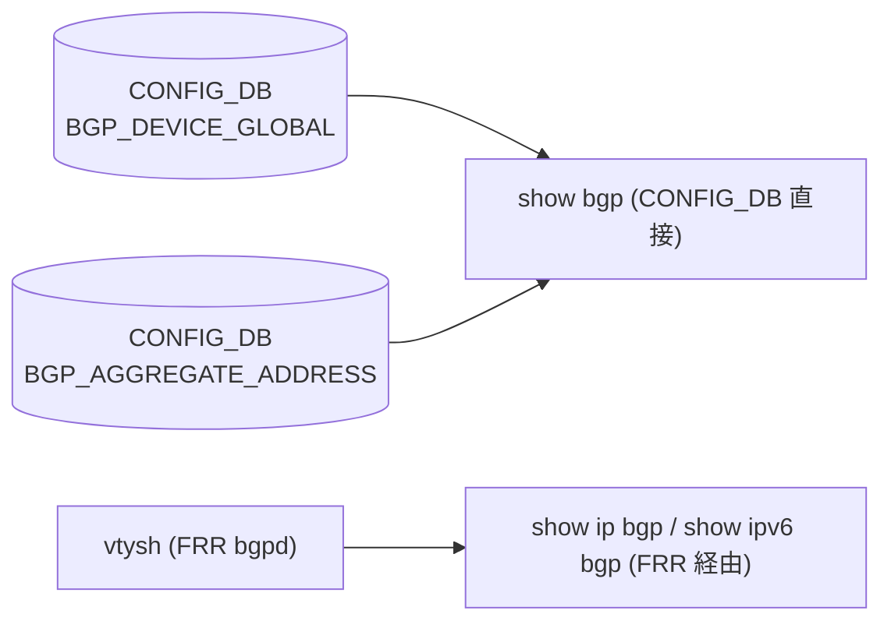

# show bgp / show ip bgp / show ipv6 bgp サブコマンド

## 概要

[BGP](../../reference/glossary.md#term-bgp) 状態表示用の CLI は **3 系統に分かれている**:

1. `show bgp ...` ... [CONFIG_DB](../../reference/glossary.md#term-config_db) の `BGP_DEVICE_GLOBAL` / `BGP_AGGREGATE_ADDRESS` を `show/bgp_cli.py` が直接 dump（[FRR](../../reference/glossary.md#term-frr) を経由しない）。
2. `show ip bgp ...` / `show ipv6 bgp ...` ... `show/bgp_frr_v4.py` / `bgp_frr_v6.py` が `vtysh -c "show ip bgp ..."` を内部実行して [FRR](../../reference/glossary.md#term-frr) の出力を整形。
3. `show running-configuration bgp` ... `show/main.py` が `vtysh -c "show running-config"` を実行（別ページ「show running-config」を参照）。

`show bgp` グループは `show/main.py` 末尾で `cli.add_command(bgp_cli.BGP)` の形で登録される[^1]ため、cli.json の機械抽出には現れない。本ページではこの隠れたサブグループを含めて整理する。

## コマンド一覧

### `show bgp ...` （CONFIG_DB 直接 dump、FRR 不経由）

| コマンド | 用途 |
|---------|------|
| `show bgp device-global [-j\|--json]` | TSA / W-[ECMP](../../reference/glossary.md#term-ecmp) の現在状態を [CONFIG_DB](../../reference/glossary.md#term-config_db) から表示 |
| `show bgp aggregate-address ipv4 [-j\|--json]` | IPv4 集約 prefix の設定一覧 |
| `show bgp aggregate-address ipv6 [-j\|--json]` | IPv6 集約 prefix の設定一覧 |

### `show ip bgp ...` / `show ipv6 bgp ...` （FRR 経由）

| コマンド | 用途 |
|---------|------|
| `show ip bgp summary [-n NS] [--display NS_OR_ALL]` | IPv4 [BGP](../../reference/glossary.md#term-bgp) セッションサマリ |
| `show ip bgp neighbors [<ipaddress>] [routes\|advertised-routes\|received-routes] [-n NS]` | 隣接情報 |
| `show ip bgp network [<ip\|prefix>] [bestpath\|json\|longer-prefixes\|multipath] [-n NS]` | RIB の prefix lookup |
| `show ip bgp aggregate-address` | bgp_cli の IPv4 aggregate 表示への shim |
| `show ip bgp vrf <vrf> summary` / `neighbors ...` / `network ...` | [VRF](../../reference/glossary.md#term-vrf) 配下の [BGP](../../reference/glossary.md#term-bgp) 情報（パラメータは default [VRF](../../reference/glossary.md#term-vrf) と同じ） |
| `show ipv6 bgp summary / neighbors / network / vrf ... ` | IPv6 版（IPv4 と同等の subcommand 体系） |

## 各コマンドの詳細

### `show bgp device-global [-j]`

`db.cfgdb.get_table(BGP_DEVICE_GLOBAL)['STATE']` を読み、`tsa_enabled` / `wcmp_enabled` を `to_str` で `Yes/No` 形式に変換して表示する。`--json` で `{"tsa": ..., "w-ecmp": ...}` の dict 出力。[CONFIG_DB](../../reference/glossary.md#term-config_db) に未設定なら `No configuration is present in CONFIG DB` と表示して exit 0[^2]。

<!-- evidence:
source: sonic-net/sonic-utilities/show/bgp_cli.py#L57-L130 (sha: 39732bceb8bdefe706518ab40623bbbba6ff33b9)
excerpt: |
  @BGP.command(name="device-global")
  def DEVICE_GLOBAL(ctx, db, json_format):
      ...
      table = db.cfgdb.get_table(CFG_BGP_DEVICE_GLOBAL)
      entry = table.get(BGP_DEVICE_GLOBAL_KEY, {})
-->

<!-- evidence-rendered:start -->
??? note "📋 検証エビデンス: sonic-net/sonic-utilities/show/bgp_cli.py#L57-L130 (sha: 39732bceb8bdefe706518ab40623bbbba6ff33b9)"

    **出典**:

    `sonic-net/sonic-utilities/show/bgp_cli.py#L57-L130 (sha: 39732bceb8bdefe706518ab40623bbbba6ff33b9)`

    **抜粋**:

    ```text
    @BGP.command(name="device-global")
    def DEVICE_GLOBAL(ctx, db, json_format):
        ...
        table = db.cfgdb.get_table(CFG_BGP_DEVICE_GLOBAL)
        entry = table.get(BGP_DEVICE_GLOBAL_KEY, {})
    ```

<!-- evidence-rendered:end -->

### `show bgp aggregate-address <ipv4|ipv6>`

`BGP_AGGREGATE_ADDRESS` テーブルから該当 family のエントリを抽出し、`bbr-required` / `summary-only` / `as-set` / `aggregate-address-prefix-list` / `contributing-address-prefix-list` をテーブル表示する。

### `show ip bgp summary [-n] [--display]`

`bgp_util.get_bgp_summary_from_all_bgp_instances(IPV4, namespace, display, vrf=default)` で各 namespace の `bgpd` から取得した summary を集約。multi-[ASIC](../../reference/glossary.md#term-asic) では `--display` が `frontend`（external 隣接）/ `all`（internal 隣接含む）を切り替える[^3]。

### `show ip bgp neighbors [<ipaddress>] [<info_type>]`

内部で `vtysh -c "show ip bgp vrf default neighbor [<ip> [routes|advertised-routes|received-routes]]"` を組み立てて [FRR](../../reference/glossary.md#term-frr) コンテナ内で実行する。引数の `<info_type>` は `<ipaddress>` を指定したときのみ意味を持つ。

`<ipaddress>` を指定すると `bgp_util.get_namespace_for_bgp_neighbor` が当該 IP を持つ namespace を逆引きし、`-n` の値と矛盾していれば警告して **実 namespace を優先** する。

### `show ip bgp network [<ip|prefix>] [<info_type>]`

`info_type` は `bestpath` / `json` / `longer-prefixes` / `multipath` の Choice。`longer-prefixes` は **prefix（`/` を含む）指定時のみ** 有効で、IP 単独で渡すと `Abort` する[^4]。chassis supervisor では `rexec all` 経由で全ライン カードで実行される。

### `show ip bgp vrf <vrf> {summary|neighbors|network}`

`vrf` を click context の親 group から取り出し、ヘルパに `vrf=<name>` を渡して default と同じパスを通す。VNet 名も [VRF](../../reference/glossary.md#term-vrf) として扱う。

### IPv6 (`show ipv6 bgp ...`)

`bgp_frr_v6.py` の構造は v4 と完全に対称で、内部で組み立てる FRR コマンドが `show ipv6 bgp ...` になるだけ。bestpath / longer-prefixes 等の制約も同じ。

## 内部呼び出し

| CLI | 内部実行 |
|------|----------|
| `show ip bgp summary` | `bgp_util.get_bgp_summary_from_all_bgp_instances` → `vtysh -c "show ip bgp vrf <vrf> summary json"` |
| `show ip bgp neighbors` | `vtysh -c "show ip bgp vrf <vrf> neighbor ..."` |
| `show ip bgp network` | `vtysh -c "show ip bgp vrf <vrf> [<prefix>] [<info_type>]"` |
| `show bgp device-global` | CONFIG_DB の `BGP_DEVICE_GLOBAL` 直接読み |
| `show bgp aggregate-address` | CONFIG_DB の `BGP_AGGREGATE_ADDRESS` 直接読み |

`vtysh` は **bgp コンテナ内の FRR と通信**するため、コンテナ起動前のタイミングではエラーになる。

## chassis supervisor の挙動

- `show ip bgp` 系の `network` 以外は、chassis supervisor で叩くと `rexec all -c "show ip bgp ..."` で全ライン カードに伝搬される[^5]。
- `network` だけは supervisor 上で直接実行できる。

## multi-ASIC オプション

- `-n / --namespace` ... 単一 namespace 名 (`asic0` 等) または `all`。
- `-d / --display` ... `frontend` / `all`。`frontend` は external 向けセッションのみ。

<!-- cli-mermaid -->
### データフロー (自動生成)



!!! note "凡例"
    `show bgp` は CONFIG_DB を直接読む。`show ip bgp` / `show ipv6 bgp` は vtysh 経由で FRR bgpd から取得する（CONFIG_DB は経由しない）。
<!-- /cli-mermaid -->

<!-- ref-triangle:start -->

## 関連リファレンス

- CONFIG_DB: [`BGP_DEVICE_GLOBAL`](../config-db/bgp-device-global.md) / [`BGP_AGGREGATE_ADDRESS`](../config-db/bgp-aggregate-address.md)

<!-- ref-triangle:end -->

## 引用元

[^1]: `show/main.py` 末尾で `cli.add_command(bgp_cli.BGP)`（`show/bgp_cli.py` の `BGP` group が `show bgp` として登録される）。<https://github.com/sonic-net/sonic-utilities/blob/39732bceb8bdefe706518ab40623bbbba6ff33b9/show/main.py>

[^2]: `show bgp device-global` 実装は `show/bgp_cli.py` L57-L130。<https://github.com/sonic-net/sonic-utilities/blob/39732bceb8bdefe706518ab40623bbbba6ff33b9/show/bgp_cli.py#L57>

[^3]: `bgp_frr_v4.py` の `summary_helper` (L160-L164) が `bgp_util.get_bgp_summary_from_all_bgp_instances` に `display` を渡す。

[^4]: `network_helper` の `longer-prefixes` 制約は `show/bgp_frr_v4.py` L225-L228。<https://github.com/sonic-net/sonic-utilities/blob/39732bceb8bdefe706518ab40623bbbba6ff33b9/show/bgp_frr_v4.py#L225>

[^5]: chassis supervisor 分岐は `bgp` group 関数（L23-L33）で `rexec` を呼ぶ。

<!-- usage-example -->
## 実行例

### 典型的な使い方

```bash
# 例 1: BGP セッションサマリ
show ip bgp summary
```

### よくある引数の組み合わせ

```bash
# VRF サマリ / IPv6 サマリ
show ip bgp vrf Vrf_Red summary
show ipv6 bgp summary

# 特定隣接の advertised / received routes
show ip bgp neighbors 10.0.0.1 advertised-routes
```

### 期待される出力 (抜粋)

```text
Neighbor        V     AS   MsgRcvd   MsgSent   TblVer  InQ OutQ  Up/Down State/PfxRcd
10.0.0.1        4  65100      1023      1019        0    0    0 01:25:34            128
10.0.0.5        4  65100       980       982        0    0    0 01:25:30            128
```
<!-- /usage-example -->

<!-- ops-hint -->
## 運用ヒント

### 典型的な利用シーン

- BGP セッションが UP しているか、prefix 学習数が想定どおりかをオペ監視で確認する。
- 障害切り分け時に隣接ステータス・received-routes・advertised-routes を順に追う。

### よくある落とし穴

- `show ip bgp summary` は default VRF のみで、VRF 設定がある場合は `show ip bgp vrf <name> summary` を使う。
- multi-[ASIC](../../reference/glossary.md#term-asic) 機種では `-n asic0` などで namespace を明示しないと一部 [ASIC](../../reference/glossary.md#term-asic) の状態が見えない。

### 関連する show / debug

```bash
show ip bgp summary
show ip bgp neighbors 10.0.0.1
show ip bgp network 10.0.0.0/24
```
<!-- /ops-hint -->

<!-- cli-sibling -->
### 関連 CLI コマンド

- [`config bgp`](config-bgp.md) — config bgp サブコマンド
- [`config default route`](config-default-route.md) — config default-route（デフォルトルート設定パターン）
- [`config route`](config-route.md) — config route サブコマンド（static route）
- [`config vrf`](config-vrf.md) — config vrf サブコマンド
- [`show arp`](show-arp.md) — show arp サブコマンド

<!-- /cli-sibling -->

## 関連ページ
- [HLD: FRR-BGP Unified Mgmt Framework](../../routing/sonic-frr-bgp-extended-unified-configuration-management-framework.md)
- [CLI: config bgp](config-bgp.md)
- [CONFIG_DB: BGP_NEIGHBOR](../config-db/bgp-neighbor.md)

<!-- glossary-links-injected: 8df9850464d2 -->
