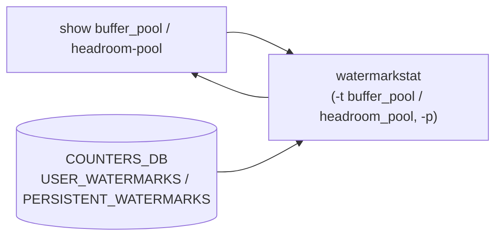

# show buffer_pool / headroom-pool サブコマンド

## 概要

`show buffer_pool` および `show headroom-pool` は [QoS](../../reference/glossary.md#term-qos) バッファプール / ヘッドルームプールの **watermark 統計** を表示するためのコマンドグループ。両グループは構造が完全に対称で、それぞれ `watermarkstat -t buffer_pool` / `watermarkstat -t headroom_pool` を呼び出す薄いラッパとして実装されている[^1]。[CONFIG_DB](../../reference/glossary.md#term-config_db) は読まず、[COUNTERS_DB](../../reference/glossary.md#term-counters_db) の watermark カウンタを `watermarkstat` 経由で取得する。

`show buffer` (= `show-buffer.md` で扱う `buffer_pool` 設定の表示) とは別の系統である点に注意。

## コマンド一覧

| コマンド | 用途 |
|---------|------|
| `show buffer_pool watermark` | バッファプールのユーザ WM（最後にクリアして以降の最大占有量） |
| `show buffer_pool persistent-watermark` | バッファプールの persistent WM（電源 OFF まで残る WM） |
| `show headroom-pool watermark` | ヘッドルームプールのユーザ WM |
| `show headroom-pool persistent-watermark` | ヘッドルームプールの persistent WM |

## 各コマンドの詳細

### `show buffer_pool watermark`

**用法**:

```bash
show buffer_pool watermark [-n|--namespace <ns>]
```

**動作**:
`watermarkstat -t buffer_pool` を実行。namespace 指定があれば `-n <ns>` を追加。

<!-- evidence:
source: sonic-net/sonic-utilities/show/main.py#L1119-L1132 (sha: 39732bceb8bdefe706518ab40623bbbba6ff33b9)
excerpt: |
  @buffer_pool.command('watermark')
  def wm_buffer_pool(namespace):
      command = ['watermarkstat', '-t', 'buffer_pool']
      if namespace is not None:
          command += ['-n', str(namespace)]
      run_command(command)
-->

<!-- evidence-rendered:start -->
??? note "📋 検証エビデンス: sonic-net/sonic-utilities/show/main.py#L1119-L1132 (sha: 39732bceb8bdefe706518ab40623bbbba6ff33b9)"

    **出典**:

    `sonic-net/sonic-utilities/show/main.py#L1119-L1132 (sha: 39732bceb8bdefe706518ab40623bbbba6ff33b9)`

    **抜粋**:

    ```text
    @buffer_pool.command('watermark')
    def wm_buffer_pool(namespace):
        command = ['watermarkstat', '-t', 'buffer_pool']
        if namespace is not None:
            command += ['-n', str(namespace)]
        run_command(command)
    ```

<!-- evidence-rendered:end -->

### `show buffer_pool persistent-watermark`

**動作**:
`watermarkstat -p -t buffer_pool` を実行。`-p` で persistent モード（ユーザがクリアできず、再起動まで残る）。

### `show headroom-pool watermark` / `persistent-watermark`

**動作**:
`watermarkstat -t headroom_pool` / `watermarkstat -p -t headroom_pool` を実行。ヘッドルームプール（[PFC](../../reference/glossary.md#term-pfc) 用ロスレストラフィックの予約バッファ）専用の WM 集計。

## 補足

- `watermarkstat` は [COUNTERS_DB](../../reference/glossary.md#term-counters_db) の `USER_WATERMARKS` / `PERSISTENT_WATERMARKS` テーブルを読みに行く。WM の更新周期は `WATERMARK_TABLE|TELEMETRY_INTERVAL` で設定可能（`config watermark telemetry interval`）
- WM のクリアは `sonic-clear` 系のコマンド (`sonic-clear queuewatermark`、`sonic-clear pgheadroom` など) で個別に行う
- persistent WM はクリア不可。電源 OFF まで保持される、いわば「歴代最大値」を保存する仕組み

<!-- cli-mermaid -->
### データフロー (自動生成)



!!! note "凡例"
    show 系 (COUNTERS_DB → watermarkstat → CLI) のミニ図。CONFIG_DB の `BUFFER_POOL` は読まず、watermark カウンタを COUNTERS_DB から取得する。
<!-- /cli-mermaid -->

<!-- ref-triangle:start -->

## 関連リファレンス

- [CONFIG_DB](../../reference/glossary.md#term-config_db): [`BUFFER_POOL`](../config-db/buffer-pool.md)

<!-- ref-triangle:end -->

## 引用元

[^1]: `show/main.py` L1116-L1196。group: `@cli.group(name='buffer_pool', ...)` / `@cli.group(name='headroom-pool', ...)`。<https://github.com/sonic-net/sonic-utilities/blob/39732bceb8bdefe706518ab40623bbbba6ff33b9/show/main.py#L1116>

<!-- cli-sibling -->
### 関連 CLI コマンド

- [`config buffer`](config-buffer.md) — config buffer サブコマンド
- [`show buffer`](show-buffer.md) — show buffer サブコマンド
- [`config pfcwd`](config-pfcwd.md) — config pfcwd サブコマンド
- [`config qos`](config-qos.md) — config qos サブコマンド
- [`show pfc`](show-pfc.md) — show pfc サブコマンド

<!-- /cli-sibling -->

## 関連ページ

- [reference/CLI: show buffer](show-buffer.md)
- [reference/CLI: show pfc](show-pfc.md)
- [reference/CLI: show priority-group](show-priority-group.md)

<!-- glossary-links-injected: 2fb486a7acc8 -->
