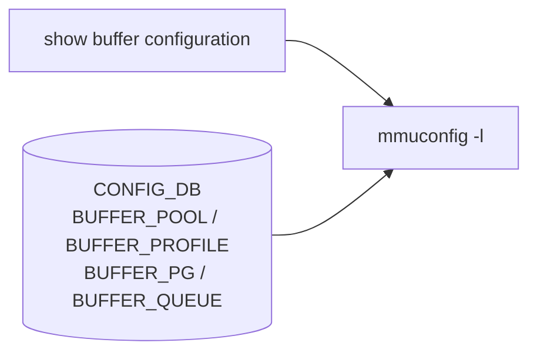

# show buffer サブコマンド

## 概要

`show buffer` は buffer 設定・状態の表示を `mmuconfig` に委譲する CLI グループ。`show/main.py` では `show buffer configuration` が定義され、namespace と verbose を `mmuconfig -l` に渡す[^1]。

## コマンド一覧

| コマンド | 用途 |
|---------|------|
| `show buffer configuration [--namespace <ns>] [--verbose]` | buffer configuration を表示 |

## 詳細

**用法**:

```bash
show buffer configuration [--namespace <ns>|--namespace all] [--verbose]
```

実行コマンドは次の通り。

```text
mmuconfig -l [-n <namespace>] [-vv]
```

`--namespace` は multi-[ASIC](../../reference/glossary.md#term-asic) namespace 名または `all` を受け付ける。`--verbose` は `mmuconfig` に `-vv` を渡す。

## 注意

- `show buffer_pool` と `show headroom-pool` は別の top-level group。
- 実際に表示される項目は `mmuconfig` 側の実装と platform の buffer model に依存する。

<!-- ref-triangle:start -->

## 関連リファレンス

- CLI: [show buffer-pool](show-buffer-pool.md) / [show priority-group](show-priority-group.md) / [show queue](show-queue.md) / [config buffer](config-buffer.md)
- [CONFIG_DB](../../reference/glossary.md#term-config_db): [BUFFER_POOL](../config-db/buffer-pool.md) / [BUFFER_PROFILE](../config-db/buffer-profile.md) / [BUFFER_PG](../config-db/buffer-pg.md) / [BUFFER_QUEUE](../config-db/buffer-queue.md)
- [YANG](../../reference/glossary.md#term-yang): [sonic-buffer-pool](../yang/sonic-buffer-pool.md) / [sonic-buffer-profile](../yang/sonic-buffer-profile.md)
- Topic: [QoS / Buffer](../../topics/08-qos-buffer/index.md)

<!-- ref-triangle:end -->

## 引用元

[^1]: `show buffer` と `configuration` command の定義。<https://github.com/sonic-net/sonic-utilities/blob/39732bceb8bdefe706518ab40623bbbba6ff33b9/show/main.py#L2466>

<!-- cli-mermaid -->
### データフロー (手動作成)



!!! note "凡例"
    show 系 (CLI → mmuconfig ← CONFIG_DB) のミニ図。CONFIG_DB を直接介さないコマンドのため手動で記述。
<!-- /cli-mermaid -->

<!-- topics-back-ref -->
## 関連 Topics

- [Topics: QoS / Buffer / PFC / Watermark](../../topics/08-qos-buffer/index.md)

<!-- /topics-back-ref -->

<!-- ops-hint -->
## 運用ヒント

### 典型的な利用シーン

- buffer pool / profile の現状確認。
- dynamic buffer mode の動作確認。

### よくある落とし穴

- dynamic buffer mode では profile が自動生成されるため、`config save` 直後の値と実値がズレる。
- pool size は [ASIC](../../reference/glossary.md#term-asic) 限界に依存。容量超過は syslog にだけ出る。

### 関連する show / debug

```bash
show buffer pool
show buffer profile
show runningconfiguration | grep -i buffer
```
<!-- /ops-hint -->

<!-- cli-sibling -->
### 関連 CLI コマンド

- [`config buffer`](config-buffer.md) — config buffer サブコマンド
- [`show buffer pool`](show-buffer-pool.md) — show buffer_pool / headroom-pool サブコマンド
- [`config pfcwd`](config-pfcwd.md) — config pfcwd サブコマンド
- [`config qos`](config-qos.md) — config qos サブコマンド
- [`show pfc`](show-pfc.md) — show pfc サブコマンド

<!-- /cli-sibling -->

<!-- glossary-links-injected: e82be350a384 -->
