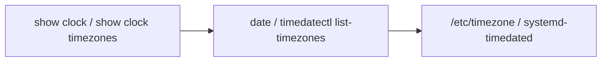

# show clock サブコマンド

## 概要

`show clock` は **システム日時の表示**と、利用可能なタイムゾーン一覧の表示を提供する click グループ。`invoke_without_command=True` で宣言されており、サブコマンド省略時はそのままグループ本体が `date` コマンドを起動する[^1]。タイムゾーン設定の **書き込み側**は `config clock` 配下にある（本ページではスコープ外）。

## コマンド一覧

| コマンド | 実装 | 起動コマンド |
|---|---|---|
| `show clock` | `show/main.py:clock()` (group, no-subcommand 時) | `date` |
| `show clock timezones` | `show/main.py:timezones()` | `timedatectl list-timezones` |

## 詳細

### `show clock`

サブコマンドが指定されない場合、`run_command(['date'])` を実行するのみ[^1]。Linux の `date(1)` の出力をそのまま流す。

`--verbose` フラグは click グループ本体に付いており、付けると実行コマンド文字列を stderr に echo する。

### `show clock timezones`

`timedatectl list-timezones` を起動。`systemd-timesyncd` / `systemd-timedated` が提供する IANA タイムゾーン名リスト（`Asia/Tokyo` `America/New_York` 等）を逐次出力する。

このコマンドは **読み取り専用**で、[CONFIG_DB](../../reference/glossary.md#term-config_db) には触らない。実際にタイムゾーンを設定するには `sudo config clock timezone <tz>` を使う（[CONFIG_DB](../../reference/glossary.md#term-config_db) の `DEVICE_METADATA|localhost` に `timezone` キーを書き込み、[hostcfgd](../../reference/glossary.md#term-hostcfgd) が `timedatectl set-timezone` を起動する仕組み）。

## CONFIG_DB との接点

| テーブル | 操作 |
|---|---|
| なし（read-only） | `show clock` は [CONFIG_DB](../../reference/glossary.md#term-config_db) を読まない |

<!-- cli-mermaid -->
### データフロー (手動作成)

!!! note "凡例"
    show 系 (CLI → date/timedatectl) のミニ図。CONFIG_DB を直接介さないコマンドのため手動で記述。
<!-- /cli-mermaid -->

<!-- ref-triangle:start -->

## 関連リファレンス

- CLI: [`config clock`](config-clock.md) / [`config ntp`](config-ntp.md)
- [CONFIG_DB](../../reference/glossary.md#term-config_db): `DEVICE_METADATA|localhost` (`timezone` キー) / [NTP_SERVER](../config-db/ntp.md)

<!-- ref-triangle:end -->

## 引用元

[^1]: `clock` グループの定義は `show/main.py` L2222-L2238。<https://github.com/sonic-net/sonic-utilities/blob/39732bceb8bdefe706518ab40623bbbba6ff33b9/show/main.py#L2222>

<!-- cli-sibling -->
### 関連 CLI コマンド

- [`config clock`](config-clock.md) — config clock サブコマンド
- [`config banner`](config-banner.md) — config banner サブコマンド
- [`config kdump`](config-kdump.md) — config kdump サブコマンド
- [`config ntp`](config-ntp.md) — config ntp サブコマンド
- [`config platform firmware`](config-platform-firmware.md) — config platform firmware サブコマンド

<!-- /cli-sibling -->

<!-- glossary-links-injected: a35f1b1cdfa7 -->
