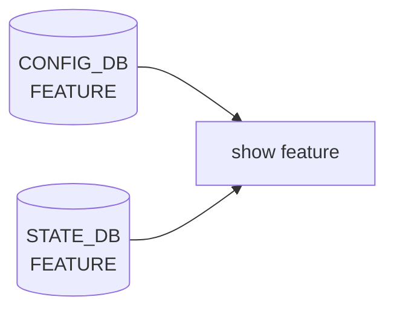

# show feature サブコマンド

## 概要

`show feature` グループは [SONiC](../../reference/glossary.md#term-sonic) の **feature** (= 個別 docker コンテナ単位の機能) の現在状態と設定値を表示する。実装は `show/feature.py` の `@click.group(name='feature')`[^1]。

[CONFIG_DB](../../reference/glossary.md#term-config_db) の `FEATURE` テーブル (Writer 側は `config/feature.py`) と [STATE_DB](../../reference/glossary.md#term-state_db) の `FEATURE|<name>` を組み合わせて表示する。[STATE_DB](../../reference/glossary.md#term-state_db) のキーは `hostcfgd` / `featured` が container 起動状況を逐次書き込む側。

## コマンド一覧

| コマンド | 用途 |
|---------|------|
| `show feature status [<feature>]` | 状態 + 設定 + 実行中 container の集計 |
| `show feature config [<feature>]` | 設定値 (state / autorestart / owner / fallback) |
| `show feature autorestart [<feature>]` | autorestart のみを抽出表示 |

## 各コマンドの詳細

### `show feature status [<feature_name>]`

**動作**:
[CONFIG_DB](../../reference/glossary.md#term-config_db) の `FEATURE` テーブル全件を `natsorted` で並べ、各 feature について [STATE_DB](../../reference/glossary.md#term-state_db) の `FEATURE|<name>` を取得して merge する。表示列は以下の組み合わせのうち、データに存在するフィールドのみ自動選別される (空文字列がデフォルト)[^2]:

- `State` ... `state` ([CONFIG_DB](../../reference/glossary.md#term-config_db))。`enabled` / `disabled` / `always_enabled`。
- `AutoRestart` ... `auto_restart`。
- `SystemState` ... STATE_DB から。systemd 視点の状態 (`up` / `down`)。
- `UpdateTime` ... STATE_DB の更新時刻。
- `ContainerId` ... 実行中の docker container ID。
- `Version` ... `container_version`。
- `SetOwner` / `CurrentOwner` ... kube デプロイ時の owner 切替状況。
- `RemoteState` ... kube ownership がリモート側にあるときの状態。

引数 `<feature_name>` を与えると 1 件だけ表示。指定 feature が `FEATURE` テーブルに存在しなければ exit code 1 で `Can not find feature ...` を出力する。

### `show feature config [<feature_name>]`

CONFIG_DB の `FEATURE` テーブルから state / auto_restart / set_owner / no_fallback_to_local を抽出して表示。`no_fallback_to_local` フィールドは表示時に **値を真偽反転** して `fallback` 列に入れる (=元の DB 上で `no_fallback_to_local=true` なら `fallback=false`)[^3]。

### `show feature autorestart [<feature_name>]`

`auto_restart` だけを抽出した 2 列の最小ビュー。値が空なら `unknown` を表示する。

## 関連する CONFIG_DB / STATE_DB

| テーブル | キー | 表示で参照するフィールド |
|----------|------|--------------------------|
| `FEATURE` (CONFIG_DB) | `<feature>` | `state`, `auto_restart`, `set_owner`, `no_fallback_to_local`, `support_syslog_rate_limit` |
| `FEATURE` (STATE_DB) | `<feature>` | `system_state`, `update_time`, `container_id`, `container_version`, `current_owner`, `remote_state` |

## 注意

- `state == always_enabled` の feature は `config feature state` で書き換えられない。CLI 側で `Feature ... state is always enabled and can not be modified` をエラーで返す (`config/feature.py`)。これは `show feature config` の `State` 列でも `always_enabled` で表示される。
- multi-[ASIC](../../reference/glossary.md#term-asic) 環境では `FEATURE` の状態が namespace 間で食い違うとエラーで停止するため、表示時に値が空欄に見える場合は CONFIG_DB が未初期化の可能性が高い。

<!-- cli-mermaid -->
### データフロー (自動生成)



!!! note "凡例"
    show 系 (CONFIG_DB → CLI) のミニ図。テーブル → daemon 対応は `docs/reference/config-db-orch-map.md` から機械生成。
<!-- /cli-mermaid -->

<!-- ref-triangle:start -->

## 関連リファレンス

- CONFIG_DB: [`FEATURE`](../config-db/feature.md)

<!-- ref-triangle:end -->

## 引用元

[^1]: `feature` グループは `show/feature.py` L11-L14。<https://github.com/sonic-net/sonic-utilities/blob/39732bceb8bdefe706518ab40623bbbba6ff33b9/show/feature.py#L11>

[^2]: `feature_status` 実装 (`show/feature.py` L40-L89)。

[^3]: `_negate_bool_str` (`show/feature.py` L92-L98) と `feature_config` (`show/feature.py` L109-L145)。


<!-- usage-example -->
## 実行例

### 典型的な使い方

```bash
# 例 1: feature の状態と auto-restart 設定
show feature status
```

### よくある引数の組み合わせ

```bash
show feature autorestart
show feature config
```

### 期待される出力 (抜粋)

```text
Feature        State     AutoRestart    SystemState
-------------  --------  -------------  -------------
bgp            enabled   enabled        up
swss           enabled   enabled        up
syncd          enabled   enabled        up
teamd          enabled   enabled        up
pmon           enabled   enabled        up
```
<!-- /usage-example -->

<!-- cli-sibling -->
### 関連 CLI コマンド

- [`config feature`](config-feature.md) — config feature サブコマンド
- [`show feature status`](show-feature.md) — feature ステータス表示
- [`show feature config`](show-feature.md) — feature 設定値表示
- [`show feature autorestart`](show-feature.md) — autorestart 設定表示

<!-- /cli-sibling -->

<!-- glossary-links-injected: ec18b66e3507 -->
