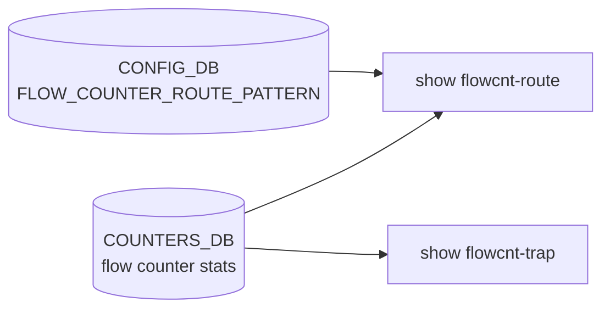

# show flowcnt-trap / flowcnt-route サブコマンド

## 概要

`show flowcnt-trap` と `show flowcnt-route` は **フローカウンタ** 機能の表示コマンド。`show/flow_counters.py` で定義され、`show/main.py` 側で `cli.add_command(flow_counters.flowcnt_trap)` / `cli.add_command(flow_counters.flowcnt_route)` として登録されている[^1]。両グループとも `flow_counters_stat` スクリプトを内部で呼び出す。

- `flowcnt-trap`: コントロールプレーンへ送られる **trap パケット** ([ARP](../../reference/glossary.md#term-arp), [LLDP](../../reference/glossary.md#term-lldp), [BGP](../../reference/glossary.md#term-bgp), etc.) を type 別にカウント
- `flowcnt-route`: 設定された prefix pattern にマッチする **ルート毎** のフローカウンタ

`flowcnt-route` はプラットフォームサポートが必要で、未対応プラットフォームでは `exit_if_route_flow_counter_not_support()` で即終了する[^2]。

## コマンド一覧

| コマンド | 用途 |
|---------|------|
| `show flowcnt-trap stats` | trap 種別ごとのフロー統計 |
| `show flowcnt-route config` | 設定済みの route flow counter パターン一覧 |
| `show flowcnt-route stats` | 全ルートフローカウンタの統計 |
| `show flowcnt-route stats pattern <prefix-pattern>` | 指定パターンの統計 |
| `show flowcnt-route stats route <prefix>` | 指定 prefix の統計 |

## 各コマンドの詳細

### `show flowcnt-trap stats`

**用法**:

```bash
show flowcnt-trap stats [--verbose] [-n|--namespace <ns>]
```

**動作**:
`flow_counters_stat -t trap` を実行。namespace 指定があれば `-n <ns>` を追加。

<!-- evidence:
source: sonic-net/sonic-utilities/show/flow_counters.py#L19-L27 (sha: 39732bceb8bdefe706518ab40623bbbba6ff33b9)
excerpt: |
  @flowcnt_trap.command()
  def stats(verbose, namespace):
      cmd = ['flow_counters_stat', '-t', 'trap']
      if namespace is not None:
          cmd += ['-n', str(namespace)]
      clicommon.run_command(cmd, display_cmd=verbose)
-->

<!-- evidence-rendered:start -->
??? note "📋 検証エビデンス: sonic-net/sonic-utilities/show/flow_counters.py#L19-L27 (sha: 39732bceb8bdefe706518ab40623bbbba6ff33b9)"

    **出典**:

    `sonic-net/sonic-utilities/show/flow_counters.py#L19-L27 (sha: 39732bceb8bdefe706518ab40623bbbba6ff33b9)`

    **抜粋**:

    ```text
    @flowcnt_trap.command()
    def stats(verbose, namespace):
        cmd = ['flow_counters_stat', '-t', 'trap']
        if namespace is not None:
            cmd += ['-n', str(namespace)]
        clicommon.run_command(cmd, display_cmd=verbose)
    ```

<!-- evidence-rendered:end -->

### `show flowcnt-route config`

**用法**:

```bash
show flowcnt-route config
```

**動作**:
[CONFIG_DB](../../reference/glossary.md#term-config_db) の `FLOW_COUNTER_ROUTE_PATTERN` テーブルを `db.cfgdb.get_table` で取得し、key (`<vrf>|<prefix>`) を `extract_route_pattern` で分解、`max` フィールドとともに tabulate 表示する[^3]。

### `show flowcnt-route stats [pattern|route]`

**用法**:

```bash
show flowcnt-route stats [--verbose] [-n|--namespace <ns>]
show flowcnt-route stats pattern <prefix-pattern> [--vrf <vrf>] [-n ...]
show flowcnt-route stats route <prefix> [--vrf <vrf>] [-n ...]
```

**動作**:

- 引数なし: `flow_counters_stat -t route` で全体集計
- `pattern <p>`: `flow_counters_stat -t route --prefix_pattern <p>`
- `route <p>`: `flow_counters_stat -t route --prefix <p>`

いずれも `--vrf` で [VRF](../../reference/glossary.md#term-vrf)/[VNET](../../reference/glossary.md#term-vnet) フィルタが可能。`stats` は `invoke_without_command=True` の group になっており、引数なしで呼ぶと内部の本体ロジックが、subcommand を付けると pattern/route 関数が走る Click パターン。

<!-- evidence:
source: sonic-net/sonic-utilities/show/flow_counters.py#L53-L93 (sha: 39732bceb8bdefe706518ab40623bbbba6ff33b9)
excerpt: |
  @flowcnt_route.group(invoke_without_command=True)
  def stats(ctx, verbose, namespace):
      if ctx.invoked_subcommand is None:
          command = ['flow_counters_stat', '-t', 'route']
          ...
  @stats.command()
  def pattern(prefix_pattern, vrf, verbose, namespace):
      command = ['flow_counters_stat', '-t', 'route', '--prefix_pattern', str(prefix_pattern)]
  @stats.command()
  def route(prefix, vrf, verbose, namespace):
      command = ['flow_counters_stat', '-t', 'route', '--prefix', str(prefix)]
-->

<!-- evidence-rendered:start -->
??? note "📋 検証エビデンス: sonic-net/sonic-utilities/show/flow_counters.py#L53-L93 (sha: 39732bceb8bdefe706518ab40623bbbba6ff33b9)"

    **出典**:

    `sonic-net/sonic-utilities/show/flow_counters.py#L53-L93 (sha: 39732bceb8bdefe706518ab40623bbbba6ff33b9)`

    **抜粋**:

    ```text
    @flowcnt_route.group(invoke_without_command=True)
    def stats(ctx, verbose, namespace):
        if ctx.invoked_subcommand is None:
            command = ['flow_counters_stat', '-t', 'route']
            ...
    @stats.command()
    def pattern(prefix_pattern, vrf, verbose, namespace):
        command = ['flow_counters_stat', '-t', 'route', '--prefix_pattern', str(prefix_pattern)]
    @stats.command()
    def route(prefix, vrf, verbose, namespace):
        command = ['flow_counters_stat', '-t', 'route', '--prefix', str(prefix)]
    ```

<!-- evidence-rendered:end -->

## 関連する CONFIG_DB

| テーブル | フィールド | 操作するコマンド |
|----------|----------|------------------|
| `FLOW_COUNTER_ROUTE_PATTERN` | key=`<vrf>|<prefix>`, field=`max` | `config flowcnt-route ...` で書き込み、`show flowcnt-route config` で表示 |

<!-- cli-mermaid -->
### データフロー (自動生成)



!!! note "凡例"
    show 系 (CONFIG_DB → CLI) のミニ図。テーブル → daemon 対応は `docs/reference/config-db-orch-map.md` から機械生成。
<!-- /cli-mermaid -->

<!-- ref-triangle:start -->

## 関連リファレンス

- [CONFIG_DB](../../reference/glossary.md#term-config_db): `FLOW_COUNTER_ROUTE_PATTERN`

<!-- ref-triangle:end -->

## 引用元

[^1]: `cli.add_command(flow_counters.flowcnt_route)` / `cli.add_command(flow_counters.flowcnt_trap)` が `show/main.py` L311-L312 にある。<https://github.com/sonic-net/sonic-utilities/blob/39732bceb8bdefe706518ab40623bbbba6ff33b9/show/main.py#L311>

[^2]: `exit_if_route_flow_counter_not_support` はプラットフォーム capability を確認する。サポート無しなら `flowcnt-route` グループ全体が事実上無効化。

[^3]: <https://github.com/sonic-net/sonic-utilities/blob/39732bceb8bdefe706518ab40623bbbba6ff33b9/show/flow_counters.py>

<!-- cli-sibling -->
### 関連 CLI コマンド

- [`config mirror session`](config-mirror-session.md) — config mirror_session サブコマンド
- [`config sflow`](config-sflow.md) — config sflow サブコマンド
- [`config snmp`](config-snmp.md) — config snmp / snmpagentaddress / snmptrap サブコマンド
- [`config syslog`](config-syslog.md) — config syslog サブコマンド
- [`show snmpagentaddress`](show-snmpagentaddress.md) — show snmpagentaddress サブコマンド

<!-- /cli-sibling -->

## 関連ページ

- [reference/CLI: show interfaces](show-interfaces.md)
- [reference/CLI: show route-map](show-route-map.md)

<!-- glossary-links-injected: 896d391185a9 -->
