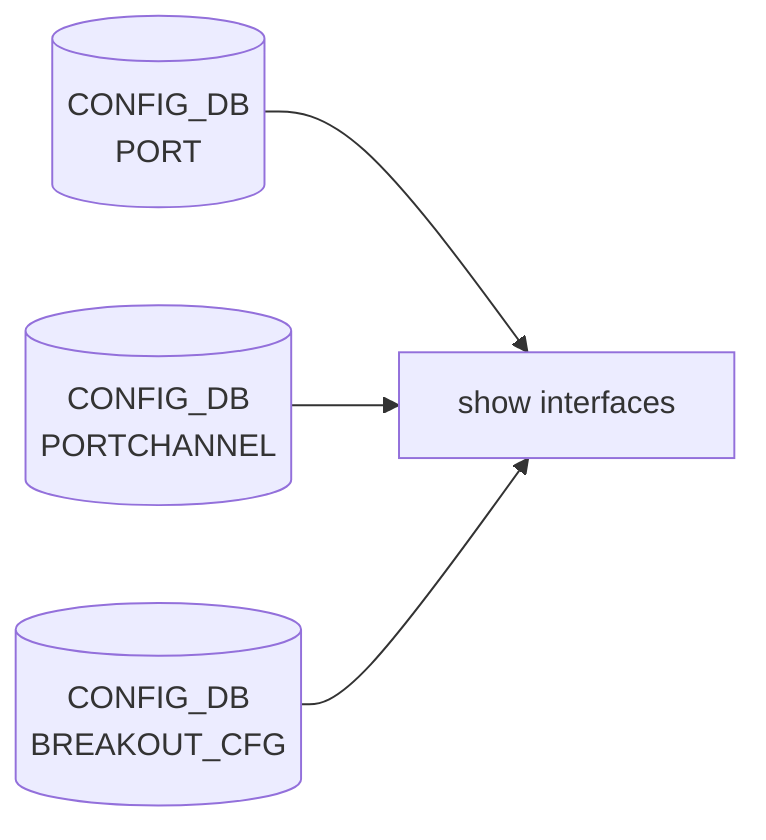

# show interfaces サブコマンド

## 概要

`show interfaces` は物理ポート・[PortChannel](../../reference/glossary.md#term-portchannel)・SubInterface の **状態 / 速度 / FEC / Auto-Negotiation / Breakout / トランシーバ / カウンタ** を一覧表示する。`show/interfaces/__init__.py` がメインで、`show/main.py` 末尾の `cli.add_command(interfaces.interfaces)` で登録される[^1]。

ほとんどのコマンドが内部で **`intfutil`** または **`portstat`** を `subprocess` で起動して整形済みテーブルを生成する。[CONFIG_DB](../../reference/glossary.md#term-config_db) / [STATE_DB](../../reference/glossary.md#term-state_db) / [COUNTERS_DB](../../reference/glossary.md#term-counters_db) から直接読むのは breakout 表示などごく一部。

## コマンド一覧

| コマンド | 用途 |
|---------|------|
| `show interfaces alias [<intf>]` | name ↔ alias マップ表示 |
| `show interfaces description [<intf>]` | `intfutil -c description` で oper / admin / desc 表示 |
| `show interfaces naming_mode` | `default` / `alias` の設定値表示 |
| `show interfaces status [<intf>]` | `intfutil -c status` (admin/oper/speed/MTU/FEC/lanes/...) |
| `show interfaces tpid [<intf>]` | `intfutil -c tpid` |
| `show interfaces breakout` | `BREAKOUT_CFG` + platform.json から JSON 出力 |
| `show interfaces breakout current-mode [<intf>]` | 現在の breakout モード |
| `show interfaces neighbor` | [LLDP](../../reference/glossary.md#term-lldp) 情報を含む隣接表示 |
| `show interfaces neighbor expected` | DEVICE_NEIGHBOR テーブルを表示 |
| `show interfaces transceiver eeprom` 等 | xcvrd の transceiver データ表示（後述） |
| `show interfaces counters` | `portstat` でカウンタ表示 (groups: errors / fec-stats / fec-histogram / detailed / rates / rif / trim) |
| `show interfaces autoneg status [<intf>]` | autoneg 状態 |
| `show interfaces link-training status [<intf>]` | link-training 状態 |
| `show interfaces fec status [<intf>]` | FEC モード状態 |
| `show interfaces switchport config / status` | switchport 関連 |
| `show interfaces dhcp-mitigation-rate [<intf>]` | DHCP rate-limit 状態 |
| `show interfaces fast-linkup status [<intf>]` | fast link-up 状態 |
| `show interfaces phy-signal <intf>` | PHY 信号品質 |
| `show interfaces phy-serdes <intf>` | PHY [SerDes](../../reference/glossary.md#term-serdes) 情報 |
| `show interfaces portchannel` | [LAG](../../reference/glossary.md#term-lag) とメンバ状態（`teamshow`） |

## 主要コマンドの詳細

### `show interfaces alias [<interfacename>]`

**動作**:
`multi_asic.get_port_table` で全 namespace の `PORT` テーブルから `alias` 列を集めて `tabulate` で出力。引数なしの場合は全ポート、`<interfacename>` 指定で 1 件のみ。`--display external/all` で internal port を除外可能。

### `show interfaces status [<interfacename>]`

**動作**:
`intfutil -c status -i <intf> [-d <display>] [-n <namespace>]` を起動。表示列: Interface / Lanes / Speed / MTU / FEC / Alias / Vlan / Oper / Admin / Type / Asym [PFC](../../reference/glossary.md#term-pfc)。

### `show interfaces description [<interfacename>]`

`intfutil -c description ...`。Oper / Admin / Description（PORT テーブルの description）を表示。

### `show interfaces breakout`

**動作**:
`BREAKOUT_CFG` テーブルと、platform.json / hwsku.json を読み合わせて、各ポートの **Default / Current Breakout Mode**, 子ポート名, 子ポート速度を JSON 形式で出力する[^2]。

### `show interfaces breakout current-mode [<interfacename>]`

`BREAKOUT_CFG|<intf>` の `brkout_mode` のみ。

### `show interfaces neighbor`

`lldpctl -f json` 系を内部実行し、隣接情報をテーブル化。

### `show interfaces neighbor expected`

[CONFIG_DB](../../reference/glossary.md#term-config_db) の `DEVICE_NEIGHBOR` テーブルを直接表示。lldpd が起動する前にケーブル配線が想定通りかを確認するのに使う。

### `show interfaces transceiver` 配下

| サブコマンド | 内容 |
|------------|------|
| `eeprom [<intf>] [-d|--dom]` | SFF-8636 / CMIS の EEPROM ダンプ |
| `lpmode [<intf>]` | low-power mode 状態 |
| `presence [<intf>]` | プレゼンスビット |
| `info [<intf>]` | パワー / DOM / バルク情報 |
| `pm [<intf>]` | performance monitoring |
| `error-status [<intf>]` | xcvrd が検出したエラー |
| `status [<intf>]` | 全般ステータス |

実装は `xcvrd` が [STATE_DB](../../reference/glossary.md#term-state_db) に書き込む `TRANSCEIVER_INFO` / `TRANSCEIVER_DOM_SENSOR` / `TRANSCEIVER_STATUS` 等を読み出す。

### `show interfaces counters [<group>]`

**用法**:

```bash
show interfaces counters [errors | fec-stats | fec-histogram | rates | rif | trim | detailed]
    [-p|--period <sec>] [-i|--interface <list>] [-a|--printall] [-j|--json] [-n|--namespace]
```

**動作**:
`portstat -c <category> ...` を起動して整形 stdout を表示。`--period N` で前回の `portstat -d <ns>` cache との差分を出して **N 秒間のレート**を表示する。`fec-histogram` は [SAI](../../reference/glossary.md#term-sai) Bin 値を可視化する詳細サブコマンド。

### `show interfaces autoneg status` / `link-training status` / `fec status`

各々 `intfutil -c autoneg` / `-c link_training` / `-c fec` を起動。フィールドは `oper` `admin` の組合せで集約表示される。

### `show interfaces switchport config` / `switchport status`

`config` は `PORT` の `mode` (`access` / `trunk` / `routed`) と untagged-[VLAN](../../reference/glossary.md#term-vlan) を、`status` はランタイム状態 (oper [VLAN](../../reference/glossary.md#term-vlan) メンバシップ) を表示。

### `show interfaces dhcp-mitigation-rate [<intf>]`

`PORT|<intf>` の `dhcp_rate_limit` フィールドを表示。

### `show interfaces fast-linkup status [<intf>]`

`PORT|<intf>` の `fast_linkup` 関連と `STATE_DB` の `SWITCH_CAPABILITY` 由来の supported range を表示。

### `show interfaces phy-signal <intf>` / `phy-serdes <intf>`

`PHY` 関連 [STATE_DB](../../reference/glossary.md#term-state_db) エントリ（`TRANSCEIVER_DOM_SENSOR`, `PORT_TX_FIR`, `PORT_RX_FIR` 等）を読み出し可視化。プラットフォーム実装依存。

### `show interfaces portchannel`

`show/interfaces/portchannel.py` 配下の `teamshow` ラッパで、`PORTCHANNEL_MEMBER` 各ポートの [teamd](../../reference/glossary.md#term-teamd-teamsyncd-teammgrd) ランタイム状態（runner, link, slave 状態）を表示する。

## オプション・共通仕様

- `-n|--namespace` ... multi-[ASIC](../../reference/glossary.md#term-asic) 専用。`asic0` / `asic1` などを指定して該当 namespace のみ出力
- `-d|--display all|external|frontend` ... `--display all` で internal port も含む
- 引数 `<interfacename>` は `alias` モード時に自動で正規名へ変換される

## 関連する CONFIG_DB / STATE_DB

| 種類 | テーブル | 表示するコマンド |
|------|----------|------------------|
| [CONFIG_DB](../../reference/glossary.md#term-config_db) | `PORT` | `status` / `description` / `dhcp-mitigation-rate` / `switchport` |
| CONFIG_DB | `PORTCHANNEL`, `PORTCHANNEL_MEMBER` | `portchannel` |
| CONFIG_DB | `BREAKOUT_CFG` | `breakout` |
| CONFIG_DB | `DEVICE_NEIGHBOR` | `neighbor expected` |
| STATE_DB | `PORT_TABLE`, `TRANSCEIVER_INFO`, `TRANSCEIVER_DOM_SENSOR`, `TRANSCEIVER_STATUS`, `SWITCH_CAPABILITY` | `transceiver *`, `fast-linkup status`, `phy-*` |
| [COUNTERS_DB](../../reference/glossary.md#term-counters_db) | `COUNTERS:*` | `counters` (via portstat) |

<!-- cli-mermaid -->
### データフロー (自動生成)



!!! note "凡例"
    show 系 (CONFIG_DB → CLI) のミニ図。テーブル → daemon 対応は `docs/reference/config-db-orch-map.md` から機械生成。
<!-- /cli-mermaid -->

<!-- ref-triangle:start -->

## 関連リファレンス

- CONFIG_DB: [`PORT`](../config-db/port.md) / [`PORTCHANNEL`](../config-db/portchannel.md) / [`BREAKOUT_CFG`](../config-db/breakout-cfg.md)

<!-- ref-triangle:end -->

## 引用元

[^1]: `interfaces` グループ定義は `show/interfaces/__init__.py` L61-L64。`show/main.py` L316 で `cli.add_command(interfaces.interfaces)` 登録。<https://github.com/sonic-net/sonic-utilities/blob/39732bceb8bdefe706518ab40623bbbba6ff33b9/show/interfaces/__init__.py>

[^2]: `breakout` の JSON 出力ロジックは `show/interfaces/__init__.py` L200-L259。<https://github.com/sonic-net/sonic-utilities/blob/39732bceb8bdefe706518ab40623bbbba6ff33b9/show/interfaces/__init__.py#L200>


<!-- usage-example -->
## 実行例

### 典型的な使い方

```bash
# 例 1: インターフェース状態サマリ
show interfaces status
```

### よくある引数の組み合わせ

```bash
show interfaces counters
show interfaces counters rif
show interfaces transceiver eeprom Ethernet0
show interfaces description
```

### 期待される出力 (抜粋)

```text
  Interface            Lanes    Speed    MTU    FEC    Alias    Vlan    Oper    Admin
-----------  ---------------  -------  -----  -----  -------  ------  ------  -------
  Ethernet0  25,26,27,28        100G   9100     rs   etp1     trunk      up       up
  Ethernet4  29,30,31,32        100G   9100     rs   etp2     trunk      up       up
```
<!-- /usage-example -->

<!-- ops-hint -->
## 運用ヒント

### 典型的な利用シーン

- ポートの admin/oper 状態、speed、MTU、FEC を一覧確認する。
- counters / errors を定期取得して link flap や CRC エラーを検出する。

### よくある落とし穴

- `show interfaces counters` は累積値。差分は `sonic-clear counters` でリセットしてから観測する。
- [PortChannel](../../reference/glossary.md#term-portchannel) メンバの speed は `show interfaces status` に出ても [LAG](../../reference/glossary.md#term-lag) 自体の speed は別系統。
- **`show interfaces counters errors` / `fec-stats` / `rates` はインターフェースフィルタ未対応** (issue [#4501](https://github.com/sonic-net/sonic-utilities/issues/4501)): 親コマンド `show interfaces counters -i Ethernet0` はフィルタが効くが、サブコマンド (`errors`, `fec-stats`, `rates`) は `-i` オプションを持たない。特定ポートのみ確認したい場合は `show interfaces counters errors | grep Ethernet0` のように `grep` で絞る。
- **multi-[ASIC](../../reference/glossary.md#term-asic) で `counterpoll` を namespace 指定しても default DB が更新される** (issue [#4375](https://github.com/sonic-net/sonic-utilities/issues/4375)): `sudo ip netns exec asic0 counterpoll pg-drop disable` のように `ip netns exec` 経由で呼んでも `CONFIG_DB`（asic0 の DB）ではなく default namespace の DB が更新される。`counterpoll pg-drop disable -n asic0` を使うこと。
- **QSFP+C トランシーバで 8 lanes が表示される** (issue [#4065](https://github.com/sonic-net/sonic-utilities/issues/4065)): CMIS 管理の QSFP+C は物理 4 lanes だが `show interfaces transceiver status` / `eeprom` が lane 1-8 を出力し、lanes 5-8 は `Unknown` / `False` / 0 が並ぶ。表示上のノイズであり実際の lane 状態は 1-4 のみ参照すること。
- **sfputil の読み取り系コマンドが `--help` に表示されない** (issue [#4518](https://github.com/sonic-net/sonic-utilities/issues/4518)): `sfputil lpmode --help` や `sfputil firmware --help` には変更コマンドしか表示されず、読み取り系の `sfputil show lpmode` / `sfputil show fwversion` は別の `show` グループにある。`sfputil show --help` で確認すること。

### 関連する show / debug

```bash
show interfaces status
show interfaces counters -i Ethernet0
show interfaces transceiver eeprom Ethernet0
```
<!-- /ops-hint -->

<!-- glossary-links-injected: 8df9850464d2 -->
