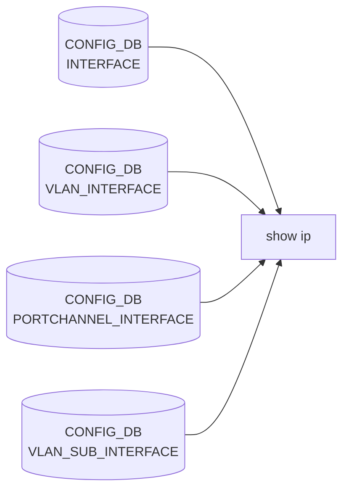

# show ip サブコマンド

## 概要

`show ip` は IPv4 ネットワーク情報の照会用サブグループ。インタフェイスの IPv4 状態、ルーティングテーブル、FIB、prefix-list、protocol、[BGP](../../reference/glossary.md#term-bgp) 関連表示を集約する[^1]。[BGP](../../reference/glossary.md#term-bgp) 系は **routing-stack の選択結果に応じて動的にロード**される（[FRR](../../reference/glossary.md#term-frr) / Quagga / supervisor 環境）。

```python
# show/main.py L1567-L1581
if routing_stack == "frr":
    from .bgp_frr_v4 import bgp
    ip.add_command(bgp)
    ...
```

このため `meta/index/cli.json` の機械抽出には `show ip bgp` 系が現れない。本ページは `show/bgp_frr_v4.py` も sources に含めて整理する。

## コマンド一覧

| コマンド | 用途 |
|---------|------|
| `show ip interfaces` | インタフェイスの IPv4 状態（`ipintutil -a ipv4`） |
| `show ip interfaces loopback-action` | INTERFACE 系テーブルの `loopback_action` 値表示 |
| `show ip route [<args>]` | IPv4 RIB（[FRR](../../reference/glossary.md#term-frr) [vtysh](../../reference/glossary.md#term-vtysh) `show ip route`） |
| `show ip prefix-list [<name>]` | [FRR](../../reference/glossary.md#term-frr) の prefix-list 表示 |
| `show ip protocol` | FRR の routing protocol summary |
| `show ip fib [<ipaddress>]` | FIB テーブル（`fibshow -4`） |
| `show ip bgp summary` | [BGP](../../reference/glossary.md#term-bgp) セッション summary (FRR) |
| `show ip bgp neighbors [<ip>] [<info_type>]` | BGP 隣接詳細 |
| `show ip bgp network [<prefix>] [<info_type>]` | RIB の特定 prefix |
| `show ip bgp aggregate-address` | `BGP_AGGREGATE_ADDRESS` テーブル表示 |
| `show ip bgp vrf <vrf> summary/neighbors/network` | [VRF](../../reference/glossary.md#term-vrf) スコープの BGP 表示 |

## 各コマンドの詳細

### `show ip interfaces`

**動作**:
`sudo ipintutil -a ipv4 [-n <namespace>] [-d <display>]` を起動する。各 IF の `INTERFACE` / `VLAN_INTERFACE` / `PORTCHANNEL_INTERFACE` / `VLAN_SUB_INTERFACE` テーブルを横断して、admin/oper/IPv4 アドレス/BGP neighbor 名/peer ip を 1 行ずつ表示する。

### `show ip interfaces loopback-action`

**動作**:
`INTERFACE` / `VLAN_INTERFACE` / `PORTCHANNEL_INTERFACE` / `VLAN_SUB_INTERFACE` を全件マージし、各エントリの `loopback_action` フィールドを `Interface` / `Action` の 2 列で表示する。設定が無いインタフェイスは行に出ない。

<!-- evidence:
source: sonic-net/sonic-utilities/show/main.py#L1416-L1441 (sha: 39732bceb8bdefe706518ab40623bbbba6ff33b9)
excerpt: |
  def loopback_action():
      ...
      for tbl in [if_tbl, vlan_if_tbl, po_if_tbl, sub_if_tbl]:
          all_tables.update(tbl)
      ...
      if 'loopback_action' in all_tables[iface]:
          ifs_action.append([iface, all_tables[iface]['loopback_action']])
-->

<!-- evidence-rendered:start -->
??? note "📋 検証エビデンス: sonic-net/sonic-utilities/show/main.py#L1416-L1441 (sha: 39732bceb8bdefe706518ab40623bbbba6ff33b9)"

    **出典**:

    `sonic-net/sonic-utilities/show/main.py#L1416-L1441 (sha: 39732bceb8bdefe706518ab40623bbbba6ff33b9)`

    **抜粋**:

    ```text
    def loopback_action():
        ...
        for tbl in [if_tbl, vlan_if_tbl, po_if_tbl, sub_if_tbl]:
            all_tables.update(tbl)
        ...
        if 'loopback_action' in all_tables[iface]:
            ifs_action.append([iface, all_tables[iface]['loopback_action']])
    ```

<!-- evidence-rendered:end -->

### `show ip route [<args>]`

**用法**:

```bash
show ip route [<IPADDRESS>] [vrf <vrf_name>] [...] [-d|--display all|frontend] [-n|--namespace <ns>]
```

**動作**:
`bgp_common.show_routes` が `vtysh -c 'show ip route ...'` を組み立てて実行する。`<args>` は **そのまま [vtysh](../../reference/glossary.md#term-vtysh) コマンドラインに連結**されるため、`show ip route 10.0.0.0/24 longer-prefixes` のような FRR ネイティブ書式を直接渡せる。multi-[ASIC](../../reference/glossary.md#term-asic) 時は対象 namespace のコンテナ内で [vtysh](../../reference/glossary.md#term-vtysh) を起動する。

### `show ip prefix-list [<name>]`

`vtysh -c 'show ip prefix-list [<name>]'` を起動するだけのラッパ。

### `show ip protocol`

`vtysh -c 'show ip protocol'`。FRR の各プロトコル（[zebra](../../reference/glossary.md#term-zebra) / bgp / static 等）有効状態 summary。

### `show ip fib [<ipaddress>]`

`fibshow -4 [-ip <ipaddress>]` を起動。実 FIB（kernel + [ASIC](../../reference/glossary.md#term-asic) sync 済みエントリ）を表示する。

### `show ip bgp summary`

**動作**:
FRR `vtysh -c 'show bgp ipv4 summary'` 風のコマンドを `summary_helper` 経由で実行。multi-[ASIC](../../reference/glossary.md#term-asic) 時は frontend (front_ns) のみ集約。

### `show ip bgp neighbors [<ipaddress>] [<info_type>]`

**動作**:
`<info_type>` は `routes` / `advertised-routes` / `received-routes`（FRR の vtysh サブ動詞）。引数省略時は隣接一覧。

### `show ip bgp network [<ipaddress>] [<info_type>]`

**動作**:
`<ipaddress>` プレフィックスについて RIB に存在する経路と属性を表示。`<info_type>` は `bestpath` / `multipath` / `longer-prefixes` 等の vtysh 直系オプション。

### `show ip bgp aggregate-address`

**動作**:
[CONFIG_DB](../../reference/glossary.md#term-config_db) の `BGP_AGGREGATE_ADDRESS` テーブルを直接読み出し、各エントリの prefix・bbr-required・summary-only・as-set・prefix-list を表示する。

### `show ip bgp vrf <vrf> summary/neighbors/network ...`

**動作**:
`<vrf>` を vtysh の `bgp vrf <name>` ファミリに変換して上記 helper を呼ぶ。`default` / `Vrf*` を指定可能。

## オプション・共通仕様

- `-n|--namespace` ... multi-ASIC 限定
- `-d|--display all|frontend` ... `frontend` で internal port を除外
- `--verbose` ... 実行コマンドを stdout に echo してから実行（debug 用）

## 関連する CONFIG_DB / 一次情報

| テーブル | 表示するコマンド |
|----------|------------------|
| `INTERFACE` / `VLAN_INTERFACE` / `PORTCHANNEL_INTERFACE` / `VLAN_SUB_INTERFACE` | `interfaces` / `interfaces loopback-action` |
| `BGP_AGGREGATE_ADDRESS` | `bgp aggregate-address` |
| FRR runtime (vtysh) | `route` / `prefix-list` / `protocol` / `bgp ...` |
| Linux FIB + [APPL_DB](../../reference/glossary.md#term-appl_db) sync (`fibshow`) | `fib` |

<!-- cli-mermaid -->
### データフロー (自動生成)



!!! note "凡例"
    show 系 (CONFIG_DB → CLI) のミニ図。テーブル → daemon 対応は `docs/reference/config-db-orch-map.md` から機械生成。
<!-- /cli-mermaid -->

<!-- ref-triangle:start -->

## 関連リファレンス

- [CONFIG_DB](../../reference/glossary.md#term-config_db): [`INTERFACE`](../config-db/interface.md) / [`VLAN_INTERFACE`](../config-db/vlan-interface.md) / [`PORTCHANNEL_INTERFACE`](../config-db/portchannel-interface.md) / [`VLAN_SUB_INTERFACE`](../config-db/vlan-sub-interface.md)

<!-- ref-triangle:end -->

## 引用元

[^1]: `ip` グループ定義は `show/main.py` L1386-L1389。BGP の動的アタッチは L1567-L1581。<https://github.com/sonic-net/sonic-utilities/blob/39732bceb8bdefe706518ab40623bbbba6ff33b9/show/main.py#L1387>

<!-- usage-example -->
## 実行例

### 典型的な使い方

```bash
# 例 1: ルーティングテーブル全件
show ip route
```

### よくある引数の組み合わせ

```bash
show ip route 10.0.0.0/24
show ip route vrf Vrf_Red
show ip interfaces
show ip bgp summary
```

### 期待される出力 (抜粋)

```text
Codes: K - kernel route, C - connected, S - static, R - RIP,
       O - OSPF, I - IS-IS, B - BGP, E - EIGRP, N - NHRP,
       T - Table, v - VNC, V - VNC-Direct, A - Babel, D - SHARP,
       F - PBR, f - OpenFabric,
       > - selected route, * - FIB route

B>* 10.0.1.0/24 [20/0] via 10.0.0.1, Ethernet0, 01:25:34
C>* 10.0.0.0/24 is directly connected, Ethernet0, 01:30:11
```
<!-- /usage-example -->

<!-- ops-hint -->
## 運用ヒント

### 典型的な利用シーン

- 経路テーブル、BGP / OSPF 状態、static route 確認。
- [VRF](../../reference/glossary.md#term-vrf) 別経路の確認。

### よくある落とし穴

- `show ip route` は default [VRF](../../reference/glossary.md#term-vrf)。VRF 切替は `show ip route vrf <name>`。
- FRR と kernel routing table のズレ。`vtysh -c 'show ip route'` と `ip route` を比較。

### 関連する show / debug

```bash
show ip route
show ip interfaces
vtysh -c 'show ip route'
```
<!-- /ops-hint -->

<!-- cli-sibling -->
### 関連 CLI コマンド

- [`config bgp`](config-bgp.md) — config bgp サブコマンド
- [`config default route`](config-default-route.md) — config default-route（デフォルトルート設定パターン）
- [`config route`](config-route.md) — config route サブコマンド（static route）
- [`config vrf`](config-vrf.md) — config vrf サブコマンド
- [`show arp`](show-arp.md) — show arp サブコマンド

<!-- /cli-sibling -->

<!-- glossary-links-injected: 68c9522f108f -->
