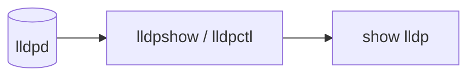

# show lldp サブコマンド

## 概要

`show lldp` は [LLDP](../../reference/glossary.md#term-lldp) (Link Layer Discovery Protocol) 隣接情報を表示するグループ。実体は `lldpd` プロセスが収集した隣接情報を、[SONiC](../../reference/glossary.md#term-sonic) 同梱の `lldpshow` スクリプト経由でフォーマットして出力する薄いラッパである[^1]。[CONFIG_DB](../../reference/glossary.md#term-config_db) は触らず、`run_command(['sudo', 'lldpshow', ...])` を呼ぶだけ。

## コマンド一覧

| コマンド | 用途 |
|---------|------|
| `show lldp neighbors [<interfacename>]` | [LLDP](../../reference/glossary.md#term-lldp) 隣接の詳細表示（デフォルト） |
| `show lldp table` | [LLDP](../../reference/glossary.md#term-lldp) 隣接の一覧表表示 |

## 各コマンドの詳細

### `show lldp neighbors [<interfacename>]`

**用法**:

```bash
show lldp neighbors [<interfacename>] [--verbose]
```

**引数**:

- `<interfacename>` ... 任意。指定するとそのポートの隣接のみ表示

**動作**:
`sudo lldpshow -d` を実行する。`<interfacename>` 指定時は `-p <interfacename>` を追加。interface naming mode が `alias` の場合は `iface_alias_converter.alias_to_name` で物理名に変換してから渡す[^2]。

<!-- evidence:
source: sonic-net/sonic-utilities/show/main.py#L1654-L1668 (sha: 39732bceb8bdefe706518ab40623bbbba6ff33b9)
excerpt: |
  @lldp.command()
  @click.argument('interfacename', required=False)
  def neighbors(interfacename, verbose):
      cmd = ['sudo', 'lldpshow', '-d']
      if interfacename is not None:
          if clicommon.get_interface_naming_mode() == "alias":
              interfacename = iface_alias_converter.alias_to_name(interfacename)
          cmd += ['-p', str(interfacename)]
      run_command(cmd, display_cmd=verbose)
-->

<!-- evidence-rendered:start -->
??? note "📋 検証エビデンス: sonic-net/sonic-utilities/show/main.py#L1654-L1668 (sha: 39732bceb8bdefe706518ab40623bbbba6ff33b9)"

    **出典**:

    `sonic-net/sonic-utilities/show/main.py#L1654-L1668 (sha: 39732bceb8bdefe706518ab40623bbbba6ff33b9)`

    **抜粋**:

    ```text
    @lldp.command()
    @click.argument('interfacename', required=False)
    def neighbors(interfacename, verbose):
        cmd = ['sudo', 'lldpshow', '-d']
        if interfacename is not None:
            if clicommon.get_interface_naming_mode() == "alias":
                interfacename = iface_alias_converter.alias_to_name(interfacename)
            cmd += ['-p', str(interfacename)]
        run_command(cmd, display_cmd=verbose)
    ```

<!-- evidence-rendered:end -->

### `show lldp table`

**用法**:

```bash
show lldp table [--verbose]
```

**動作**:
`sudo lldpshow` を引数なしで実行し、隣接を tabular 形式で出力する。

## 補足

- `show lldp` を引数なしで呼ぶと help が表示される。隣接詳細を見るには `show lldp neighbors` と明示する必要がある
- LLDP の有効・無効や送信間隔などの設定は本コマンドのスコープ外（`lldpd.conf` / `LLDP*` テーブル管理ツール側）

<!-- cli-mermaid -->
### データフロー (自動生成)



!!! note "凡例"
    show 系 (データソース → ラッパスクリプト → CLI) のミニ図。CONFIG_DB は経由しない。
<!-- /cli-mermaid -->

<!-- ref-triangle:start -->

## 関連リファレンス

- (関連リンクなし)

<!-- ref-triangle:end -->

## 引用元

[^1]: グループ定義は `show/main.py` L1649-L1652。<https://github.com/sonic-net/sonic-utilities/blob/39732bceb8bdefe706518ab40623bbbba6ff33b9/show/main.py#L1649>

[^2]: alias 変換は [SONiC](../../reference/glossary.md#term-sonic) の interface naming mode によって行われる。設定は `MGMT_INTERFACE` などとは別の環境変数経由。

<!-- usage-example -->
## 実行例

### 典型的な使い方

```bash
# 例 1: LLDP 隣接サマリ
show lldp table
```

### よくある引数の組み合わせ

```bash
show lldp neighbors
show lldp neighbors Ethernet0
```

### 期待される出力 (抜粋)

```text
Capability codes: (R) Router, (B) Bridge, (O) Other
LocalPort    RemoteDevice    RemotePortID    Capability    RemotePortDescr
-----------  --------------  --------------  ------------  -----------------
Ethernet0    leaf01          Ethernet1/1     BR            to-spine01
Ethernet4    leaf02          Ethernet1/1     BR            to-spine01
```
<!-- /usage-example -->

<!-- ops-hint -->
## 運用ヒント

### 典型的な利用シーン

- 対向機器（リーフ/スパイン）の特定とケーブル接続検証。
- neighbor の System Name / Port ID を取って配線記録と突合する。

### よくある落とし穴

- `show lldp table` の Remote Port が `ifname` か `ifalias` かは対向次第。両方確認する。
- Mgmt port には LLDP が出ないことが多い（lldp 設定が `Ethernet*` のみのため）。

### 関連する show / debug

```bash
show lldp table
show lldp neighbors Ethernet0
docker exec lldp lldpcli show neighbors
```
<!-- /ops-hint -->

<!-- cli-sibling -->
### 関連 CLI コマンド

- [`config interface`](config-interface.md) — config interface サブコマンド
- [`config portchannel`](config-portchannel.md) — config portchannel サブコマンド
- [`config vlan`](config-vlan.md) — config vlan サブコマンド
- [`show mac`](show-mac.md) — show mac サブコマンド
- [`show storm control`](show-storm-control.md) — show storm-control サブコマンド

<!-- /cli-sibling -->

## 関連ページ

- [reference/CLI: show interfaces](show-interfaces.md)
- [reference/CLI: show ip](show-ip.md)

<!-- glossary-links-injected: 92c530e50bae -->
