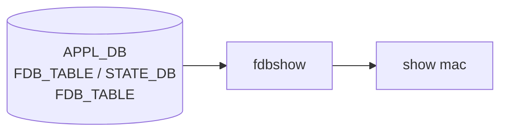

# show mac サブコマンド

## 概要

`show mac` は [FDB](../../reference/glossary.md#term-fdb) ([Forwarding Database](../../reference/glossary.md#term-forwarding-database)) のエントリ（MAC アドレス学習テーブル）を表示する。実装は `fdbshow` スクリプトの薄いラッパで、CLI 側はオプションを `fdbshow` の引数に machine-translate するだけ[^1]。`invoke_without_command="true"` の Click group なので、サブコマンドなしで呼ぶと [FDB](../../reference/glossary.md#term-fdb) を、`aging-time` を指定すると別系統 ([APPL_DB](../../reference/glossary.md#term-appl_db)) を読みに行く。

## コマンド一覧

| コマンド | 用途 |
|---------|------|
| `show mac [options]` | [FDB](../../reference/glossary.md#term-fdb) エントリの表示 |
| `show mac aging-time` | スイッチの FDB エージング時間（秒） |

## 各コマンドの詳細

### `show mac [options]`

**用法**:

```bash
show mac
    [-v|--vlan <vlan>]
    [-p|--port <port>]
    [-a|--address <mac>]
    [-t|--type <static|dynamic>]
    [-c|--count]
    [-n|--namespace <ns>]
    [--verbose]
```

**オプション**:

- `-v / --vlan` ... 特定 [VLAN](../../reference/glossary.md#term-vlan) の FDB のみ
- `-p / --port` ... 特定ポート上の FDB のみ
- `-a / --address` ... 指定 MAC アドレス
- `-t / --type` ... `static` / `dynamic` のみ
- `-c / --count` ... 件数表示モード（エントリ一覧の代わりに件数のみ）
- `-n / --namespace` ... multi-[ASIC](../../reference/glossary.md#term-asic) 環境向け

**動作**:
`fdbshow` コマンドにフラグを渡して exec する。例: `--vlan 100 --port Ethernet0` の場合は `fdbshow -v 100 -p Ethernet0`。

<!-- evidence:
source: sonic-net/sonic-utilities/show/main.py#L1199-L1244 (sha: 39732bceb8bdefe706518ab40623bbbba6ff33b9)
excerpt: |
  @cli.group(cls=clicommon.AliasedGroup, invoke_without_command="true")
  def mac(ctx, vlan, port, address, type, count, verbose, namespace):
      if ctx.invoked_subcommand is not None:
          return
      cmd = ["fdbshow"]
      if vlan is not None:    cmd += ['-v', str(vlan)]
      if port is not None:    cmd += ['-p', str(port)]
      if address is not None: cmd += ['-a', str(address)]
      if type is not None:    cmd += ['-t', str(type)]
      if count:               cmd += ["-c"]
      if namespace is not None: cmd += ['-n', str(namespace)]
      run_command(cmd, display_cmd=verbose)
-->

<!-- evidence-rendered:start -->
??? note "📋 検証エビデンス: sonic-net/sonic-utilities/show/main.py#L1199-L1244 (sha: 39732bceb8bdefe706518ab40623bbbba6ff33b9)"

    **出典**:

    `sonic-net/sonic-utilities/show/main.py#L1199-L1244 (sha: 39732bceb8bdefe706518ab40623bbbba6ff33b9)`

    **抜粋**:

    ```text
    @cli.group(cls=clicommon.AliasedGroup, invoke_without_command="true")
    def mac(ctx, vlan, port, address, type, count, verbose, namespace):
        if ctx.invoked_subcommand is not None:
            return
        cmd = ["fdbshow"]
        if vlan is not None:    cmd += ['-v', str(vlan)]
        if port is not None:    cmd += ['-p', str(port)]
        if address is not None: cmd += ['-a', str(address)]
        if type is not None:    cmd += ['-t', str(type)]
        if count:               cmd += ["-c"]
        if namespace is not None: cmd += ['-n', str(namespace)]
        run_command(cmd, display_cmd=verbose)
    ```

<!-- evidence-rendered:end -->

### `show mac aging-time`

**用法**:

```bash
show mac aging-time
```

**動作**:
**FDB 表示とは別系統** で、`SonicV2Connector` 経由で **[APPL_DB](../../reference/glossary.md#term-appl_db)** の `SWITCH_TABLE*` を列挙し、各キーから `fdb_aging_time` を取得して表示する[^2]。設定されていなければ `Aging time not configured for the switch` を出力。

<!-- evidence:
source: sonic-net/sonic-utilities/show/main.py#L1245-L1262 (sha: 39732bceb8bdefe706518ab40623bbbba6ff33b9)
excerpt: |
  @mac.command('aging-time')
  def aging_time(ctx):
      app_db = SonicV2Connector()
      app_db.connect(app_db.APPL_DB)
      keys = app_db.keys(app_db.APPL_DB, "SWITCH_TABLE*")
      for key in keys:
          fdb_aging_time = app_db.get(app_db.APPL_DB, key, 'fdb_aging_time')
          ...
-->

<!-- evidence-rendered:start -->
??? note "📋 検証エビデンス: sonic-net/sonic-utilities/show/main.py#L1245-L1262 (sha: 39732bceb8bdefe706518ab40623bbbba6ff33b9)"

    **出典**:

    `sonic-net/sonic-utilities/show/main.py#L1245-L1262 (sha: 39732bceb8bdefe706518ab40623bbbba6ff33b9)`

    **抜粋**:

    ```text
    @mac.command('aging-time')
    def aging_time(ctx):
        app_db = SonicV2Connector()
        app_db.connect(app_db.APPL_DB)
        keys = app_db.keys(app_db.APPL_DB, "SWITCH_TABLE*")
        for key in keys:
            fdb_aging_time = app_db.get(app_db.APPL_DB, key, 'fdb_aging_time')
            ...
    ```

<!-- evidence-rendered:end -->

## 補足

- `fdbshow` 自体は [APPL_DB](../../reference/glossary.md#term-appl_db) / [ASIC_DB](../../reference/glossary.md#term-asic_db) / [STATE_DB](../../reference/glossary.md#term-state_db) を読み合わせて FDB を組み立てる。[CONFIG_DB](../../reference/glossary.md#term-config_db) は使わない
- aging time の **設定** は `config mac aging_time <seconds>` 等が存在する場合に行う（本ページは表示系のみ）

<!-- cli-mermaid -->
### データフロー (自動生成)



!!! note "凡例"
    show 系 (データソース → ラッパスクリプト → CLI) のミニ図。CONFIG_DB は経由しない。
<!-- /cli-mermaid -->

<!-- ref-triangle:start -->

## 関連リファレンス

- (関連リンクなし)

<!-- ref-triangle:end -->

## 引用元

[^1]: <https://github.com/sonic-net/sonic-utilities/blob/39732bceb8bdefe706518ab40623bbbba6ff33b9/show/main.py#L1199>

[^2]: APPL_DB の `SWITCH_TABLE` は [orchagent](../../reference/glossary.md#term-orchagent) が書き込む。`fdb_aging_time` は秒単位。

<!-- usage-example -->
## 実行例

### 典型的な使い方

```bash
# 例 1: MAC アドレステーブル
show mac
```

### よくある引数の組み合わせ

```bash
show mac -v 100
show mac -p Ethernet0
show mac -c
```

### 期待される出力 (抜粋)

```text
  No.    Vlan  MacAddress         Port           Type
-----  ------  -----------------  -------------  ---------
    1     100  00:11:22:33:44:55  Ethernet0      Dynamic
    2     100  00:11:22:33:44:66  Ethernet4      Dynamic
```
<!-- /usage-example -->

<!-- cli-sibling -->
### 関連 CLI コマンド

- [`config interface`](config-interface.md) — config interface サブコマンド
- [`config portchannel`](config-portchannel.md) — config portchannel サブコマンド
- [`config vlan`](config-vlan.md) — config vlan サブコマンド
- [`show lldp`](show-lldp.md) — show lldp サブコマンド
- [`show storm control`](show-storm-control.md) — show storm-control サブコマンド

<!-- /cli-sibling -->

## 関連ページ

- [reference/CLI: show vlan](show-vlan.md)
- [reference/CLI: show interfaces](show-interfaces.md)

<!-- glossary-links-injected: e88eafb61c57 -->
