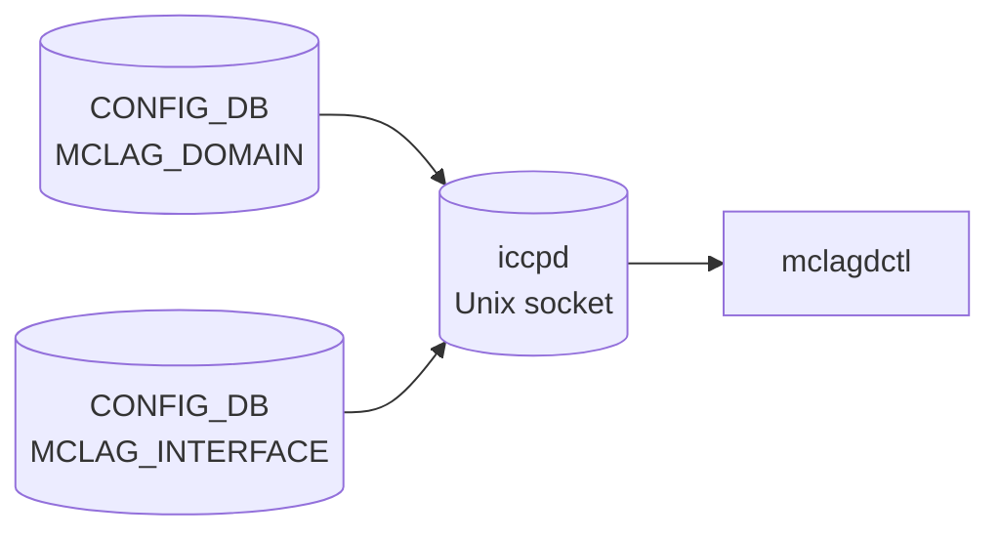

# show mclag (mclagdctl) コマンド

## 概要

[SONiC](../../reference/glossary.md#term-sonic) には `show mclag` という Click サブコマンドは存在しない。[MCLAG](../../reference/glossary.md#term-mclag) の状態確認は **`mclagdctl`** コマンド経由で行い、これは `iccpd` コンテナ内の Unix ソケット (`/var/run/iccpd/mclagdctl.sock`) に接続する `iccpd` 由来のユーティリティである[^1]。

ホスト側の `/usr/local/bin/mclagdctl` は `docker exec -i iccpd mclagdctl "$@"` を呼ぶだけのラッパーで、引数はそのままコンテナ内 `mclagdctl` に渡る[^2]。

## コマンド一覧

`mclagdctl.c` の `command_types[]` で実装されているサブコマンドは次の通り[^3]:

| コマンド | 用途 |
|---------|------|
| `mclagdctl -i <domain_id> dump state` | ICCP セッションの現在状態 |
| `mclagdctl -i <domain_id> dump arp` | [MCLAG](../../reference/glossary.md#term-mclag) 同期されている [ARP](../../reference/glossary.md#term-arp) テーブル |
| `mclagdctl -i <domain_id> dump nd` | 同 IPv6 neighbor (Neighbor Discovery) |
| `mclagdctl -i <domain_id> dump mac` | 同 MAC テーブル |
| `mclagdctl -i <domain_id> dump unique_ip` | unique-ip 機能を有効にした Vlan インタフェースの一覧 |
| `mclagdctl -i <domain_id> dump portlist local` | ローカル側 [MCLAG](../../reference/glossary.md#term-mclag) メンバ port 一覧 |
| `mclagdctl -i <domain_id> dump portlist peer` | ピア側 port 一覧 |
| `mclagdctl -i <domain_id> dump debug counters` | デバッグカウンタ |
| `mclagdctl -i <domain_id> config loglevel <level>` | iccpd のログレベル変更 |

`-i <domain_id>` は省略可で、その場合は CLI が自動的に唯一の domain を選ぶ (現状 [SONiC](../../reference/glossary.md#term-sonic) は 1 ノードあたり 1 MCLAG ドメインしか作成できない: `config mclag` 参照)。

## 各コマンドの詳細

### `mclagdctl dump state`

ICCP / KA セッションの状態と ToR 識別子、peer link、isolation 状態などを表示する。`/etc/iccpd/iccpd.conf` のロード状態と `MCLAG_DOMAIN` テーブルの設定値が想定通り適用されているかの確認に使う。

### `mclagdctl dump portlist local` / `peer`

local は自ノードの MCLAG メンバ [PortChannel](../../reference/glossary.md#term-portchannel) + そのメンバ物理 port、peer はピア側からの ICCP メッセージで取得した port 状態。`peer` 側は ICCP セッション断絶中はステイル状態となる。

### `mclagdctl dump arp` / `dump nd` / `dump mac`

ICCP 経由でピアと同期しているフォワーディングテーブルのスナップショット。Dual-ToR の片側でしか学習されていない MAC / [ARP](../../reference/glossary.md#term-arp) の検出に有用。

### `mclagdctl dump unique_ip`

`config mclag unique-ip add` で `MCLAG_UNIQUE_IP` に登録した Vlan インタフェース一覧。各 Vlan が ICCP プロトコル上で「unique-ip 有効」と認識されているかを確認できる。

### `mclagdctl config loglevel <level>`

iccpd 内部のログレベル切替。値は iccpd の syslog 等でデバッグする際に動的に上げ下げする。

## 注意

- `mclagdctl` は **`show mclag` ではない**。[SONiC](../../reference/glossary.md#term-sonic) `show` Click ツリーには MCLAG 用サブコマンドが定義されていないため、CLI 補完や `show -h` には現れない。
- 出力はパース対象として安定したフォーマットではない (人間向け固定列)。スクリプトから扱う際はバージョン差異に注意。
- ピアとの ICCP 接続が落ちている状態では `dump portlist peer` `dump arp` 等は最後に同期したスナップショットのままになる。

<!-- ref-triangle:start -->

## 関連リファレンス

- [CONFIG_DB](../../reference/glossary.md#term-config_db): [`MCLAG_DOMAIN`](../config-db/mclag-domain.md) / `MCLAG_INTERFACE`

<!-- ref-triangle:end -->

## 引用元

[^1]: `mclagdctl_sock_connect` 実装 (`src/iccpd/src/mclagdctl/mclagdctl.c` L165-L196)。<https://github.com/sonic-net/sonic-buildimage/blob/9ea932ec2e18f35e58268ec2e4456b1d4afd65cd/src/iccpd/src/mclagdctl/mclagdctl.c#L165>

[^2]: ホスト側ラッパは `dockers/docker-iccpd/base_image_files/mclagdctl`。<https://github.com/sonic-net/sonic-buildimage/blob/9ea932ec2e18f35e58268ec2e4456b1d4afd65cd/dockers/docker-iccpd/base_image_files/mclagdctl>

[^3]: コマンドテーブルは `command_types[]` (`src/iccpd/src/mclagdctl/mclagdctl.c` L64-L160)。<https://github.com/sonic-net/sonic-buildimage/blob/9ea932ec2e18f35e58268ec2e4456b1d4afd65cd/src/iccpd/src/mclagdctl/mclagdctl.c#L64>

<!-- usage-example -->
## 実行例

### 典型的な使い方

```bash
# 例 1: MCLAG セッション状態のダンプ
mclagdctl -i 4095 dump state
```

### よくある引数の組み合わせ

```bash
mclagdctl -i 4095 dump portlist local
```

### 期待される出力 (抜粋)

```text
Domain ID    : 4095
Role         : active
Session State: up
Peer Link    : PortChannel0001
Local IP     : 10.0.0.1
Peer IP      : 10.0.0.2
```
<!-- /usage-example -->

<!-- cli-mermaid -->
### データフロー (自動生成)



!!! note "凡例"
    mclagdctl は iccpd コンテナの Unix ソケット経由でランタイム情報を取得する。CONFIG_DB は iccpd が起動時に読み込む設定元であり、mclagdctl が直接読むわけではない。
<!-- /cli-mermaid -->

<!-- topics-back-ref -->
## 関連 Topics

- [Topics: L2 / VLAN / LAG / MC-LAG](../../topics/06-l2-vlan-lag/index.md)

<!-- /topics-back-ref -->

<!-- ops-hint -->
## 運用ヒント

### 典型的な利用シーン

- MC-[LAG](../../reference/glossary.md#term-lag) のピアリンク・keepalive・メンバ [LAG](../../reference/glossary.md#term-lag) の同期状態を確認する。
- [ARP](../../reference/glossary.md#term-arp)/ND/MAC の同期 (mclag [syncd](../../reference/glossary.md#term-syncd)) が想定どおり動いているかを判定する。

### よくある落とし穴

- `mclagdctl` は iccpd コンテナの Unix ソケットに接続するため、iccpd が落ちていると応答しない。
- system MAC が両端で異なると [LAG](../../reference/glossary.md#term-lag) メンバが flap する。`mclagdctl -i <domain_id> dump state` で必ず確認。

### 関連する show / debug

```bash
mclagdctl -i 1000 dump state
mclagdctl -i 1000 dump portlist local
mclagdctl -i 1000 dump portlist peer
```
<!-- /ops-hint -->

<!-- cli-sibling -->
### 関連 CLI コマンド

- [`config mclag`](config-mclag.md) — config mclag サブコマンド
- [`config vnet`](config-vnet.md) — config vnet サブコマンド
- [`config vxlan`](config-vxlan.md) — config vxlan サブコマンド

<!-- /cli-sibling -->

<!-- glossary-links-injected: 97063dcb81c4 -->
