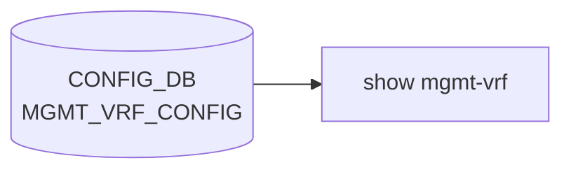

# show mgmt-vrf サブコマンド

## 概要

`show mgmt-vrf` は管理 [VRF](../../reference/glossary.md#term-vrf) (`mgmt`) の有効・無効状態、Linux 上の [VRF](../../reference/glossary.md#term-vrf) デバイス情報、ルーティングテーブルを表示する。`invoke_without_command=True` の Click group として実装されており、サブコマンドを指定しなくても本体ロジックが動く特殊な構造になっている[^1]。

## コマンド一覧

| コマンド | 用途 |
|---------|------|
| `show mgmt-vrf` | 管理 [VRF](../../reference/glossary.md#term-vrf) の状態 + `ip link show` を表示 |
| `show mgmt-vrf routes` | 管理 VRF のルーティングテーブル (table 6000) を表示 |

## 各コマンドの詳細

### `show mgmt-vrf`

**用法**:

```bash
show mgmt-vrf [routes]
```

**引数**:

- `routes` ... 任意。リテラル文字列 `routes` のみ受け付ける（`click.Choice(["routes"])`）

**動作**:

1. `is_mgmt_vrf_enabled(ctx)` で [CONFIG_DB](../../reference/glossary.md#term-config_db) の `MGMT_VRF_CONFIG` を参照し、`mgmtVrfEnabled` が `"true"` でない場合は `ManagementVRF : Disabled` を表示して終了
2. `routes` 引数なしで有効な場合: `ManagementVRF : Enabled` と `Management VRF interfaces in Linux:` を表示してから `ip -d link show mgmt` と `ip link show vrf mgmt` を続けて実行
3. `routes` 引数ありで有効な場合: `Routes in Management VRF Routing Table:` を表示してから `ip route show table 6000` を実行（管理 VRF 専用 routing table の固定 ID）

<!-- evidence:
source: sonic-net/sonic-utilities/show/main.py#L539-L559 (sha: 39732bceb8bdefe706518ab40623bbbba6ff33b9)
excerpt: |
  @cli.group('mgmt-vrf', invoke_without_command=True)
  @click.argument('routes', required=False, type=click.Choice(["routes"]))
  @click.pass_context
  def mgmt_vrf(ctx,routes):
      """Show management VRF attributes"""

      if is_mgmt_vrf_enabled(ctx) is False:
          click.echo("\nManagementVRF : Disabled")
          return
      else:
          if routes is None:
              click.echo("\nManagementVRF : Enabled")
              click.echo("\nManagement VRF interfaces in Linux:")
              cmd = ['ip', '-d', 'link', 'show', 'mgmt']
              run_command(cmd)
              cmd = ['ip', 'link', 'show', 'vrf', 'mgmt']
              run_command(cmd)
          else:
              click.echo("\nRoutes in Management VRF Routing Table:")
              cmd = ['ip', 'route', 'show', 'table', '6000']
              run_command(cmd)
-->

<!-- evidence-rendered:start -->
??? note "📋 検証エビデンス: sonic-net/sonic-utilities/show/main.py#L539-L559 (sha: 39732bceb8bdefe706518ab40623bbbba6ff33b9)"

    **出典**:

    `sonic-net/sonic-utilities/show/main.py#L539-L559 (sha: 39732bceb8bdefe706518ab40623bbbba6ff33b9)`

    **抜粋**:

    ```text
    @cli.group('mgmt-vrf', invoke_without_command=True)
    @click.argument('routes', required=False, type=click.Choice(["routes"]))
    @click.pass_context
    def mgmt_vrf(ctx,routes):
        """Show management VRF attributes"""
    
        if is_mgmt_vrf_enabled(ctx) is False:
            click.echo("\nManagementVRF : Disabled")
            return
        else:
            if routes is None:
                click.echo("\nManagementVRF : Enabled")
                click.echo("\nManagement VRF interfaces in Linux:")
                cmd = ['ip', '-d', 'link', 'show', 'mgmt']
                run_command(cmd)
                cmd = ['ip', 'link', 'show', 'vrf', 'mgmt']
                run_command(cmd)
            else:
                click.echo("\nRoutes in Management VRF Routing Table:")
                cmd = ['ip', 'route', 'show', 'table', '6000']
                run_command(cmd)
    ```

<!-- evidence-rendered:end -->

## 補足

- 管理 VRF のルーティングテーブル ID は [SONiC](../../reference/glossary.md#term-sonic) で **6000 固定**。`ip rule` の優先度で標準テーブル経路と分離されている
- `is_mgmt_vrf_enabled` は `MGMT_VRF_CONFIG|vrf_global` の `mgmtVrfEnabled` を参照する
- 管理 VRF の有効化・無効化は `config vrf add mgmt` / `config vrf del mgmt` 系コマンドで行う（本コマンドは表示のみ）

<!-- cli-mermaid -->
### データフロー (自動生成)



!!! note "凡例"
    show 系 (CONFIG_DB → CLI) のミニ図。テーブル → daemon 対応は `docs/reference/config-db-orch-map.md` から機械生成。
<!-- /cli-mermaid -->

<!-- ref-triangle:start -->

## 関連リファレンス

- [YANG](../../reference/glossary.md#term-yang): `sonic-mgmt-vrf`
- [CONFIG_DB](../../reference/glossary.md#term-config_db): [`MGMT_VRF_CONFIG`](../config-db/mgmt-vrf-config.md)

<!-- ref-triangle:end -->

## 引用元

[^1]: `@cli.group('mgmt-vrf', invoke_without_command=True)` + `@click.argument('routes', required=False)` の組み合わせで、`show mgmt-vrf` も `show mgmt-vrf routes` も同じ関数本体に流れる。<https://github.com/sonic-net/sonic-utilities/blob/39732bceb8bdefe706518ab40623bbbba6ff33b9/show/main.py#L540>

<!-- cli-sibling -->
### 関連 CLI コマンド

- [`config mgmt trio`](config-mgmt-trio.md) — config save / load / reload / replace / qos reload
- [`config vrf`](config-vrf.md) — config vrf サブコマンド
- [`config dhcp relay`](config-dhcp-relay.md) — config dhcp_relay / dhcpv4_relay サブコマンド
- [`config muxcable`](config-muxcable.md) — config muxcable サブコマンド
- [`show muxcable`](show-muxcable.md) — show muxcable サブコマンド

<!-- /cli-sibling -->

<!-- glossary-links-injected: 8ba32e5aa69d -->
